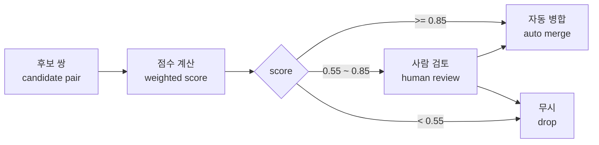
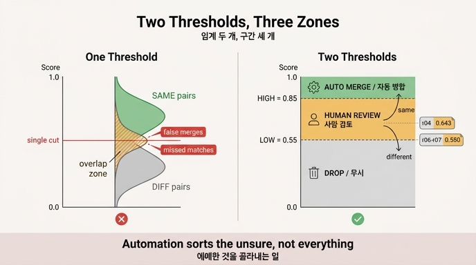

# 엔티티 해상도에서 임계를 두 개 두는 이유

**Q.** 엔티티 해상도에서 임계를 두 개 두는 이유는 무엇인가?

**A.** 위는 자동 병합, 아래는 무시, 사이는 사람에게 보내기 위해서다. 자동화의 일은 다 맞히는 것이 아니라 애매한 것을 골라내는 것이다.

---

## 1. 왜 임계가 하나면 안 되는가

엔티티 해상도(entity resolution)는 두 레코드가 같은 실체인지를 점수 하나로 요약한다. 문제는 이 점수의 분포다.

- **같은 쌍**의 점수는 높은 쪽에 몰린다.
- **다른 쌍**의 점수는 낮은 쪽에 몰린다.
- 그런데 **두 분포는 겹친다.** 겹치는 구간이 없으면 애초에 엔티티 해상도가 어려운 문제가 아니다.

임계가 하나면 이 겹치는 구간을 **강제로 둘로 자른다.** 선을 어디에 그어도 손실이 생긴다.

| 임계 하나를 어디에 두든 | 결과 |
|---|---|
| 높게 | 안전하지만 같은 것을 못 합친다(재현율 붕괴) |
| 낮게 | 많이 합치지만 다른 것을 합친다(오병합) |
| 중간 | 위 두 가지를 동시에, 조금씩 |

**임계를 두 개 두면 이 겹치는 구간을 「모르겠다」로 이름 붙여 따로 뺄 수 있다.** 이것이 두 임계의 전부다.

## 2. 세 구간의 구조

14장 예제 2(`ex2_scoring.py`)의 값은 `HIGH = 0.85`, `LOW = 0.55`다.

```
점수 1.0 ┬──────────────────────
         │  ▲ 자동 병합 (auto merge)   ← 사람 손 안 탐
    0.85 ┼─ HIGH ───────────────
         │  ▲ 사람 검토 (review queue) ← 여기가 두 임계의 존재 이유
    0.55 ┼─ LOW ────────────────
         │  ▲ 무시 (drop)              ← 아예 후보에서 버림
     0.0 ┴──────────────────────
```



핵심은 화살표 방향이다. **애매 구간의 판정은 자동화가 하지 않고, 사람의 판정 결과가 다시 자동 병합/무시로 흘러 들어간다.** 자동화의 산출물이 「병합 결정」이 아니라 「분류된 작업 큐」인 셈이다.

## 3. 예제에서 실제로 무엇이 애매 구간에 걸렸나

14장 데이터는 「가온테크」가 네 가지 표기로 앉아 있는 12개 레코드다. 자동 병합만 돌리면 정답에 **못** 간다.

### r04 — 위쪽 경계에 걸린 것 (점수 0.643)

```python
("r04", "GAON TECH", "123-45-67890", "", "", "")
```

- 사업자번호는 r01과 **같다** (가중치 0.45).
- 그런데 이름이 영문이라 2-gram 자카드 유사도가 거의 0이고, 주소·대표자·전화는 **비어 있다**.
- 빈 필드는 「모름」으로 빼고 정규화하므로 점수가 0.643으로 내려앉는다 → 애매 구간.

**이게 정상이다.** 이 정보만으로 「같다」고 단정할 근거가 없다. 사람이 보면 5초 만에 같다고 안다.

### r06/r07 — 아래쪽 경계에 걸린 것 (점수 0.550)

```python
("r06", "나루소프트",     "222-33-44444", "서울 마포구 월드컵로 2", "이서연", "02-2222-3333")
("r07", "나루소프트(주)", "555-66-77777", "서울 마포구 월드컵로 2", "이서연", "02-2222-3333")
```

- 주소·대표자·전화가 **전부 같고** 이름도 정규화하면 같다.
- 그런데 사업자번호가 **다르다.** 모회사와 자회사다.
- 점수 0.550으로 애매 구간 **바닥**에 걸렸고, 사람이 「다르다」고 판정했다.

> 자동 병합 임계를 0.55로 낮췄다면 모회사와 자회사를 합쳐 버렸을 것이다. 제가 실제로 그렇게 했고, 되돌리는 데 사흘 걸렸다.

**즉 두 임계는 양방향으로 작동한다.** 위쪽 경계는 「합치고 싶은데 근거가 부족한 것」을 잡고, 아래쪽 경계는 「합칠 것처럼 보이는데 합치면 안 되는 것」을 잡는다.

### 성과의 정의

12개 레코드에서 사람에게 간 것은 **3쌍**뿐이었다. 「전부 맞혔는가」가 아니라 **「사람이 볼 양을 얼마나 줄였는가」**가 성과 지표다.

## 4. 임계를 어디에 둘 것인가 — 숫자로 보기

예제 4(`ex4_threshold_tuning.py`)는 같은 쌍 400개, 다른 쌍 9,600개의 점수 분포를 흉내 내서 임계를 옮겨 본다. 직접 재현한 결과다.

| 자동 임계(HIGH) | 검토 하한(LOW) | 정밀도 | 재현율 | 오병합 | 놓침 | 사람 검토 |
|---|---|---|---|---|---|---|
| 0.95 | 0.80 | 0.963 | 0.195 | 3 | 136 | 243 |
| 0.90 | 0.70 | 0.911 | 0.357 | 14 | 35 | 514 |
| **0.85** | **0.55** | **0.898** | **0.527** | **24** | **0** | **2,053** |
| 0.75 | 0.55 | 0.701 | 0.797 | 136 | 0 | 1,833 |
| 0.65 | 0.50 | 0.379 | 0.975 | 638 | 0 | 2,262 |
| 0.55 | 0.50 | 0.175 | 1.000 | 1,888 | 0 | 1,002 |

읽는 법:

- **HIGH를 낮추면** 자동 병합이 늘고(재현율 ↑) 오병합도 폭증한다. 0.55에서는 오병합 1,888건, 정밀도 0.175 — 자동 병합의 다섯 중 넷이 틀렸다는 뜻이다.
- **HIGH를 올리면** 안전하지만(정밀도 0.963) 사람이 볼 게 남고 놓침이 생긴다.
- **LOW는 「놓침」을 지배한다.** LOW를 0.80으로 올리면 놓침 136건이 즉시 발생하고, 0.55로 내리면 0이 된다. 놓침은 되돌릴 기회조차 없다는 점에서 오병합보다 조용하고 위험하다.
- 두 임계는 **따로 조정된다.** HIGH는 정밀도를, LOW는 재현율(놓침)을 조절한다. 임계가 하나라면 이 둘을 분리해서 튜닝할 수 없다.

### 선택의 기준: 오병합 하나의 값 vs 검토 한 건의 값

책이 제시하는 실측 환산:

| 항목 | 비용 |
|---|---|
| 사람 한 건 검토 | 약 40초, 인건비 환산 약 400원 |
| 오병합 하나 수습 | 평균 2시간 (원인 파악 + 되돌리기 + 영향 질의 확인) |
| **환산** | **오병합 하나 ≈ 검토 180건** |

그래서 저자는 임계를 높게 잡는다. 사람이 많이 보더라도.

**단, 이 계산은 「되돌리기가 비쌀 때」의 계산이다.** 예제 3처럼 `unmerge`가 포인터 대입 한 번이면 오병합 값이 2시간에서 5분으로 떨어지고, 그러면 임계를 훨씬 공격적으로 낮출 수 있다. **되돌릴 수 있으면 더 공격적으로 자동화할 수 있다** — 이것이 14.3절과 14.2절이 맞물리는 지점이다.

## 5. 왜 「다 맞히는 것」이 목표가 아닌가

이 카드의 두 번째 문장이 사실은 더 중요한 주장이다.

> 자동화의 일은 다 맞히는 것이 아니라 애매한 것을 골라내는 것이다.

- 겹치는 구간의 쌍들은 **주어진 필드만으로는 원리적으로 판정 불가능**하다. r04는 사업자번호만 같고 나머지가 다 비어 있다. 더 좋은 모델을 써도 이 정보에서 확신을 뽑아낼 수 없다.
- 그러므로 「정확도 100%를 목표로 하는 자동 분류기」는 잘못된 목표 설정이다. 올바른 목표는 **확신할 수 있는 것은 통과시키고, 확신할 수 없는 것을 정직하게 표시해서 사람에게 넘기는 것**이다.
- 이것은 능동 학습(active learning)·human-in-the-loop 설계와 같은 사고방식이다. 시스템의 가치는 예측의 정확도가 아니라 **불확실성을 정확히 위치시키는 능력**에 있다.

## 6. 함께 챙겨야 할 안전장치

두 임계만으로는 부족하다. 14장이 같이 요구하는 것들.

| 장치 | 이유 |
|---|---|
| **거부권 규칙(veto)** | 점수 위에 「절대 안 되는」 규칙을 둔다. 사업자번호가 다르면 다른 법인 — 다른 게 아무리 같아도. r06/r07이 이 경우다. |
| **되돌릴 수 있는 병합** | 원본을 지우지 않고 대표 노드를 가리키게만 한다. 되돌리기가 포인터 하나 고치는 일이 된다. |
| **군집 크기 상한** | 이행성(transitivity)은 공짜가 아니다. 잘못된 병합 하나가 군집 전체를 오염시킨다. 군집이 커지면 사람에게 보낸다. |
| **블로킹 재현율** | 애초에 후보에 못 들면 임계가 무슨 값이든 영영 못 만난다. 전략을 서너 개 돌리고 합집합을 쓴다. |
| **동일성 표현의 강도 구분** | 확신하는 것은 `owl:sameAs`, 애매한 것은 `skos:closeMatch`로. 세 구간을 데이터 모델에도 반영할 수 있다. |

## 7. 한 줄 정리

**임계 하나는 「합칠까 말까」를 강제로 결정하게 만든다. 임계 두 개는 「모르겠다」를 표현할 수 있게 해 준다.** 그리고 그 「모르겠다」를 작은 큐로 유지하는 것이 자동화의 성과다.

---

### 1차 출처

- [Entity resolution / deep learning for ER (VLDB)](https://www.vldb.org/pvldb/vol11/p1454-mudgal.pdf)
- [Fellegi–Sunter model — 확률적 레코드 연결](https://www.tandfonline.com/doi/abs/10.1080/01621459.1969.10501049)
- [Blocking (ACM)](https://dl.acm.org/doi/10.1145/3355491.3355496)
- [owl:sameAs](https://www.w3.org/TR/owl2-syntax/#Individual_Equality) / [skos:closeMatch](https://www.w3.org/TR/skos-reference/#mapping)

## 인포그래픽


