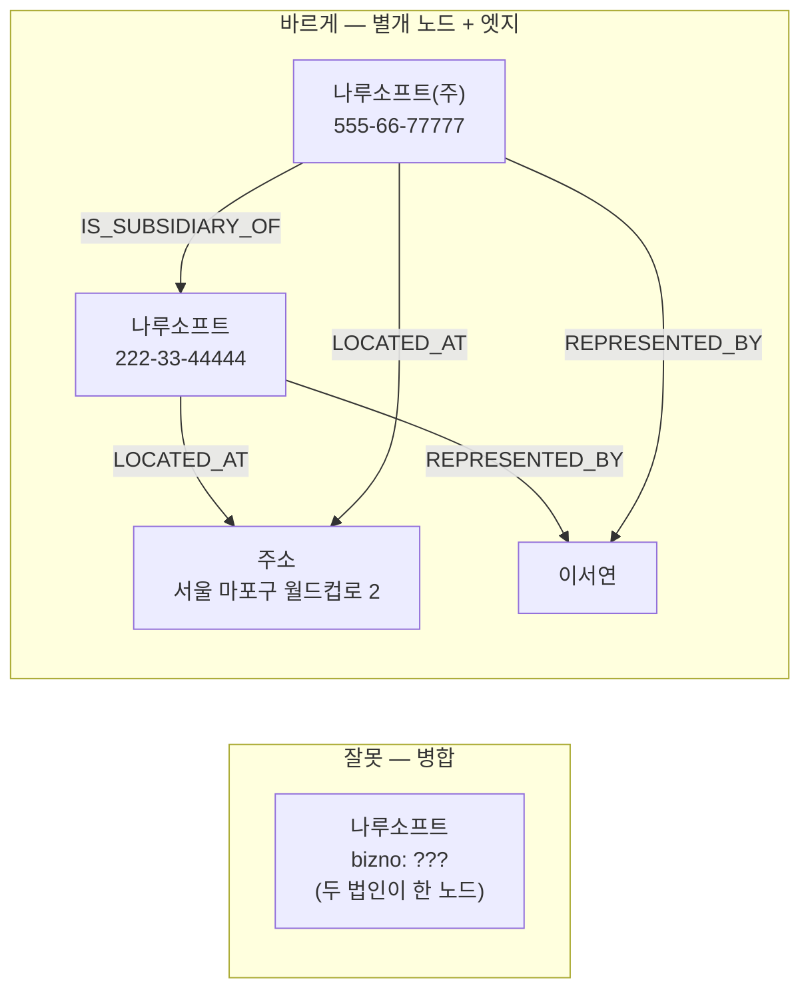

# r06–r07(나루소프트 / 나루소프트(주))은 왜 병합하면 안 되는가

> **정답**: 주소·대표자·전화가 모두 같지만 **사업자번호가 달라 별개 법인**이기 때문이다. 모회사와 자회사다.

이 쌍은 14장에서 「점수가 잘 작동하지 않는」 대표 사례로 등장합니다. 유사도만 보면 거의 만점인데 정답은 **다름**이에요. 저자가 실제로 자동 병합해 버렸고, 되돌리는 데 **사흘**이 걸린 그 쌍입니다.

---

## 1. 두 레코드를 나란히 놓고 보기

`code/records.py`의 원본입니다.

| 필드 | r06 | r07 | 일치? |
|---|---|---|---|
| 이름 | 나루소프트 | 나루소프트(주) | 정규화하면 **완전 일치** |
| **사업자번호** | **222-33-44444** | **555-66-77777** | **불일치** |
| 주소 | 서울 마포구 월드컵로 2 | 서울 마포구 월드컵로 2 | 완전 일치 |
| 대표자 | 이서연 | 이서연 | 완전 일치 |
| 전화 | 02-2222-3333 | 02-2222-3333 | 완전 일치 |

다섯 필드 중 **네 개가 완벽하게 같습니다.** 사람이 눈으로 훑으면 "같은 회사를 두 번 입력했네"로 읽히는 모양이에요. 그런데 정답은 다릅니다.

### 왜 주소·대표자·전화가 같아도 다른 법인인가

한국에서 **사업자등록번호는 사업자 단위로 부여되는 식별자**입니다. 번호가 다르면 세무상 별개의 사업자이고, 법인이라면 별개의 법인이에요. 반면

- **본점 소재지**는 모회사와 자회사가 같은 건물·같은 층을 쓰는 일이 아주 흔합니다.
- **대표이사**는 겸임이 가능합니다. 모회사 대표가 자회사 대표를 함께 맡는 건 지배구조상 오히려 자연스럽습니다.
- **대표전화**는 그룹 대표번호를 공유하거나, 같은 사무실의 같은 회선을 쓰면 그대로 같아집니다.

즉 **주소·대표자·전화는 "같은 법인"의 증거가 아니라 "관계 있는 법인"의 증거**입니다. 세 개가 동시에 같다는 건 오히려 지배·종속 관계나 관계사 관계를 강하게 시사하는 신호인데, 점수 모델은 이걸 「같음」 쪽으로만 해석합니다. 이 오해가 이 카드의 핵심이에요.

`records.py`의 주석이 이 결론을 그대로 못 박아 둡니다.

```python
# r06/r07 은 «주소·대표자·전화가 같아도» 다른 법인이다. 사업자번호가 다르다.
```

---

## 2. 점수 0.550이 어떻게 나오는가 — 계산 전개

`code/ex2_scoring.py`의 가중 평균 방식입니다.

```python
FIELDS = [
    ("사업자번호", lambda r: r[2], 0.45, "exact"),
    ("이름",      lambda r: norm_name(r[1]), 0.25, "fuzzy"),
    ("주소",      lambda r: r[3], 0.15, "fuzzy"),
    ("대표자",    lambda r: r[4], 0.10, "exact"),
    ("전화",      lambda r: norm_phone(r[5]), 0.05, "exact"),
]
HIGH, LOW = 0.85, 0.55
```

필드별로 전개하면 이렇습니다.

| 필드 | 가중치 w | 비교 방식 | 유사도 s | 기여분 w×s |
|---|---:|---|---:|---:|
| 사업자번호 | 0.45 | exact | **0.00** | 0.000 |
| 이름 | 0.25 | fuzzy | 1.00 | 0.250 |
| 주소 | 0.15 | fuzzy | 1.00 | 0.150 |
| 대표자 | 0.10 | exact | 1.00 | 0.100 |
| 전화 | 0.05 | exact | 1.00 | 0.050 |
| **합계** | **1.00** (used) | | | **0.550** |

`score = total / used = 0.550 / 1.000 = ` **0.550**

세 가지를 짚어 둘 만합니다.

**(1) 이름 유사도가 1.0인 이유는 문자열이 닮아서가 아니라, 정규화가 증거를 지웠기 때문입니다.**

```python
def norm_name(s):
    s = re.sub(r"\(주\)|주식회사|\(유\)|유한회사", "", s)   # ← "(주)" 를 지운다
    return re.sub(r"\s+", "", s)
```

`"나루소프트"` → `"나루소프트"`, `"나루소프트(주)"` → `"나루소프트"`. 두 문자열이 **동일해지므로** 2-gram 자카드는 0.9쯤이 아니라 정확히 **1.0**입니다. 법인격 표기를 지우는 정규화는 r01/r02(가온테크 / (주)가온테크)에서는 정답을 도와주지만, 여기서는 **r07이 별개 법인일 수 있다는 유일한 텍스트 단서를 삭제**합니다. 정규화는 중립적인 전처리가 아니에요. 어떤 쌍에는 도움이고 어떤 쌍에는 증거 인멸입니다.

**(2) `used`가 1.0인 것도 중요합니다.** 이 점수 함수는 한쪽이 비면 그 필드를 「모름」으로 빼고 분모를 줄입니다.

```python
if not x or not y:          # 한쪽이 비면 그 항목은 «모름»으로 빼둔다
    detail.append((name, None, w))
    continue
```

r06/r07은 모든 필드가 채워져 있어 감점 없이 전 필드가 계산됩니다. 그래서 0.550은 「데이터가 부실해서 애매한 점수」가 **아닙니다.** 정보가 완비된 상태에서 나온 애매한 점수예요. 대비되는 게 r01–r04입니다.

| 쌍 | 점수 | 애매한 이유 |
|---|---:|---|
| r01–r04 | 0.643 | 주소·대표자·전화가 **비어서**(`used = 0.70`) 정보가 부족함 |
| r06–r07 | 0.550 | 정보는 다 있는데 **핵심 필드 하나가 반대 방향**을 가리킴 |

두 애매함은 성질이 다른데 점수 하나로 뭉개면 구분되지 않습니다. r01–r04는 **정보를 더 모으면** 풀리고, r06–r07은 정보를 더 모아도 안 풀립니다. 판단 기준 자체를 바꿔야 하죠.

**(3) 0.550은 우연한 숫자가 아니라 구조적으로 결정된 값입니다.**

사업자번호 외의 모든 필드가 완전 일치할 때,

```
score = (1 − w_사업자번호) / 1 = 1 − 0.45 = 0.55
```

즉 **「사업자번호만 다르고 나머지는 전부 같은 쌍」의 점수는 항상 `1 − 0.45 = 0.55`** 입니다. 그리고 하필 `LOW = 0.55`. 이 일치는 우연이지만, 우연이라는 게 바로 문제예요.

---

## 3. 0.550이 LOW 경계에 정확히 걸린다는 것의 의미

`ex2_scoring.py`의 분기입니다.

```python
if s >= LOW:
    verdict = "자동 병합" if s >= HIGH else "사람 검토"
```

`0.55 >= 0.55` 는 참(파이썬 부동소수점으로도 `0.25+0.15+0.10+0.05 == 0.55` 가 정확히 성립합니다)이고 `0.55 >= 0.85` 는 거짓이므로, r06–r07은 **사람 검토 구간의 맨 바닥에 간신히 올라앉습니다.** 임계값을 조금만 건드리면 세 방향으로 흩어집니다.

| 설정 | r06–r07의 운명 | 결과 |
|---|---|---|
| `LOW = 0.56` (하한을 살짝 올림) | 후보에서 **조용히 탈락** | 병합 안 됨 → 결과는 맞지만, **사람이 이 쌍을 본 적이 없음** |
| `LOW = 0.55, HIGH = 0.85` (책의 설정) | **사람 검토** | 사람이 "다르다" 판정 → 정답 |
| `HIGH = 0.55` (자동 임계를 낮춤) | **자동 병합** | 모회사·자회사가 한 노드로 합쳐짐 → **사흘짜리 사고** |

`ex2_scoring.py` 마지막 해설이 이걸 그대로 말합니다.

```
반대 방향도 보라. r06–r07(나루소프트/나루소프트(주))은 0.550 으로
애매 구간 바닥에 걸렸고, 사람이 «다르다»고 판정했다. 사업자번호가 다르니까.
자동 병합 임계를 0.55 로 낮췄다면 모회사와 자회사를 합쳐 버렸을 것이다.
제가 실제로 그렇게 했고, 되돌리는 데 사흘 걸렸다.
```

`ex4_threshold_tuning.py`의 표에 `(0.55, 0.50)` 행이 실려 있는 게 의미심장합니다. 저 행이 바로 사고가 난 설정이에요.

여기서 진짜 불편한 사실은, **첫 번째 행(`LOW=0.56`)도 「운 좋게 맞은」 것**이라는 점입니다. 병합하지 않았으니 결과는 정답이지만, 이유는 「다른 법인임을 알아서」가 아니라 「점수가 0.01 모자라서」입니다. 데이터가 조금 달라져 0.56을 넘기면 그날부터 틀립니다. **임계 위치로 정답을 맞히는 건 실력이 아니라 운입니다.**

---

## 4. 그래서 거부권(veto) 규칙이 필요하다

14장 「한 장 요약」의 문장입니다.

> 점수 위에 「절대 안 되는」 거부권 규칙을 두세요. **사업자번호가 다르면 다른 법인입니다. 다른 게 아무리 같아도요.**

### 가중치를 올려서 해결하면 안 되나

"사업자번호 가중치를 0.45에서 0.6으로 올리면 되지 않나"라는 생각이 자연스럽게 듭니다. 계산해 보면 이렇습니다. 나머지가 전부 일치할 때 점수는 `1 − w`이므로, 이 쌍을 LOW 아래로 떨구려면

```
1 − w < 0.55  →  w > 0.45
```

`w = 0.50`이면 점수는 0.50, LOW 미달. 겉보기엔 해결입니다. 그런데 **가중치는 전역 파라미터라서 다른 쌍이 같이 흔들립니다.** 사업자번호 가중치를 올리면 사업자번호가 비어 있는 r03이 재정규화(`used`가 작아짐)로 영향을 받고, 사업자번호만 같고 나머지가 어긋난 쌍은 반대로 점수가 올라갑니다. 한 쌍을 고치려고 전체 분포를 비틉니다.

더 근본적인 문제는 **논리적 형태가 다르다**는 겁니다.

| | 가중 평균 | 거부권 규칙 |
|---|---|---|
| 성격 | 증거의 **누적** (soft evidence) | **경성 제약** (hard constraint) |
| 표현 | "이 필드가 다르면 점수를 좀 깎는다" | "이 필드가 다르면 나머지는 볼 필요 없다" |
| 다른 증거로 상쇄 가능? | **가능** | **불가능** |

가중 평균은 정의상 「나머지 증거로 뒤집을 수 있음」을 전제합니다. 그래서 아무리 가중치를 조절해도 **「무엇으로도 뒤집을 수 없다」는 명제를 표현할 수 없습니다.** 점수 안에서 해결하려는 시도가 실패하는 이유예요. 거부권은 점수를 **미세조정한 것이 아니라 점수 위에 얹은 다른 층**입니다.

### 규칙의 형태

```python
def veto(a, b):
    """점수를 계산하기 전에 «절대 아님»을 먼저 확정한다."""
    ba, bb = a[2], b[2]
    if ba and bb and ba != bb:        # 양쪽 다 있고, 다르면
        return "다른 법인"             # 점수 무관, 병합 금지
    return None
```

세부에서 중요한 점 두 가지가 있습니다.

**(1) 전제조건이 반드시 「양쪽 다 존재」여야 합니다.** `ba and bb` 조건이 없으면 사업자번호가 비어 있는 **r03(가온테크 주식회사)** 이 r01과 「다른 값」으로 취급되어 정답 군집(`{r01, r02, r03, r04}`)이 깨집니다. 없는 값은 「다른 값」이 아니라 「모르는 값」입니다.

**(2) 자리표시자를 걸러내야 합니다.** 14장 요약의 마지막 항목이 이걸 짚습니다.

> 빈 값과 자리표시자는 절대 이기지 못하게 하세요. 한 줄인데 사고의 절반을 막습니다.

`"000-00-00000"`, `"-"`, `"미등록"`, `"000-00-00000"` 같은 값이 진짜 값처럼 통과하면 거부권 규칙은 **역방향으로도** 사고를 냅니다. 자리표시자끼리는 「같다」고 판정되어 서로 무관한 수십 개 회사가 한 군집으로 뭉치죠. 거부권 규칙을 넣을 땐 자리표시자 화이트리스트를 같이 넣어야 합니다.

### 거부권의 부수 효과 — 사람 검토 부담이 줄어든다

거부권을 걸면 r06–r07은 애초에 사람에게 가지 않습니다. 점수 계산 전에 「다름」으로 확정되니까요. 사람은 **정말 판단이 필요한 것**(r01–r04처럼 정보가 모자라서 애매한 것)만 봅니다. `ex4`의 비용 계산(검토 1건 400원 vs 오병합 1건 2시간 ≈ 검토 180건)에 비춰 보면, 거부권 규칙 한 줄이 오병합을 막으면서 검토 큐까지 줄이는 셈입니다. **임계값 조정으로는 둘 중 하나만 얻는 트레이드오프인데, 규칙은 둘 다 얻습니다.** 이게 점수 위에 규칙을 얹는 진짜 이유예요.

---

## 5. 정반대 사례 — r08/r09는 사업자번호가 같은데도 분리한다

거부권 규칙만으로 다 끝나면 좋겠지만, 같은 데이터셋에 **정확히 반대 방향**의 쌍이 심어져 있습니다.

```python
# 지점 — 같은 법인, 다른 사업장
("r08", "다올물산 본사",    "333-44-55555", "인천 연수구 송도로 3", "최민준", "032-333-4444"),
("r09", "다올물산 부산지점", "333-44-55555", "부산 사하구 낙동로 8", "정우진", "051-333-4444"),
```

```python
# r08/r09 는 «사업자번호가 같아도» 별도 사업장으로 두기로 했다. 도메인 결정이다.
```

두 쌍을 나란히 놓으면 이렇습니다.

| | r06 – r07 | r08 – r09 |
|---|---|---|
| 사업자번호 | **다름** (222-33-44444 / 555-66-77777) | **같음** (333-44-55555) |
| 주소 | 같음 | 다름 (인천 / 부산) |
| 대표자 | 같음 (이서연) | 다름 (최민준 / 정우진) |
| 전화 | 같음 | 다름 |
| 점수 | **0.550** (사람 검토 구간 바닥) | **0.533** (LOW 미달 → 무시) |
| 실제 관계 | 모회사 / 자회사 | 같은 법인의 본사 / 지점 |
| 정답 | **병합 안 함** | **병합 안 함** |
| 정답의 근거 | 사업자번호 = 법인 식별자 | **도메인이 그렇게 정했다** |

### r08/r09의 0.533은 어떻게 나오는가

| 필드 | w | s | w×s |
|---|---:|---:|---:|
| 사업자번호 | 0.45 | 1.000 | 0.450 |
| 이름 | 0.25 | 0.333 | 0.083 |
| 주소 | 0.15 | 0.000 | 0.000 |
| 대표자 | 0.10 | 0.000 | 0.000 |
| 전화 | 0.05 | 0.000 | 0.000 |
| 합계 | | | **0.533** |

이름 유사도 0.333은 2-gram 자카드입니다. `"다올물산본사"` → `{다올, 올물, 물산, 산본, 본사}`, `"다올물산부산지점"` → `{다올, 올물, 물산, 산부, 부산, 산지, 지점}`. 교집합 3, 합집합 9 → `3/9 ≈ 0.333`.

**0.533은 LOW(0.55)에 못 미쳐 사람에게도 안 갑니다.** 결과는 정답인데 이번에도 이유는 운입니다. 그리고 여기서 아까 만든 거부권 규칙을 뒤집어 「사업자번호가 같으면 자동 병합」이라는 규칙을 세우면 **r08/r09를 즉시 오병합합니다.** 사업자번호 일치는 병합의 충분조건이 아니에요.

### 두 사례를 짝지으면 나오는 결론

- r06/r07: **데이터는 「같다」고 말하는데 정답은 「다르다」** — 유사도 4/5 만점, 정답은 별개 법인
- r08/r09: **데이터는 「같다」는 강력한 근거(동일 사업자번호)를 주는데 정답은 「다르다」** — 그런데 이번엔 법률이 아니라 **운영상의 선택** 때문

r08/r09를 분리하는 건 데이터에서 도출되지 않습니다. 「지점별 실적을 따로 보고 싶다」, 「배송지·세금계산서 발행지가 사업장 단위다」 같은 **업무 요구**에서 나옵니다. 다른 조직은 같은 데이터로 「합친다」를 정답으로 삼을 수 있고, 그것도 맞습니다.

> **정답은 데이터가 아니라 도메인이 정한다.**

`ex5_survivorship.py`의 결론과 정확히 같은 말입니다.

```
어느 쪽이 정답인가. 도메인이 정한다.
  대표자는 «바뀌는» 값이다 → 최근이 맞다
  사업자번호는 «안 바뀌는» 값이다 → 신뢰도 높은 출처가 맞다
```

그래서 엔티티 해상도 파이프라인의 산출물은 「점수와 임계」가 아니라 **「명문화된 도메인 규칙 + 점수 + 임계 + 사람 판정 이력」** 전체입니다. 점수는 그중 한 부품일 뿐입니다.

---

## 6. 그래프 모델링 — 병합하지 말고 엣지로 표현하라

r06/r07을 「병합하지 않는다」로 끝내면 **정보를 버립니다.** 두 법인이 주소·대표자·전화를 공유한다는 사실은 실제로 중요한 사실인데, 병합을 거부한 순간 그냥 「무관한 두 노드」가 되어 버리니까요. 올바른 처리는 **병합 대신 관계를 명시하는 것**입니다.



### (1) 관계는 관계 엣지로

```cypher
MATCH (sub:Company {bizno: '555-66-77777'}), (parent:Company {bizno: '222-33-44444'})
CREATE (sub)-[:IS_SUBSIDIARY_OF {source: 'human-review', decided_at: date()}]->(parent)
```

`IS_SUBSIDIARY_OF`는 **방향이 있고, 이행적이지 않으며, 두 노드의 독립성을 보존합니다.** 병합(`owl:sameAs`)과 결정적으로 다른 점이에요. 14장 키워드 표에 `owl:sameAs`(동일성 선언)와 `skos:closeMatch`(느슨한 동일성)가 함께 실린 이유가 여기 있습니다. r06/r07은 **둘 중 어느 것도 아닙니다.** `sameAs`는 명백히 틀렸고, `closeMatch`도 「같은 개념의 근사」라는 의미라서 오해를 부릅니다. 이 둘에 필요한 건 동일성 계열 술어가 아니라 **도메인 관계 술어**입니다.

`owl:sameAs`가 특히 위험한 건 **대칭적·이행적으로 정의되어 있어서 추론기가 자동으로 전파**시킨다는 점입니다. 하나를 잘못 선언하면 그 노드에 연결된 모든 동일성 주장이 오염됩니다. `ex2_scoring.py`가 경고하는 것과 같은 구조예요.

```
이행성도 공짜가 아니다. 잘못된 병합 하나가 군집 전체를 오염시킨다.
그래서 군집 크기에 상한을 두거나, 커지면 사람에게 보내는 게 안전하다.
```

r06/r07을 합쳤다고 상상해 보면, 이후 r07과 강하게 매칭되는 레코드가 들어올 때마다 그 군집이 커지고, **어디까지가 자회사 데이터이고 어디까지가 모회사 데이터인지 구분이 사라집니다.** 이게 되돌리기에 사흘이 걸린 이유입니다. 병합 자체를 되돌리는 건 포인터 하나인데, 그 사이에 군집을 전제로 쌓인 파생 데이터와 질의 결과를 전부 되짚어야 하니까요.

### (2) 공유 속성을 값이 아니라 노드로 승격시키기

주소·대표자·전화를 문자열 속성으로 두면 「두 회사의 주소 문자열이 닮았다」는 **유사도 신호**로만 존재합니다. 이걸 노드로 빼면 **명시적 사실**이 됩니다.

```cypher
(:Company)-[:LOCATED_AT]->(:Address {full: '서울 마포구 월드컵로 2'})
(:Company)-[:REPRESENTED_BY]->(:Person {name: '이서연'})
```

효과가 두 갈래로 옵니다.

- **설명 가능성**: "왜 이 두 회사가 닮았나요?"에 「0.55점입니다」가 아니라 「같은 `Address`와 같은 `Person`을 가리킵니다」로 답합니다. 그래프 경로가 근거가 됩니다.
- **오병합의 원인이 자산으로 바뀜**: 유사도를 부풀려 사고를 냈던 그 세 필드가, 노드로 승격되고 나면 관계사 탐지·이해관계자 분석에 쓰이는 **유용한 조회 경로**가 됩니다. 「이 주소에 등록된 법인이 몇 개인가」 같은 질의가 공짜로 생기죠.

물론 여기서도 사람 이름 동명이인 문제가 생기므로, `Person` 노드 자체가 또 다른 엔티티 해상도 대상이 됩니다. 해상도는 재귀적입니다.

### (3) r08/r09는 해상도 단위(entity type)를 나눠서 푼다

r08/r09는 관계 엣지의 문제가 아니라 **모델링 층위의 문제**입니다. 사업자번호는 법인의 식별자이므로 법인 노드에 붙고, 본사·지점은 사업장 노드로 따로 둡니다.

```cypher
(:Company {name: '다올물산', bizno: '333-44-55555'})
  -[:HAS_ESTABLISHMENT]->(:Establishment {name: '본사',     addr: '인천 연수구 송도로 3', ceo: '최민준'})
(:Company {name: '다올물산', bizno: '333-44-55555'})
  -[:HAS_ESTABLISHMENT]->(:Establishment {name: '부산지점', addr: '부산 사하구 낙동로 8', ceo: '정우진'})
```

이렇게 두면 「같은 법인인가」와 「같은 사업장인가」가 **서로 다른 질문**이 되고, 둘 다 답할 수 있습니다. 그리고 점수 함수도 층마다 달라집니다. 법인 해상도는 사업자번호가 지배적이고, 사업장 해상도는 주소가 지배적이죠. **해상도 단위를 잘못 잡은 문제는 점수 튜닝으로 절대 안 고쳐집니다.** r08/r09를 하나의 `Company` 노드 후보로 놓고 임계를 아무리 옮겨도 「법인은 하나, 사업장은 둘」을 표현할 수 없어요.

### (4) 사람 판정 결과를 그래프에 영구 저장하기

`ex2_scoring.py`는 사람 판정을 파이썬 dict로 흉내 냅니다.

```python
HUMAN = {("r01", "r04"): True, ("r02", "r04"): True, ("r06", "r07"): False}
```

실무에서는 이 `False`를 **반드시 저장**해야 합니다. 안 그러면 다음 파이프라인 실행에서 r06–r07이 또 0.550으로 검토 큐에 올라오고, 사람이 같은 판단을 반복하며, 어느 날 다른 담당자가 반대로 판정합니다.

```cypher
CREATE (a)-[:NEVER_MERGE_WITH {
  reason: '별개 법인 — 사업자번호 상이, 모회사/자회사 관계',
  decided_by: 'reviewer@example.com', decided_at: date()
}]->(b)
```

**부정 판정(negative decision)도 데이터입니다.** 그리고 판정마다 근거·판정자·시각을 붙이는 게 14장 키워드의 `PROV-O`(출처 추적)이고, 16장으로 이어지는 이야기입니다.

### (5) 되돌릴 수 있게 만들기

`ex3_reversible_merge.py`는 하필 이 쌍으로 시연합니다.

```python
print("\n2) 틀린 병합 — 모회사와 자회사를 합쳐 버렸다")
s.merge("r06", "r07", by="auto", reason="주소·대표자·전화 일치")
```

`reason`에 적힌 「주소·대표자·전화 일치」가 이 사고의 자백입니다. **일치한 세 필드만 근거로 적혀 있고, 불일치한 사업자번호는 근거에 아예 등장하지 않습니다.** 가중 평균이 반대 증거를 점수 안으로 흡수해 없애 버렸으니까요. 병합 근거를 「어느 필드가 일치했나」로만 기록하는 관행 자체가 위험합니다. **불일치한 필드도 함께 기록**해야 나중에 감사할 수 있습니다.

원본 노드를 지우지 않고 `canonical` 포인터만 옮기기 때문에 되돌리기는 대입 한 번입니다.

```python
def unmerge(self, dropped):
    ...
    self.canonical[dropped] = dropped
```

`ex4`의 마지막 문장이 이 설계의 값을 계산해 줍니다.

```
다만 이건 «되돌리기가 비싼» 경우다. 되돌리기가 싸면 계산이 달라진다.
앞 예제처럼 unmerge 가 대입 한 번이면 오병합 값이 2시간에서 5분이 된다.
```

---

## 7. 한 줄로 압축하면

**r06/r07은 「유사도가 높다」와 「같은 실체다」가 다른 명제라는 걸 보여 주는 쌍입니다.** 네 필드가 완벽히 일치해 0.550을 받았지만, 사업자번호 하나가 반대 방향을 가리키므로 답은 「다름」이고, 그 「하나」는 나머지 넷으로 상쇄할 수 없는 **경성 제약**이라 점수 체계 밖의 거부권 규칙으로 표현해야 합니다. 그리고 합치지 않은 뒤에 해야 할 일은 **관계를 엣지로 남기는 것**(`IS_SUBSIDIARY_OF`, 주소·대표자 노드 공유)입니다. 반대편의 r08/r09는 사업자번호가 같아도 분리하는데, 그 근거는 데이터가 아니라 도메인이에요. 두 쌍을 함께 보면 결론은 하나입니다. **점수는 애매한 것을 골라내는 도구이고, 정답은 도메인이 정한다.**

---

## 함께 보면 좋은 것

- `code/records.py` — `TRUTH` 아래 세 줄 주석이 r06/r07, r08/r09 결정의 근거를 못 박아 둠
- `code/ex2_scoring.py` — 점수·임계·이행성, 그리고 r06–r07이 0.550으로 걸리는 장면
- `code/ex3_reversible_merge.py` — 바로 이 쌍을 잘못 병합했다가 되돌리는 시연
- `code/ex4_threshold_tuning.py` — `(0.55, 0.50)` 행이 사고가 난 설정
- 14장 「한 장 요약」 4번째 항목 — "점수 위에 「절대 안 되는」 거부권 규칙을 두세요"
- 키워드 표의 [owl:sameAs](https://www.w3.org/TR/owl2-syntax/#Individual_Equality), [skos:closeMatch](https://www.w3.org/TR/skos-reference/#mapping) — 동일성 선언과 도메인 관계의 차이
