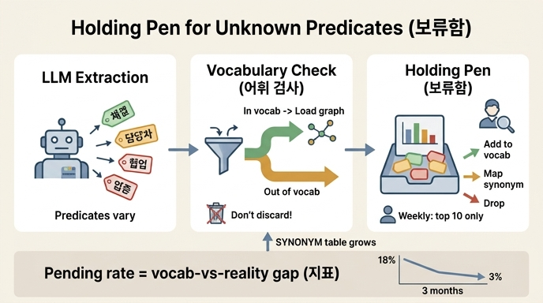

# 어휘 밖 술어를 어떻게 처리해야 하는가?

## 한 줄 답

**버리지 말고 보류함(holding pen)에 넣는다.** 빈도 상위 10개만 주에 한 번 사람이 보면 되고, 보류율 자체가 「우리 어휘가 현실과 얼마나 어긋나는가」를 알려 주는 지표가 된다.

## 배경 — 어휘 밖 술어란

12장에서 정한 술어 어휘(예: `체결`, `해지`, `담당`, `체결일`, `대표`, `소재지`, `소속` …)가 있는데, LLM 추출기는 이 어휘를 자꾸 벗어난다. 같은 문서를 여러 번 돌리면 술어가 훨씬 다양해진다:

| 모델이 낸 술어 | 판정 |
|---|---|
| `계약체결일자`, `체결일자`, `계약일` | 뜻은 맞다 → `체결일`로 매핑하면 정답이 된다 |
| `담당자`, `책임자` | 뜻은 맞다 → `담당`으로 매핑 |
| `협업`, `업종` | 어휘에 없다 → **보류함으로** |

핵심 관찰: 어휘 밖 술어라고 해서 전부 거짓이 아니다. `계약체결일자: 2025-06-02`는 값이 완전히 맞는데 술어 이름만 다르다. 이것을 버리면 **정답을 버리는 것**이다.

## 왜 「버림」이 아니라 「보류」인가

- **버리면 그 정보가 사라진다. 보류하면 나중에 살릴 수 있다.**
- 15장 예제(`ex3_normalize.py`)의 흐름: 모델이 낸 술어를 먼저 사람이 만든 `SYNONYM` 매핑 표로 정규화하고, 그래도 어휘에 없으면 적재하지 않고 보류함에 쌓는다.

```python
def normalize(pred):
    p = SYNONYM.get(pred, pred)          # 동의어 표로 먼저 정규화
    return p if p in VOCAB_PREDICATES else None   # None이면 보류함으로
```

## 운영 방법 — 주에 한 번, 상위 10개만

보류함을 전수 검사할 필요가 없다. **빈도 상위 10개만 주 1회** 사람이 보고, 항목마다 셋 중 하나를 정한다:

1. **어휘에 추가한다** — 실제로 필요한 관계였다 (어휘가 현실을 못 담고 있었던 것)
2. **동의어로 매핑한다** — 기존 술어와 같은 뜻이었다 (`계약체결일자 → 체결일`)
3. **버린다** — 우리가 안 다루는 것이다

이 결정을 `SYNONYM` 표에 쌓으면 **다음부터는 자동으로 처리**된다. 즉 매핑 표가 조직의 자산이 된다. 저자의 경우 3개월쯤 쌓으니 **보류율이 18%에서 3%로** 떨어졌다.

## 보류율 = 어휘 건강 지표

보류함 크기(보류율)는 단순한 대기열이 아니라 측정값이다:

- 보류율이 높다 → 우리가 정한 어휘가 실제 문서 세계와 크게 어긋나 있다 (어휘 설계를 다시 봐야 한다)
- 보류율이 꾸준히 떨어진다 → 매핑 표와 어휘가 현실에 수렴하고 있다는 증거

즉 「보류함이 이 파이프라인의 심장이다」— 추출 품질 개선 루프(측정 → 분류 → 매핑 축적 → 자동화)가 여기서 돈다.

## 다른 검사와의 관계

- 근거 검사(ex2)는 **지어낸 것**을 잡고, 어휘 정규화 + 보류함(ex3)은 **이름만 다른 정답**을 살린다. 오류 종류가 다르므로 처리도 달라야 한다.
- 어휘 밖이면서 새 노드를 만드는 트리플은 비싼 검사(여러 번 돌려 표 세기, ex4)의 2차 대상으로만 보낸다 — 비싼 검사를 소수에만 쓰는 절충이다.

## 요약

| 하지 말 것 | 할 것 |
|---|---|
| 어휘 밖 술어를 즉시 폐기 | 보류함에 적재 (정보 보존) |
| 보류함 전수 검사 | 빈도 상위 10개만 주 1회 리뷰 |
| 리뷰 결과를 일회성으로 소비 | SYNONYM 표에 축적 → 자동 처리 |
| 보류함을 쓰레기통으로 취급 | 보류율을 어휘-현실 정합성 지표로 활용 |

## 인포그래픽


