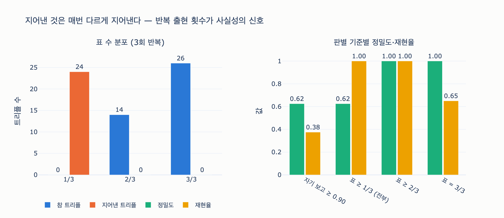

# 여러 번 돌려 표를 세는 방식이 잘 갈라내는 이유

## 질문

여러 번 돌려 표를 세는 방식이 잘 갈라내는 이유는 무엇인가?

## 답

**지어낸 것은 매번 다르게 지어내기 때문이다. 반복 출현 횟수가 사실성의 신호가 된다.**

## 자세한 설명

### 배경: 모델의 자기 보고 확신도는 믿을 게 못 된다

15장 예제 4(`ex4_confidence.py`)의 상황이다. 트리플 추출 파이프라인에서 "이 트리플을 얼마나 믿을 수 있나"라는 신뢰도가 필요한데, 후보는 둘이다.

1. **자기 보고(self-reported) 확신도** — 모델에게 "이 트리플의 확신도를 0~1로 매겨라"라고 시킨 값
2. **표 세기(voting)** — 같은 문서를 여러 번 돌려서 각 트리플이 몇 번 나왔는지 세는 것

예제의 데이터가 문제를 그대로 보여 준다. 지어낸 트리플에도 모델은 높은 확신을 준다.

```python
SELF_REPORTED = {
    ("가온테크", "체결", "C-2025-118"): 0.95,   # 참
    ("가온테크", "업종", "IT 서비스"): 0.91,     # 지어낸 건데 확신이 높다
    ("가온테크", "규모", "중견기업"): 0.87,       # 이것도
    ...
}
```

참 트리플은 0.88~0.95, 거짓 트리플은 0.85~0.91. **분포가 겹쳐서 임계값을 어디에 두어도 갈라지지 않는다.** 자기 보고 0.90 이상으로 자르면 거짓인 "업종: IT 서비스"(0.91)가 통과하고 참인 "체결일"(0.88)이 떨어진다.

### 표 세기가 갈라내는 메커니즘

핵심 비대칭은 이것이다.

- **참 트리플은 원문에 닻이 있다.** "담당자는 김하늘 부장이다"라는 문장이 문서에 있는 한, 몇 번을 돌려도 모델은 같은 문장에서 같은 트리플을 뽑는다. 출력이 원문이라는 고정점에 수렴한다.
- **지어낸 트리플은 닻이 없다.** 원문에 근거가 없으니 모델의 그럴듯함 분포에서 매번 새로 표본을 뽑는 셈이다. 첫 번째 실행에서는 "업종: IT 서비스", 세 번째 실행에서는 "규모: 중견기업" — **매번 다르게 지어낸다.**

예제의 세 번 실행 결과가 정확히 이 패턴이다.

| 트리플 | 표 수 | 실제 |
|---|---|---|
| 가온테크 체결 C-2025-118 | 3/3 | 참 |
| C-2025-118 상대 나루소프트 | 3/3 | 참 |
| C-2025-118 담당 김하늘 | 2/3 | 참 |
| C-2025-118 체결일 2025-06-02 | 1/3 | 참 (아깝게 낮음) |
| 가온테크 업종 IT 서비스 | 1/3 | **거짓** |
| 가온테크 규모 중견기업 | 1/3 | **거짓** |
| C-2025-118 담당 김하늘 부장 | 1/3 | 참이지만 표기가 갈림 |

같은 거짓이 두 번 이상 나오려면 모델이 "같은 거짓말을 똑같이 반복"해야 하는데, 거짓의 후보 공간이 넓기 때문에 확률이 급격히 떨어진다. 거칠게 말해 특정 거짓 트리플이 한 번 나올 확률이 $q$ 라면 $k$ 번 모두 같은 거짓이 나올 확률은 대략 $q^k$ 로 지수적으로 준다. 반면 참 트리플은 실행마다 높은 확률 $p$ 로 재출현하므로, 반복 출현 횟수(표 수)가 참/거짓을 가르는 신호가 된다.

이 아이디어의 뿌리가 **self-consistency**(Wang et al., 2022, [arXiv:2203.11171](https://arxiv.org/abs/2203.11171))다. 원래는 추론 체인 여러 개를 샘플링해 최종 답을 다수결로 고르는 기법인데, "맞는 답은 여러 경로가 수렴하고, 틀린 답은 흩어진다"는 같은 비대칭을 이용한다.

### 표 세기의 성질과 대가

예제에서 임계값별로 갈라 보면:

- **자기 보고 0.90 이상**: 정밀도 0.75, 재현율 0.75 — 거짓이 섞여 들어온다.
- **3번 중 3번 나옴**: 정밀도 **1.000**, 재현율 0.500 — 거짓은 완벽히 걸러지지만, 참인 "체결일"(1/3)과 표기가 갈린 "담당"(2:1로 분열)을 놓친다.

즉 표 세기는 **"확실한 것만 고르는" 쪽으로 치우친다**(정밀도↑, 재현율↓). 그리고 결정적 대가는 **비용**이다. 세 번 돌리면 API 비용도 세 배다.

그래서 책의 절충안은 이렇다.

1. **1차** — 한 번만 돌리고 근거 검사(문자열 대조)로 거른다. 싸다.
2. **2차** — 근거 검사를 통과했지만 어휘 밖이거나 새 노드를 만드는 **애매한 것에만** 두 번 더 돌려 표를 센다. 비싼 검사를 소수에만 쓴다.

### 한 줄 정리

자기 보고 확신도는 참과 거짓에 비슷하게 높은 값을 주지만, 표 세기는 "원문에 닻이 있는 것은 수렴하고 지어낸 것은 흩어진다"는 구조적 비대칭을 이용하므로 훨씬 잘 갈라낸다. 반복 출현 횟수 자체가 사실성의 신호다.

## 시각화


