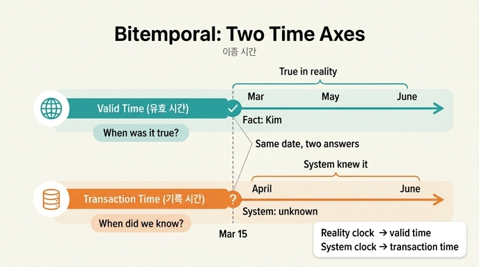

# 이중 시간(bitemporal)의 두 시간 축

## 질문
이중 시간(bitemporal)의 두 시간 축은 각각 무엇인가?

## 답
**유효 시간(valid time)** 은 현실에서 그 사실이 참인 기간이고, **기록 시간(transaction time)** 은 우리 시스템이 그렇게 알고 있던 기간이다.

## 자세한 설명

### 왜 시간 축이 하나로는 부족한가

16장은 감사팀의 요청 하나로 시작합니다. "6월 30일 자 계약 현황 보고서를 다시 뽑아 달라." 시스템에 「지금 아는 것」만 있으면 이 질문에 답할 수 없습니다. 「6월 30일에 알고 있던 것」이 어디에도 없기 때문입니다. 시간 축을 둘로 나누면 이 두 가지를 모두 담을 수 있습니다.

| 축 | 영어(ISO 표준 용어) | 뜻 | 답하는 질문 |
|---|---|---|---|
| 유효 시간 | valid time | 현실에서 그 사실이 **참인** 기간 | 「3월 15일에 담당이 누구였나」 |
| 기록 시간 | transaction time | 우리 시스템이 그렇게 **알고 있던** 기간 | 「3월 15일에 우리는 누구로 알고 있었나」 |

두 용어 모두 SQL 표준(ISO/IEC 9075) 계열의 공식 용어이며, 두 축을 함께 쓰는 방식을 **이중 시간(bitemporal)** 이라고 부릅니다(사실상 표준).

### 두 질문이 실제로 다른 답을 내는 예

책의 `ex1_two_axes.py` 예제 상황입니다.

- 현실: 3월 1일부터 담당은 김하늘이었다. 그런데 우리는 그 사실을 **4월 10일에야** 입력했다.
- 이후: 6월 1일부터 박서준으로 바뀌었고, 6월 3일에 입력했다.

같은 저장소에 네 가지를 물으면 답이 갈립니다.

| 질문 | 유효 시점 | 기록 시점 | 답 |
|---|---|---|---|
| 3월 15일 담당은? (지금 아는 대로) | 3/15 | 지금 | 김하늘 |
| 3월 15일에 우리는 누구로 알았나? | 3/15 | 3/15 | **모름** (4월 10일에야 입력됨) |
| 7월 1일 담당은? | 7/1 | 지금 | 박서준 |
| 6월 2일에 우리는 7월 담당을 누구로 알았나? | 7/1 | 6/2 | 김하늘 (교체 사실을 아직 모름) |

핵심은 두 번째 줄입니다. 「3월 15일에 담당은 김하늘이었다」(유효 시간 기준)와 「3월 15일에 우리는 몰랐다」(기록 시간 기준)가 **동시에 참**입니다. 감사에서 "그때 왜 그렇게 처리했나"를 물으면 필요한 것은 후자이고, 현재 값만 저장하면 이 질문에 답할 방법이 없습니다.

### 구현에서 두 축이 어떻게 나타나는가

책의 100줄짜리 `bitemporal.py` 저장소는 사실 하나마다 네 개의 날짜를 붙입니다.

- `valid_from` / `valid_to` — 유효 시간 구간 (현실에서 참인 기간)
- `tx_from` / `tx_to` — 기록 시간 구간 (시스템이 그렇게 알던 기간)

질의할 때는 `valid_at`으로 유효 시간을 자르고 `tx_at`으로 기록 시간을 자릅니다. `tx_at=None`이면 "지금 아는 대로", 즉 아직 닫히지 않은(`tx_to == FOREVER`) 기록만 봅니다.

두 축이 나뉘어 있어야 **만료와 정정**도 구분됩니다(16.2절).

- **만료**: 그때는 맞았고 지금은 아니다 → 기존 사실의 **유효 시간**을 닫는다.
- **정정**: 그때도 틀렸다 → 기존 기록의 **기록 시간**을 닫는다(`correct`). 그래야 과거 시점 보고서를 다시 뽑아도 소급해서 바뀌지 않는다.

### 비용과 트레이드오프

모든 값을 이중 시간으로 저장하면 저장량이 현재값 대비 약 139배까지 늘어납니다. 「이 값 때문에 나중에 누가 항의할 수 있나」를 기준으로 필드를 골라 붙이면(예: 등급·담당은 이중 시간, 로그성 값은 현재값만) 약 12배로 떨어집니다. 그리고 기록 시간은 소급해서 만들 수 없으므로 — 과거에 무엇을 알았는지는 그때 적어 두지 않으면 사라집니다 — 필요해지기 **전에** 정해야 합니다.

### 기억법

- **유효 시간** = 세상의 시계. "현실에서 언제 참이었나."
- **기록 시간** = 시스템의 시계. "우리가 언제부터 언제까지 그렇게 믿었나."
- 장 제목 「어제는 맞았고 오늘은 틀리다」가 곧 두 축의 존재 이유: '맞았다/틀리다'의 판정이 **어느 시계로 보느냐**에 따라 달라진다.

## 인포그래픽

