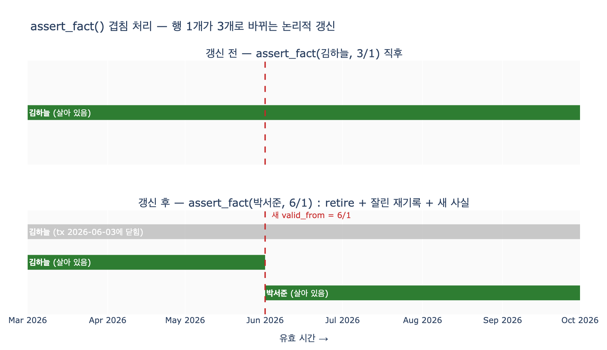

# `assert_fact()`는 기존 사실과 기간이 겹칠 때 어떻게 처리하는가?

## 한 줄 답

기존 기록을 **기록 시간(tx)으로 닫고**(`_retire`), **잘린 유효 기간**(원래 시작 ~ 새 사실의 시작)으로 **다시 기록**해서, 겹침을 「논리적 갱신」으로 바꾼다. 새 사실은 그 뒤에 그대로 추가한다.

## 배경: 이중 시간 저장소

16장의 `BiTemporalStore`는 사실 하나마다 시간 축을 두 개 붙인다.

| 축 | 필드 | 뜻 |
|---|---|---|
| 유효 시간 (valid time) | `valid_from` / `valid_to` | 현실에서 그 사실이 참인 기간 |
| 기록 시간 (transaction time) | `tx_from` / `tx_to` | 우리 시스템이 그렇게 «알고 있던» 기간 |

핵심 불변 조건은 두 가지다.

1. **어떤 기록도 물리적으로 삭제하거나 덮어쓰지 않는다.** 과거에 우리가 뭘 알고 있었는지를 재현해야 하니까.
2. **「지금 아는 대로」의 관점에서는, 같은 (주어, 술어)의 유효 기간이 겹치면 안 된다.** 겹치면 「3월 15일 담당이 누구냐」에 답이 두 개 나온다.

이 두 조건을 동시에 만족시키는 것이 `assert_fact()`의 겹침 처리다.

## 코드가 하는 일 (bitemporal.py)

```python
def assert_fact(self, s, p, v, valid_from, tx_at, valid_to=FOREVER):
    """새 사실을 기록한다. 같은 (s, p) 의 겹치는 기간은 유효 시간을 잘라 준다."""
    for f in self.facts:
        if (f["s"], f["p"]) != (s, p) or f["tx_to"] != FOREVER:
            continue                          # ① 다른 사실이거나 이미 닫힌 기록은 건너뜀
        if f["valid_from"] < valid_from < f["valid_to"]:
            # ② 기존 사실의 유효 기간을 잘라 «논리적 갱신»을 만든다
            self._retire(f, tx_at)            # ③ 기존 기록을 기록 시간으로 닫는다
            self._append(s, p, f["value"], f["valid_from"], valid_from, tx_at)
                                              # ④ 잘린 유효 기간으로 다시 기록
    self._append(s, p, v, valid_from, valid_to, tx_at)   # ⑤ 새 사실 추가

def _retire(self, f, tx_at):
    f["tx_to"] = tx_at                        # 물리 삭제가 아니라 tx_to 만 닫는다
```

단계별로 풀면:

1. **대상 선별**: 같은 `(s, p)`이면서 아직 살아 있는 기록(`tx_to == FOREVER`)만 본다. 이미 닫힌 기록은 과거 지식의 스냅숏이므로 절대 건드리지 않는다.
2. **겹침 판정**: 새 사실의 시작(`valid_from`)이 기존 기록의 유효 기간 «안쪽»에 떨어지는지 본다 (`f.valid_from < valid_from < f.valid_to`).
3. **`_retire(f, tx_at)`**: 기존 기록의 `tx_to`를 `tx_at`으로 바꿔 «이 버전의 지식은 여기까지»라고 닫는다. 행 자체는 남는다 — 그래서 `tx_at` 이전 시점으로 질의하면 여전히 옛 모습이 보인다.
4. **잘린 기간으로 재기록**: 같은 값을 유효 기간 `[원래 valid_from, 새 valid_from)`으로 새 행에 다시 쓴다. «그 값은 새 사실이 시작되기 전까지만 참이었다»는 뜻이다.
5. **새 사실 추가**: 새 값을 `[valid_from, valid_to)`로 추가한다.

결과적으로 행 3개(닫힌 원본 + 잘린 원본 + 새 사실)가 생기고, 이 조합이 **논리적 갱신(logical update)** 이다. UPDATE 문 하나 대신, 「닫고 + 자르고 + 추가」 세 동작으로 갱신을 표현한다.

## 예: 담당자 교체

```python
st.assert_fact("가온테크", "담당", "김하늘", valid_from=3/1, tx_at=4/10)
st.assert_fact("가온테크", "담당", "박서준", valid_from=6/1, tx_at=6/3)
```

두 번째 호출에서 김하늘 기록(`3/1 ~ FOREVER`)과 겹치므로:

| 값 | 유효 시작 | 유효 끝 | 기록 시작 | 기록 끝 | 비고 |
|---|---|---|---|---|---|
| 김하늘 | 3/1 | — | 4/10 | **6/3** | ③ retire: tx로 닫힘 |
| 김하늘 | 3/1 | **6/1** | 6/3 | — | ④ 잘린 기간으로 재기록 |
| 박서준 | 6/1 | — | 6/3 | — | ⑤ 새 사실 |

이 덕분에 네 가지 질문에 전부 답할 수 있다.

- 「3/15에 담당이 누구였나 (지금 아는 대로)」 → 김하늘 (2행)
- 「3/15에 우리는 누구로 알았나」 → 모름 (그때는 tx가 아직 안 열렸다)
- 「7/1 담당은」 → 박서준 (3행)
- 「6/2에 우리는 7월 담당을 누구로 알았나」 → 김하늘 (1행 — 닫힌 기록이 여기서 쓰인다)

## `correct()`와의 차이

`assert_fact()`의 겹침 처리는 **만료**(그때는 맞았다)다. 옛 값을 잘린 기간으로 «살려 둔다». 반면 `correct()`는 **정정**(그때도 틀렸다)이라 기존 기록을 `_retire`로 닫기만 하고 잘린 기간으로 재기록하지 **않는다** — 그 값은 애초에 참인 기간이 없었기 때문이다. 이 둘을 섞으면 과거 보고서가 소급해서 바뀌거나, 틀린 값이 과거에 영원히 남는다.

## 시각화


