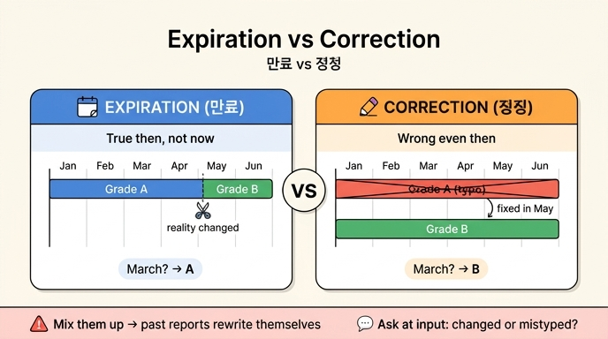

# 만료와 정정의 차이는 무엇인가?

**답: 만료는 「그때는 맞았고 지금은 아니다」라는 뜻이고, 정정은 「그때도 틀렸다」라는 뜻이다.**

## 핵심 구분

과거의 값을 바꾸는 이유는 두 가지뿐인데, 겉보기에 비슷해서 실무에서 자주 섞인다.

| 구분 | 만료 (expiration) | 정정 (correction) |
|---|---|---|
| 의미 | 그때는 맞았고, 지금은 아니다 | 그때도 틀렸다 |
| 현실에서 일어난 일 | 값이 실제로 **바뀌었다** | 값을 처음부터 **잘못 적었다** |
| 어느 시간 축을 닫나 | **유효 시간**(valid time)을 닫는다 | **기록 시간**(transaction time)을 닫는다 |
| 과거 질의 결과 | 과거 시점의 옛 값이 그대로 보인다 | 과거 시점에도 올바른 값이 보인다 |

이 구분은 16장의 이중 시간(bitemporal) 모델 위에서 작동한다. 유효 시간은 「현실에서 그 사실이 참인 기간」, 기록 시간은 「우리 시스템이 그렇게 알고 있던 기간」이다.

## 예제로 보는 차이 (ex2_correction.py)

같은 겉모습 — 「가온테크 등급이 A였는데 5월에 B가 됐다」 — 이라도 이유가 다르면 저장이 달라진다.

**만료 시나리오**: 1월 1일부터 등급 A, 5월 1일부터 실제로 B로 바뀌었다.
- 기존 A 기록의 **유효 기간을 5월 1일에서 자르고**, B를 새로 추가한다.
- 「3월 1일 등급은? (지금 아는 대로)」 → **A**. 그때는 진짜 A였으니까.

**정정 시나리오**: 처음부터 B였는데 A로 잘못 입력했고, 5월 1일에 발견했다.
- 기존 A 기록의 **기록 시간을 5월 1일에 닫고**(`correct()` — «그때도 틀렸다»는 뜻이라 기록 시간으로 닫는다), 유효 시작이 같은 B를 새로 추가한다.
- 「3월 1일 등급은? (지금 아는 대로)」 → **B**. 그때도 B였는데 우리가 잘못 적었으니까.

한편 「3월 1일 등급을 4월 시점 지식으로」 물으면 **둘 다 A**다. 4월에는 두 시나리오 모두 A로 알고 있었기 때문이다 — 이것이 기록 시간 축이 보존하는 정보다.

## 섞으면 무슨 일이 나나

- **만료를 정정으로 처리하면**: 과거 보고서가 **소급해서 바뀐다**. 「6월 30일 자 보고서를 다시 뽑어 달라」는 감사 요청에서 그때와 다른 숫자가 나온다.
- **정정을 만료로 처리하면**: 틀린 값이 **과거에 영원히 남는다**. 3월을 조회하면 계속 잘못된 A가 나온다.

## 실무 처방

사람이 이 둘을 자주 헷갈리므로, 입력 화면에서 직접 묻는 게 낫다:

> «값이 바뀐 건가요, 잘못 적은 건가요?»

질문 하나를 더 하는 게 나중에 며칠을 아낀다. 시스템이 자동으로 판단할 수 없는 정보 — 「왜 바뀌었나」 — 는 입력하는 사람만 알기 때문이다.

## 인포그래픽

