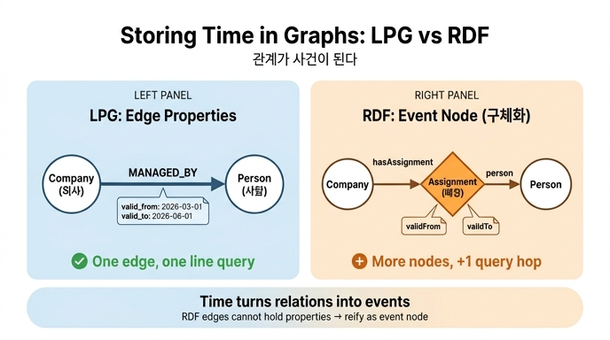

# 같은 시간 정보를 RDF로 저장할 때 어떻게 해야 하는가?

**답: RDF는 엣지에 속성을 달 수 없어 '배정(Assignment)' 같은 사건 노드로 구체화(reification)한다. 그 대가로 노드가 늘고 질의가 한 줄 길어진다.**

## 문제의 출발점 — LPG와 RDF의 구조 차이

16.4절 "시간이 붙으면 관계가 사건이 된다"의 핵심 대비입니다.

- **LPG(속성 그래프)** 는 엣지 자체가 속성을 가질 수 있습니다. `(회사)-[담당 {valid_from, valid_to}]->(사람)`처럼 유효 기간을 **엣지 속성으로 그냥 답니다**. 한 줄이면 끝.
- **RDF** 는 세상을 `주어-술어-목적어` 트리플로만 표현합니다. 트리플(=엣지)은 그 자체로 최소 단위라서 **트리플에 속성을 붙일 자리가 없습니다**. "이 관계가 언제부터 언제까지 참이었나"를 적을 곳이 없는 거죠.

## RDF의 해법 — 관계를 사건 노드로 승격 (구체화)

관계 하나를 **노드로 승격**시킵니다. 5장에서 본 구체화(reification) 방법 1과 같은 수법입니다.

`가온테크 --담당--> 김하늘` 이라는 한 개의 엣지 대신:

```turtle
ex:Gaon a ex:Company ; ex:name "가온테크" ; ex:hasAssignment ex:a1, ex:a2 .

ex:a1 ex:person ex:Kim  ; ex:validFrom "2026-03-01"^^xsd:date ;
      ex:validTo "2026-06-01"^^xsd:date .
ex:a2 ex:person ex:Park ; ex:validFrom "2026-06-01"^^xsd:date ;
      ex:validTo "9999-12-31"^^xsd:date .
```

`ex:a1`, `ex:a2`가 바로 **"배정"이라는 사건 노드**입니다. 원래 엣지 하나였던 것이 노드가 되고, 그 노드에 `person`, `validFrom`, `validTo`를 일반 트리플로 붙입니다.

## 비용 — 노드가 늘고 질의가 한 줄 길어진다

시점 질의를 나란히 놓고 보면 차이가 보입니다.

**Cypher (LPG)** — 엣지 속성을 바로 필터:

```cypher
MATCH (c:Company {name:'가온테크'})-[r:ManagedBy]->(p:Person)
WHERE r.valid_from <= date($d) AND date($d) < r.valid_to
RETURN p.name
```

**SPARQL (RDF)** — 사건 노드를 한 번 거쳐야 함:

```sparql
SELECT ?담당 WHERE {
    ex:Gaon ex:hasAssignment ?a .            # ← 사건 노드로 한 홉 추가
    ?a ex:person ?p ; ex:validFrom ?vf ; ex:validTo ?vt .
    ?p ex:name ?담당 .
    FILTER(?vf <= "..."^^xsd:date && "..."^^xsd:date < ?vt)
}
```

- **노드 수 증가**: 담당 이력이 n번 바뀌면 사건 노드가 n개 생깁니다.
- **질의 홉 증가**: `hasAssignment`로 사건 노드를 찾는 패턴이 한 줄 더 들어갑니다.
- 결과는 두 언어가 **같은 답**을 냅니다. 쓰는 모양만 다를 뿐.

## 그런데 RDF 방식이 나은 점도 있다

사건 노드는 일반 노드이므로 **메타데이터를 얼마든지 붙일 수 있습니다**. "누가 언제 이 배정을 입력했나"(기록 시간, 입력자) 같은 정보를 트리플 몇 개로 그냥 추가하면 됩니다.

LPG에서 같은 걸 하려면 엣지 속성을 계속 늘려야 하고, 그 속성으로 **검색**하려는 순간 7장의 "속성을 노드로 승격" 문제가 다시 옵니다. 결국 LPG도 사건 노드를 만들게 되죠.

## 이 절의 진짜 결론

> **시간을 다루기 시작하면 관계가 사건이 된다.**

시간을 붙일 관계는 처음부터 사건 노드로 설계하는 것이, 나중에 엣지를 노드로 승격하는 마이그레이션보다 쌉니다. RDF는 구조상 이 선택을 강제할 뿐이고, LPG도 시간·이력·입력자 추적이 깊어지면 같은 지점에 도달합니다.

참고: RDF 진영의 시간 표현 표준으로는 [OWL-Time](https://www.w3.org/TR/owl-time/)이 있고, 최근에는 트리플 자체를 인용할 수 있는 RDF-star(RDF 1.2)가 구체화의 번거로움을 줄이는 대안으로 표준화되고 있습니다.

## 인포그래픽


