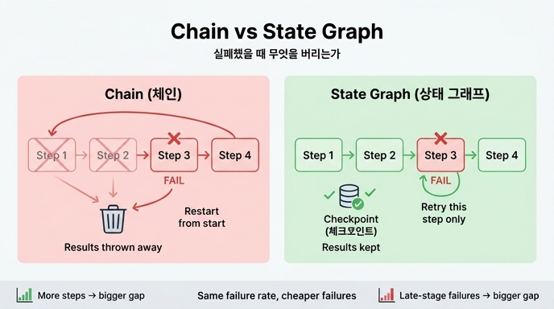

# 체인과 상태 그래프의 근본적 차이

**질문**: 체인과 상태 그래프의 근본적 차이는 무엇인가?

**답**: 실패했을 때 무엇을 버리는가다. 체인은 앞 단계 결과를 버리고, 그래프는 실패한 단계만 다시 한다.

## 왜 「실패 시 무엇을 버리는가」가 핵심인가

체인(prompt chaining)과 상태 그래프(StateGraph)를 비교할 때 흔히 떠올리는 차이 — 분기 표현력, 순환 가능성, 코드 구조 — 는 모두 파생적인 차이다. 18장이 첫 절(18.1)에서 짚는 근본 차이는 딱 하나다:

> **실패했을 때 무엇을 버리는가.**

- **체인**: 단계들을 한 줄로 이어 붙인 구조. 3단계에서 실패하면 예외가 위로 던져지고, 재시도는 **처음부터** 다시 시작한다. 1·2단계가 성공적으로 만든 결과 — 이미 시간과 토큰(돈)을 낸 값 — 를 그대로 버린다.
- **상태 그래프**: 각 단계의 결과가 **상태(state)에 쌓이고 체크포인트로 저장**된다. 3단계에서 실패하면 앞의 결과는 체크포인트에 남아 있으므로 **실패한 3단계만 다시** 실행한다.

## 격차가 벌어지는 두 조건

책의 예제 1(`ex1_chain_vs_graph.py`)은 기대값 계산으로 이 차이를 정량화한다. 네 단계짜리 작업(문서 찾기 → 요약 → 초안 작성 → 검토)에서:

1. **뒤쪽 단계가 자주 실패할수록** 격차가 벌어진다. 마지막 단계 실패율이 높아지면 체인은 회차 전체를 반복하므로 앞 단계들의 비용이 그 배수만큼 다시 든다. 그래프는 마지막 단계의 재시도 비용만 추가된다.
2. **단계가 많을수록** 격차가 벌어진다. 단계가 n개면 체인의 「한 번의 실패로 버려지는 양」이 커지기 때문이다.

수식으로 보면: 체인의 기대 비용은 전체 성공 확률 `p_all_ok = ∏(1-pᵢ)`의 역수를 회차 수로 곱하는 구조라 단계 수·실패율에 대해 **곱셈적으로** 커진다. 그래프는 단계별로 독립이라 각 단계의 기대 시도 횟수 `1/(1-pᵢ)`만 곱해져 **덧셈적으로** 커진다.

## 이 차이를 가능하게 하는 장치: 체크포인트

그래프가 「실패한 단계만 다시」 할 수 있는 이유는 알고리즘이 똑똑해서가 아니라, **매 단계의 상태를 체크포인터(checkpointer)가 저장**하기 때문이다(LangGraph의 persistence, Temporal의 durable execution과 같은 계열의 아이디어). 프로세스가 죽어도 마지막 체크포인트에서 이어서 실행할 수 있다.

## 오해 방지 두 가지

- **그래프가 항상 낫다는 뜻이 아니다.** 단계가 두세 개고 실패가 드물면 체인이 더 싸다(개념이 적고 코드가 짧다). 대부분의 시스템이 체인에서 시작하는 게 맞다. 다만 단계를 함수로 분리하고 데이터를 딕셔너리로 통일해 두면 나중에 반나절이면 갈아탈 수 있다.
- **구조를 바꿔도 실패율은 안 줄어든다.** 3단계가 18% 확률로 실패하는 건 그래프로 바꿔도 그대로다. 줄어드는 것은 **실패 한 번의 값(비용)** — 버려지는 시간과 토큰 — 이다. 이 구분을 팀에 먼저 설명하라는 것이 책의 조언이다.

## 한 줄 정리

체인과 그래프의 차이는 성공 경로에서는 거의 안 보인다. **실패하는 순간**, 체인은 「이미 낸 값」을 버리고 그래프는 체크포인트 덕에 실패한 조각만 다시 산다 — 그래서 근본 차이는 「실패했을 때 무엇을 버리는가」다.

## 인포그래픽

