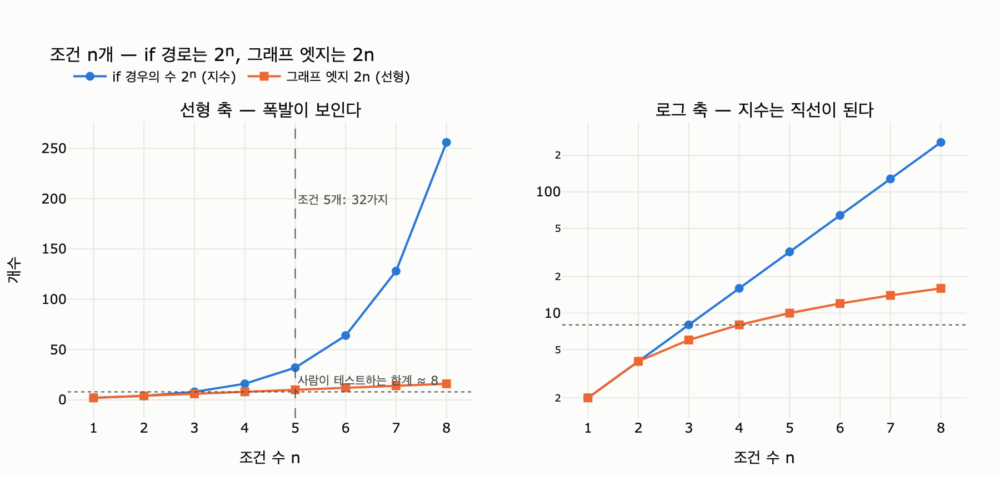

# 조건이 늘어날 때 `if` 문과 그래프 엣지는 각각 어떻게 증가하는가?

**답: `if` 문의 경우의 수는 지수(exponential)로 늘고, 그래프 엣지는 선형(linear)으로 는다. 조건 다섯 개 근처에서 사람이 경우의 수를 다 못 본다.**

## 왜 증가 속도가 다른가

핵심은 두 방식이 조건 조합을 **어디서 만들어 내는가**의 차이다.

- **`if` 문 — 경우의 수를 코드로 펼친다.** 조건이 하나 늘 때마다 기존의 모든 경로가 「예/아니오」 두 갈래로 갈라진다. 그래서 조건 $n$개면 경로가 $2^n$개. 조건마다 **두 배**씩 — 지수 증가다.
- **상태 그래프 — 갈림길을 선언만 한다.** 조건 하나는 「갈림길 노드 하나 + 나가는 엣지 둘」로 표현된다. 조건 $n$개면 엣지 $2n$개. 조건마다 **둘씩** — 선형 증가다. 조합은 코드에 미리 펼쳐지는 게 아니라 **실행 시점에** 만들어진다.

같은 분기 로직인데, `if` 문은 조합의 결과물(경로)을 전부 소스 코드에 적어야 하고, 그래프는 조합의 재료(갈림길)만 적으면 된다.

## 숫자로 보면 (18장 예제 2, `ex2_if_explosion.py`)

책의 예제는 「검색 결과 있음, 요약 길이 초과, 검토 통과, 사람 승인 필요, 재시도 남음」 같은 실무형 조건을 늘려 가며 센다.

| 조건 수 $n$ | 경우의 수 $2^n$ | if 코드 줄 (대략 $2^{n+1}+2n$) | 그래프 엣지 $2n$ | 사람이 다 볼 수 있나 |
|---:|---:|---:|---:|---|
| 1 | 2 | 6 | 2 | 예 |
| 2 | 4 | 12 | 4 | 예 |
| 3 | 8 | 22 | 6 | 예 |
| 4 | 16 | 40 | 8 | 힘들다 |
| **5** | **32** | **74** | **10** | **힘들다** |
| 6 | 64 | 140 | 12 | 불가능 |
| 7 | 128 | 270 | 14 | 불가능 |
| 8 | 256 | 528 | 16 | 불가능 |

## 왜 하필 「다섯 개 근처」인가

조건 5개면 경우의 수가 $2^5 = 32$가지다. 사람이 실제로 테스트해 보는 경로는 여덟 가지쯤이 한계라서, 32가지 중 상당수는 **테스트를 안 해 보게 되고, 안 해 본 경우가 운영에서 나온다.** 이게 실무에서 중첩 `if`가 무너지는 전형적인 지점이다. (이 감각은 순환 복잡도 — McCabe의 cyclomatic complexity — 가 10 근처를 위험 신호로 보는 것과 같은 계열의 관찰이다.)

## 그렇다고 `if`를 쓰지 말라는 뜻은 아니다

조건이 **두세 개면 `if`가 훨씬 읽기 쉽다.** 상태 그래프는 노드·엣지·상태 같은 개념 학습 비용이 처음에 한 번 붙는다. 책의 예제 5(`ex5_when_to_switch.py`) 계산으로는 갈아타는 손익분기점이 대략 **조건 6~7개** 사이에 나온다 — 단, 결제·삭제처럼 되돌리기 힘든 작업이면 조건 두세 개에서도 그래프가 낫다.

## 요약

$$\text{if 경로 수} = 2^n \quad \text{(지수)} \qquad \text{그래프 엣지 수} = 2n \quad \text{(선형)}$$

- `if`는 경우의 수를 **코드로 펼치고**, 그래프는 갈림길을 **선언**한다.
- 조건 5개($2^5=32$가지) 근처에서 사람이 전 경로를 다 보지 못한다.
- 조건 두세 개까지는 `if`가 싸고 읽기 쉽다 — 문제는 그 뒤의 증가 속도다.

## 시각화

