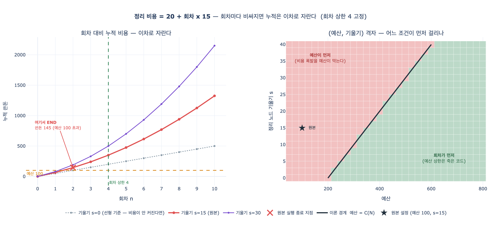

# `ex5_debug_state.py`에서 '정리' 노드의 비용은 어떻게 변하는가?

**`20 + 회차 × 15`로 회차가 늘수록 비싸진다. 실제로 흔한 패턴이다.**

## 원본 코드

```python
def 정리(s):
    # 회차가 늘수록 비싸진다 — 실제로 흔한 패턴
    cost = 20 + s["회차"] * 15
    return {"쓴돈": cost, "기록": [f"정리 {cost}"]}
```

`회차`는 `Annotated[int, operator.add]` 리듀서를 달고 있어서 `검색` 노드가 매 루프마다 `+1`씩 누적한다.
따라서 `정리`가 읽는 `s["회차"]`는 **지금까지 돈 루프 횟수**이고, 비용은 상수가 아니라
**회차에 비례해 커지는 값**이다.

이건 억지 설정이 아니라 에이전트에서 실제로 흔한 모양이다. 맥락을 계속 쌓아 두고
매 회차마다 그 전체를 요약·정리하면, 정리해야 할 양이 회차와 함께 늘어난다.

## 회차별 비용

| 회차 | 검색(고정) | 정리(가변) | 누적 쓴돈 |
|---:|---:|---:|---:|
| 1 | 30 | 20 + 1×15 = **35** | 65 |
| 2 | 30 | 20 + 2×15 = **50** | **145** |
| 3 | 30 | 20 + 3×15 = 65 | 240 |
| 4 | 30 | 20 + 4×15 = 80 | 350 |

한 회차 만에 정리 비용이 35 → 50으로 **43% 비싸졌다**.

## 왜 위험한가 — 누적은 선형이 아니라 이차

회차 $k$의 비용이 $c_k = 20 + 15k$이면 누적은 등차수열의 합이므로

$$C(n)=\sum_{k=0}^{n-1}(20+15k)=20n+15\frac{n(n-1)}{2}$$

가 된다. 원본은 `검색`이 `회차`를 먼저 올린 뒤 `정리`가 그 값을 보므로 실제로는
$k=1$부터 세는 게 맞고 $C(n)=20n+15\frac{n(n+1)}{2}$이지만, **어느 쪽이든 $n^2$ 항이 남는다**는 사실은 같다.

일반화해서 기울기 $s$, 기본비 $b$, 검색비 $f$라 하면 전체 누적은

$$C_{\text{전체}}(n)=(f+b)\,n+s\frac{n(n+1)}{2}=\frac{s}{2}n^{2}+\left(f+b+\frac{s}{2}\right)n$$

최고차항이 $\frac{s}{2}n^{2}$다. **회차 상한을 2배로 늘리면 최악 비용은 2배가 아니라 약 4배가 된다.**

| 회차 상한 N | 최악 누적 비용 | N=4 대비 |
|---:|---:|---:|
| 2 | 145 | ×0.4 |
| 4 | 350 | ×1.0 |
| 8 | 940 | ×2.7 |
| 16 | 2,840 | ×8.1 |
| 32 | 9,520 | ×27.2 |

"재시도 5번까지만" 같은 회차 상한은 직관적으로는 선형처럼 느껴지지만,
회차당 비용이 커지는 구조에서는 실제로 이차다. 그래서 **회차 상한만 믿는 설계는 위험하다.**

## 두 종료 조건은 경쟁한다

`route()`에는 종료 조건이 **두 가지** 있다.

```python
def route(s):
    if s["쓴돈"] >= BUDGET:                    # (A) 예산 상한 100
        return END
    return END if s["회차"] >= 4 else "검색"   # (B) 회차 상한 4
```

역할이 다르다. **회차 상한은 무한 루프를 막고, 예산 상한은 비용 폭발을 막는다.**

원본 기본값에서 실제로 일한 건 **(A) 예산 상한**이다.
2회차에 누적 145로 예산 100을 넘겨 끝났고, 회차 상한 4는 구경도 못 했다.

임계점은 $C_{\text{전체}}(N)$과 예산을 비교하면 나온다.

$$\text{예산} > (f+b)N+s\frac{N(N+1)}{2}\;\Longrightarrow\;\text{회차 상한이 먼저}$$

기본값($f{=}30,\ b{=}20,\ s{=}15,\ N{=}4$)에서 임계 예산은 **350**이다.
즉 예산이 350을 넘어야 비로소 회차 상한이 실질적인 브레이크가 되고,
그 아래에서는 회차 상한이 **죽은 코드**나 다름없다.

## 놓치기 쉬운 것 — `route()`는 쓰고 난 뒤에 검사한다

예산은 100인데 최종 사용은 **145**다. `route()`는 `정리`가 돈을 다 쓴 뒤에 호출되므로
**45만큼의 초과 지출이 이미 확정된 상태**에서 멈춘다.
그리고 비용이 회차마다 커지는 패턴에서는 이 "마지막 한 걸음"이 회차와 함께 커진다.
상한은 이 초과분까지 감안해서 잡아야 한다.

바로 이 지점이 20장 「언제 멈출 것인가」로 이어진다.

## 시각화



왼쪽은 회차 대비 누적 비용 곡선이다. 기울기 `s=0`(점선)은 직선이지만
원본 `s=15`와 `s=30`은 위로 휘는 이차 곡선이고, 예산선(100)을 2회차에 이미 뚫는다.
오른쪽은 (예산, 기울기) 격자에서 어느 종료 조건이 먼저 발동하는지 보여 준다.
붉은 영역은 예산이, 초록 영역은 회차가 먼저 걸리는 구간이며,
둘을 가르는 검은 선이 이론 경계 $\text{예산}=C_{\text{전체}}(N)$이다.
원본 설정(별표, 예산 100 · $s{=}15$)은 붉은 영역 깊숙이 들어가 있다.
