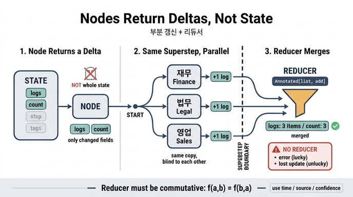

# 상태 그래프의 노드는 무엇을 반환하는가?

> **답**: 상태 전체가 아니라 **바꾼 부분만** 반환한다. 여럿이 같은 필드를 건드리면 **리듀서**가 합친다.

---

## 1. 핵심: 노드는 「덮어쓰기」가 아니라 「부분 갱신」을 낸다

상태 그래프(StateGraph)의 노드 함수는 현재 상태를 인자로 받지만, 돌려주는 값은 **상태 전체가 아니라 델타(delta), 즉 바꾼 필드만 담은 부분 딕셔너리**다.

```python
def worker(name):
    def fn(s):
        # s 에는 상태 전체가 들어오지만
        # 돌려주는 건 «내가 바꾼 두 필드»뿐이다
        return {"logs": [f"{name} 실행"], "count": 1}
    return fn
```

`fn` 이 `{"logs": [...], "count": 1}` 만 반환해도, 상태에 있는 다른 필드는 그대로 살아 있다. 노드는 자기가 건드린 부분만 책임지면 된다.

이게 왜 중요한가:

- 노드가 상태 전체를 재구성해서 돌려줄 필요가 없다 → 노드끼리 **결합도가 낮아진다**.
- 실행기가 "누가 어떤 필드를 썼는지"를 정확히 알 수 있다 → 병합 시점에 충돌을 **탐지**할 수 있다.
- 타입 정의만 읽어도 "이 필드는 여럿이 쓴다"는 사실이 드러난다(뒤에 나오는 `Annotated`).

---

## 2. 문제: 같은 슈퍼스텝의 여러 노드가 같은 필드를 낸다

19장 예제 1(`ex1_lost_update.py`)의 구조는 이렇다. `START` 에서 세 노드로 동시에 뻗는다.

```
        START
       /  |  \
    재무 법무 영업     ← 셋이 «같은 슈퍼스텝»
       \  |  /
         END
```

셋 다 같은 슈퍼스텝에 들어가고, 셋 다 `{"logs": [...], "count": 1}` 을 반환한다. 그러면 실행기는 세 개의 델타를 하나의 `logs`, 하나의 `count` 로 만들어야 한다. **어떻게 합칠지**를 정하는 게 리듀서다.

### 리듀서가 없으면 — 갱신 유실(lost update)

```python
class NoReducer(TypedDict):
    logs: list      # 합치는 규칙이 없다
    count: int
```

이 경우 결과는 둘 중 하나다.

| 결과 | 설명 |
|---|---|
| 예외 (운이 좋으면) | LangGraph 는 "같은 필드를 여럿이 쓰려 한다"고 **막는다**. `InvalidUpdateError` 계열. |
| 조용한 갱신 유실 (운이 나쁘면) | 마지막 하나만 남고 나머지는 사라진다. 그리고 **누가 마지막인지는 매번 다르다**. |

19장 도입부의 "노드 셋을 병렬로 돌렸는데 로그가 하나만 남았습니다. 「덮였다」는 말이 정확하지도 않습니다. 누가 마지막이었는지도 매번 달랐거든요"가 정확히 이 증상이다.

`lost update`는 데이터베이스 동시성 이론의 고전적 이상현상(anomaly)이다. 두 트랜잭션이 같은 값을 읽고 각자 고쳐서 쓰면 한쪽 갱신이 흔적 없이 사라진다. 그래프 실행기에서도 똑같은 일이 벌어진다.

### 리듀서가 있으면 — 전부 합쳐진다

```python
import operator
from typing import Annotated, TypedDict

class WithReducer(TypedDict):
    logs:  Annotated[list, operator.add]   # 리스트 이어 붙이기
    count: Annotated[int,  operator.add]   # 정수 더하기
```

`Annotated[T, reducer]` 로 필드에 병합 함수를 붙이면, 실행기는 그 슈퍼스텝에 도착한 모든 델타를 `reducer(누적값, 새값)` 으로 접어(fold) 하나로 만든다.

```
logs  ['재무 실행', '법무 실행', '영업 실행']
count 3
```

> 여기서 중요한 건 «리듀서를 붙였다»가 아니라 **«이 필드를 여럿이 쓴다는 걸 타입에 적었다»**는 것이다. 타입을 읽으면 동시 쓰기 여부를 알 수 있다. 코드를 안 읽어도.
> — `ex1_lost_update.py`

---

## 3. 왜 「병합」이 필요한가 — 슈퍼스텝의 성질

병합이 필요한 이유는 **같은 슈퍼스텝의 노드들이 서로가 쓴 것을 볼 수 없기** 때문이다. 셋 다 **같은 상태 사본**을 받는다.

```
슈퍼스텝 N        상태 사본 S를 A, B, C 가 각자 받는다
                 A → ΔA     B → ΔB     C → ΔC      (서로 못 봄)
─── 경계 ───     reduce(S, ΔA, ΔB, ΔC) → S'        ← 여기서 합쳐진다
슈퍼스텝 N+1      D, E 는 S' 를 본다
```

이 모형은 Google의 **Pregel** 논문(SIGMOD 2010)에서 온 것이고, 그 뿌리는 Valiant의 **BSP(Bulk Synchronous Parallel, 1990)** 다. BSP의 한 슈퍼스텝은 (1) 로컬 계산 (2) 통신 (3) **장벽 동기화(barrier synchronization)** 로 이뤄진다. 장벽 이전에 쓴 값은 장벽 이후에만 보인다.

예제 2(`ex2_superstep.py`)가 이걸 눈으로 보여준다. A·B·C 는 전부 `seen=0개` 를 봤다고 기록한다 — 서로의 기록을 못 본 것이다. 그리고 `경계` 노드를 하나 끼워 넣으면 D·E 는 앞의 결과를 전부 본다.

> 그래서 «같은 슈퍼스텝 안에서 서로 결과를 참조»하는 설계는 안 된다. 필요하면 **사이에 노드를 하나 넣어 경계를 만들어야** 한다.

---

## 4. 리듀서는 교환법칙을 지켜야 한다

리듀서를 직접 짤 때의 함정. **실행 순서를 여러분이 정할 수 없다.**

`f(a, b) == f(b, a)` 가 성립하지 않으면(즉 교환법칙이 깨지면), 같은 입력에 같은 코드인데 실행마다 다른 답이 나온다. 그리고 실행기 버전이 올라가면 순서가 또 바뀔 수 있다.

예제 3(`ex3_custom_reducer.py`)이 네 가지 리듀서를 비교한다.

| 필드 | 리듀서 | 규칙 | 순서 의존? |
|---|---|---|---|
| `담당` | `keep_latest` | 값 안의 `at`(시각)이 최근인 쪽 | ❌ 안전 |
| `분류` | `keep_best` | 값 안의 `conf`(신뢰도)가 높은 쪽 | ❌ 안전 |
| `속성` | `merge_dict` | 키 단위 병합, 겹치면 **나중 것**이 이김 | ⚠️ 위험 |
| `태그` | `collect_unique` | 이어 붙이되 중복 제거, 순서 유지 | ⚠️ 순서가 흔들림 |

```python
def keep_latest(old, new):
    """타임스탬프가 더 최근인 쪽을 남긴다."""
    if not old: return new
    if not new: return old
    return new if new["at"] > old["at"] else old
```

`merge_dict` 로 병합한 `속성` 을 보면 실제 함정이 드러난다. ERP는 등급 A, CRM은 등급 B를 냈고, "새 것이 이긴다"로 짰는데 결과는 **A**가 남았다. 실행기가 CRM을 먼저 돌려서 ERP가 「새 것」이 되어 버렸기 때문이다. `태그` 순서도 `['중견', '수도권', '제조']` — CRM이 먼저 왔다는 증거다. 코드에는 ERP를 먼저 등록했는데도.

**해법**: 순서에 기대지 말고, **값 안에 판단 근거를 담아라**. 시각(`at`), 출처(`source`), 신뢰도(`conf`) 같은 필드를 값 자체에 넣고 리듀서가 그걸 보고 결정하면, 도착 순서와 무관하게 항상 같은 답이 나온다. `담당` 과 `분류` 가 그렇게 돼 있다.

이건 CRDT(충돌 없는 복제 자료형)에서 병합 연산이 **교환·결합·멱등(commutative, associative, idempotent)** 이어야 한다는 요구와 같은 얘기다.

---

## 5. 곁가지: 델타를 반환한다고 상태가 작아지진 않는다

노드가 델타만 반환해도, **체크포인트는 슈퍼스텝마다 상태를 통째로** 저장한다(구현이 증분 저장을 지원하지 않는 한). 예제 4(`ex4_state_size.py`)의 기준:

- **판별 질문**: "다음 노드가 이걸 읽는가?" — 아니면 상태에 두지 마라.
- 검색 결과 원문(84KB), 모델 원본 응답(12KB), 중간 계산 캐시(31KB)는 전부 탈락. 원문은 밖에 두고 상태에는 **주소만**.
- 전부 담으면 필요한 것만 담을 때의 수십 배. 저자 기준선은 **8KB** — 넘으면 뺄 것을 찾는다.
- 진짜 비용은 저장비(월 몇천 원)가 아니라 **직렬화 시간**이다. 슈퍼스텝마다 읽고 쓰는 지연이 사용자 대기 시간이 된다.

부수 효과 하나: 상태가 작아지면 **"이 노드가 무엇에 의존하는가"가 타입만 봐도 보인다.**

---

## 6. 한 줄 정리

| 질문 | 답 |
|---|---|
| 노드가 반환하는 것은? | 상태 전체가 아니라 **바꾼 필드만 담은 부분 딕셔너리** |
| 여럿이 같은 필드를 쓰면? | **리듀서**가 정의된 규칙대로 합친다 |
| 리듀서가 없으면? | 예외(운 좋으면) 또는 **조용한 갱신 유실**(운 나쁘면) |
| 리듀서를 어디에 적나? | 상태 타입에 `Annotated[T, reducer]` — 타입이 곧 동시 쓰기 문서 |
| 리듀서의 필수 조건은? | **교환법칙** `f(a,b) == f(b,a)`. 순서는 내가 못 정한다 |
| 순서 의존을 피하려면? | 값 안에 시각·출처·신뢰도를 담고 리듀서가 그걸 보고 결정 |

## 참고

- [LangGraph Graph API — StateGraph / reducer / superstep](https://docs.langchain.com/oss/python/langgraph/graph-api)
- [Pregel: A System for Large-Scale Graph Processing (SIGMOD 2010)](https://dl.acm.org/doi/10.1145/1807167.1807184)
- [L. G. Valiant, A Bridging Model for Parallel Computation (CACM 1990)](https://dl.acm.org/doi/10.1145/79173.79181)
- [LangGraph Persistence (체크포인트)](https://docs.langchain.com/oss/python/langgraph/persistence)

## 인포그래픽


