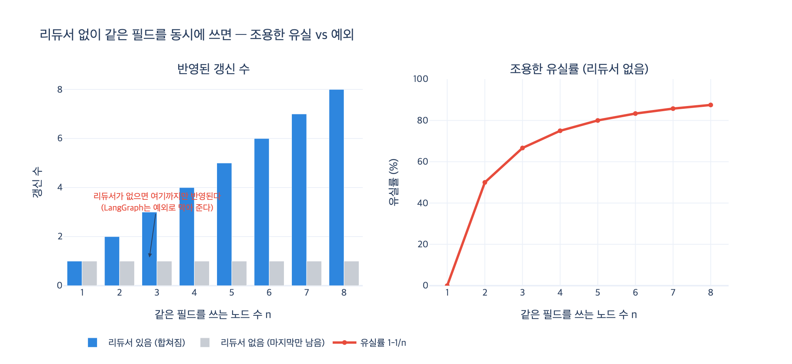

# 리듀서가 없는데 여러 노드가 같은 필드를 쓰면 어떻게 되는가?

> **답**: 운이 나쁘면 갱신이 조용히 사라지고, 운이 좋으면 예외가 난다. LangGraph는 예외로 막아 준다.

---

## 1. 왜 이런 상황이 생기는가

LangGraph의 노드는 **상태 전체를 돌려주지 않는다.** 바꾼 부분만 부분 갱신(partial update)으로 돌려준다.

```python
def fn(s):
    return {"logs": [f"{name} 실행"], "count": 1}   # 상태 전체가 아니라 «바뀐 것»만
```

그리고 같은 슈퍼스텝(superstep)에 들어간 노드들은 **같은 상태 사본**을 읽는다. 서로가 쓴 걸 못 본다.

```python
b.add_edge(START, "재무")
b.add_edge(START, "법무")   # 셋이 «동시에» 시작 → 같은 슈퍼스텝
b.add_edge(START, "영업")
```

슈퍼스텝이 끝나는 순간, 실행기 손에는 같은 키에 대한 부분 갱신이 **세 개** 들어온다.

```
슈퍼스텝 종료 시점:
  재무 → {"logs": ["재무 실행"], "count": 1}
  법무 → {"logs": ["법무 실행"], "count": 1}   ← logs 키에 값 3개
  영업 → {"logs": ["영업 실행"], "count": 1}
```

이 세 개를 하나로 접어야 다음 상태가 만들어진다. **접는 방법을 알려 주는 함수가 리듀서다.**

리듀서가 없으면 접을 방법이 없다. 남는 선택지는 두 가지뿐이다.

---

## 2. 운이 나쁜 경우 — 갱신이 조용히 사라진다

「마지막 하나만 남긴다(last-write-wins)」로 처리하는 실행기라면 이렇게 된다.

```
결과: {'logs': ['영업 실행'], 'count': 1}
유실: 재무의 logs·count, 법무의 logs·count
```

세 노드가 **전부 성공**했고, **예외도 없었고**, **로그도 깨끗하다.** 그런데 결과에는 한 노드분만 남았다. `count`는 3이어야 하는데 1이다.

이게 데이터베이스 쪽에서 오래 알려진 **갱신 유실(lost update)** 이다. 서로를 못 보는 두 갱신이 같은 자리에 쓰면 앞의 것이 흔적 없이 지워진다.

문제는 「사라진다」가 아니라 **「조용히」** 다.

- 스택 트레이스가 없다.
- 에러 로그가 없다.
- 결과가 그럴듯해서 며칠 뒤에나 발견된다.

더 나쁜 건, **누가 살아남는지가 매번 다르다**는 점이다. 순서는 실행기의 스케줄링이 정하고, 그 순서는 우리가 못 정한다.

```
['재무', '법무', '영업'] -> {'logs': ['영업 실행'], 'count': 1}
['영업', '재무', '법무'] -> {'logs': ['법무 실행'], 'count': 1}
['법무', '영업', '재무'] -> {'logs': ['재무 실행'], 'count': 1}
```

재현이 안 되는 버그가 된다. 「덮였다」는 말조차 정확하지 않다. **누가 마지막이었는지가 매번 다르기 때문이다.**

---

## 3. 운이 좋은 경우 — 예외가 난다. LangGraph가 그렇다

LangGraph는 조용히 넘어가지 않는다. 리듀서가 없는 키에 한 슈퍼스텝에서 값이 두 개 이상 들어오면 `InvalidUpdateError`를 던진다.

```python
class NoReducer(TypedDict):     # 리듀서 없음
    logs: list
    count: int
```

```
[리듀서 없음] 예외 InvalidUpdateError —
    At key 'logs': Can receive only one value per step.
    Use an Annotated key to handle multiple values.
```

프로그램이 죽는다. 하지만 **틀린 답을 들고 다니지는 않는다.**

「막아 준다」가 이 뜻이다. 조용한 데이터 손상 대신 시끄러운 실패를 고른 설계다. 원래 예제 코드(`ex1_lost_update.py`)가 **일부러 예외를 내는 경우를 포함**하는 이유도 그것이다. 예외가 나는 게 이 예제의 결과다.

> 확인 시점 기준 실제 재현: LangGraph 0.6.11 / 1.0.x 모두 동일하게 `InvalidUpdateError`.

---

## 4. 리듀서를 붙이면

`Annotated[타입, 리듀서]` 로 「이 필드는 여럿이 쓴다」고 타입에 적어 주면 된다.

```python
class WithReducer(TypedDict):
    logs:  Annotated[list, operator.add]   # 이어 붙인다
    count: Annotated[int,  operator.add]   # 더한다
```

```
[리듀서 있음] logs=['법무 실행', '영업 실행', '재무 실행'] count=3
```

셋이 전부 합쳐졌다.

여기서 진짜 중요한 건 「리듀서를 붙였다」가 아니라 **「이 필드를 여럿이 쓴다는 걸 타입에 적었다」** 는 점이다. 타입만 읽으면 동시 쓰기 여부를 알 수 있다. 코드를 안 읽어도.

---

## 5. 따라오는 함정 — 리듀서는 교환법칙을 지켜야 한다

위 결과의 `logs` 순서를 다시 보자. `['법무', '영업', '재무']`. **등록 순서(재무→법무→영업)가 아니다.** 실행기가 정한 순서다.

실행 순서를 우리가 정하지 못하므로, 리듀서는 순서와 무관하게 같은 답을 내야 한다.

$$ f(a, b) = f(b, a) $$

이게 아니면 실행 순서에 따라 답이 달라지고, 실행기 버전이 올라가면 순서가 또 바뀔 수 있다.

| 리듀서 | 예 | 교환법칙 |
|---|---|---|
| 「더한다」 | `operator.add` (int) | O |
| 「중복 뺀 합집합」 | `collect_unique` | O (내용 기준) |
| 「타임스탬프가 최근인 쪽」 | `keep_latest` | O |
| 「신뢰도가 높은 쪽」 | `keep_best` | O |
| 「나중에 온 쪽이 이긴다」 | `merge_dict`, `last_wins` | **X** |

`ex3_custom_reducer.py`가 보여 주는 실패가 정확히 이것이다. `merge_dict`를 「새 것이 이긴다」로 짰는데 실행기가 CRM을 먼저 돌리는 바람에 ERP가 「새 것」이 되어, 기대와 정반대인 `등급: A`가 남았다.

**고치는 법**: 값 안에 판단 근거(시각·출처·신뢰도)를 담고, 리듀서가 그걸 보고 정하게 한다.

```python
{"who": "박서준", "at": "2026-01-15"}     # ← at 을 보고 정하면 순서와 무관
{"cat": "유통",   "conf": 0.9}            # ← conf 를 보고 정하면 순서와 무관
```

---

## 6. 한 장 정리

| 상황 | 결과 | 판정 |
|---|---|---|
| 리듀서 없음 + 마지막 값만 남기는 실행기 | 갱신이 조용히 사라짐 (lost update) | **운이 나쁨** |
| 리듀서 없음 + LangGraph | `InvalidUpdateError` 예외 | **운이 좋음** |
| `Annotated[list, operator.add]` | 전부 합쳐짐 | 정답 |
| 리듀서 있음 + 교환법칙 X | 실행마다 답이 달라짐 | 숨은 함정 |

같은 슈퍼스텝에서 서로의 결과를 참조하고 싶다면 리듀서로 될 일이 아니다. **사이에 노드를 하나 넣어 슈퍼스텝 경계를 만들어야 한다.**

### 1차 출처

- [LangGraph Graph API — StateGraph / reducer / superstep](https://docs.langchain.com/oss/python/langgraph/graph-api)
- [Pregel: a system for large-scale graph processing](https://dl.acm.org/doi/10.1145/1807167.1807184)
- [Bulk Synchronous Parallel](https://dl.acm.org/doi/10.1145/79173.79181)
- lost update — ISO/IEC 9075 (SQL) 격리 수준 이상 현상

## 시각화


