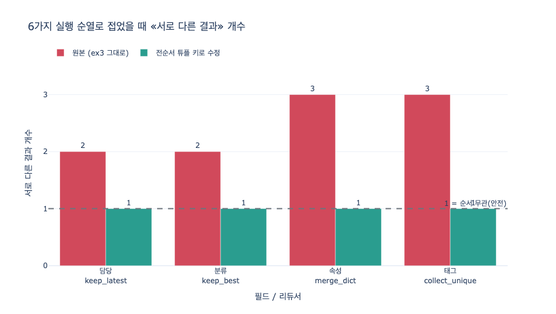

# `ex3_custom_reducer.py`의 네 가지 커스텀 리듀서

**질문** — `ex3_custom_reducer.py`의 네 가지 커스텀 리듀서는 무엇인가?

**답** — `keep_latest`(타임스탬프가 최근인 쪽), `keep_best`(신뢰도 높은 쪽), `merge_dict`(키 단위 병합), `collect_unique`(중복 뺀 이어 붙이기)다.

---

## 왜 리듀서가 필요한가 — 30초 배경

19장 예제 1이 보여 준 대로, 같은 슈퍼스텝의 노드 여럿이 **같은 필드**를 쓰면 LangGraph는 "리듀서 없이는 못 합친다"며 막는다. 리듀서는 그 충돌을 해결하는 함수이고, `TypedDict` 필드에 `Annotated[타입, 리듀서]`로 붙인다.

핵심은 예제 3의 docstring 한 줄에 있다.

> 리듀서를 직접 쓴다. **«어떻게 합칠까»가 도메인 지식이다.**

`operator.add` 같은 범용 리듀서로 안 되는 필드가 대부분이다. "담당자는 최신이 이긴다", "분류는 신뢰도가 이긴다" 같은 규칙은 프레임워크가 알 수 없고 도메인만 안다. 예제 3은 그 규칙 네 가지를 손으로 짠다.

## 네 리듀서 — 시그니처·동작·적합한 도메인

리듀서의 시그니처는 전부 `f(old, new) -> merged`다. `old`는 지금까지 접힌 누적값, `new`는 새로 들어온 갱신이다.

### 1. `keep_latest(old, new) -> dict` — 최신 우선 (Last-Write-Wins by timestamp)

```python
def keep_latest(old, new):
    """타임스탬프가 더 최근인 쪽을 남긴다."""
    if not old:
        return new
    if not new:
        return old
    return new if new["at"] > old["at"] else old
```

- **동작**: 두 값의 `at` 필드를 문자열 비교해 큰 쪽(더 최근)을 통째로 남긴다. 필드 단위 병합이 아니라 **레코드 통째로 교체**다.
- **전제**: 값 안에 `at`이 반드시 들어 있어야 하고, `at`은 사전순 비교가 곧 시간순이어야 한다(ISO-8601 `YYYY-MM-DD`가 그래서 쓰인다).
- **적합한 도메인**: 담당자, 연락처, 주소, 현재 상태 라벨처럼 **가장 최근 사실 하나만 유효한** 필드. 여러 시스템이 같은 개체를 각자 갱신할 때 "누가 더 최근에 봤나"가 판단 기준이 되는 경우.
- **예제 3에서**: `담당` 필드. ERP는 `2024-03-01`의 김하늘, CRM은 `2026-01-15`의 박서준 → 박서준이 남는다. **실행 순서와 무관하게** 같은 답이 나온다. 판단 근거(`at`)가 값 안에 들어 있기 때문이다.

### 2. `keep_best(old, new) -> dict` — 신뢰도 우선 (best-of by confidence)

```python
def keep_best(old, new):
    """신뢰도가 높은 쪽. 같으면 먼저 온 쪽."""
    if not old:
        return new
    if not new:
        return old
    return new if new["conf"] > old["conf"] else old
```

- **동작**: `conf`(0~1의 신뢰도)가 큰 쪽을 남긴다. 구조는 `keep_latest`와 동일하고 **비교 키만 다르다**. 동률이면 `>`가 거짓이라 `old`(먼저 접힌 쪽)가 이긴다.
- **적합한 도메인**: 여러 분류기·추출기·모델이 같은 슬롯에 서로 다른 답을 낼 때. 산업 분류, 개체 인식(NER), 의도 분류, OCR 후보 등 **확률/점수가 딸려 나오는** 출력.
- **예제 3에서**: `분류` 필드. ERP `제조/0.7` vs CRM `유통/0.9` → 유통이 남는다. 역시 순서 무관.

### 3. `merge_dict(old, new) -> dict` — 키 단위 병합 (right-biased shallow merge)

```python
def merge_dict(old, new):
    """키 단위 병합. 겹치면 새 것이 이긴다."""
    out = dict(old or {})
    out.update(new or {})
    return out
```

- **동작**: 얕은 병합. 겹치지 않는 키는 합집합으로 모이고, **겹치는 키는 `new`가 덮는다.**
- **적합한 도메인**: 여러 출처가 **서로 다른 조각**을 채우는 프로필/속성 백. ERP는 사업자번호를, CRM은 지역을, 마케팅은 세그먼트를 아는 식으로 담당 키가 갈릴 때 진가가 난다.
- **예제 3에서 — 여기가 함정이다**: ERP `{사업자번호, 등급:A}`, CRM `{등급:B, 지역:수도권}`. 겹치는 키는 `등급` 하나인데, 결과는 **`등급: A`** 가 남았다. `new`가 이기도록 짰는데 실행기가 CRM을 먼저 돌려서 ERP가 "새 것"이 되어 버린 것이다. 책 본문의 표현대로 *"코드를 짤 때 제가 기대한 것과 반대다."*

### 4. `collect_unique(old, new) -> list` — 중복 뺀 이어 붙이기 (order-preserving union)

```python
def collect_unique(old, new):
    """이어 붙이되 중복은 뺀다. 순서는 유지."""
    seen, out = set(), []
    for x in list(old or []) + list(new or []):
        k = x if isinstance(x, str) else str(x)
        if k not in seen:
            seen.add(k); out.append(x)
    return out
```

- **동작**: `operator.add`(단순 이어 붙이기)의 중복 제거 버전. `str()`로 정규화한 키를 써서 **비해시(dict 등) 원소도 다룰 수 있다.** 첫 등장 순서를 유지한다.
- **적합한 도메인**: 태그·라벨·인용 출처 URL·방문 노드 목록처럼 **집합 의미론**이면서 리스트로 담기는 필드. 같은 태그를 여러 출처가 내도 한 번만 남아야 할 때.
- **예제 3에서**: ERP `["제조","중견"]`, CRM `["중견","수도권"]` → 결과 `['중견','수도권','제조']`. 중복 `중견`은 하나만 남았다. 그런데 순서가 **CRM 먼저**다. ERP를 먼저 등록했는데도.

## 대수적 성질 판정표

리듀서가 안전하려면 무엇이 성립해야 하나. LangGraph는 한 슈퍼스텝에서 온 갱신들을 **왼쪽 접기**로 합친다.

$$ \text{final} = f(\dots f(f(s_0, u_{\sigma(1)}), u_{\sigma(2)}) \dots, u_{\sigma(n)}) $$

순열 $\sigma$ 는 실행기가 정하고 **우리가 고를 수 없다**. 따라서 결합법칙이 성립하는 상황에서 "모든 $\sigma$ 에 대해 결과가 같다"는 조건은 곧 **교환법칙** $f(a,b)=f(b,a)$ 다. 19장 요약이 *"리듀서는 교환법칙을 지켜야 합니다"* 라고 못 박은 이유다.

| 리듀서 | 교환 $f(a,b)=f(b,a)$ | 결합 $f(f(a,b),c)=f(a,f(b,c))$ | 멱등 $f(a,a)=a$ | 순서 의존 위험 |
|---|---|---|---|---|
| `keep_latest` | **조건부 O** — `at`이 서로 다를 때만. 동률이면 X | O (leftmost-argmax는 결합적) | O | 같은 날짜/같은 초의 갱신 둘이 오면 **tie-break가 인자 순서**로 결정된다 |
| `keep_best` | **조건부 O** — `conf`가 서로 다를 때만. 동률이면 X | O | O | `conf`는 `0.9` 같은 반올림 값이 흔해 **동률 확률이 높다**. `keep_latest`보다 위험 |
| `merge_dict` | **X** — 겹치는 키의 값이 다르면 즉시 깨짐 | O (dict update는 결합적) | O | 겹치는 키는 **마지막에 접힌 쪽**이 이긴다. 예제 3의 `등급 A/B` 사고가 바로 이것 |
| `collect_unique` | **집합으로는 O / 리스트로는 X** | O | O(원소 중복 없는 입력), 중복 있으면 정규화 후 성립 | 원소 집합은 항상 같지만 **첫 등장 순서**가 인자 순서를 물려받는다. 뒤 노드가 `태그[0]`을 읽는 순간 버그 |

읽는 법 — 넷 모두 **결합법칙과 멱등성은 만족하고 교환법칙만 깨진다.** 그래서 문제가 은근하다. 재시도로 같은 갱신이 두 번 와도 안전하고(멱등), 부분 병합 후 재접기도 안전한데(결합), 오직 **순서**에서만 답이 갈린다. 그리고 순서는 테스트 때 우연히 맞았다가 프로덕션에서 뒤집히는 종류의 변수다.

### 위험 두 갈래를 구분하자

**(A) 동률 tie-break — `keep_latest` / `keep_best`**

`new["at"] > old["at"]` 는 **엄격 부등호**다. 동률이면 거짓 → `old`가 남는다. 즉 `f(a,b)=a`, `f(b,a)=b`. 비교 키가 **부분 순서**(동률 허용)라서 생기는 문제다. `keep_best`의 docstring "같으면 먼저 온 쪽"이 바로 이 동작을 명시한 것인데, **"먼저"가 무엇인지 우리가 정할 수 없다는 게 함정**이다.

**(B) 순서 편향 — `merge_dict` / `collect_unique`**

이쪽은 동률과 무관하게 **설계 자체가 인자 위치에 의미를 부여**한다. `merge_dict`는 오른쪽이, `collect_unique`는 왼쪽이 우선권을 갖는다. 어느 쪽이 "오른쪽"인지가 실행기 손에 있으니 결과도 실행기 손에 있다.

## 고치는 법 — 전순서(total order) 튜플 키

처방은 하나다. **비교 키를 전순서로 만든다.** 서로 다른 두 값이 결코 같은 키를 갖지 않도록, 판단 근거를 튜플로 쌓는다.

$$ k(v) = (\text{at},\; \text{src\_rank},\; \text{id}) $$

```python
SRC_RANK = {"MDM": 3, "ERP": 2, "CRM": 1}   # 동률일 때 신뢰하는 출처 우선순위

def keep_latest_fixed(old, new):
    if not old: return new
    if not new: return old
    k = lambda d: (d["at"], SRC_RANK[d["src"]], d["who"])
    return new if k(new) > k(old) else old
```

- 1순위 `at`이 갈리면 거기서 끝. 동률이면 2순위 `src_rank`가 갈라 준다. 그것마저 같으면 3순위 `who`(값 자체)가 최종 결정한다.
- 마지막 항목이 **값 자체**여야 한다. 그래야 "값이 다르면 키도 다르다"가 보장되어 동률이 원천적으로 사라진다.
- `merge_dict`는 **값마다 `(at, src)`를 달고** 키별로 최대값을 고르게 바꾼다. `collect_unique`는 **정규 순서로 정렬**해 순서 자체를 값에서 배제한다(또는 순서에 의미를 두지 않기로 계약한다).

여기서 진짜 배울 점은 리듀서 코드가 아니라 **값의 스키마**다. 19장 본문이 말하듯 *"값 안에 판단 근거(시각, 출처, 신뢰도)를 넣으세요."* `담당`과 `분류`가 순서에 강한 이유는 리듀서가 똑똑해서가 아니라 **값이 `at`과 `conf`를 들고 다니기 때문**이다. `속성`과 `태그`가 약한 이유는 값이 아무 근거도 안 들고 있어서다.

## 함께 보면 좋은 것

- 예제 1 `ex1_lost_update.py` — 리듀서가 아예 없을 때(갱신 유실 / 예외)
- 예제 2 `ex2_superstep.py` — 같은 슈퍼스텝의 노드들이 서로를 못 보는 이유
- 14장의 "생존 규칙" — 같은 병합 문제를 **배치**로 푼 것. 예제 3은 그걸 **실행 중**에 한다
- 1차 출처: [LangGraph Graph API — reducer](https://docs.langchain.com/oss/python/langgraph/graph-api), [Pregel](https://dl.acm.org/doi/10.1145/1807167.1807184), [BSP](https://dl.acm.org/doi/10.1145/79173.79181)

## 시각화

같은 필드에 갱신 셋(ERP·CRM·MDM)을 넣고 $3!=6$ 가지 실행 순열 **전부**로 접었을 때, 리듀서마다 서로 다른 결과가 몇 개 나오는지 센 것이다. 값이 1이면 어떤 실행 순서에도 같은 답 — 안전하다는 뜻이다.

원본 리듀서는 `keep_latest` 2개, `keep_best` 2개(동률 tie-break), `merge_dict` 3개, `collect_unique` 3개(리스트 순서)로 갈렸고, 전순서 튜플 키를 적용하자 넷 다 1개로 수렴했다. 재현 코드는 `expy.py`에 있다.


