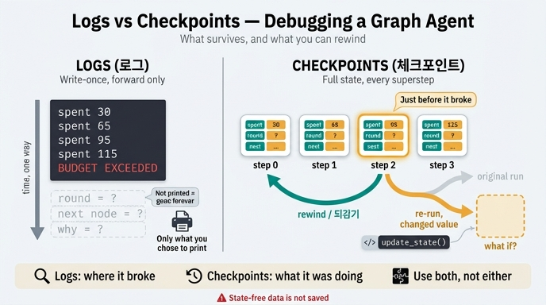

# 체크포인트로 디버깅할 때 로그와 무엇이 다른가?

> **답**: 로그는 "100을 넘었다"까지만 알려 주지만, 체크포인트는 넘기 직전 상태로 되감아 그때 무엇을 하려 했는지 볼 수 있다.

---

## 0. 카드가 나온 자리

19장 `ex5_debug_state.py`의 마지막 출력문이 이 카드의 원문입니다.

```
로그만 있으면 «100 을 넘었다»까지만 안다.
체크포인트가 있으면 «넘기 직전 상태»로 되감아서 그때 무엇을 하려 했는지 본다.

그리고 되감은 지점에서 «다르게» 이어 갈 수도 있다.
app.update_state 로 값을 고치고 그 지점부터 다시 돌리는 것이다.
«만약 예산이 150 이었다면»을 실제로 돌려 볼 수 있다.

이게 체크포인트의 두 번째 값어치다. 첫째는 복구, 둘째는 디버깅.
그리고 실무에서는 둘째를 훨씬 자주 쓴다.
```

19장 「한 장 요약」에도 같은 이야기가 있습니다. **"체크포인트는 복구보다 디버깅에 훨씬 자주 씁니다. 제 로그에서 여덟 배였어요."**

예제의 그래프는 이렇게 생겼습니다.

```python
BUDGET = 100

class S(TypedDict):
    쓴돈: Annotated[int, operator.add]
    기록: Annotated[list, operator.add]
    회차: Annotated[int, operator.add]

def 검색(s):
    return {"쓴돈": 30, "기록": ["검색 30"], "회차": 1}

def 정리(s):
    cost = 20 + s["회차"] * 15      # 회차가 늘수록 비싸진다
    return {"쓴돈": cost, "기록": [f"정리 {cost}"]}

def route(s):
    if s["쓴돈"] >= BUDGET:
        return END
    return END if s["회차"] >= 4 else "검색"

app = b.compile(checkpointer=InMemorySaver())
```

핵심은 `compile(checkpointer=...)` 한 줄입니다. 이 한 줄이 있고 없고가 "로그 읽기"와 "시간 여행"을 가릅니다.

---

## 1. 근본 차이 — 무엇이 남는가

| | 로그 | 체크포인트 |
|---|---|---|
| **누가 정하나** | 개발자가 코드 짤 때 미리 결정 | 실행기가 자동으로, 슈퍼스텝마다 |
| **무엇이 남나** | `print`/`logger` 호출에 넣은 것만 | 그 시점 상태(State) **전체** |
| **형태** | 사람이 읽는 문자열 (구조 소실) | 구조화된 객체 (그대로 다시 먹일 수 있음) |
| **시간 방향** | 앞으로만. 이미 지나갔음 | 되감기 가능 |

로그의 진짜 문제는 "정보가 적다"가 아닙니다. **필요한 로그가 무엇인지는 사고가 난 뒤에야 알 수 있다**는 게 문제입니다.

```
사고 발생
  → 로그를 본다
  → "쓴돈만 찍었네. 회차도 찍었어야 했는데"
  → 코드 고쳐서 로그 추가
  → 다시 실행
  → 재현이 안 된다 (또는 재현하는 데 30분)
```

이 루프가 로그 디버깅의 비용입니다. 관측 대상이 개발자의 사전 예측에 묶여 있습니다.

체크포인트는 이 루프가 없습니다. `쓴돈`, `기록`, `회차`, 그리고 다음에 갈 노드까지 **이미 전부 저장돼 있습니다**. 사고 후에 "그때 회차가 몇이었지?"를 물어봐도 답이 나옵니다. 미리 그걸 찍기로 결정하지 않았어도요.

한 줄로 정리하면:

> 로그는 **관측을 사전에 선언**해야 하고, 체크포인트는 **관측을 사후에 질의**할 수 있다.

---

## 2. 되감기 — 예제가 실제로 하는 일

`ex5_debug_state.py`는 체크포인트 이력을 거꾸로 훑어 범인을 찾습니다.

```python
cfg = {"configurable": {"thread_id": "dbg"}}
out = app.invoke({"쓴돈": 0, "기록": [], "회차": 0}, cfg)

hist = list(app.get_state_history(cfg))   # 최신 → 과거 순
culprit = None
for snap in hist:
    spent = snap.values.get("쓴돈", 0)
    if spent < BUDGET:        # 아직 예산 안에 있던 마지막 스냅샷
        culprit = snap
        break
```

로그였다면 `쓴돈 115`라는 줄 하나를 보고 끝났을 겁니다. 여기서는 **예산을 넘기 직전 스냅샷 객체**를 손에 쥡니다. 그 안에는 그 시점의 `회차`도, `기록`도, `next`(다음에 실행하려던 노드)도 들어 있습니다. "그때 무엇을 하려 했는가"가 바로 `snap.next`입니다.

### LangGraph의 실제 API

확인 시점 LangGraph 1.x 기준입니다.

#### `graph.get_state(config, *, subgraphs=False) -> StateSnapshot`

현재(또는 config에 `checkpoint_id`가 있으면 그 시점의) 스냅샷 하나를 돌려줍니다.

```python
snap = app.get_state({"configurable": {"thread_id": "dbg"}})
```

#### `graph.get_state_history(config, *, filter=None, before=None, limit=None) -> Iterator[StateSnapshot]`

그 스레드의 스냅샷들을 **최신부터 과거 순(reverse chronological)** 으로 흘려보냅니다. 예제가 `list(...)` 후 `reversed(...)`로 다시 뒤집는 이유가 이것입니다.

#### `StateSnapshot`의 필드

| 필드 | 내용 |
|---|---|
| `values` | 그 시점의 상태 값 (dict) |
| `next` | **다음에 실행될 노드 이름 튜플**. 비어 있으면 종료 |
| `config` | 이 스냅샷을 가리키는 config. `configurable.checkpoint_id`가 들어 있다 |
| `metadata` | `source`(input/loop/update), `step`(슈퍼스텝 번호), `writes` 등 |
| `created_at` | 저장 시각 (ISO 문자열) |
| `parent_config` | 직전 체크포인트의 config |
| `tasks` | 이 시점에 실행 예정/실패한 태스크. 실패 시 `tasks[i].error`에 예외가 담긴다 |

`metadata["step"]`이 곧 슈퍼스텝 번호라, "몇 번째 슈퍼스텝에서 넘었나"를 그대로 셀 수 있습니다.

#### 재실행 (replay) — `checkpoint_id`가 든 config로 `invoke(None, ...)`

```python
history = list(app.get_state_history(cfg))
before = next(s for s in history if s.values["쓴돈"] < BUDGET)

# before.config == {"configurable": {"thread_id": "dbg", "checkpoint_id": "1ef6..."}}
replayed = app.invoke(None, before.config)
```

첫 인자가 `None`인 게 핵심입니다. **새 입력을 주는 게 아니라 저장된 상태에서 이어서 돌린다**는 뜻입니다. 그 체크포인트까지의 노드는 다시 실행되지 않고 결과가 그대로 재생되며, 그 이후 노드부터 **실제로 다시 실행**됩니다. 캐시 조회가 아니라 진짜 재실행입니다.

#### 분기 (fork) — `update_state`로 값을 고치고 재실행

```python
fork_config = app.update_state(
    before.config,                 # 되감을 지점
    values={"쓴돈": -50},           # 리듀서(operator.add)를 통과하므로 «더해진다»
    as_node="정리",                 # 어느 노드가 쓴 것처럼 취급할지 (선택)
)
forked = app.invoke(None, fork_config)
```

`update_state(config, values, as_node=None)`는 **새 체크포인트를 하나 만들고 그 config를 돌려줍니다.** 원래 타임라인은 그대로 남고 갈래가 하나 생깁니다.

여기서 꼭 기억할 함정 하나. `values`는 **리듀서를 거칩니다.** 19장의 `쓴돈`은 `Annotated[int, operator.add]`이므로 `update_state(..., values={"쓴돈": 100})`은 "100으로 설정"이 아니라 **"100을 더함"** 입니다. 리듀서가 없는 필드만 덮어쓰기로 동작합니다. 19장 앞부분에서 배운 리듀서 개념이 디버깅 API에도 그대로 적용되는 지점입니다.

`as_node`는 "이 갱신을 어느 노드가 낸 것으로 칠 것인가"입니다. 이 값에 따라 다음에 실행될 노드가 결정되므로, 조건부 엣지가 걸린 그래프에서는 지정해 주는 편이 안전합니다.

이렇게 해서 예제 주석의 "**만약 예산이 150이었다면**"을 실제로 돌려 볼 수 있습니다. 로그로는 절대 못 하는 일입니다. 로그는 읽는 것이지 다시 돌리는 것이 아니니까요.

---

## 3. 한계 — 체크포인트가 못 하는 것

체크포인트를 만능으로 여기면 다치니, 경계를 분명히 해 둡시다.

### 3.1 상태에 없는 것은 체크포인트에도 없다

체크포인트는 **State의 스냅샷**입니다. State에 넣지 않은 건 저장되지 않습니다.

19장 `ex4_state_size.py`가 이 긴장을 정면으로 다룹니다.

| 필드 | 크기 | 다음 노드가 읽나 | 상태에 둘까 |
|---|---|---|---|
| 검색 결과 원문 | 84,000B | 요약만 있으면 된다 | 아니오 |
| **모델 원본 응답** | 12,000B | **로그에만 쓴다** | **아니오** |
| 중간 계산 캐시 | 31,000B | 같은 노드 안에서만 쓴다 | 아니오 |
| 실행 로그 | 6,400B | 사람이 나중에 본다 | 아니오 |

**"모델 원본 응답 — 로그에만 쓴다"** 를 보세요. 상태를 8KB 아래로 유지하려고 뺀 바로 그 항목은, 정의상 체크포인트로 되감아도 볼 수 없습니다. 상태를 줄이는 최적화가 관측 가능성을 깎아 냅니다. 이건 트레이드오프이지 버그가 아니고, 그래서 로그(또는 LangSmith 같은 트레이싱)가 계속 필요합니다.

### 3.2 외부 부작용은 되감기지 않는다

되감는 건 **그래프 상태뿐**입니다. 이미 나간 것은 돌아오지 않습니다.

- 이미 보낸 이메일 / 슬랙 메시지
- 이미 커밋된 DB 쓰기
- 이미 결제된 API 호출 비용
- 이미 삭제된 파일

체크포인트에서 재실행하면 그 이후 노드가 **실제로 다시 실행**되므로, 부작용이 **한 번 더** 일어납니다. 되돌아가는 게 아니라 두 번 하는 겁니다. 그래서 되감아 재실행할 노드는 멱등(idempotent)해야 하고, 아니라면 디버깅 시 외부 호출을 차단하거나 스텁으로 바꿔야 합니다.

### 3.3 비결정적 요소는 같은 결과를 안 준다

재실행은 **캐시 재생이 아니라 진짜 재실행**입니다. 따라서 되감은 지점 이후에 있는 것 중:

- LLM 호출 (`temperature > 0`이면 당연히, `0`이어도 완전 재현은 보장되지 않음)
- `datetime.now()`, `random`, UUID 생성
- 외부 API의 응답 내용 변화
- **같은 슈퍼스텝 안의 노드 실행 순서** — 19장 `ex3_custom_reducer.py`가 보여 준 바로 그 문제

는 값이 달라질 수 있습니다. "되감았는데 이번엔 버그가 안 나요"가 실제로 일어납니다.

`ex3`의 교훈이 여기서도 유효합니다. 순서에 기대는 리듀서는 재실행 때 또 다른 답을 냅니다. **교환법칙을 지키는 리듀서(`f(a,b) == f(b,a)`)를 쓰면 되감기의 재현성도 같이 올라갑니다.** 상태 설계와 디버깅 가능성은 같은 문제의 앞뒷면입니다.

반대로 `ex5`는 완전히 결정적입니다. 고정된 상수 연산뿐이라 몇 번을 되감아도 같은 답이 나옵니다. 예제로 고른 이유가 그것이고, 실무는 그렇게 착하지 않다는 것도 같이 기억해 둘 필요가 있습니다.

### 3.4 공짜가 아니다

체크포인트는 **슈퍼스텝마다** 저장됩니다. `ex4`의 계산에 따르면 전부 담을 때와 필요한 것만 담을 때가 수십 배 차이 나고, 진짜 비용은 저장비(월 1,600원 수준)가 아니라 **직렬화 시간**입니다. 18장에서 잰 체크포인트 40~120ms가 상태가 커지면 몇 배로 불어나고, 그게 사용자 대기 시간이 됩니다.

그래서 19장의 조언은 이렇습니다.

> 그리고 켜는 코드와 지우는 코드를 같은 커밋에 쓰세요.

디버깅용 체크포인터를 켰으면 끄는 방법도 같이 남기라는 뜻입니다.

---

## 4. 결론 — 대체재가 아니라 보완재

| 항목 | 로그 | 체크포인트 |
|---|---|---|
| **강한 것** | 시간 축 흐름, 상태 밖의 사건 | 특정 시점의 상태 전체 |
| **입도** | 개발자가 찍은 임의 지점 | 슈퍼스텝 경계 |
| **범위** | 프로세스 전체 (외부 호출, 예외, 지연) | 그래프 State 안쪽만 |
| **모델 원본 응답, 토큰 수, 지연** | 볼 수 있다 | 상태에 없으면 못 본다 |
| **"그때 회차가 몇이었나"** | 미리 찍었어야만 | 언제든 조회 가능 |
| **"그때 다음에 뭘 하려 했나"** | 추측 | `snap.next` |
| **다르게 다시 돌려 보기** | 불가능 | `update_state` + `invoke(None, cfg)` |
| **여러 실행의 통계·집계** | 강함 (검색·필터·대시보드) | 약함 (스레드 단위) |
| **사후 새 질문 던지기** | 재현 실행 필요 | 즉시 가능 |
| **저장 비용** | 낮음, append-only | 슈퍼스텝마다 상태 전체 |
| **운영 알림 연동** | 자연스러움 | 부적합 |

**실전 조합**은 이렇게 굴러갑니다.

1. **로그·트레이싱**이 "이 스레드에서 사고가 났다"를 알려 준다 → 알림, `thread_id` 확보
2. **체크포인트**로 그 `thread_id`를 열어 "왜"를 판다 → `get_state_history`로 사고 직전 스냅샷 확보
3. **`update_state` + 재실행**으로 가설을 검증한다 → "예산이 150이었다면 안 났을까?"
4. 검증된 수정을 코드에 반영한다

로그는 **어디를 볼지**를 알려 주고, 체크포인트는 **거기서 무엇을 볼지**를 채워 줍니다. 로그를 지우고 체크포인트만 쓰는 건 (모델 원본 응답과 외부 호출을 잃으므로) 나쁜 거래고, 체크포인트 없이 로그만 쓰는 건 사고마다 재현 실행 비용을 내는 것입니다.

---

## 5. 한 줄 암기

> 로그는 **내가 찍기로 한 것**을 **한 방향으로** 남긴다.
> 체크포인트는 **상태 전체**를 **되감을 수 있게** 남긴다.
> 그래서 로그는 "무슨 일이 났나"에, 체크포인트는 "그때 무엇을 하려 했나"에 답한다.

---

## 참고

- [LangGraph — Use time travel](https://docs.langchain.com/oss/python/langgraph/use-time-travel)
- [LangGraph — Persistence](https://docs.langchain.com/oss/python/langgraph/persistence)
- [LangGraph — Graph API (state, reducer, superstep)](https://docs.langchain.com/oss/python/langgraph/graph-api)

---

## 인포그래픽


