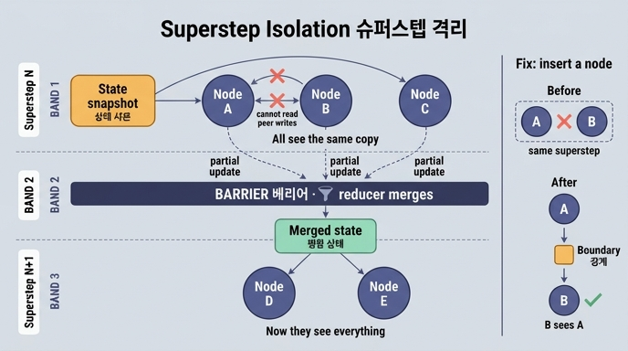

# 같은 슈퍼스텝의 노드들은 서로가 쓴 값을 볼 수 있는가?

**답: 볼 수 없다.** 같은 슈퍼스텝에 들어간 노드들은 **같은 상태 사본**을 입력으로 받는다. 순서가 필요하면 그 사이에 노드를 하나 넣어 **경계**를 만들어야 한다.

---

## 1. 왜 못 보는가 — BSP와 Pregel까지 거슬러 올라가면

이건 LangGraph가 만든 규칙이 아니라, 그 아래 깔린 **계산 모형**에서 나온 성질이다.

### 벌크 동기 병렬 (BSP, Valiant 1990)

BSP는 병렬 계산을 세 단계가 반복되는 「슈퍼스텝」으로 정의한다.

| 단계 | 하는 일 |
|---|---|
| 1. 지역 계산 | 각 프로세서가 **자기 로컬 메모리만** 보고 계산한다 |
| 2. 통신 | 계산 결과로 나온 메시지를 서로에게 보낸다 |
| 3. 배리어 동기화 | 모두가 끝날 때까지 기다린다. 여기가 **경계** |

핵심은 1단계다. 지역 계산 중에 오간 메시지는 **다음 슈퍼스텝이 되어야** 보인다. 배리어를 넘기 전에는 남이 쓴 값이 내 눈에 들어오지 않는다.

### Pregel (Google, 2010)

Pregel은 이 BSP를 그래프 계산에 적용한 모형이다. 정점(vertex)마다 `compute()`가 돌고:

- 슈퍼스텝 S에서 정점이 받는 메시지는 **슈퍼스텝 S-1에서 보낸 것**이다
- 슈퍼스텝 S에서 보낸 메시지는 **S+1에서야** 도착한다
- 슈퍼스텝 안에서 정점끼리 실시간으로 값을 주고받는 통로가 **없다**

그래서 「A가 값을 쓰고 B가 그걸 읽는다」를 하려면 A와 B는 **서로 다른 슈퍼스텝**에 있어야 한다.

### LangGraph

LangGraph의 실행기 이름이 그냥 `Pregel`이다. 우연이 아니라 계보다.

```
슈퍼스텝 N 시작
  ├─ 실행 대기 노드 집합을 확정한다
  ├─ 모든 노드에 «같은 상태 스냅샷»을 넘긴다   ← 여기가 답의 핵심
  ├─ 노드들이 각자 부분 갱신(partial update)을 반환한다
  └─ 배리어: 반환된 갱신들을 리듀서로 합쳐 상태에 적용, 체크포인트 저장
슈퍼스텝 N+1 시작 ← 이제서야 합쳐진 결과가 보인다
```

노드가 반환하는 건 상태 전체가 아니라 **바꾼 부분만**이고, 그게 실제 상태에 반영되는 시점은 **슈퍼스텝이 끝난 뒤**다. 그러니 같은 슈퍼스텝 동료의 반환값을 볼 방법이 원리적으로 없다.

---

## 2. 코드로 확인하기 (`ex2_superstep.py`)

교재 예제가 이걸 눈으로 보게 만든다.

```python
class S(TypedDict):
    seen: Annotated[list, operator.add]
    step: int

def mk(name):
    def fn(s):
        # 이 노드가 «본» 상태를 기록한다. 같은 슈퍼스텝이면 같은 걸 본다.
        return {"seen": [f"{name}: step={s['step']}, seen={len(s['seen'])}개"]}
    return fn

def bump(s):
    return {"step": s["step"] + 1, "seen": ["--- 경계 ---"]}
```

그래프 모양:

```
        START
       ╱  │  ╲
      A   B   C        ← 슈퍼스텝 1 (동시, 같은 사본)
       ╲  │  ╱
        경계            ← 슈퍼스텝 2 (배리어 역할 노드)
        ╱   ╲
       D     E         ← 슈퍼스텝 3 (앞의 결과를 전부 본다)
        ╲   ╱
         END
```

실행 결과의 핵심:

- **A·B·C가 전부 `seen=0개`를 봤다.** 셋 다 「아직 아무도 아무것도 안 썼다」는 같은 상태를 본 것이다. A가 먼저 실행됐든 C가 먼저였든 무관하다.
- **D·E는 `seen`이 4개(A·B·C + 경계)인 상태를 본다.** 「경계」 노드가 별도 슈퍼스텝을 차지하면서 앞의 병합 결과가 확정됐기 때문이다.

교재 저자의 말: *「제가 이걸 몰라서 «왜 B가 A의 결과를 못 보지»로 반나절을 썼다.」*

---

## 3. 「경계를 만든다」는 게 정확히 무슨 뜻인가

순서가 필요하면 두 가지 방법이 있다.

### 방법 1 — 사이에 노드를 넣는다 (교재의 처방)

```python
b.add_edge("A", "경계")
b.add_edge("경계", "B")   # 이제 B는 A의 결과를 본다
```

노드가 하나 늘어나면 슈퍼스텝이 하나 늘어난다. 슈퍼스텝이 늘어나면 배리어가 하나 늘어난다. 배리어가 지나가야 상태가 확정된다. 즉 **「노드를 넣는다 = 배리어를 넣는다」**가 이 처방의 정체다. 위 예제의 `경계` 노드는 계산상 하는 일이 거의 없는데도(step을 1 올릴 뿐) 존재 이유가 충분하다 — **경계를 긋는 것 자체가 그 노드의 일**이다.

### 방법 2 — 그냥 엣지로 직렬화한다

`A → B` 엣지를 직접 걸어도 된다. B는 A 다음 슈퍼스텝이 되므로 A의 결과를 본다. 별도의 「경계」 노드가 굳이 필요한 건 **여럿(A·B·C)이 끝난 뒤**로 합류점을 만들 때다.

---

## 4. 이 성질이 만드는 다른 결과들

같은 사본을 받는다는 건 곧 **여럿이 같은 필드에 동시에 쓸 수 있다**는 뜻이고, 그래서 다음 문제들이 따라온다.

### (a) 리듀서가 필요해진다

동시에 쓴 값들을 배리어에서 합쳐야 하는데, 합치는 규칙이 없으면 LangGraph는 에러를 낸다(`ex1_lost_update.py`).

```python
class WithReducer(TypedDict):
    logs: Annotated[list, operator.add]   # 이어 붙인다
    count: Annotated[int, operator.add]   # 더한다
```

교재의 요점은 「리듀서를 붙였다」가 아니라 **「이 필드를 여럿이 쓴다는 걸 타입에 적었다」**는 것이다. 타입만 읽어도 동시 쓰기 여부를 알 수 있다.

### (b) 리듀서는 교환법칙을 지켜야 한다

`f(a,b) == f(b,a)`가 아니면 실행 순서에 따라 답이 달라지는데, **그 순서는 여러분이 정할 수 없다**. `ex3_custom_reducer.py`가 이 함정을 보여준다 — ERP를 먼저 등록했는데 실행기가 CRM을 먼저 돌려서 「새 것이 이긴다」 리듀서의 결과가 기대와 반대로 나온다.

고치는 법: 값 안에 **판단 근거(시각·출처·신뢰도)**를 담고 리듀서가 그걸 보고 정하게 한다.

```python
def keep_latest(old, new):     # 순서와 무관하게 같은 답
    return new if new["at"] > old["at"] else old
```

### (c) 체크포인트는 슈퍼스텝마다 찍힌다

배리어 = 상태가 확정되는 지점 = 저장 지점이다. `app.get_state_history()`로 슈퍼스텝별 스냅샷을 되짚을 수 있고(`ex5_debug_state.py`), 반대로 상태가 크면 **매 슈퍼스텝마다 그 크기를 통째로 직렬화**하게 된다(`ex4_state_size.py`). 교재 기준은 상태 하나가 8KB를 넘으면 뭘 뺄지 찾는 것.

---

## 5. 한 줄 정리

| 질문 | 답 |
|---|---|
| 같은 슈퍼스텝 노드끼리 서로 쓴 값이 보이나 | 안 보인다 |
| 왜 | 같은 상태 사본(스냅샷)을 입력으로 받기 때문 |
| 반환값은 언제 반영되나 | 슈퍼스텝이 끝나는 배리어에서, 리듀서로 합쳐져서 |
| 순서가 필요하면 | 사이에 노드를 넣어 슈퍼스텝 경계를 만든다 |
| 뿌리 | BSP(Valiant 1990) → Pregel(Google 2010) → LangGraph `Pregel` 실행기 |

**절대 하면 안 되는 설계**: 같은 슈퍼스텝 안에서 서로의 결과를 참조하는 것. 조용히 안 되는 게 아니라 **경합처럼 보이는 버그**로 나타나서, 로그만으로는 원인을 못 찾는다.

---

## 참고

- [LangGraph Graph API — superstep](https://docs.langchain.com/oss/python/langgraph/graph-api)
- [Pregel: A System for Large-Scale Graph Processing (SIGMOD 2010)](https://dl.acm.org/doi/10.1145/1807167.1807184)
- [A bridging model for parallel computation (Valiant, CACM 1990)](https://dl.acm.org/doi/10.1145/79173.79181)
- [LangGraph persistence](https://docs.langchain.com/oss/python/langgraph/persistence)

## 인포그래픽


