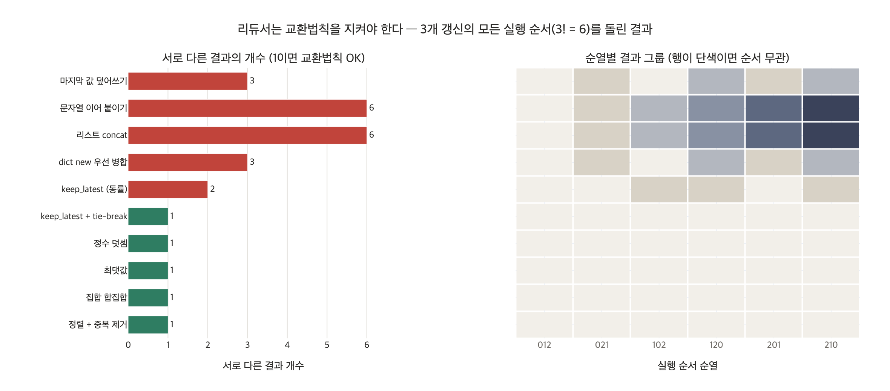

# 리듀서가 반드시 지켜야 하는 성질

> **Q.** 리듀서가 반드시 지켜야 하는 성질은 무엇인가?
>
> **A.** 교환법칙이다. `f(a,b) == f(b,a)`가 아니면 실행 순서에 따라 답이 달라지고, 그 순서는 개발자가 정할 수 없다.

---

## 1. 리듀서가 뭐길래

LangGraph 같은 상태 그래프에서 노드는 **상태 전체가 아니라 자기가 바꾼 부분만** 돌려줍니다.

```python
def worker(name):
    def fn(s):
        return {"logs": [f"{name} 실행"], "count": 1}   # ← 부분 갱신
    return fn
```

문제는 **같은 슈퍼스텝에 있는 여러 노드가 같은 필드를 건드릴 때**입니다. `재무`, `법무`, `영업` 셋이 동시에 `logs`에 한 줄씩 쓰면 실행기는 셋 중 하나만 남길 수도, 예외를 낼 수도 있습니다. 그래서 "어떻게 합칠지"를 타입에 적어 둡니다.

```python
class WithReducer(TypedDict):
    logs:  Annotated[list, operator.add]   # ← 이 함수가 리듀서
    count: Annotated[int,  operator.add]
```

리듀서는 `f(old, new) -> merged` 꼴의 **두 값을 하나로 합치는 함수**입니다. 실행기는 같은 슈퍼스텝에서 도착한 갱신들을 이 함수로 차례차례 접어(fold) 넣습니다.

$$
\text{final} \;=\; f(f(f(\text{init}, u_{\sigma(1)}), u_{\sigma(2)}), u_{\sigma(3)})
$$

여기서 $\sigma$ 는 **실행기가 정하는 순열**입니다. 여러분이 정하는 게 아닙니다.

## 2. 왜 하필 교환법칙인가

핵심은 한 문장입니다.

> **$\sigma$ 를 개발자가 통제할 수 없다.**

같은 슈퍼스텝의 노드들은 병렬로 돌고, 완료 순서는 스레드 풀 스케줄링, 네트워크 지연, 모델 응답 시간, 심지어 실행기 버전에 따라 달라집니다. 19장 본문의 `ex3_custom_reducer.py`가 정확히 이 함정을 보여 줍니다.

> «속성»을 보라. 등급이 A(ERP)와 B(CRM)로 갈렸는데 «A»가 남았다.
> `merge_dict`는 «새 것이 이긴다»로 짰는데, 실행기가 CRM을 먼저 돌려서
> ERP가 «새 것»이 되어 버렸다. 코드를 짤 때 내가 기대한 것과 반대다.

`merge_dict`는 겹치는 키에서 **나중에 온 쪽**이 이깁니다. 즉 결과가 도착 순서에 의존합니다. 개발자는 "ERP를 먼저 등록했으니 CRM이 나중"이라고 생각했지만, 그래프에 노드를 등록한 순서는 실행 순서를 보장하지 않습니다.

리듀서가 교환법칙을 만족하면, $\sigma$ 가 무엇이든 결과가 같습니다. 즉 **비결정적인 실행 순서를 결정적인 결과로 바꿔 주는 유일한 방어선**이 교환법칙입니다.

$$
f(a,b) = f(b,a) \quad \Longrightarrow \quad \text{순서 } \sigma \text{ 와 무관하게 결과 유일}
$$

반대로 교환법칙이 깨지면 증상은 이렇게 나옵니다.

- 같은 입력으로 돌렸는데 답이 매번 다름 (재현 불가 버그)
- 로컬에서는 되는데 운영에서 안 됨 (부하가 다르면 순서가 다름)
- 라이브러리 업그레이드 후 갑자기 결과가 바뀜 (스케줄러 구현 변경)
- 테스트는 통과하는데 (단일 스레드라 순서가 고정) 실전에서 터짐

## 3. 교환법칙 · 결합법칙 · 멱등성 — 다른 문제를 푼다

셋을 자주 뭉뚱그리는데, **각각이 막아 주는 사고가 다릅니다.**

| 성질 | 수식 | 막아 주는 것 | 안 지키면 |
|---|---|---|---|
| 교환법칙 (commutativity) | $f(a,b) = f(b,a)$ | **도착 순서**가 결과를 바꾸는 것 | 병렬 노드 결과가 실행마다 달라짐 |
| 결합법칙 (associativity) | $f(f(a,b),c) = f(a,f(b,c))$ | **묶는 방식**이 결과를 바꾸는 것 | 부분 집계(트리 병합, 샤딩)가 전체 집계와 어긋남 |
| 멱등성 (idempotence) | $f(a,a) = a$ | **같은 값의 중복 반영** | 재시도·중복 전달 시 값이 부풀려짐 |

### 3.1 교환법칙은 "누가 먼저냐"

두 값만 놓고 봅니다. `keep_latest`처럼 **값 안에 든 타임스탬프**로 승자를 정하면 순서가 바뀌어도 같은 답이 나옵니다. `merge_dict`처럼 **인자 위치**(`new`가 이긴다)로 승자를 정하면 깨집니다. 차이는 딱 이겁니다.

> **판단 근거가 값 안에 있는가, 인자 위치에 있는가.**

### 3.2 결합법칙은 "어떻게 묶느냐"

리듀서가 3개 이상의 갱신을 접을 때 실행기가 항상 좌측 fold를 한다는 보장은 없습니다. 트리 형태로 병합하거나(분산 집계), 부분 결과를 캐시했다가 나중에 합칠 수도 있습니다. 결합법칙이 없으면 `((a+b)+c)`와 `(a+(b+c))`가 달라집니다.

실무에서 교환법칙만 만족하고 결합법칙은 깨지는 함수는 드물지만, "평균"이 대표적인 반례입니다. `avg(avg(a,b), c) != avg(a, avg(b,c))`. 그래서 평균을 리듀서로 쓰면 안 되고, **`(합, 개수)` 쌍을 리듀서로 쓰고 마지막에 나누어야** 합니다.

### 3.3 멱등성은 "몇 번 반영되느냐"

`operator.add`(정수 덧셈)는 교환·결합은 만족하지만 **멱등하지 않습니다**. 노드가 타임아웃으로 재시도되어 같은 갱신이 두 번 도착하면 `count`가 2가 됩니다. 반면 `max`, `set union`, `min`은 멱등합니다. 그래서 "at-least-once 전달"이 있는 환경에서는 카운터보다 **집합이나 최댓값**이 안전합니다.

정수 덧셈을 꼭 써야 한다면 갱신에 **고유 ID를 붙이고 이미 본 ID는 무시**하는 식으로 멱등성을 인위적으로 만들어야 합니다. 이게 아래에서 볼 CRDT의 OR-Set 아이디어입니다.

### 3.4 함정: `operator.add`로 리스트를 합치면 교환법칙이 깨진다

19장 예제가 가장 많이 쓰는 `Annotated[list, operator.add]`는 사실 **교환법칙 위반**입니다.

```python
["재무"] + ["법무"]   # ['재무', '법무']
["법무"] + ["재무"]   # ['법무', '재무']   ← 다르다
```

그런데도 실무에서 널리 쓰입니다. 이유는 두 가지입니다.

1. **원소 집합**은 순서와 무관하게 항상 같습니다. 로그처럼 "다 모이기만 하면 되는" 용도면 순서 차이가 무해합니다.
2. 순서를 **결과 판단에 쓰지 않기로 약속**했기 때문입니다.

문제는 나중에 누군가 `state["logs"][0]`을 읽어 분기하는 코드를 넣는 순간입니다. 그때부터 조용히 비결정적인 그래프가 됩니다. 그래서 **"리스트 concat은 교환법칙을 어긴다, 다만 우리가 순서를 안 읽기로 했다"**를 주석이나 타입 이름으로 남겨 두는 게 좋습니다. 순서가 진짜로 중요하면 각 항목에 시퀀스 번호나 시각을 넣고 **읽는 쪽에서 정렬**하세요.

### 3.5 함정: 동률(tie)에서 교환법칙이 깨진다

19장의 `keep_latest`를 다시 봅니다.

```python
def keep_latest(old, new):
    if not old: return new
    if not new: return old
    return new if new["at"] > old["at"] else old
```

`at`이 서로 다르면 완벽하게 교환 가능합니다. 하지만 **`at`이 같으면** `else old`로 빠지면서 "먼저 온 쪽"이 이깁니다. 즉 동률 구간에서만 순서 의존이 되살아납니다. 같은 배치에서 같은 초에 찍힌 타임스탬프 두 개는 실무에서 아주 흔합니다.

고치는 방법은 **비교 키를 전순서(total order)로 만드는 것**입니다.

```python
def keep_latest_fixed(old, new):
    if not old: return new
    if not new: return old
    key = lambda x: (x["at"], x["source"])   # 시각이 같으면 출처로 결정
    return new if key(new) > key(old) else old
```

`source`가 유일하면 두 값의 키가 결코 같지 않으므로 승자가 순서와 무관하게 정해집니다. 이게 분산 시스템에서 말하는 **LWW(Last-Write-Wins) 레지스터 + 결정적 tie-break**입니다.

## 4. CRDT와의 연결 — 같은 문제의 정식 이름

세 성질을 모두 만족하는 병합 함수(ACI: Associative, Commutative, Idempotent)를 갖는 자료구조가 **CRDT(Conflict-free Replicated Data Type)**, 정확히는 상태 기반 CvRDT입니다.

수학적으로 이 조건은 상태 공간이 **결합 반격자(join-semilattice)**를 이루고 병합 함수가 **최소 상한(least upper bound, $\sqcup$)**이라는 뜻입니다.

$$
a \sqcup b = b \sqcup a,\qquad (a \sqcup b) \sqcup c = a \sqcup (b \sqcup c),\qquad a \sqcup a = a
$$

이 셋이 성립하면 갱신이 **어떤 순서로, 몇 번 중복해서, 어떤 그룹으로 묶여 도착하든** 모든 복제본이 같은 값으로 수렴합니다(강한 최종 일관성, Strong Eventual Consistency). 리듀서 설계는 결국 "이 필드를 CRDT로 만들 수 있는가"를 묻는 일입니다.

| CRDT | 병합 함수 | LangGraph 리듀서로 옮기면 |
|---|---|---|
| G-Counter (증가 전용 카운터) | 노드별 카운터의 원소별 `max` | `{node_id: count}` 딕셔너리 + 키별 max |
| G-Set (증가 전용 집합) | 합집합 | `lambda a,b: a | b` |
| 2P-Set / OR-Set | 추가 집합·삭제 집합의 합집합 | 삭제를 tombstone/태그로 표현 |
| LWW-Register | 더 큰 `(timestamp, replica_id)` 승 | 19장 `keep_latest` + tie-break |
| MV-Register | 인과 관계로 비교 불가한 값들을 **모두** 보관 | 충돌을 지우지 않고 리스트로 남겨 나중 판단 |
| PN-Counter | 증가·감소 카운터 쌍 | `(plus, minus)` 튜플, 각각 max |

여기서 실무적으로 가장 쓸모 있는 아이디어는 **MV-Register**입니다. 억지로 승자를 하나 고르지 말고 **충돌 자체를 상태에 남겨** 다음 노드나 사람이 판단하게 하는 겁니다.

```python
def keep_all_conflicts(old, new):
    """승자를 못 고르면 전부 남긴다. 리스트는 정렬해 순서 의존을 제거."""
    merged = list(old or []) + list(new or [])
    best = max(m["conf"] for m in merged)
    return sorted((m for m in merged if m["conf"] == best),
                  key=lambda m: m["source"])
```

`sorted`가 핵심입니다. 결과를 **정규형(canonical form)**으로 만들면 리스트 concat의 순서 의존이 사라져 교환법칙이 회복됩니다.

같은 원리는 CRDT 말고도 여러 곳에 있습니다.

- **MapReduce combiner**: combiner를 붙이려면 reduce 연산이 교환·결합적이어야 합니다. `sum`은 되고 `average`는 안 됩니다.
- **Pregel / BSP combiner**: 19장이 참조하는 계산 모형 그 자체입니다. 슈퍼스텝 경계에서 메시지를 합칠 때 같은 요건이 붙습니다.
- **Spark `reduceByKey` / `aggregateByKey`**: 파티션별 부분 집계 후 병합하므로 교환·결합이 필수입니다.
- **모노이드(monoid)**: `(집합, 결합적 연산, 항등원)`. 여기에 교환법칙을 더하면 **가환 모노이드**, 멱등성까지 더하면 반격자입니다. `(list, +, [])`는 모노이드지만 가환이 아니고, `(set, |, set())`는 셋 다 만족합니다.

## 5. 실무 체크리스트

리듀서를 새로 쓸 때 이 순서로 점검하세요.

1. **판단 근거가 값 안에 있는가?** 승자를 `new`/`old` 같은 **인자 위치**로 정하고 있다면 이미 틀렸습니다. 시각·출처·신뢰도·버전을 값에 실으세요.
2. **동률에서 어떻게 되는가?** 비교 키를 튜플로 확장해 전순서로 만드세요. `(timestamp, source_id)`가 무난합니다.
3. **결과를 정규형으로 만들 수 있는가?** 리스트라면 `sorted`, 중복 제거가 필요하면 집합으로 받고 마지막에 정렬하세요.
4. **재시도로 두 번 오면 어떻게 되는가?** 멱등하지 않다면 갱신에 고유 ID를 달아 중복을 걸러 내세요.
5. **테스트로 강제하세요.** `itertools.permutations`로 **모든 실행 순서 순열**을 돌려 결과가 하나로 모이는지 단위 테스트를 만드세요. 이게 가장 확실합니다.

```python
import itertools, functools, json

def assert_commutative(reducer, init, updates):
    results = {
        json.dumps(functools.reduce(reducer, perm, init),
                   sort_keys=True, ensure_ascii=False)
        for perm in itertools.permutations(updates)
    }
    assert len(results) == 1, f"교환법칙 위반: {len(results)}가지 결과 {results}"
```

6. **못 지키겠으면 병렬로 두지 마세요.** 어떤 병합은 본질적으로 순서 의존적입니다(예: 사용자 편집 이력의 텍스트 이어 붙이기). 그럴 땐 리듀서로 해결하려 하지 말고 **슈퍼스텝 경계를 하나 넣어 직렬화**하는 게 정답입니다. 19장 `ex2_superstep.py`의 «경계» 노드가 그 방법입니다.

## 6. 한 줄 요약

> 리듀서는 **실행기가 정하는 순서**를 받아들여야 하는 함수다. 교환법칙은 "순서가 결과를 바꾸지 못하게" 하는 최소 조건이고, 결합법칙은 "묶는 방식", 멱등성은 "중복 반영"까지 막아 준다. 셋을 다 갖추면 그 필드는 CRDT가 되고, 그때부터 그 상태는 분산 환경에서도 안전하다.

---

## 시각화


