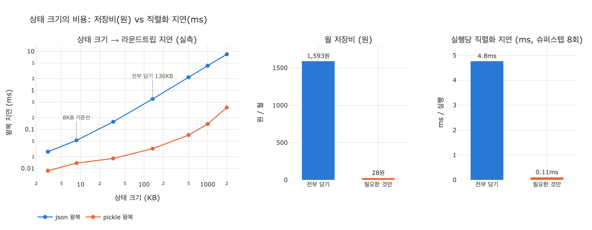

# 상태 크기의 진짜 비용은 저장비인가?

**아니다.** 저장비는 월 1,600원 수준이고, 진짜 값은 **직렬화 시간**이다.
슈퍼스텝마다 1.9MB를 쓰고 읽으면 그 지연이 그대로 사용자 대기 시간이 된다.

19장 `ex4_state_size.py`가 이 카드의 근거다. 이 예제는 "상태를 줄이면 돈이 굳는다"는
기대를 일부러 계산해 보이고, 그 결과가 **너무 작아서** 논거가 될 수 없다는 걸 보여 준
다음, 진짜 논거로 지연을 꺼낸다.

---

## 1. 저자의 필드 판정표 — 무엇을 남기고 무엇을 뺄까

`ex4_state_size.py`의 `FIELDS` 표다. 판정 기준은 **단 하나**, "다음 노드가 읽는가".

| 필드 | 크기 | 왜 | 상태에 둘까 |
|---|---:|---|---|
| 질문 | 220B | 다음 노드가 읽는다 | 예 |
| **검색 결과 원문** | **84,000B** | 요약만 있으면 된다 | **아니오** |
| 검색 결과 주소 | 180B | 필요하면 다시 읽는다 | 예 |
| 검색 결과 요약 | 1,800B | 다음 노드가 읽는다 | 예 |
| **모델 원본 응답** | **12,000B** | 로그에만 쓴다 | **아니오** |
| **중간 계산 캐시** | **31,000B** | 같은 노드 안에서만 쓴다 | **아니오** |
| **실행 로그** | **6,400B** | 사람이 나중에 본다 | **아니오** |
| 재시도 횟수 | 8B | 라우팅이 읽는다 | 예 |
| 체크포인트 메타 | 140B | 실행기가 쓴다 | 예 |

- 전부 담으면 **135,748B**
- 필요한 것만 담으면 **2,348B**
- **57.8배**

빼야 할 네 필드가 전체의 **98.3%**다. "다음 노드가 읽는가"라는 한 줄 기준만으로
상태가 58분의 1이 된다.

---

## 2. "월 1,600원"은 어떤 가정에서 나온 수치인가

예제 코드의 상수를 그대로 풀면 이렇다.

```
SUPERSTEPS               = 14      # 실행 한 번에 슈퍼스텝 14회
RUNS_PER_DAY             = 1,200   # 하루 실행 1,200회
STORAGE_WON_PER_GB_MONTH = 25      # 오브젝트 스토리지 25원/GB·월
```

$$
\text{월 저장비} \;=\; \frac{S \times n_{\text{superstep}} \times r_{\text{day}} \times 30}{1024^3} \times 25\ \text{원}
$$

단계별로 분해하면:

| 단계 | 전부 담기 | 필요한 것만 |
|---|---:|---:|
| 상태 하나 $S$ | 135,748B | 2,348B |
| × 슈퍼스텝 14회 = 실행당 | **1,900KB (≈1.9MB)** | 32.9KB |
| × 1,200 실행/일 = 하루 | 2.28GB | 0.04GB |
| × 30일 = 월 누적 | 63.72GB | 1.10GB |
| × 25원/GB·월 | **1,593원** | **28원** |

저자가 말한 "월 1,600원"은 **1,593원의 반올림**이고, 카드 답의 "1.9MB"는
$135{,}748 \times 14 = 1{,}900{,}472$B, 즉 **실행 한 번이 체크포인터에 밀어 넣는 총량**이다.

### 왜 이 항목이 의사결정에 무의미한가

세 가지 이유가 겹친다.

1. **가장 비싼 가정을 써도 작다.** 위 식은 한 달치 체크포인트를 *하나도 안 지우고
   전부 보관한다*고 놓은 상한이다. 실무에서는 TTL을 걸어 며칠 뒤 지우므로 실제 청구액은
   이보다 더 작다. 그런데도 상한이 1,593원이다.
2. **절감액이 회의 비용보다 싸다.** 58배를 줄여서 아끼는 돈은 월 **1,565원**이다.
   이 결정을 두고 개발자 둘이 30분 회의하면 그 인건비가 몇 년치 절감액을 넘는다.
   *논거로 쓰는 순간 반대편이 "그거 아껴서 뭐 하냐"로 끝낼 수 있는 숫자*다.
3. **같은 실행의 LLM 호출비에 묻힌다.** 실행 1,200회/일에는 모델 호출비가 따라붙는데,
   그건 보통 월 수십만~수백만 원대다. 저장비 1,593원은 소수점 아래로 사라진다.

> **핵심**: 저장비 계산은 "이 축은 볼 필요가 없다"를 증명하려고 하는 계산이다.
> 결론이 "1,600원"이면 그 축은 닫고 다른 축을 열어야 한다.

---

## 3. 진짜 비용 — 직렬화/역직렬화 지연이 사용자 대기 시간이 되는 경로

체크포인트는 **슈퍼스텝마다** 저장된다. 그리고 저장은 파이썬 객체를 그대로 밀어 넣는 게
아니라 **JSON/pickle 문자열로 바꿔서**(직렬화) 쓰고, 다음 슈퍼스텝에서 **다시 객체로
되돌려서**(역직렬화) 읽는다. 한 슈퍼스텝 = 한 왕복이다.

$$
t_{rt}(S) \;=\; t_{ser}(S) + t_{deser}(S)
$$

$$
T_{\text{run}} \;=\; n_{\text{superstep}} \times \bigl(t_{ser} + t_{deser}\bigr)
$$

이 식의 무서운 부분은 $n_{\text{superstep}}$이라는 **곱셈 인자**다.

- 저장비는 상태를 58배 줄이면 1,593원 → 28원, 그래도 그냥 작은 숫자다.
- 지연은 상태를 58배 줄이면 **슈퍼스텝 수만큼 곱해진 절감**이 된다.
  슈퍼스텝 8회면 8배, 저자 가정인 14회면 14배로 증폭된다.

### 왜 곱해지는가 — 슈퍼스텝의 성질 때문

19.2절의 요지가 여기서 되돌아온다. 슈퍼스텝은 **경계**다. 경계마다 실행기는

1. 이번 슈퍼스텝의 노드 출력들을 리듀서로 합치고,
2. 합친 상태 **전체**를 직렬화해서 체크포인터에 쓰고,
3. 다음 슈퍼스텝 노드들에게 줄 사본을 역직렬화해서 만든다.

여기서 저장되는 건 **바뀐 필드가 아니라 상태 전체**다. `검색 결과 원문` 84KB는 3번째
슈퍼스텝에서 한 번 채워지고 그 뒤로 안 바뀌는데도, 4·5·6…14번째 슈퍼스텝에서
**매번 통째로** 다시 문자열이 되고 다시 객체가 된다.

그리고 이 시간은 **동기적**이다. 노드가 일하는 시간과 겹치지 않는다. 경계에서 멈추고
직렬화가 끝나야 다음 노드가 시작된다. 즉 이 지연은 그대로 **응답 지연에 더해진다**.

### 실측 (`expy.py`)

판정표와 같은 구성으로 가짜 상태를 만들어 `json`/`pickle`로 왕복 시간을 쟀다.
(macOS / Python 3.9.6. **환경에 따라 절대값은 크게 달라진다. 자릿수와 기울기를 보라.**)

| 상태 | JSON 왕복 | pickle 왕복 |
|---|---:|---:|
| 전부 담기 136KB | **0.584ms** | 0.030ms |
| 필요한 것만 2.4KB | 0.014ms | 0.002ms |

크기를 2KB에서 2MB까지 늘려 보면:

| 크기 | JSON 왕복 | ms/100KB |
|---:|---:|---:|
| 3KB | 0.025ms | 0.83 |
| 8.6KB | 0.053ms | 0.61 |
| 32.7KB | 0.156ms | 0.48 |
| 136KB | 0.606ms | 0.44 |
| 500KB | 2.325ms | 0.46 |
| 1MB | 4.466ms | 0.45 |
| 2MB | 8.315ms | 0.42 |

**ms/100KB가 32KB 이상에서 0.42~0.48로 거의 상수다. 완전한 선형이다.**
작은 상태에서 값이 커 보이는 건 호출 고정 오버헤드 탓이고, 그건 곧
"작게만 유지하면 고정비만 남는다"는 뜻이다.

pickle이 JSON보다 20배쯤 빠르지만 **"전부 vs 축소" 비율은 그대로**다.
포맷을 갈아 끼우면 상수만 줄지, 크기 의존성은 사라지지 않는다.

### 슈퍼스텝과 동시 사용자를 곱한다

슈퍼스텝 8회 기준, 실행 한 번의 순수 직렬화 지연:

- 전부 담기 **4.67ms** / 필요한 것만 **0.11ms** / 차이 **4.56ms**

직렬화는 CPU 바운드라 동시 사용자가 같은 코어를 나눠 쓰면 줄을 선다.

$$
T_{\text{felt}} \;\approx\; u \times n_{\text{superstep}} \times \bigl(t_{ser} + t_{deser}\bigr)
$$

| 동시 사용자 | 전부(ms) | 축소(ms) | 절감(ms) |
|---:|---:|---:|---:|
| 1 | 4.7 | 0.1 | 4.6 |
| 10 | 46.7 | 1.1 | 45.6 |
| 100 | 467.2 | 11.2 | 456.0 |
| 1,000 | 4,672.1 | 112.5 | 4,559.6 |

동시 사용자 100명이면 "상태를 문자열로 바꾸는 데"만 초당 **0.47초어치 CPU**가 물린다.
슈퍼스텝을 저자 가정인 14회로 올리면 그대로 1.75배가 된다.

그리고 이건 **CPU만 센 하한선**이다. 18장에서 잰 체크포인트 실측 **40~120ms**에는
직렬화 외에 네트워크·DB 왕복이 들어 있다. 저자가 "18장에서 잰 40~120ms가 여기서 몇 배가
된다"고 쓴 건 이 뜻이다.

---

## 4. 지연 외에 따라오는 숨은 비용

원 단위 장부에 잡히지 않는 것들이다. 전부 **상태 크기에 비례**한다.

| 항목 | 왜 크기에 비례하나 | 언제 아프나 |
|---|---|---|
| **네트워크 왕복** | 체크포인터가 원격 DB(Postgres/Redis)면 페이로드가 클수록 전송 시간이 는다. 1.9MB/실행이면 리전 내 왕복만으로도 슈퍼스텝당 수 ms | 체크포인터가 인메모리가 아닐 때, 리전이 다를 때 |
| **DB 쓰기 경합** | 큰 행/도큐먼트는 락 보유 시간, WAL/저널 양, 인덱스 갱신 비용을 늘린다. 동시 실행끼리 서로를 기다리게 만든다 | 동시 사용자가 늘 때 — **선형이 아니라 급격히** 나빠진다 |
| **메모리 피크** | 직렬화 순간 원본 객체 + 문자열 사본이 동시에 존재한다(실질 2배). 슈퍼스텝마다 이 피크가 반복 | 컨테이너 메모리 한계에 걸려 OOM으로 죽을 때 |
| **GC 압박** | 슈퍼스텝마다 수 MB 임시 객체가 생겼다 사라진다. 세대 승격이 일어나면 major GC가 잦아지고, 그 일시정지가 다시 지연이 된다 | 장기 실행 워커에서 p99 지연이 튈 때 |
| **로그·트레이싱 비용** | 관측 도구가 상태를 스팬 속성으로 찍고 있으면 그쪽도 같이 커진다 | 관측 SaaS 요금이 저장비보다 비쌀 때 |

이 중 어느 것도 "월 1,600원"에는 안 잡힌다. 그리고 위 넷은 서로 **곱해진다** —
메모리 피크 때문에 워커당 동시 실행 수를 줄이면, 같은 처리량을 내려고 워커 수를 늘려야
하고, 그게 인프라 비용이 된다. 결국 돈으로 돌아오긴 하는데 **저장비 항목이 아니라
컴퓨트 항목으로** 돌아온다.

### 숨은 비용까지 더한 총 계산

같은 리전 왕복 12ms/MB, 체크포인터 I/O 고정비 40ms(18장 실측 하한)를 가정하면:

| 구분 | 직렬화 | 네트워크 | I/O 고정 | 슈퍼스텝당 | 실행 총계(8회) |
|---|---:|---:|---:|---:|---:|
| 전부 담기 135.7KB | 0.58ms | 3.26ms | 40.0ms | 43.84ms | **350.7ms** |
| 필요한 것만 2.3KB | 0.01ms | 0.06ms | 40.0ms | 40.07ms | **320.6ms** |

실행당 차이 **30.2ms**. 고정비 40ms가 커서 비율은 8% 남짓으로 보이지만,
슈퍼스텝을 14회로 올리면 53ms, 네트워크가 느린 환경이면 네트워크 항이 지배해 더 커진다.
그리고 이 30ms는 **사용자가 실제로 기다리는 30ms**다.

---

## 5. 결론 — 비용의 단위를 바꿔라

같은 결정("검색 결과 원문 84KB를 상태에서 뺀다")을 두 단위로 재면:

| 단위 | 절감 | 의사결정에 쓸 수 있나 |
|---|---:|---|
| 원 | 월 **1,565원** | ✗ 너무 작아 반박당한다 |
| 밀리초 | 실행당 **30.2ms**, 동시 100명이면 초당 **0.46초 CPU** | ✓ 사용자가 체감한다 |

그래서 사고를 이렇게 전환해야 한다.

> **비용의 단위는 "원"이 아니라 "밀리초 × 슈퍼스텝 수 × 동시 사용자"다.**

$$
\text{Cost} \;=\; \underbrace{t_{rt}(S)}_{\text{크기에 선형}} \times \underbrace{n_{\text{superstep}}}_{\text{그래프 깊이}} \times \underbrace{u}_{\text{동시 사용자}}
$$

세 인자 중 상태 크기 $S$만이 **설계로 직접 줄일 수 있는** 값이다.
슈퍼스텝 수는 그래프 구조가 정하고, 동시 사용자는 사업이 정한다.
그러니 줄일 수 있는 하나를 줄이는 게 맞다.

저자의 실무 기준선이 여기서 나온다.

> **"상태 하나가 8KB를 넘으면 무엇을 뺄지 찾는다."**

이 8KB는 저장비 계산에서 나온 숫자가 **아니다**. 밀리초 축에서 나온 숫자다.
그리고 대처법 두 가지 중 저자가 확실하다고 한 건 1번이다.

1. **상태에 안 넣는다** — 원문은 밖에 두고 상태에는 "주소"만 (24장 오프로딩)
2. 체크포인터가 "바뀐 것만" 저장하게 한다 — 구현이 지원해야 한다

그리고 1번에는 부수 효과가 하나 더 있다.
상태가 작아지면 **"이 노드가 무엇에 의존하는가"가 타입만 봐도 보인다.**
지연을 줄이려고 한 일이 설계 가독성까지 같이 고쳐 주는 셈이다.

---

## 한 줄 요약

저장비 1,600원은 "이 축은 볼 필요 없다"를 증명하는 숫자고,
진짜 청구서는 슈퍼스텝마다 곱해지는 직렬화 지연으로 사용자의 시간에서 빠져나간다.

---

## 시각화



왼쪽: 상태 크기 대비 라운드트립 지연(로그–로그에서 직선 = 선형).
가운데·오른쪽: 같은 결정이 "원"과 "밀리초" 두 단위에서 각각 얼마나 움직이는지.
단위가 다르므로 축을 겹치지 않고 패널을 나눴다.
