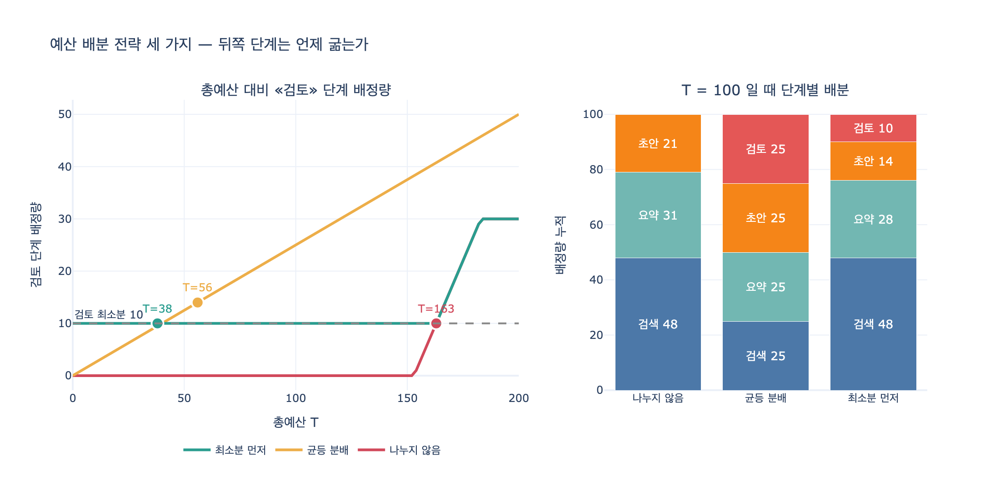

# `ex3_budget_split.py`의 세 가지 예산 배분 전략

**질문** — `ex3_budget_split.py`의 세 가지 예산 배분 전략은 무엇인가?

**답** — 나누지 않음(먼저 오는 쪽이 다 쓴다), 균등 분배, 최소분 먼저 떼어 두기다.

---

## 왜 이 예제가 필요한가

20장 20.3절의 제목이 「예산을 안 나누면 뒤가 굶는다」다. 한 장 요약의 해당 줄은 이렇다.

> 예산을 안 나누면 뒤쪽 단계가 굶습니다. 그리고 대개 뒤쪽이 품질을 지키는 단계예요. 최소분을 먼저 떼어 두세요.

예산 상한을 **하나** 걸어 두는 것만으로는 부족하다는 게 요지다. 상한이 있어도 그 예산을 파이프라인의 여러 단계가 **어떤 순서와 규칙으로 나눠 쓰는지**를 정하지 않으면, 앞 단계가 다 써 버리고 뒤 단계가 0을 받는다. 하필 뒤 단계가 품질을 지키는 검토 단계인 경우가 많다.

## 문제 설정

```python
TOTAL = 100.0

# (단계, 최소 필요 예산, 여유가 있으면 더 쓰는 양)
STAGES = [
    ("검색",  8,  40),
    ("요약",  6,  25),
    ("초안", 14,  60),
    ("검토", 10,  20),
]
```

단계마다 숫자가 두 개다.

| 기호 | 뜻 |
|---|---|
| `need` (최소 필요분) | 그 단계가 최소한 있어야 일을 할 수 있는 양 |
| `greedy` (욕심분) | 여유가 있으면 **더** 쓰고 싶은 양 |
| `want = need + greedy` | 제한이 없을 때 그 단계가 요구하는 양 |

- 최소 필요분 합계: `8 + 6 + 14 + 10 = 38`
- 욕심 합계(`want` 합계): `48 + 31 + 74 + 30 = 183`
- 총예산: `100`

**183 > 100**이므로 모두를 만족시킬 수는 없다. 배분 전략이란 결국 «누구를 깎을 것인가»를 정하는 규칙이다.

---

## 전략 1 — 나누지 않음 (먼저 오는 쪽이 다 쓴다)

```python
def no_split(total):
    """먼저 오는 단계가 여유분을 다 쓴다."""
    left = total
    out = []
    for name, need, greedy in STAGES:
        want = need + greedy
        got = min(want, left)
        left -= got
        out.append((name, got, got >= need))
    return out
```

앞 단계부터 원하는 만큼 다 준다. 선착순이다. 이건 «전략을 안 세운 상태»의 기본 동작이기도 하다. 전역 예산 하나만 걸어 두고 노드들이 알아서 쓰게 하면 자연히 이 모양이 된다.

## 전략 2 — 균등 분배

```python
def even_split(total):
    share = total / len(STAGES)
    return [(n, share, share >= need) for n, need, _ in STAGES]
```

단계가 $n$ 개면 각자 $T/n$ 씩. 단계별 사정을 전혀 보지 않는다.

## 전략 3 — 최소분 먼저 떼어 두기

```python
def reserve_first(total):
    """최소 필요분을 먼저 떼어 두고 나머지를 앞에서부터 쓴다."""
    reserved = sum(need for _, need, _ in STAGES)
    spare = total - reserved
    out = []
    for name, need, greedy in STAGES:
        extra = min(greedy, spare)
        spare -= extra
        out.append((name, need + extra, True))
    return out
```

먼저 `sum(need) = 38`을 통째로 예약한다. 그러고 남은 여유분 `spare = 100 - 38 = 62`를 앞 단계부터 욕심껏 나눠 준다. **최소분은 이미 잠겨 있으므로 아무리 앞이 욕심을 부려도 뒤가 굶지 않는다.**

---

## 세 전략의 단계별 배분 결과 (총예산 100)

원문 실행 출력을 그대로 옮기면 이렇다.

```
전체 예산 100. 단계별 최소 필요분 합계 38.

나누지 않음 — 먼저 오는 쪽이 다 쓴다
    단계          배정 충분한가
    검색        48.0 예
    요약        31.0 예
    초안        21.0 예
    검토         0.0 아니오 ←
    → 1개 단계가 최소 예산도 못 받았다

균등 분배
    단계          배정 충분한가
    검색        25.0 예
    요약        25.0 예
    초안        25.0 예
    검토        25.0 예

최소분 먼저 떼어 두기
    단계          배정 충분한가
    검색        48.0 예
    요약        28.0 예
    초안        14.0 예
    검토        10.0 예
```

표로 정리하면:

| 단계 | 최소분 `need` | 욕심분 `greedy` | 나누지 않음 | 균등 분배 | 최소분 먼저 |
|---|---:|---:|---:|---:|---:|
| 검색 | 8 | 40 | 48.0 | 25.0 | 48.0 |
| 요약 | 6 | 25 | 31.0 | 25.0 | 28.0 |
| 초안 | 14 | 60 | 21.0 | 25.0 | 14.0 |
| 검토 | 10 | 20 | **0.0 ←굶음** | 25.0 | 10.0 |
| 합계 | 38 | 145 | 100.0 | 100.0 | 100.0 |
| 굶은 단계 수 | | | **1** | 0 | 0 |

### 계산이 어떻게 그렇게 나오나

**나누지 않음**
1. 검색: `want = 8+40 = 48`, 남은 100 → **48** 배정, 남은 52
2. 요약: `want = 6+25 = 31`, 남은 52 → **31** 배정, 남은 21
3. 초안: `want = 14+60 = 74`인데 남은 게 21뿐 → **21** 배정, 남은 0
4. 검토: 남은 게 없으므로 **0** — 최소분 10을 못 받고 굶는다

**균등 분배** — `100 / 4 = 25`씩. 최대 최소분이 초안의 14이므로 25면 전부 충분하다.

**최소분 먼저**
1. `reserved = 38`, `spare = 100 - 38 = 62`
2. 검색: `extra = min(40, 62) = 40` → `8 + 40 = 48`, `spare = 22`
3. 요약: `extra = min(25, 22) = 22` → `6 + 22 = 28`, `spare = 0`
4. 초안: `extra = 0` → **14** (최소분만)
5. 검토: `extra = 0` → **10** (최소분만)

---

## 원문이 뽑아낸 결론

원문 `main()`의 해설을 그대로 인용하면 이렇다.

> «나누지 않음»에서 검토 단계가 0을 받는다.
> 검색과 초안이 여유분을 다 써 버렸기 때문이다.
>
> 그런데 검토는 «품질을 지키는» 단계다. 그게 굶으면 나쁜 결과가 그대로 나간다.
> **제일 중요한 단계가 제일 마지막에 있어서 제일 먼저 굶는 구조다.**
>
> «균등 분배»는 안전한데 낭비가 있다. 요약은 6이면 되는데 25를 받는다.
>
> «최소분 먼저»가 대개 답이다. 먼저 최소를 보장하고 남는 걸 앞에서부터 쓴다.
> 다만 «최소가 얼마인지»를 알아야 한다. 그건 실측해야 하고,
> 실측하려면 단계별 토큰을 따로 세고 있어야 한다.
> **그 계측을 안 해 두면 이 전략을 못 쓴다.**

### 전략별 성격 요약

| 전략 | 장점 | 단점 | 언제 쓰나 |
|---|---|---|---|
| 나누지 않음 | 구현이 없다시피 하다. 앞 단계가 충분히 쓴다 | 뒤쪽 단계가 굶는다. 하필 검토가 마지막 | 단계 하나짜리 루프 |
| 균등 분배 | 안전하다. 최소분만 넘으면 아무도 안 굶는다 | 낭비. 요약은 6이면 되는데 25 | 단계별 소요가 비슷할 때 |
| 최소분 먼저 | 최소 보장 + 남는 건 앞에서 유연하게 | 각 단계의 «최소»를 실측해서 알아야 한다 | 대개 이게 답 |

---

## 총예산을 바꾸면 굶는 지점이 어디인가

세 전략에서 검토 단계가 최소분 10을 확보하는 조건은 손으로도 풀린다.

| 전략 | 검토가 받는 양 | 모든 단계가 사는 최소 총예산 |
|---|---|---:|
| 나누지 않음 | $\max(0,\ T - 153)$ | **163** |
| 균등 분배 | $T / 4$ | **56** |
| 최소분 먼저 | $10$ (단, $T \ge 38$) | **38** |

- `153 = 48 + 31 + 74`, 앞 세 단계의 `want` 합계다. 즉 «나누지 않음»은 앞 세 단계가 배부를 때까지 검토가 한 푼도 못 받는다.
- 균등 분배의 임계 56은 제일 큰 최소분(초안 14)에 단계 수 4를 곱한 값이다.
- **«최소분 먼저»의 임계 38은 정확히 `sum(need)`다. 이론적 하한과 같다.** 이보다 적은 예산이면 어떤 전략을 써도 모두를 살릴 수 없다.

실제 총예산 100은 163에는 한참 못 미치므로, «나누지 않음»에서 검토는 확실히 굶는다.

## 코드를 볼 때 짚고 넘어갈 점

`reserve_first`는 세 번째 값(«충분한가» 플래그)을 항상 `True`로 하드코딩한다. `total < 38`이면 `spare`가 음수라 `extra = min(greedy, spare)`가 음수가 되고, 실제 배정은 최소분보다 적어지는데도 «예»라고 말한다. 예제의 목적(전략 대비)에는 지장이 없지만, 이 로직을 실제 코드에 옮길 때는 배정량과 최소분을 직접 비교하는 검증을 따로 둬야 한다.

## 20장의 다른 조각과의 연결

- **20.1** 종료 조건 네 가지(횟수·예산·시간·진전 없음) 중 «예산»을 어떻게 쪼갤 것인가가 이 절의 주제다.
- **20.5** `ex5_nested_loops.py`는 층마다 상한을 둬도 곱하면 커진다는 점을 보여준다. 전역 예산 하나가 필요하다는 결론과, 그 전역 예산을 단계별로 어떻게 나눌지의 문제(이 절)가 짝을 이룬다.
- 최소분 실측 → 단계별 토큰 계측이 전제다. 계측이 없으면 최소분 먼저 전략 자체를 쓸 수 없다.

## 시각화


