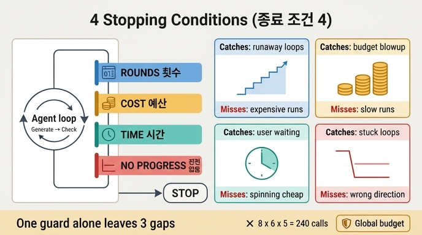

# 종료 조건 네 가지

**질문**: 종료 조건 네 가지는 무엇인가?

**답**: 횟수, 예산, 시간, 진전 없음이다. 하나만 두면 나머지 셋이 못 잡는 경우가 남는다.

---

## 한 줄로

에이전트 루프를 멈추는 방법은 하나가 아니라 **넷**이고, 넷은 서로 **다른 종류의 실패**를 잡는다. 그래서 네 개를 다 걸어야 한다.

| 조건 | 무엇을 재나 | 무엇을 잡나 | 잡지 못하는 것 |
|---|---|---|---|
| **횟수** (max_rounds) | 반복 회차 수 | 무한 루프, 폭주 | 회차는 적은데 비싼 루프 / 느린 루프 |
| **예산** (max_cost) | 누적 비용·토큰 | 지갑이 터지는 것 | 싸지만 오래 걸리는 루프 |
| **시간** (max_seconds) | 벽시계 경과 시간 | 사용자가 기다리다 떠나는 것 | 빠르지만 헛도는 루프 |
| **진전 없음** (stall) | 점수가 안 나아짐 | 제자리걸음, 헛수고 | 처음부터 잘못된 방향 |

## 왜 하나로는 부족한가

20장의 시작 문장이 이 장 전체의 문제 제기다.

> 층마다 상한을 다 걸어 뒀는데 240번을 돌았습니다.

1장의 41만 원 사고 때는 "종료 조건이 없으면 종료를 모델이 정한다"였는데, 20장에서는 종료 조건이 **있었는데도** 안 막혔다. 조건이 있느냐 없느냐가 아니라 **어떤 종류의 조건이 몇 개 있느냐**가 문제인 것이다.

### 예제 1이 보여주는 네 가지 시나리오

`code/ex1_four_guards.py`는 다섯 가지 상황을 같은 `Guards`(기본값 `max_rounds=5, max_cost=100, max_seconds=120, stall_limit=2`)에 넣어 돌린다.

| 상황 | 회차별 (비용, 초, 점수) | 끝난 이유 | 회차 | 비용 | 초 |
|---|---|---|---|---|---|
| 잘 수렴한다 | 점수 5 → 2 → 0 | **성공** | 3 | 60 | 30 |
| 천천히 나아진다 | 점수 9→8→7→6→5→4 | **횟수 상한** | 5 | 100 | 50 |
| 제자리걸음 | 점수 3→3→3→3 | **진전 없음** | 3 | 60 | 30 |
| 비싼 루프 | 회당 45원 | **예산 상한** | 3 | 135 | 30 |
| 느린 루프 | 회당 55초 | **시간 상한** | 3 | 30 | 165 |

읽는 법:

- **«천천히 나아진다»** — 계속 좋아지고 있는데 횟수 상한에 걸려 잘린다. 더 돌리면 될 텐데 못 돌린다. 횟수 상한의 부작용이 이거다.
- **«제자리걸음»** — 진전 없음이 3회차에서 잡는다. 횟수 상한만 있었으면 두 번 더 헛돌고 예산을 다 썼을 것이다.
- **«비싼 루프»** — 회차는 3번뿐인데 돈을 다 썼다. 횟수 상한으로는 절대 못 잡는다.
- **«느린 루프»** — 비용은 30원밖에 안 썼는데 165초가 지났다. 횟수·예산 둘 다 못 잡는다.

이게 "하나만 두면 나머지 셋이 못 잡는 경우가 남는다"의 의미다.

## 구현 — `guards.py`

네 조건이 한 클래스에 모여 있고, 핵심은 **불리언이 아니라 「이유」를 돌려준다**는 점이다.

```python
def check(self) -> Optional[str]:
    """멈출 이유가 있으면 «그 이유»를, 없으면 None."""
    if self.rounds >= self.max_rounds:
        return "횟수 상한"
    if self.cost >= self.max_cost:
        return "예산 상한"
    if self.elapsed >= self.max_seconds:
        return "시간 상한"
    if self.stalled():
        return "진전 없음"
    return None
```

- 체크 순서는 횟수 → 예산 → 시간 → 진전 없음. (그래서 «천천히 나아진다»는 비용도 정확히 100에 닿지만 횟수 상한으로 기록된다.)
- 부등호가 전부 `>=`다. 「같음」도 잡아야 한 회차 더 새지 않는다.

정체 판정도 같은 태도다.

```python
def stalled(self) -> bool:
    """«같음»도 정체로 본다. 나빠지는 것만 잡으면 늦다."""
    n = self.stall_limit + 1
    if len(self.scores) < n:
        return False
    window = self.scores[-n:]
    best_before = min(window[:-1])
    return window[-1] >= best_before
```

## 네 번째 조건이 제일 어렵고 제일 중요하다

앞의 셋(횟수·예산·시간)은 **세기만 하면 되는 값**이다. 네 번째 「진전 없음」만 **무엇을 진전으로 볼지 정해야** 한다. 20.2절이 여기에 통째로 쓰인다.

`ex2_stall_detection.py`는 똑같은 루프를 세 척도로 잰다.

| 회차 | 위반 건수 | 산출물 길이 | 모델 확신도 |
|---:|---:|---:|---:|
| 1 | 9 | 320 | 0.55 |
| 2 | 6 | 480 | 0.61 |
| 3 | 4 | 610 | 0.68 |
| 4 | 4 | 890 | 0.74 |
| 5 | 4 | 1240 | 0.79 |
| 6 | 3 | 1610 | 0.83 |

- **산출물 길이** — 영원히 안 멈춘다. 계속 길어지니까. 그런데 길어진다고 나아지는 게 아니다.
- **모델 확신도** — 계속 오른다. 자기 보고는 믿을 게 못 된다.
- **위반 건수** — 4회차에서 정체를 잡는다. 규칙으로 세는 값이라 안 흔들린다.

기준 한 줄: **「모델이 스스로 올릴 수 있는 값이면 진전 척도로 쓰면 안 된다.」** 길이도 확신도도 모델이 마음대로 올릴 수 있다. 위반 건수는 못 올린다.

관련 원칙: 모델에게 「끝났나요?」를 묻지 말고 **「무엇이 남았나요」**만 물어라. 끝났는지는 코드가 정한다. 그러면 남은 목록의 길이가 그대로 진전 척도가 된다.

## 끝난 「이유」를 상태에 남겨라

`ex4_generator_critic.py`는 LangGraph 루프에 네 조건을 다 붙이고, 종료 이유를 상태 필드 `ending`에 남긴다.

```python
def route(s: S) -> str:
    if not s["missing"]:      return "성공"
    if s["rounds"] >= MAX_ROUNDS: return "상한"
    if s["cost"] >= MAX_COST:     return "예산"
    if stalled(s["scores"]):      return "정체"
    return "생성"
```

실행 결과는 위반이 3 → 2 → 2로 가다가 3회차에 **«정체»**로 끝난다. 회차 상한만 있었다면 6회차까지 돌아 132를 썼을 텐데, 정체 감지가 세 회차(66원)를 아꼈다.

그리고 이유를 남기면 호출한 쪽이 **다르게 대응**할 수 있다.

| 끝난 이유 | 대응 |
|---|---|
| 성공 | 그대로 쓴다 |
| 상한 | 사람에게 넘긴다 — 더 돌리면 될 수도 있다 |
| 예산 | 예산을 올릴지 물어본다 |
| 정체 | 사람에게 넘긴다 — 더 돌려도 안 된다 |

«상한»과 «정체»는 대응이 정반대다. 불리언 하나로는 이 구분이 안 된다.

## 네 조건을 다 걸어도 남는 함정

이 카드의 답 바깥이지만 같은 장의 마무리라 붙여 둔다.

- **예산을 안 나누면 뒤가 굶는다** (`ex3_budget_split.py`). 전체 100 예산을 안 나누면 검색·초안이 여유분을 다 쓰고 마지막 «검토»가 0을 받는다. 하필 검토가 품질을 지키는 단계다. 「최소분 먼저 떼어 두기」가 대개 답이고, 그러려면 단계별 토큰을 따로 계측하고 있어야 한다.
- **층마다 상한을 둬도 곱하면 커진다** (`ex5_nested_loops.py`). 바깥 8 · 안쪽 6 · 도구 5는 각 층에서 보면 다 합리적인데 곱하면 **240회**, 432원이다. 각 층 코드를 따로 리뷰하면 아무 문제가 없어 보인다. 곱하기를 아무도 안 했을 뿐이다. → **전역 예산**을 하나 더 두고 모든 층이 그걸 보게 한다. 그러면 층 상한은 «안전망», 전역 예산이 «실질 제어»가 된다.
- 그 전역 예산은 전역 변수가 아니라 **상태**에 둔다. 안 그러면 재개할 때 리셋된다.

## 외우는 법

**「횟·예·시·정」** — 얼마나 많이(횟수), 얼마나 비싸게(예산), 얼마나 오래(시간), 그리고 **소용은 있었나**(진전 없음). 앞의 셋은 *자원*을 재고, 마지막 하나만 *성과*를 잰다.

## 인포그래픽


