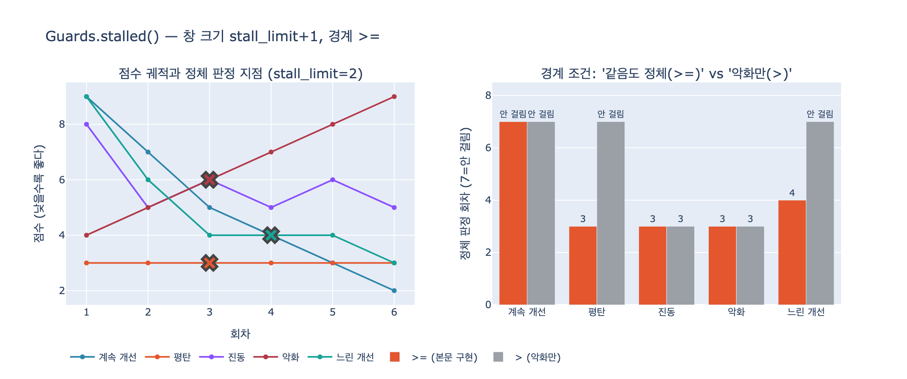

# `Guards.stalled()`는 정체를 어떻게 판정하는가?

**답**: 최근 `stall_limit + 1`개 점수를 보고 마지막 값이 이전 최선값보다 나아지지 않았으면 정체로 본다. '같음'도 정체로 취급한다.

---

## 본문 코드 (`code/guards.py`)

```python
@dataclass
class Guards:
    max_rounds: int = 5
    max_cost: float = 100.0
    max_seconds: float = 120.0
    stall_limit: int = 2          # 몇 번 연속 안 나아지면 멈출까

    # 실행 중에 채워지는 것들
    rounds: int = 0
    cost: float = 0.0
    elapsed: float = 0.0
    scores: list = field(default_factory=list)

    def record(self, cost: float, seconds: float, score: Optional[float]):
        self.rounds += 1
        self.cost += cost
        self.elapsed += seconds
        if score is not None:
            self.scores.append(score)

    def stalled(self) -> bool:
        """최근 stall_limit+1 개 점수가 나아지지 않았나.
        «같음»도 정체로 본다. 나빠지는 것만 잡으면 늦다."""
        n = self.stall_limit + 1
        if len(self.scores) < n:
            return False
        window = self.scores[-n:]
        best_before = min(window[:-1])
        return window[-1] >= best_before
```

판정은 네 줄이 전부다. 한 줄씩 뜯어 본다.

## 1. 창 크기는 `stall_limit + 1` — 왜 `+1`인가

```python
n = self.stall_limit + 1
```

`stall_limit`은 「몇 번 연속 안 나아지면 멈출까」다. 그런데 «나아졌는가»는
**비교 대상이 있어야** 판정된다. `stall_limit`번의 비교를 하려면 점수가
`stall_limit + 1`개 있어야 한다. `stall_limit = 2`면 창 크기는 3이고,
`window[:-1]`(앞의 2개)이 기준, `window[-1]`(마지막 1개)이 판정 대상이다.

```python
if len(self.scores) < n:
    return False
```

점수가 창 크기에 못 미치면 **무조건 `False`**. 판정을 내리는 게 아니라
「아직 판정할 수 없다」를 `False`로 표현한 것이다. 이 때문에 정체로 끝나는
가장 이른 회차는 다음을 만족한다.

- 첫 정체 회차 ≥ `stall_limit + 1`

`stall_limit = 2`면 아무리 평탄해도 3회차 전에는 절대 안 멈춘다.

## 2. 기준값은 «창 안의» 최선값 — 전체 이력이 아니다

```python
window = self.scores[-n:]
best_before = min(window[:-1])
```

`min(...)`을 쓴다는 건 **점수가 낮을수록 좋다**는 전제다. 20장에서 진전 척도로
쓰는 값이 「위반 건수」·「남은 항목 수」이기 때문이다(`ex4_generator_critic.py`의
`critic()`이 `scores: [len(miss)]`를 쌓는다). 높을수록 좋은 척도를 쓰려면
`max` + `<=`로 뒤집어야 한다 — `ex2_stall_detection.py`의 `stalled_at()`이
그 일반형이고, `higher_better` 플래그로 두 방향을 다 다룬다.

중요한 건 `self.scores` 전체가 아니라 `window[:-1]`, 즉 **최근 창 안에서의**
최선값과 비교한다는 점이다. 슬라이딩 윈도우이므로 오래전 기록은 잊는다.
그래서 한 번 `True`가 나온 뒤 점수가 다시 좋아지면 판정이 풀린다
(실제 루프에서는 `check()`가 정체를 만나는 즉시 종료하므로 그 상황까지 가지 않는다).

## 3. 경계 조건 `>=` — 「같음도 정체」

```python
return window[-1] >= best_before
```

이 한 글자가 핵심이다. `>`였다면 «점수가 나빠질 때»만 정체로 잡는다.
그런데 실무에서 루프가 망가지는 전형적 모습은 나빠지는 게 아니라 **제자리걸음**이다.

- `[3, 3, 3, 3, ...]` — `>=`는 3회차에 잡는다. `>`는 **영원히 못 잡는다.**
  같은 점수를 무한 반복하며 상한까지 예산을 다 태운다.
- 본문 주석의 «나빠지는 것만 잡으면 늦다»가 정확히 이 경우를 가리킨다.
- `ex1_four_guards.py`의 «제자리걸음» 시나리오 `[(20,10,3)] * 4`가 이걸 시연한다.
  횟수 상한만 있었으면 두 번 더 헛돌았을 것이다.

`>=`가 공짜인 건 아니다. 잠깐 평평했다가 다시 내려가는 루프(`[9,6,4,4,4,3]`)를
4회차에서 끊어 버려 마지막 개선(3)을 놓친다. **그 관용도를 조절하는 손잡이가
`stall_limit`**이다. 크게 잡으면 더 참고, 작게 잡으면 더 빨리 끊는다.

## 4. 실제 판정 추적 (`stall_limit = 2`, 점수 `[9, 6, 4, 4, 4, 3]`)

| 회차 | 누적 점수 | window | `best_before` | `window[-1] >= best_before` | 판정 |
|---|---|---|---|---|---|
| 1 | `[9]` | — | — | — | `False` (표본 부족) |
| 2 | `[9,6]` | — | — | — | `False` (표본 부족) |
| 3 | `[9,6,4]` | `[9,6,4]` | `min(9,6)=6` | `4 >= 6` → 거짓 | `False` |
| 4 | `[9,6,4,4]` | `[6,4,4]` | `min(6,4)=4` | `4 >= 4` → **참** | `True` ← 정체 |

4회차의 `4 >= 4`가 「같음도 정체로 본다」의 실체다.

## 5. `check()` 안에서의 위치 — 마지막에 본다

```python
def check(self) -> Optional[str]:
    """멈출 이유가 있으면 «그 이유»를, 없으면 None."""
    if self.rounds >= self.max_rounds:
        return "횟수 상한"
    if self.cost >= self.max_cost:
        return "예산 상한"
    if self.elapsed >= self.max_seconds:
        return "시간 상한"
    if self.stalled():
        return "진전 없음"
    return None
```

`stalled()`는 네 가지 종료 조건 중 하나일 뿐이고, `check()`의 **마지막**에 놓인다.
그리고 불리언이 아니라 «이유 문자열»을 돌려준다는 게 이 설계의 요점이다.
「상한」과 「정체」는 호출한 쪽의 대응이 다르기 때문이다.

- 상한 — 사람에게 넘긴다 (더 돌리면 될 수도 있다)
- 정체 — 사람에게 넘긴다 (더 돌려도 안 된다)

## 흔한 오해

| 오해 | 실제 |
|---|---|
| 창 크기가 `stall_limit`이다 | `stall_limit + 1`. 비교하려면 기준 점수들 + 판정 대상 1개가 필요하다 |
| 전체 이력의 최선값과 비교한다 | 최근 창 `window[:-1]` 안의 최선값과만 비교한다 |
| 점수가 나빠져야 정체다 | `>=`이므로 **같기만 해도** 정체다 |
| 높은 점수가 좋은 척도에도 쓸 수 있다 | `min` 기준이라 «낮을수록 좋다» 전제다. 뒤집으려면 `max` + `<=` |
| 점수가 부족하면 판정을 미룬다는 신호를 준다 | 그냥 `False`를 돌려준다. 「정체 아님」과 「판정 불가」가 같은 값이다 |

## 시각화



왼쪽은 다섯 가지 점수 궤적과 `stall_limit = 2`에서 정체 판정이 나는 지점(X 표시).
오른쪽은 같은 시퀀스에 대해 `>=`(본문 구현)와 `>`(악화만 잡는 변형)의 판정 회차 대비다.
«평탄»과 «느린 개선»에서 `>`는 아예 안 걸리고, `>=`만 각각 3회차·4회차에 끊는다.
