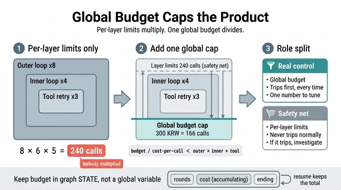

# 전역 예산과 층 상한의 역할 분담

**질문**: 전역 예산과 층 상한의 올바른 역할 분담은 무엇인가?

**답**: 전역 예산이 층 상한보다 먼저 걸리게 잡는다. 그러면 층 상한은 **안전망**이 되고 전역 예산이 **실질 제어**가 된다.

---

## 1. 문제: 층마다 상한이 있어도 곱하면 커진다

20장의 시작 문장이 그대로 사고 기록입니다.

> 층마다 상한을 다 걸어 뒀는데 240번을 돌았습니다.

`ex5_nested_loops.py`는 이 240번이 어디서 나오는지를 보여 줍니다.

```python
OUTER, INNER, TOOL = 5, 4, 3        # 각 층의 상한
COST_PER_CALL = 1.8                 # 원


def counts():
    """각 층이 «자기 상한»만 보면 총 호출이 몇 번이 되나."""
    return OUTER, OUTER * INNER, OUTER * INNER * TOOL
```

`counts()`가 하는 일은 곱하기 하나뿐입니다. 그런데 실무에서는 그 곱하기를 아무도 안 합니다.

| 바깥 | 안쪽 | 도구 | 총 호출 | 값 |
|---:|---:|---:|---:|---:|
| 5 | 4 | 3 | 60 | 108원 |
| 6 | 4 | 3 | 72 | 130원 |
| 5 | 5 | 3 | 75 | 135원 |
| 5 | 4 | 4 | 80 | 144원 |
| 8 | 6 | 5 | **240** | **432원** |

「여덟 번, 여섯 번, 다섯 번」은 각 층 코드를 따로 리뷰하면 전부 합리적인 숫자입니다. 리뷰어는 자기가 보는 파일의 상한만 보고 통과시킵니다. 아무도 세 파일을 곱하지 않습니다. 그래서 40배 넘는 폭발이 리뷰를 그대로 통과합니다.

층 상한이 나쁘다는 얘기가 아닙니다. 층 상한은 **필요**합니다. 다만 **곱셈이라 그것만으로는 부족**합니다.

---

## 2. 해법: 모든 층이 보는 전역 예산 하나

```python
def with_global_budget(budget):
    """전역 예산이 있으면 실제로 몇 번까지 가나."""
    return int(budget / COST_PER_CALL)
```

핵심은 이 함수가 `OUTER`, `INNER`, `TOOL` 중 **아무것도 참조하지 않는다**는 점입니다. 층 구조와 무관하게, 총액 하나로 상한이 결정됩니다. 곱셈이 아니라 나눗셈이라서 층이 몇 겹이든 결과가 폭발하지 않습니다.

`ex5`가 세 가지 예산으로 돌려 본 결과입니다 (층 상한 곱 = 240회).

| 전역 예산 | 최대 호출 | 240회와 비교 | 실제로 먼저 걸리는 것 |
|---:|---:|---|---|
| 100원 | 55회 | 적다 | **전역 예산** ✅ |
| 300원 | 166회 | 적다 | **전역 예산** ✅ |
| 1000원 | 555회 | 많다 | 층 상한 ❌ |

---

## 3. 왜 「전역 예산 < 층 상한의 곱」이 설계 원칙인가

부등식으로 쓰면 이렇습니다.

```
전역 예산 / 회당 비용  <  OUTER × INNER × TOOL
```

이 부등식이 성립하면 **항상 전역 예산이 먼저 걸립니다**. 그리고 그때 두 장치의 역할이 이렇게 갈립니다.

**전역 예산 = 실질 제어 (normal path)**
- 평소 루프를 끝내는 건 항상 이쪽입니다.
- 조절할 값이 **하나**입니다. 더 돌리고 싶으면 예산 숫자 하나만 올립니다. 세 층을 각각 조율하고 곱을 다시 계산할 필요가 없습니다.
- 단위가 「원」이나 「토큰」이라 사업적 의미가 직접 붙습니다. 「이 작업에 최대 얼마까지 쓸 것인가」는 답할 수 있는 질문이지만, 「안쪽 루프를 몇 번 돌 것인가」는 답하기 어렵습니다.

**층 상한 = 안전망 (fallback)**
- 정상 동작에서는 **절대 안 걸립니다**. 걸린다면 그건 무언가 잘못됐다는 신호입니다.
- 비용 계측이 깨졌을 때, 캐시 히트로 회당 비용이 0에 가까워졌을 때, 무료 도구를 무한히 재시도할 때 — 전역 예산이 안 늘어나 못 잡는 경우를 층 상한이 잡습니다.
- 즉 층 상한은 「비용 기준 제어가 실패했을 때를 대비한 횟수 기준 백스톱」입니다.

1000원 행처럼 부등식이 뒤집히면 이 역할 분담이 무너집니다. 전역 예산이 장식이 되고 다시 240회짜리 곱셈 폭발이 실제 상한이 됩니다. **전역 예산을 「넉넉하게」 잡는 것이 위험한 이유**가 이겁니다. 넉넉한 예산은 제어가 아니라 없는 것과 같습니다.

---

## 4. 전역 예산은 전역 변수가 아니라 *상태*에 둔다

20장 요약의 문장입니다.

> 전역 예산을 하나 더 두고 모든 층이 보게 하세요. 그리고 그 예산은 전역 변수가 아니라 *상태*에 둡니다. 안 그러면 재개할 때 리셋됩니다.

「모든 층이 본다」를 구현하는 가장 쉬운 방법은 모듈 전역 변수나 프로세스 카운터입니다. 그런데 그러면 프로세스가 죽고 재개될 때 누적치가 0으로 돌아갑니다. 480원을 쓰고 죽은 루프가 재개되면서 다시 500원 예산을 통째로 받는 셈입니다. 상한이 없는 것과 다를 게 없습니다.

`ex4_generator_critic.py`가 이걸 상태에 두는 방식입니다.

```python
class S(TypedDict):
    text:    str
    missing: list
    rounds:  Annotated[int, operator.add]
    cost:    Annotated[float, operator.add]
    scores:  Annotated[list, operator.add]
    ending:  str          # 어떤 이유로 끝났는지. 이게 중요하다.
```

- `cost`가 상태 필드이고 리듀서가 `operator.add`입니다. 어느 노드가 얼마를 썼다고 보고하든 그래프 상태에 **누적**됩니다.
- `app = b.compile(checkpointer=InMemorySaver())` — 체크포인터에 상태가 저장되므로 같은 `thread_id`로 재개하면 **누적된 비용이 그대로 이어집니다**.
- 라우터가 상태를 읽어 판단합니다.

```python
def route(s: S) -> str:
    if not s["missing"]:
        return "성공"
    if s["rounds"] >= MAX_ROUNDS:
        return "상한"
    if s["cost"] >= MAX_COST:
        return "예산"
    if stalled(s["scores"]):
        return "정체"
    return "생성"
```

여기서 `MAX_ROUNDS`(=6)가 층 상한 성격, `MAX_COST`(=90.0)가 전역 예산 성격입니다. 회당 22원이므로 6회면 132원 — 즉 90원 예산이 6회 상한보다 먼저 걸리도록 잡혀 있습니다. 3절의 부등식이 그대로 반영된 숫자입니다.

그리고 안쪽 루프가 어느 깊이에 있든 같은 상태 객체를 보면 됩니다. 「모든 층이 하나의 예산을 본다」가 전역 변수 없이 성립하는 이유입니다.

이 이야기가 21장으로 이어집니다. 「재개하면 예산이 이어진다」를 전제로 하려면 프로세스가 죽어도 상태가 남아 있어야 하니까요.

---

## 5. 끝난 이유를 구분해서 남긴다

역할 분담이 제대로 되어 있으면 **끝난 이유 자체가 진단 정보**가 됩니다. `ex4`는 `ending` 필드에 이유를 남깁니다.

| 끝난 이유 | 의미 | 대응 |
|---|---|---|
| 성공 | 목표 달성 | 그대로 쓴다 |
| 예산 | 전역 예산 소진 — **정상 경로** | 예산을 올릴지 물어본다 |
| 상한 | 층 상한에 걸림 — **안전망 발동** | 사람에게 넘긴다. 그리고 왜 예산보다 먼저 걸렸는지 조사한다 |
| 정체 | 더 돌려도 안 나아짐 | 사람에게 넘긴다 (더 돌려도 안 된다) |

특히 **「상한」으로 끝났다는 건 설계 위반 알람**입니다. 안전망이 먼저 걸렸다는 뜻이니까요. 비용 계측이 어긋났거나 예산을 너무 넉넉히 잡았다는 신호입니다. 불리언 하나로 「멈췄다/안 멈췄다」만 돌려주면 이 구분이 사라집니다.

---

## 한 줄 정리

**층 상한은 곱해지고, 전역 예산은 나눠진다.** 그래서 「전역 예산 ÷ 회당 비용 < 층 상한의 곱」이 되도록 잡아 전역 예산이 항상 먼저 걸리게 만들고, 그 예산을 전역 변수가 아니라 체크포인트되는 상태에 누적시킨다. 층 상한은 그 아래에서 조용히 대기하는 안전망으로 남는다.

## 인포그래픽


