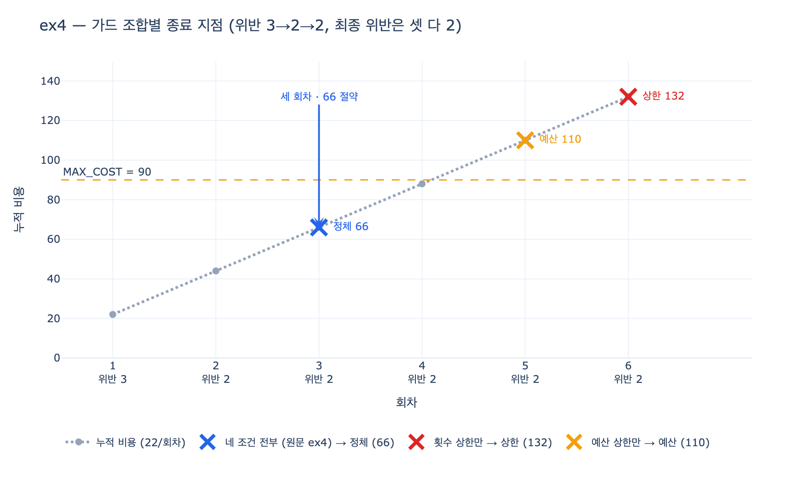

# `ex4`의 루프는 왜 '정체'로 끝났고 무엇을 아꼈는가

## 한 줄 답

위반이 **3 → 2 → 2**로 가면서 마지막에 줄지 않아 정체로 끝났다. 횟수 상한만 있었다면 6회차까지 돌아 **132**를 썼을 것이므로, 정체 감지가 **세 회차**를 아꼈다.

---

## 1. `ex4`가 무엇을 하는 루프인가

`code/ex4_generator_critic.py`는 20.4절의 예제로, 생성-검증(evaluator-optimizer) 루프에 **네 가지 종료 조건을 다 붙인** 것이다. LangGraph `StateGraph`로 `생성 → 검증 → route` 사이클을 만든다.

```python
REQUIRED = ["## 개요", "## 원인", "## 조치", "## 재발 방지"]
MAX_ROUNDS, MAX_COST, STALL_LIMIT = 6, 90.0, 2
```

| 상수 | 값 | 역할 |
|---|---|---|
| `MAX_ROUNDS` | 6 | 횟수 상한 |
| `MAX_COST` | 90.0 | 예산 상한 |
| `STALL_LIMIT` | 2 | 몇 번 연속 안 나아지면 정체로 볼까 |
| `generate`의 `cost` | 22.0 | 회차마다 누적되는 비용 |

핵심은 `generate`가 일부러 **막히도록** 짜여 있다는 점이다.

```python
def generate(s: S) -> dict:
    """모델 자리. 3회차부터는 더 못 고친다 — 실제로 흔한 일이다."""
    have = [x for x in REQUIRED if x in s["text"]]
    if s["rounds"] < 2:
        have = REQUIRED[: len(have) + 1]
    ...
    return {"text": text, "rounds": 1, "cost": 22.0}
```

`s["rounds"] < 2`일 때만 필수 섹션을 하나 더 채운다. 즉 3회차부터는 아무리 돌려도 산출물이 그대로다. 실무에서 「모델이 더 이상 못 고치는」 상황을 축약한 것이다.

## 2. 회차별 위반과 비용 추적

`critic`은 빠진 섹션 수를 점수로 쌓고(`scores`), `cost`는 `operator.add` 리듀서로 회차마다 22씩 누적된다.

| 회차 | `generate` 후 섹션 | 누적 `cost` | 위반(`missing`) | `scores` | `route` 판정 |
|---:|---:|---:|---:|---|---|
| 1 | 1 (`## 개요`) | 22 | **3** | `[3]` | 생성 (창 미달) |
| 2 | 2 (`+## 원인`) | 44 | **2** | `[3, 2]` | 생성 (창 미달) |
| 3 | 2 (변화 없음) | 66 | **2** | `[3, 2, 2]` | **정체** ← 여기서 종료 |

3회차 종료 시점의 실제 실행 출력은 다음과 같다.

```
끝난 이유  정체
회차       3 / 6
쓴 비용     66 / 90
점수 이력   [3, 2, 2]
남은 항목   ['## 조치', '## 재발 방지']
```

## 3. 왜 3회차에 「정체」로 판정되는가

정체 판정 함수는 최근 `STALL_LIMIT + 1 = 3`개 점수만 본다.

```python
def stalled(scores):
    n = STALL_LIMIT + 1          # 3
    if len(scores) < n:
        return False
    w = scores[-n:]
    return w[-1] >= min(w[:-1])  # «같음»도 정체로 본다
```

- 1회차 `[3]`, 2회차 `[3, 2]` — 창(window)이 3개가 안 되므로 판정 불가, 계속 진행.
- 3회차 `[3, 2, 2]` — `min([3, 2]) = 2`이고 마지막 값도 `2`. `2 >= 2`이므로 **True**.

여기서 중요한 설계 결정 하나. **「같음」도 정체로 본다.** `guards.py` 주석이 이유를 못 박는다 — "«같음»도 정체로 본다. 나빠지는 것만 잡으면 늦다." 만약 `>` (엄격히 나빠짐)만 잡았다면 위반이 2에서 영원히 평평해도 절대 안 멈춘다.

또 하나. 위반 건수는 **규칙으로 세는 값**이다. 20.2절(`ex2`)이 강조하듯 산출물 길이나 모델 확신도는 모델이 스스로 올릴 수 있어 정체 척도로 못 쓴다. `critic`의 `len(missing)`은 `REQUIRED` 문자열 포함 여부로 코드가 세므로 모델이 못 흔든다.

### `route`의 우선순위도 답의 일부다

```python
def route(s: S) -> str:
    if not s["missing"]: return "성공"
    if s["rounds"] >= MAX_ROUNDS: return "상한"   # 3 >= 6 ? 아니오
    if s["cost"] >= MAX_COST:     return "예산"   # 66 >= 90 ? 아니오
    if stalled(s["scores"]):      return "정체"   # True → 여기
    return "생성"
```

3회차 시점에 횟수(3 < 6)도 예산(66 < 90)도 아직 여유가 있다. **그 둘이 못 잡는 구간을 정체가 잡았다.** 이것이 20.1절의 "하나만 두면 나머지 셋이 못 잡는 경우가 남는다"의 실증이다.

## 4. 반사실 — 정체 감지가 없었다면

`generate`가 3회차부터 산출물을 못 고치므로, 정체 감지를 끄면 위반은 계속 2로 평평하다. 가드 조합별 종료 지점을 정량화하면:

| 가드 조합 | 끝난 이유 | 종료 회차 | 누적 비용 | 최종 위반 |
|---|---|---:|---:|---:|
| **네 조건 전부 (원문 `ex4`)** | 정체 | **3** | **66** | 2 |
| 예산 상한만 (`MAX_COST=90`) | 예산 | 5 | 110 | 2 |
| 횟수 상한만 (`MAX_ROUNDS=6`) | 상한 | 6 | **132** | 2 |

- 횟수 상한만: 6회차 × 22 = **132**. 원문이 말하는 반사실 비용이 이 값이다.
- 예산 상한만: 4회차 88은 90 미만이라 통과, 5회차 110에서야 걸린다.
- **세 조합의 최종 위반은 모두 2로 똑같다.** 더 돌려도 결과가 나아지지 않았다. 달라지는 건 오직 「얼마를 쓰고 멈췄나」다.

### 절약분

- 회차: 6 − 3 = **3회차** ("정체 감지가 세 회차를 아꼈다")
- 비용: 132 − 66 = **66** → 절약률 66/132 = **50%**
- 예산 상한만 두었을 때와 비교해도 110 − 66 = **44**를 아꼈다.

20.1절이 "실무에서 제일 아픈 건 «제자리걸음»이다. 횟수 상한만 있으면 안 될 일에 예산을 끝까지 쓰고 끝난다"고 한 그대로다.

## 5. 아낀 것이 비용만은 아니다 — 끝난 이유가 상태에 남는다

`S` TypedDict의 `ending` 필드와 `mark(reason)` 노드가 존재하는 이유다.

```python
ending: str          # 어떤 이유로 끝났는지. 이게 중요하다.
```

원문 출력이 대응표를 제시한다.

| `ending` | 호출한 쪽의 대응 |
|---|---|
| 성공 | 그대로 쓴다 |
| 상한 | 사람에게 넘긴다 (**더 돌리면 될 수도 있다**) |
| 예산 | 예산을 올릴지 물어본다 |
| 정체 | 사람에게 넘긴다 (**더 돌려도 안 된다**) |

"«상한»과 «정체»의 대응이 다르다. 불리언 하나로는 이 구분이 안 된다." 만약 정체 감지 없이 「상한」으로 끝났다면 운영자는 "`MAX_ROUNDS`를 8로 올려볼까"라고 오판했을 것이고, 그건 176을 더 태우는 길이다. 정체 감지는 비용 66뿐 아니라 **잘못된 후속 조치까지** 막았다.

## 정리

1. **왜 정체인가** — `scores = [3, 2, 2]`에서 마지막 값이 창의 최솟값보다 줄지 않았다(`2 >= 2`). 같음도 정체로 보기 때문에 3회차에 즉시 잡힌다.
2. **왜 다른 가드가 아닌가** — 그 시점에 회차는 3/6, 비용은 66/90으로 둘 다 여유가 있었다. 정체만이 잡을 수 있는 구간이었다.
3. **무엇을 아꼈나** — 횟수 상한만 있었다면 6회차 132. 실제로는 3회차 66. **세 회차, 비용 66(50%)**을 아꼈고, 결과 품질(최종 위반 2)은 전혀 손해 보지 않았다.

## 시각화


