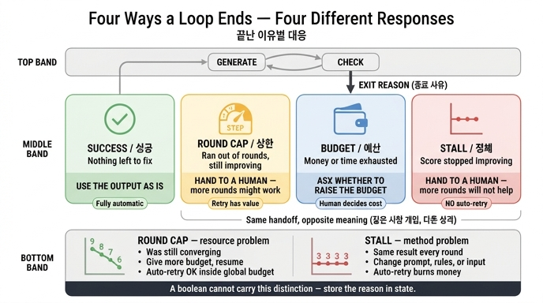

# 끝난 이유별 대응은 각각 무엇인가?

## 한 줄 답

**성공**은 그대로 쓰고, **상한**은 더 돌리면 될 수도 있으니 사람에게 넘기고, **예산**은 예산을 올릴지 묻고, **정체**는 더 돌려도 안 되니 사람에게 넘긴다.

---

## 왜 「끝났다」만으로는 부족한가

`code/guards.py` 주석이 이 카드의 전제를 그대로 말한다.

> 핵심은 «어떤 이유로 끝났는지»를 돌려주는 것이다.
> 불리언 하나만 돌려주면 호출한 쪽이 다르게 대응할 수 없다.

루프의 종료를 `True/False`로만 돌려주면, 호출한 쪽에는 「끝났다」만 남는다. 그런데 끝나는 방식은 최소 네 가지고, 각각 **다음에 해야 할 일이 다르다**. 그래서 `ex4_generator_critic.py`의 상태 스키마에는 이유를 담는 필드가 따로 있다.

```python
class S(TypedDict):
    ...
    ending:  str          # 어떤 이유로 끝났는지. 이게 중요하다.
```

그리고 성공/상한/예산/정체를 각각 별도 노드로 만들어 라우터가 그중 하나로 보낸다. 즉 **종료 이유는 부수적 로그가 아니라 그래프의 1급 출력**이다.

```python
def route(s: S) -> str:
    if not s["missing"]:            return "성공"
    if s["rounds"] >= MAX_ROUNDS:   return "상한"
    if s["cost"]   >= MAX_COST:     return "예산"
    if stalled(s["scores"]):        return "정체"
    return "생성"
```

---

## 네 이유 × 대응 표

| 끝난 이유 | 무엇이 일어난 상태인가 | 대응 | 재시도 가치 | 자동화 가능성 |
|---|---|---|---|---|
| **성공** | 검증기가 남은 항목 0을 확인했다 | 산출물을 **그대로 쓴다** | 해당 없음 (끝났다) | 완전 자동 |
| **상한** (횟수) | 회차 상한에 걸렸다. 점수는 계속 좋아지는 중이었다 | **사람에게 넘긴다** — 더 돌리면 될 수도 있다 | **있다** (수렴 중이었음) | 조건부. 사람/정책이 상한을 올려 주면 재개 |
| **예산** (비용·시간) | 돈이나 시간을 다 썼다 | **예산을 올릴지 물어본다** | 있다 — 단 지불 의사가 있어야 | 사람 결정 필요 (돈이 걸림) |
| **정체** (진전 없음) | 점수가 연속으로 안 줄었다 | **사람에게 넘긴다** — 더 돌려도 안 된다 | **없다** | 자동 재시도 금지 |

`ex4_generator_critic.py` 말미의 문장이 이 표의 원문이다.

```
성공 — 그대로 쓴다
상한 — 사람에게 넘긴다 (더 돌리면 될 수도 있다)
예산 — 예산을 올릴지 물어본다
정체 — 사람에게 넘긴다 (더 돌려도 안 된다)
```

---

## 「상한」과 「정체」는 왜 같은 사람 개입인데 성격이 다른가

둘 다 최종 행동은 「사람에게 넘긴다」로 같아 보인다. 하지만 **사람에게 넘길 때 붙는 메시지가 정반대**다.

| | 상한 | 정체 |
|---|---|---|
| 루프 궤적 | 점수가 **계속 내려가고 있었다** (좋아지는 중) | 점수가 **평평하다** (`3 → 2 → 2`) |
| 멈춘 원인 | 외부 제약(설정한 회차)이 먼저 닿았다 | 루프 자체가 더 못 나아간다 |
| 사람에게 하는 말 | "예산/회차를 좀 더 주면 끝날 것 같습니다" | "이 방식으로는 안 됩니다. 접근을 바꾸세요" |
| 사람이 할 일 | 상한을 올리고 **재개** | 프롬프트·검증 규칙·입력을 **수정** 후 재시작 |
| 그대로 더 돌리면 | 완주 가능성 있음 | **같은 값에 돈만 더 쓴다** |

핵심 구분자는 **재시도 가치(retry value)의 유무**다.

- **상한** = "시간이 모자랐다" — 자원의 문제. 자원을 더 주면 해결될 수 있다.
- **정체** = "능력이 모자랐다" — 방법의 문제. 자원을 더 줘도 같은 자리다.

`ex1_four_guards.py`가 이 대비를 시나리오로 보여준다.

```
«천천히 나아진다» — 횟수 상한에 걸린다. 더 돌리면 될 텐데 못 돌린다
«제자리걸음»     — 진전 없음에 걸린다. 횟수 상한이었으면 두 번 더 헛돌았을 것
```

「천천히 나아진다」는 9→8→7→6→5→4로 매 회차 개선되는데 상한 6에 걸려 끊긴다. 아쉬운 종료다. 「제자리걸음」은 3→3→3→3으로 아무리 돌려도 3이다. 정체 감지가 없었다면 상한까지 **헛돌면서 예산만 태웠을** 것이다.

그래서 `ex4`의 결론이 이렇게 끝난다.

> «상한»과 «정체»의 대응이 다르다. 불리언 하나로는 이 구분이 안 된다.

---

## 자동 재시도가 정당화되는 경우와 아닌 경우

「사람에게 넘긴다」를 「자동으로 다시 돌린다」로 바꿔도 되는지가 실무의 진짜 질문이다. 기준은 **재시도가 다른 결과를 낼 근거가 있는가**다.

### 자동 재시도가 정당화되는 경우

1. **상한 + 개선 궤적이 뚜렷할 때.** 최근 점수가 단조 감소 중이고, 남은 항목 수로 볼 때 몇 회차 안에 끝날 것으로 보이면 상한을 정해진 만큼만(예: +2회차) 올려 자동 재개할 수 있다. 단, **전역 예산 안에서만**이다.
2. **예산 초과인데 정책상 상향이 이미 승인된 경우.** "이 작업은 상한 500원까지 자동 승인" 같은 사전 규칙이 있으면 사람에게 묻는 대신 규칙이 답한다. 사람을 부르는 이유는 "돈을 쓸 권한이 코드에 없어서"이지, 기술적으로 불가능해서가 아니다.
3. **원인이 외부의 일시적 실패일 때.** 속도 제한(429), 타임아웃, 일시적 도구 오류 등은 같은 입력으로 다시 돌리면 다른 결과가 나올 수 있다. 이건 애초에 종료 이유 네 가지와 다른 층(도구 재시도)의 문제다.

### 자동 재시도를 하면 안 되는 경우

1. **정체.** 이게 가장 명확한 금지 사례다. 정의상 "연속으로 나아지지 않았다"이므로, 같은 조건으로 재시도하면 같은 결과를 다시 산다. 무엇도 바꾸지 않은 자동 재시도는 **예산 소모 장치**일 뿐이다.
2. **정체인데 상한처럼 위장된 경우 — 척도가 틀렸을 때.** `ex2_stall_detection.py`의 교훈이 여기 붙는다. 진전 척도로 「산출물 길이」나 「모델 확신도」를 쓰면 정체를 영원히 감지하지 못하고 항상 「상한」으로 끝난다. 그러면 위 1번 규칙에 따라 자동 재시도가 계속 정당화되고, 실제로는 헛도는 루프에 돈을 붓게 된다.

   > 진전 척도를 고르는 기준 하나. «모델이 스스로 올릴 수 있는 값이면 안 된다.»

   그래서 진전 척도는 규칙으로 세는 값(위반 건수, 남은 항목 수)이어야 한다. 그리고 모델에게 "끝났나요?"를 묻지 말고 "무엇이 남았나요"만 물어야 한다. 끝났는지는 코드가 정한다.
3. **재시도 판단이 층마다 독립적으로 이뤄질 때.** `ex5_nested_loops.py`가 경고하는 구간이다. 각 층이 자기 상한만 보고 "아직 여유 있네, 재시도"를 하면 5·4·3=60, 8·6·5=240회로 곱해진다. 자동 재시도는 반드시 **모든 층이 함께 보는 전역 예산**을 조회한 뒤에만 허용해야 한다.

   > 층마다 상한을 두는 건 필요하다. 다만 그것만으로는 부족하다. «전역 예산»을 하나 더 둬야 한다.

4. **예산 초과를 자동으로 상향할 때.** 예산은 사람이 지불 의사를 밝히는 지점이다. 코드가 스스로 예산을 올리면 애초에 예산이 아니다. 1장의 41만 원 사고가 정확히 이 형태였다.

---

## 실무 체크리스트

- [ ] 루프의 종료를 불리언이 아니라 **이유 문자열/열거형**으로 돌려준다.
- [ ] 그 이유를 **상태(state)에 저장**한다. 전역 변수가 아니라 상태여야 재개 시 살아남는다.
- [ ] 호출한 쪽에 성공/상한/예산/정체 **네 갈래 분기**를 실제로 구현한다.
- [ ] 정체 경로는 **자동 재시도 없음**으로 하드코딩한다.
- [ ] 상한 경로의 자동 재개는 **전역 예산 확인 후**, 상향 폭을 유한하게 정한다.
- [ ] 진전 척도가 모델이 임의로 올릴 수 있는 값이 아닌지 확인한다(길이·확신도 금지).

---

## 관련 자료

- `content/ch20/code/guards.py` — 네 종료 조건을 한곳에 모으고 **이유**를 반환
- `content/ch20/code/ex1_four_guards.py` — 네 조건이 각각 다른 상황을 잡는다
- `content/ch20/code/ex2_stall_detection.py` — 정체 판정을 좌우하는 진전 척도 선택
- `content/ch20/code/ex4_generator_critic.py` — 네 이유를 각각 별도 종료 노드로 만든 LangGraph 루프
- `content/ch20/code/ex5_nested_loops.py` — 층별 상한의 곱셈과 전역 예산

## 인포그래픽


