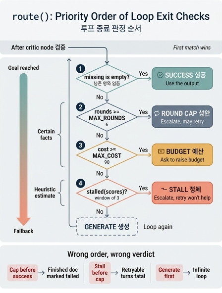

# `ex4_generator_critic.py`의 `route()` 판정 순서

## 질문

`ex4_generator_critic.py`의 `route()`는 어떤 순서로 판정하는가?

## 답

**남은 항목이 없으면 성공 → 회차가 `MAX_ROUNDS` 이상이면 상한 → 비용이 `MAX_COST` 이상이면 예산 → 정체면 정체 → 그 외에는 생성으로 되돌린다.**

---

## 원문 코드

```python
REQUIRED = ["## 개요", "## 원인", "## 조치", "## 재발 방지"]
MAX_ROUNDS, MAX_COST, STALL_LIMIT = 6, 90.0, 2


def stalled(scores):
    n = STALL_LIMIT + 1
    if len(scores) < n:
        return False
    w = scores[-n:]
    return w[-1] >= min(w[:-1])


def route(s: S) -> str:
    if not s["missing"]:
        return "성공"
    if s["rounds"] >= MAX_ROUNDS:
        return "상한"
    if s["cost"] >= MAX_COST:
        return "예산"
    if stalled(s["scores"]):
        return "정체"
    return "생성"
```

그래프 배선은 이렇게 붙는다.

```python
b.add_edge(START, "생성")
b.add_edge("생성", "검증")
b.add_conditional_edges("검증", route,
                        {"생성": "생성", "성공": "성공", "상한": "상한",
                         "예산": "예산", "정체": "정체"})
```

`route()`는 **`검증`(critic) 노드가 끝난 직후**에만 호출된다. 즉 판정 시점의 `rounds`/`cost`는 방금 끝낸 회차까지 누적된 값이고, `missing`/`scores`도 방금 채점한 결과가 반영된 상태다.

---

## 이 순서가 왜 이 순서여야 하는가

### 0. 먼저: `route()`는 "우선순위 목록"이지 "조건 검사 목록"이 아니다

`if ... return` 연쇄라 **첫 번째로 참이 되는 조건 하나만** 반환된다. 여러 조건이 동시에 참이어도 아래쪽 조건은 아예 평가되지 않는다. 그래서 코드에 적힌 줄 순서가 그대로 **종료 사유의 우선순위**가 된다.

그리고 반환된 문자열은 `mark(reason)` 노드를 거쳐 `ending` 상태에 기록된다.

```python
def mark(reason):
    def fn(s: S) -> dict:
        return {"ending": reason}
    return fn
```

`ending`이 중요한 이유는 장 본문이 직접 말한다 — 호출한 쪽의 대응이 사유마다 다르기 때문이다.

| `ending` | 호출자의 대응 |
|---|---|
| 성공 | 그대로 쓴다 |
| 상한 | 사람에게 넘긴다 (더 돌리면 될 수도 있다) |
| 예산 | 예산을 올릴지 물어본다 |
| 정체 | 사람에게 넘긴다 (더 돌려도 안 된다) |

대응이 다르니 **오분류는 곧 잘못된 대응**이다. 순서가 곧 정책이다.

### 1. 성공이 맨 위 — 목표 달성은 자원 소진을 이긴다

`missing`이 비었다는 것은 요구된 네 섹션(`## 개요`, `## 원인`, `## 조치`, `## 재발 방지`)이 전부 채워졌다는 뜻, 즉 **루프의 목적이 달성됐다**는 뜻이다.

여기서 핵심 상황은 **마지막 회차에 성공하는 경우**다. `MAX_ROUNDS`번째 회차에 드디어 결과물이 완성되면 `missing == []`이면서 동시에 `rounds >= MAX_ROUNDS`도 참이다. 성공이 위에 있어야 이때 "성공"이 나온다. 상한/예산이 위에 있었다면 **완성된 결과물을 들고 실패로 보고**하게 되고, 호출자는 쓸 수 있는 산출물을 버린 채 사람에게 에스컬레이션한다.

같은 논리가 예산에도 적용된다. 비용을 다 썼더라도 그 비용으로 **결과가 나왔다면 그건 성공적으로 쓴 돈**이지 초과 사고가 아니다.

### 2. 상한과 예산 — 확정적 사실, 그중 회차가 먼저

`rounds >= MAX_ROUNDS`와 `cost >= MAX_COST`는 둘 다 **관측된 숫자의 단순 비교**다. 추정이 아니라 사실이고, 참이면 반드시 멈춰야 한다. 그래서 휴리스틱인 정체보다 위에 온다.

둘 사이의 순서는 "동시에 넘겼을 때 무엇을 보고할 것인가"의 선택이다. 이 코드는 **회차를 먼저** 본다.

- 회차는 그래프가 직접 세는 값이고, 상한을 넘겼다는 것은 "이 루프의 구조적 반복 한도"에 닿았다는 더 근본적인 신호다.
- 대응도 다르다. `상한`은 "회차를 늘려 주면 될 수도 있다", `예산`은 "돈을 더 쓸지 물어본다"이다. 회차를 먼저 보고하면 호출자는 먼저 반복 한도를 조정할지 판단하게 된다.

이 예제의 숫자로 보면 회차당 `cost`가 22.0이므로 6회차까지 돌면 132가 되어 `MAX_COST=90`을 훨씬 넘는다. 즉 **상한과 예산은 실제로 함께 걸릴 수 있는 관계**이고(이 설정에선 오히려 5회차에 110으로 예산이 먼저 닿는다), 순서를 정해 두지 않으면 어느 사유가 보고될지 예측할 수 없다.

### 3. 정체가 맨 아래 — 유일한 "추정" 판정

`stalled()`는 최근 `STALL_LIMIT + 1 = 3`개의 점수 창을 보고 "마지막 점수가 앞선 점수들의 최소값보다 나아지지 않았다"면 정체로 본다.

```python
w = scores[-n:]
return w[-1] >= min(w[:-1])
```

이건 두 가지 의미에서 나머지 셋과 다르다.

- **아직 성립할 수 없는 구간이 있다.** `len(scores) < 3`이면 무조건 `False`다. 즉 초반 두 회차에서는 정체 판정 자체가 불가능하다.
- **판정이 간접적이다.** 점수 이력의 추세를 보고 "앞으로도 나아지지 않을 것"이라고 추정한다. 잠깐 정체했다가 다시 개선될 가능성을 잘라내는 판단이므로, 확정 사실인 상한/예산보다 아래에 두는 것이 안전하다.

정체가 맨 아래여도 **실질적으로는 대개 정체가 먼저 발동한다**. 이 예제의 실제 실행이 그렇다.

- `generate()`는 `rounds < 2`일 때만 섹션을 하나씩 더 채운다. 3회차부터는 더 못 고친다.
- 그래서 `scores`가 `3 → 2 → 2`가 되고, `w = [3, 2, 2]`에서 `2 >= min(3, 2) = 2`이므로 `True`.
- 3회차에 `ending = "정체"`로 끝난다. `rounds = 3 < 6`, `cost = 66 < 90`이라 상한도 예산도 아직 안 걸렸다.

본문의 결론이 여기다 — "횟수 상한만 있었다면 6회차까지 돌아 132를 썼을 것이다. 정체 감지가 세 회차를 아꼈다." 정체는 우선순위가 낮지만, **시간축에서는 가장 먼저 도착하는 가드**다. 우선순위(누가 이기나)와 발동 시점(누가 먼저 오나)은 별개다.

### 4. `"생성"`은 폴백이지 조건이 아니다

네 조건 중 무엇도 걸리지 않으면 루프를 한 바퀴 더 돈다. 이 줄이 위로 올라가면(예: `if s["missing"]: return "생성"`을 맨 앞에 두면) 어떤 가드도 평가되지 않아 **무한 루프**가 된다. 폴백은 반드시 마지막이어야 한다.

---

## 순서를 바꾸면 어떻게 오분류되는가

| 바꾼 순서 | 오분류되는 상황 | 결과 |
|---|---|---|
| 상한/예산을 성공보다 위로 | 마지막 회차 또는 예산 소진 회차에 결과물이 완성됨 | `missing == []`인데 `ending`이 `상한`/`예산`. **완성된 문서를 실패로 보고**하고 사람에게 넘기거나 예산 증액을 요청한다. 쓸 수 있는 산출물이 버려진다 |
| 정체를 성공보다 위로 | 점수가 이미 낮은 상태에서 0으로 마감 | 성공을 정체로 보고. 호출자는 "더 돌려도 안 된다"고 판단해 **성공한 루프를 포기 처리**한다 |
| 정체를 상한/예산보다 위로 | 6회차에 도달하면서 점수도 안 줄어든 경우 | `상한`이어야 할 것이 `정체`로 나간다. "회차를 늘리면 될 수도 있다"가 "더 돌려도 안 된다"로 뒤집혀, **회복 가능한 실패를 회복 불가로 신고**한다 |
| 예산을 상한보다 위로 | 회차 상한과 예산 초과가 함께 걸리는 경우(회차당 22 × 6 = 132 > 90이라 흔하다) | `상한` 대신 `예산`이 보고된다. 호출자가 예산만 올려 재실행하면 회차 상한에서 다시 막혀 **같은 지점에서 두 번 실패**한다 |
| `"생성"`을 위로 | `missing`이 비지 않은 모든 경우 | 어떤 가드도 도달하지 못한다. 무한 루프 — LangGraph의 `recursion_limit`이 걸릴 때까지 돈다. 이 장이 처음부터 경고한 상황으로 되돌아간다 |

정리하면 순서의 원칙은 두 축이다.

1. **성공 우선** — 목적을 달성했다면 자원 상태와 무관하게 성공이다.
2. **확정 > 추정** — 사실로 확인된 초과(상한·예산)를 추정 기반 판정(정체)보다 먼저 본다. 확정 초과 안에서는 더 구조적인 축(회차)을 먼저 본다.

그리고 본문의 마지막 문장이 이 설계 전체의 이유다 — **"«상한»과 «정체»의 대응이 다르다. 불리언 하나로는 이 구분이 안 된다."** `route()`가 `bool`이 아니라 문자열을 반환하고, 그 문자열이 `ending`으로 상태에 남는 이유가 여기에 있다.

## 인포그래픽


