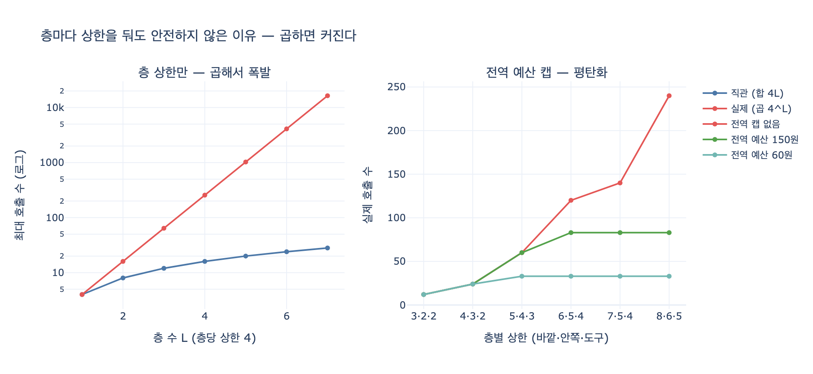

# 층마다 상한을 둬도 안전하지 않은 이유

> **Q.** 층마다 상한을 둬도 안전하지 않은 이유는 무엇인가?
>
> **A.** 곱하면 커진다. 전역 예산을 하나 더 두고 모든 층이 보게 해야 한다.

20장의 도입부가 이 카드의 전부입니다.

> 층마다 상한을 다 걸어 뒀는데 240번을 돌았습니다.

종료 조건이 *없어서* 터진 게 아닙니다. **세 개나 있었는데도** 터졌습니다.

---

## 1. 무슨 일이 일어나는가

에이전트 시스템은 대개 층이 겹칩니다. 바깥에 계획-실행 루프가 있고,
그 안에 생성-검증 루프가 있고, 그 안에 도구 호출 재시도가 있습니다.
각 층의 담당자는 자기 층에만 상한을 겁니다.

| 층 | 상한 | 그 층에서 본 근거 |
|---|---|---|
| 바깥 루프 | 5 | "다섯 번이면 충분하지" |
| 안쪽 루프 | 4 | "네 번 고치면 되겠지" |
| 도구 재시도 | 3 | "세 번은 재시도해야지" |

세 숫자 다 합리적입니다. 리뷰에서 아무도 토를 달지 않습니다.
그런데 최악의 총 모델 호출 수는 **5 + 4 + 3 = 12**가 아니라
**5 × 4 × 3 = 60**입니다.

층이 $L$개, 각 층의 상한이 $c_1, \dots, c_L$일 때

$$N_{\max} = \prod_{k=1}^{L} c_k$$

합이 아니라 **곱**입니다. 사람의 직관은 더하기로 굴러가는데
시스템은 곱하기로 자랍니다. 여기가 어긋나는 지점입니다.

## 2. 왜 리뷰로 안 잡히는가 — "곱하기를 아무도 안 한다"

`8 · 6 · 5`를 봅시다. 여덟 번, 여섯 번, 다섯 번.
각 층 코드를 따로 열어 보면 전부 온건합니다. 그런데 곱하면

- **240회 호출**
- 호출당 1.8원이면 **432원**

기준(5·4·3 = 60회) 대비 **4배**입니다.
층별 상한은 1.6배(합 12 → 19)밖에 안 늘렸는데요.

이게 20장 5절 제목이 「곱하기를 아무도 안 한다」인 이유입니다.
곱은 **어느 코드 파일에도 적혀 있지 않습니다.** 층 A의 리뷰어는 `8`을 보고,
층 B의 리뷰어는 `6`을 보고, 층 C의 리뷰어는 `5`를 봅니다.
`240`이라는 숫자는 시스템이 실제로 돌기 전까지 아무 데도 존재하지 않습니다.

> 제가 겪은 사고가 이거였다. 층마다 상한이 다 있었는데 전역이 없었다.
> 각 층 코드를 따로 리뷰하면 아무 문제가 없어 보인다. 곱하기를 아무도 안 했다.
> — `ex5_nested_loops.py`

곁들여, **완화의 비용이 비대칭**입니다.
"바깥을 5에서 6으로만 올리자"는 요청은 한 층에서 보면 +20%지만
전체로는 +20%가 아니라 곱의 +20%, 즉 안쪽 층들의 배수만큼 늘어납니다.
층이 깊을수록 표면적으로 작은 완화가 크게 번집니다.

## 3. 해법 — 전역 예산을 하나 더 둔다

층별 상한을 **없애라는 얘기가 아닙니다.** 필요합니다. 다만 충분하지 않습니다.
카운터를 하나 더 만들되, 조건이 있습니다.

### (1) 모든 층이 «같은» 카운터를 본다

카운터가 층마다 따로면 그건 층별 상한과 다를 게 없습니다.
바깥 루프도, 안쪽 루프도, 도구 재시도도 매 호출 직전에
**동일한 전역 예산 잔액**을 확인하고, 없으면 그 자리에서 빠져나옵니다.

```
if not budget.can_spend():
    break
budget.charge()
```

이 두 줄이 세 층 모두에 들어갑니다.

### (2) 전역 예산이 층 상한보다 «먼저» 걸리게 잡는다

$$\text{budget} \;<\; \Big(\prod_k c_k\Big) \times \text{단가}$$

이 부등식이 깨지면 전역 예산은 장식입니다. 층 상한이 먼저 걸리니까요.
`8·6·5`에 단가 1.8원이면 층 상한 곱의 비용은 432원.
예산을 500원으로 잡으면 아무것도 막지 못합니다.

먼저 걸리게 잡으면 역할이 이렇게 나뉩니다.

- **층 상한 = 안전망** (전역이 어쩌다 실패했을 때의 하한선)
- **전역 예산 = 실질 제어** (평소에 실제로 멈추는 건 이쪽)

### (3) 예산은 전역 변수가 아니라 «상태»에 둔다

20장 한 장 요약이 굳이 덧붙이는 문장입니다.

> 그리고 그 예산은 전역 변수가 아니라 *상태*에 둡니다. 안 그러면 재개할 때 리셋됩니다.

모듈 전역 변수에 누적 비용을 담아 두면, 워커가 죽었다 살아날 때마다
`0`으로 초기화됩니다. 예산 300원짜리 작업이 세 번 재개되면
실제로는 900원을 씁니다. 예산이 부활하는 거죠.
그래서 잔액은 체크포인트되는 상태(예: `StateGraph`의 `cost` 필드)에 얹혀 있어야 합니다.
다음 21장이 정확히 이 이야기(프로세스가 죽어도 작업은 살아 있어야 한다)로 이어집니다.

## 4. 예산만으로도 부족하다 — 네 조건 중 하나일 뿐

전역 예산은 «곱셈 폭발»을 잡는 장치지 만능 종료 조건이 아닙니다.
20장이 드는 종료 조건은 넷이고, 각각 다른 걸 잡습니다.

| 조건 | 잡는 상황 | 다른 셋이 못 잡는 이유 |
|---|---|---|
| 횟수 상한 | 회차가 계속 늘어남 | 층이 겹치면 **곱해져서** 무의미해짐 ← 이 카드 |
| 예산 상한 | 회차는 적은데 호출이 비쌈 | 횟수만 보면 못 잡음 |
| 시간 상한 | 회차·비용은 괜찮은데 느림 | 사용자가 기다리다 떠남 |
| 진전 없음 | 계속 도는데 나아지지 않음 | 상한만 있으면 안 될 일에 예산을 끝까지 씀 |

그리고 **끝난 이유를 상태에 남겨야** 합니다.
`상한`으로 끝난 것과 `정체`로 끝난 것은 대응이 다릅니다.
전자는 더 돌리면 될 수도 있고, 후자는 더 돌려도 안 됩니다.
불리언 하나로는 이 구분이 안 됩니다.

## 5. 한 줄 정리

> 층별 상한은 **덧셈처럼 읽히지만 곱셈으로 동작한다.**
> 그래서 층마다 걸어도 총량은 통제되지 않는다.
> 총량을 통제하려면 총량을 세는 카운터가 **하나** 있어야 하고,
> 그 카운터를 **모든 층이 보고**, 그 카운터가 **상태에 살아 있어야** 한다.

관련 예제: `code/ex5_nested_loops.py` (곱셈 폭발과 전역 예산),
`code/guards.py` (네 조건을 한곳에), `code/ex4_generator_critic.py` (네 조건을 다 붙인 루프).

## 시각화



왼쪽: 층당 상한을 4로 고정하고 층 수 $L$을 늘렸을 때, 직관(합 $4L$)과 실제(곱 $4^L$)의 간극 — 로그 축인데도 벌어집니다.
오른쪽: 층별 상한을 키워 갈 때 실제 호출 수. 전역 캡이 없으면 곡선이 치솟지만,
전역 예산을 씌우면 층 상한을 아무리 올려도 **평평해집니다.** 이게 "실질 제어"의 모습입니다.
