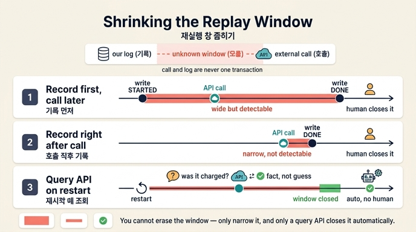

# 재실행 창을 좁히는 세 가지 방법

## 질문
재실행 창을 좁히는 세 가지 방법은 무엇인가?

## 답
기록을 먼저 하고 호출을 나중에 하기, 호출 직후 즉시 기록하기, 상대에게 조회 API가 있으면 재시작 때 물어보기다.

---

## 배경: 왜 「창」이 생기는가

체크포인트는 슈퍼스텝 경계에만 찍힌다. 경계와 프로세스가 죽은 시점 사이에 벌어진 일 — 특히 **외부 호출(결제, 발송 등)** — 은 재개할 때 다시 실행된다. 상대 API가 멱등 키를 지원하면 다시 해도 안전하지만, 지원하지 않으면 우리가 직접 **부수 효과 로그**(EffectLog)를 남겨야 한다.

그런데 여기에 근본적 한계가 있다. **외부 호출과 우리 기록은 같은 트랜잭션이 아니다.** 「호출은 됐는데 기록은 안 된」(또는 그 반대) 순간이 반드시 존재한다. 이 순간에 죽으면 재시작한 프로세스는 그 호출이 실제로 나갔는지 **모른다**. 이 「모름」의 시간 구간이 바로 **재실행 창**이다. 창을 0으로 만들 수는 없고, **좁힐 수만 있다**.

## 세 가지 방법 — 각각 어디서 창을 좁히는가

### 1. 기록을 먼저, 호출을 나중에 (write-ahead / intent log — ex3의 방식)

```
[기록: started] → 외부 호출 → [기록: done]
```

- **좁히는 지점**: 호출 「의도」를 호출 전에 영속화한다. `started`만 있고 `done`이 없는 레코드를 발견하면, 죽은 지점이 「호출 전인지 후인지 모르는」 상태임을 최소한 **탐지**할 수 있다.
- **남는 창**: `started` 기록 후 ~ `done` 기록 전 전체. 호출이 실제로 나갔는지는 여전히 모른다.
- **처리**: 자동 재시도하면 중복 결제 위험이 있으므로, 「사람이 확인」 상태로 분류해서 사람이 마감한다. 중복 결제보다 사람 한 번 부르는 게 싸다.

### 2. 호출 직후 즉시 기록

```
외부 호출 → (즉시) [기록: done]
```

- **좁히는 지점**: 호출과 기록 사이의 시간 간격을 최대한 줄인다. 다른 작업을 끼워 넣지 않고 호출 반환 즉시 기록한다.
- **남는 창**: 「호출 성공 ~ 기록 완료」 사이의 짧은 순간. 여기서 죽으면 기록에는 아무 흔적이 없어서 재개 시 **호출한 줄도 모르고 다시 호출**한다(탐지조차 안 됨). 창은 짧지만 성격은 더 위험할 수 있다.
- **핵심**: 창의 폭을 물리적으로 좁히는 접근이지, 없애는 접근이 아니다.

### 3. 상대에게 조회 API가 있으면 재시작 때 물어본다 (제일 확실하다)

```
재시작 → 상대에게 "order-8842 결제됐나?" 조회 → 됐으면 건너뜀 / 안 됐으면 실행
```

- **좁히는 지점**: 「모름」을 로컬 기록으로 추측하는 대신, **진실의 원천(상대 시스템)에 직접 물어서 사실로 바꾼다**. 창이 사실상 사라지는 것과 같은 효과다.
- **왜 이 방법만 사람 개입 없이 마감 가능한가**: 방법 1·2는 로컬 로그만 보고 판단하는데, 로그가 애매한 상태(`started`에서 멈춤, 또는 흔적 없음)면 실제 호출 여부를 **원리적으로 알 수 없어서** 사람이 상대 시스템(결제 대시보드 등)을 조회해 확인해야 한다. 방법 3은 그 「사람이 하던 조회」를 프로그램이 API로 대신하는 것이다. 모호함이 조회 결과라는 사실로 해소되므로 자동으로 마감할 수 있다.
- **전제**: 상대가 조회 API를 제공해야 한다. 그래서 통합 설계 초기에 「조회 API가 있는지 먼저 확인하시라」는 것.

## 정리 표

| 방법 | 창을 좁히는 방식 | 남는 창 | 마감 주체 |
|---|---|---|---|
| 1. 기록 먼저, 호출 나중 | 의도를 선기록해 애매 상태를 **탐지 가능**하게 | started~done 전체 | 사람 확인 |
| 2. 호출 직후 즉시 기록 | 호출-기록 사이 **시간 폭 축소** | 호출~기록의 짧은 순간 (탐지 불가) | 사람 확인 |
| 3. 재시작 때 조회 API | 추측 대신 **사실 조회**로 모름 해소 | 사실상 없음 | 자동 (사람 불필요) |

## 큰 그림에서의 위치

- 멱등 키를 상대가 지원하면 이 고민 자체가 필요 없다 (ex2). 지원 안 할 때의 차선책이 부수 효과 로그이고, 그 로그의 한계(창)를 다루는 게 이 세 방법이다.
- 우선순위: ① 멱등 키 가능한지 상대 문서 확인 → ② 안 되면 기록을 남기고 창을 좁힘 → ③ 그래도 애매하면 「사람 확인」으로 멈춤. 창은 없애려 하지 말고 **좁히고 넘기는** 것이 원칙이다.

## 인포그래픽


