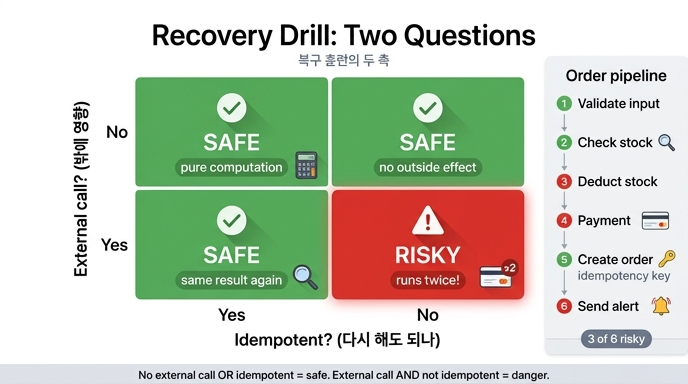

# ex5_recovery_drill.py의 판정 기준 두 가지

## 핵심 답

`ex5_recovery_drill.py`(21장, 복구 훈련 예제)는 파이프라인의 각 단계에 대해 **딱 두 가지 속성**만 묻는다.

```python
@dataclass
class Step:
    name: str
    external_call: bool     # 밖에 영향을 주는가
    idempotent: bool        # 다시 해도 되는가
```

1. **external_call — 밖에 영향을 주는가?**
   프로세스 바깥 세계(결제 API, 재고 DB, 메일 서버 등)에 부수효과를 남기는 단계인지.
2. **idempotent — 다시 해도 되는가?**
   같은 단계를 두 번 실행해도 결과가 한 번 실행한 것과 같은지(멱등성).

판정 로직은 이 둘의 조합으로 끝난다.

```python
if not s.external_call:
    verdict, note = "안전", "밖에 영향 없음"
elif s.idempotent:
    verdict, note = "안전", "다시 해도 같음"
else:
    verdict, note = "위험", "중복 실행됨"
```

즉, **외부 호출이 없거나(external_call=False), 있어도 멱등이면(idempotent=True) 안전**이고, **외부 호출이 있으면서 멱등이 아닌 경우만 위험**이다.

## 2×2 매트릭스로 보기

| | **idempotent = True** | **idempotent = False** |
|---|---|---|
| **external_call = False** | 안전 — 밖에 영향 없음 (순수 계산) | 안전 — 밖에 영향 없음. 멱등 여부는 판정에 쓰이지도 않는다 |
| **external_call = True** | 안전 — 다시 해도 같음 (조회, 멱등 키 있는 쓰기) | **위험 — 중복 실행됨** (재실행 시 이중 결제·이중 차감) |

포인트: 4칸 중 위험은 **오른쪽 아래 한 칸뿐**이다. 복구 설계란 결국 "이 칸에 들어가는 단계를 목록으로 갖고, 하나씩 빼내는 일"이다.

## ex5의 6단계 파이프라인을 매트릭스에 배치

```python
PIPELINE = [
    Step("입력 검증",   False, True),
    Step("재고 확인",   True,  True),      # 조회라 다시 해도 된다
    Step("재고 차감",   True,  False),     # 두 번 하면 재고가 두 번 준다
    Step("결제",        True,  False),     # 두 번 하면 두 번 결제
    Step("주문 생성",   True,  True),      # 멱등 키 있음
    Step("알림 발송",   True,  False),     # 두 번 하면 두 번 보낸다
]
```

| 단계 | external_call | idempotent | 판정 | 이유 |
|---|---|---|---|---|
| 1. 입력 검증 | False | True | 안전 | 순수 검사. 밖에 영향 없음 |
| 2. 재고 확인 | True | True | 안전 | 조회(read)라 몇 번을 해도 세상이 안 바뀜 |
| 3. 재고 차감 | True | **False** | **위험** | 재실행하면 재고가 두 번 줄어듦 |
| 4. 결제 | True | **False** | **위험** | 재실행하면 이중 결제 |
| 5. 주문 생성 | True | True | 안전 | 멱등 키가 있어 두 번 보내도 주문은 하나 |
| 6. 알림 발송 | True | **False** | **위험** | 재실행하면 알림이 두 번 발송됨 |

→ 6단계 중 **3개(재고 차감, 결제, 알림 발송)가 위험**. 이 표를 만드는 데 20분이면 되고, 예제의 말대로 "이게 복구 설계의 전부"다.

## 왜 이 두 축인가

체크포인트에서 재개한다는 것은 "죽은 단계부터 **다시 실행**한다"는 뜻이다. 그때 문제가 되는 건 정확히 두 경우의 교집합이다:

- 밖에 영향을 주지 않는 단계는 몇 번을 다시 해도 프로세스 안에서만 일어나는 일이라 무해하다.
- 밖에 영향을 주더라도 멱등이면(같은 요청을 두 번 보내도 결과가 하나면) 무해하다.
- 남는 것은 "밖에 영향을 주는데 멱등이 아닌" 단계 — 여기서만 중복 결제, 중복 차감, 중복 알림 같은 실제 사고가 난다.

이는 분산 시스템의 고전적 원칙과 같다: at-least-once 재시도(체크포인트 재개가 바로 이것) 아래에서 안전하려면 부수효과가 없거나 멱등해야 한다.

## 위험한 단계는 어떻게 처리하나 (예제의 처방)

위험 칸에 있는 단계는 순서대로 시도한다:

1. **멱등 키를 붙일 수 있나** — 상대 API 문서를 본다 (Stripe 등 결제 API의 idempotency key)
2. 없으면 **"했다는 기록"을 남긴다** (예제 3의 방식 — 실행 전 원장에 기록)
3. 그것도 안 되면 **"사람 확인" 상태로 두고 멈춘다**

그리고 이 표는 문서가 아니라 **테스트로** 유지하라 — "새 단계를 추가하면 이 표를 갱신하라"는 검사를 CI에 넣는 것까지가 예제의 결론이다.

## 한 줄 요약

> 죽었다 재개될 때 각 단계에 물을 질문은 둘뿐이다: **밖에 영향을 주는가(external_call), 다시 해도 되는가(idempotent).** 외부 호출이 없거나 멱등이면 안전, 둘 다 아니면(외부 호출 있음 + 비멱등) 위험이다.

## 인포그래픽


