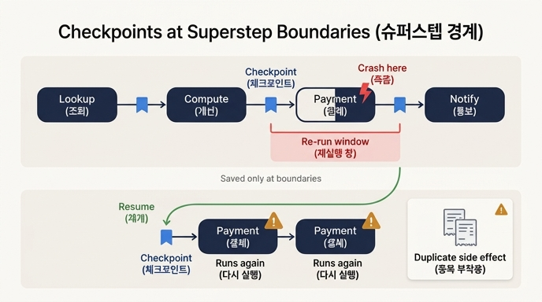

# 체크포인트는 어디에 찍히며 그 결과 어떤 문제가 남는가?

**답: 슈퍼스텝 경계에만 찍힌다. 경계와 죽은 시점 사이에 벌어진 일은 재개할 때 다시 한다.**

## 체크포인트가 찍히는 위치

LangGraph의 체크포인터(checkpointer)는 그래프 실행을 **슈퍼스텝(superstep) 단위**로 저장합니다. 슈퍼스텝은 노드 하나(또는 병렬 노드 묶음)가 실행을 마치는 지점이고, 체크포인트는 바로 이 **경계**에서만 기록됩니다. 노드 *실행 도중*의 중간 상태는 어디에도 저장되지 않습니다.

```
[조회] ──ckpt──> [계산] ──ckpt──> [결제] ──ckpt──> [통보]
                              ↑
                        여기서 죽으면?
```

예를 들어 `조회 → 계산 → 결제 → 통보` 파이프라인에서 **결제 노드 실행 중** 프로세스가 죽으면:

- 마지막 체크포인트는 「계산 완료」 시점의 것
- 재개하면 **결제 노드를 처음부터 다시 실행**한다
- 결제 노드가 죽기 직전까지 이미 해 둔 일(예: 외부 API 호출)은 체크포인트에 없다

## 남는 문제 — 재실행 창(re-execution window)

마지막 체크포인트 경계와 실제로 죽은 시점 사이의 구간이 **재실행 창**입니다. 이 창 안에서 이미 벌어진 일은 재개 시 **한 번 더** 일어납니다.

- 조회처럼 멱등한 작업이면 다시 해도 무해
- 결제·재고 차감·알림 발송처럼 **부작용이 있는 작업이면 중복 실행** — 두 번 결제, 두 번 발송

이것이 21장 전체의 출발점입니다. 책의 표현으로는:

> 상태를 저장하는 것만으로는 안 끝나요. 저장한 지점과 죽은 지점 사이에 *이미 벌어진 일*이 있거든요.

## 창을 좁힐 수는 있어도 없앨 수는 없다

- **노드를 잘게 쪼개면** 창이 좁아진다. 하지만 0이 되지는 않고, 체크포인트 횟수가 늘어 느려진다. 실측으로 SQLite 체크포인터는 메모리 대비 2.0~2.8배, 상태가 32KB를 넘으면 4.8배까지 느려진다 (ex4).
- 창은 구조적으로 사라지지 않는다 — 외부 호출과 우리의 기록은 **같은 트랜잭션이 아니기** 때문.

## 그래서 해법은 "다시 해도 되게" 만드는 것

창을 없애려 하지 말고, 재실행이 무해하도록 만드는 것이 이 장의 흐름입니다.

1. **멱등성(idempotency)**: 멱등 키를 작업 단위(예: `order-8842`)에서 만들어 붙인다. 단, 상대 API가 실제로 그 키를 보는지 문서와 실험으로 확인해야 한다 (ex2).
2. **부작용 로그**: 상대가 멱등을 지원하지 않으면 실행 *전*에 「시작」을 적고 끝나면 「완료」를 채운다. 「시작」에서 멈춘 건은 자동 재시도하지 않고 사람이 확인한다 (ex3).
3. **복구 훈련**: 각 단계에서 죽었다고 가정하고 재개 시 무슨 일이 생기는지 표로 만든 뒤, 실제로 `kill -9`로 죽여서 확인한다 (ex5, run_crash_demo.sh).

## 요약 표

| 구분 | 내용 |
|---|---|
| 찍히는 위치 | 슈퍼스텝(노드) 경계에만 |
| 저장 안 되는 것 | 노드 실행 도중의 진행 상황 |
| 남는 문제 | 경계~죽은 시점 사이의 일이 재개 시 중복 실행됨 |
| 창을 좁히는 법 | 노드 세분화 (단, 체크포인트 비용 증가) |
| 창을 무해하게 하는 법 | 멱등 키 → 부작용 로그 → 사람 확인 순으로 |

## 인포그래픽


