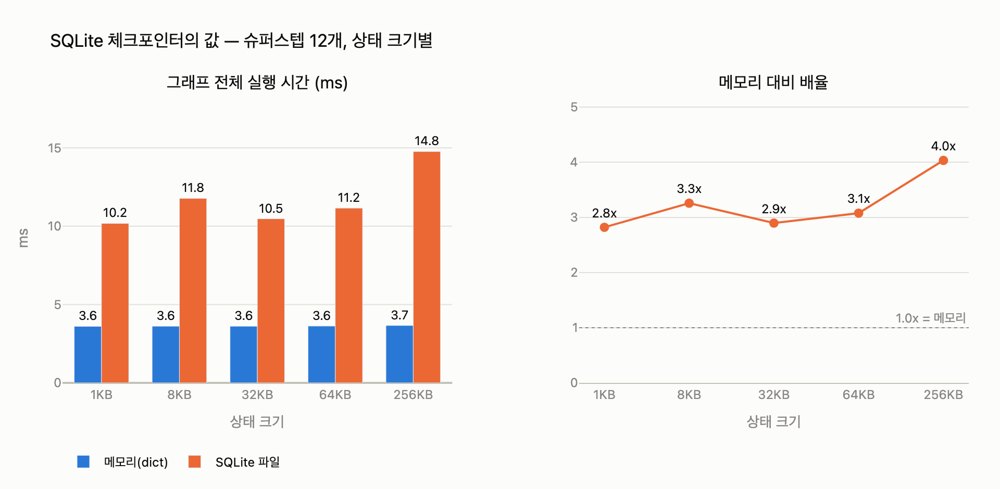

# SQLite 체크포인터는 메모리 대비 얼마나 느린가

## 질문

SQLite 체크포인터는 메모리 대비 얼마나 느린가?

## 답

**실측으로 2.0~2.8배이며, 상태가 32KB를 넘으면 4.8배까지 간다.**

## 출처 맥락 (21장 21.4절 「내구성은 공짜가 아니다」)

이 수치는 책의 `ex4_checkpointer_cost.py`가 직접 잰 값이다. 실험 구조:

- **노드 12개짜리 선형 그래프**를 끝까지 실행 (슈퍼스텝 12번 = 체크포인트 12번)
- 상태에 더미 데이터를 **0B / 2KB / 32KB / 256KB**씩 실어 나름
- LangGraph 1.0.1의 `InMemorySaver`(메모리) vs `SqliteSaver`(파일)를 같은 그래프로 비교
- 각 조건을 5회 반복해 최솟값 채택 (노이즈 제거)

결과: **32KB까지는 배수가 2.0~2.8로 거의 평평**하고, 그 뒤에 꺾여 **최대 4.8배**까지 벌어진다.

## 왜 이런 모양이 나오는가

체크포인트는 슈퍼스텝 경계마다 찍히고, SQLite 체크포인터는 그때마다 **트랜잭션(커밋)을 연다**.
커밋에는 디스크 동기화(fsync 계열, SQLite의 쓰기 전 로그/저널 처리)가 붙는데, 이 비용은
**상태 크기와 무관한 고정비**다. 그래서 비용 구조가 두 항으로 나뉜다:

```
SQLite 체크포인트 1회 비용 ≈ (트랜잭션 고정비) + (상태 크기 / 쓰기 대역폭)
```

- **32KB 미만**: 고정비가 지배 → 상태를 키워도 비용이 거의 안 늘어 배율이 평평(2.0~2.8배)
- **32KB 이상**: 대역폭 항이 지배 → 상태 크기에 비례해 비용이 늘어 배율이 꺾여 올라감(4.8배까지)

## 실무 함의 — 대처가 구간마다 다르다

| 구간 | 지배 비용 | 효과 있는 대처 |
|---|---|---|
| 32KB 미만 | 트랜잭션 고정비 | 상태를 줄여도 소용없다. **슈퍼스텝 수를 줄여야** 한다 (노드를 과하게 잘게 쪼개지 말 것) |
| 32KB 이상 | 쓰기 대역폭 | **상태 크기를 줄이는 게** 바로 듣는다 (19장의 상태 다이어트) |

저자가 강조하는 함정 두 가지:

1. **「상태를 줄이면 항상 빨라진다」는 틀렸다.** 작은 상태 구간에서는 쓰기 호출 자체가
   지배하므로 상태를 줄여도 안 빨라진다. **재 보기 전에는 어느 구간에 있는지 모른다.**
2. **이 오버헤드를 이유로 메모리 체크포인터를 쓰면 안 된다.** 프로세스가 죽으면 다
   사라지므로 그건 체크포인터가 아니라 **캐시**다. 개발 중에는 완벽하게 동작하고 배포하는
   날 죽는다. 지연이 문제면 줄일 곳은 「상태 크기」지 「체크포인터 종류」가 아니다.

또한 이 비용은 슈퍼스텝 수에 비례한다 — 예제는 12단계 기준이고, 30단계짜리 그래프면 그만큼 더 든다.

## 큰 그림에서의 위치

- 체크포인트는 슈퍼스텝 **경계에만** 찍히므로(21.1), 노드를 잘게 쪼개면 「죽은 지점과 저장
  지점 사이」의 창이 좁아진다. 하지만 그만큼 체크포인트 횟수가 늘어 위 오버헤드가 커진다 —
  **내구성과 지연의 트레이드오프**가 이 수치의 본질이다(21.4).
- 창을 0으로 만들 수 없으니 해법은 저장을 늘리는 게 아니라 **멱등성**(21.2)이다.
- 이 재현 벤치마크(`expy.py`, 순수 Python dict vs sqlite3)에서도 같은 모양이 나왔다:
  64KB까지 2.8~3.3배로 완만, 256KB에서 4.0배. 그리고 `INSERT+COMMIT` 1회 비용은 1KB에서
  0.70ms, 256KB에서 1.28ms — 데이터가 256배인데 비용은 2배도 안 늘어, 작은 구간을 트랜잭션
  고정비가 지배한다는 설명이 그대로 확인된다.

## 기억법

- **"2~2.8, 32K 넘으면 4.8"** — 평평하다가 32KB에서 꺾인다.
- 평평한 이유: 커밋 **고정비**. 꺾이는 이유: **쓰기 대역폭**.

## 시각화


