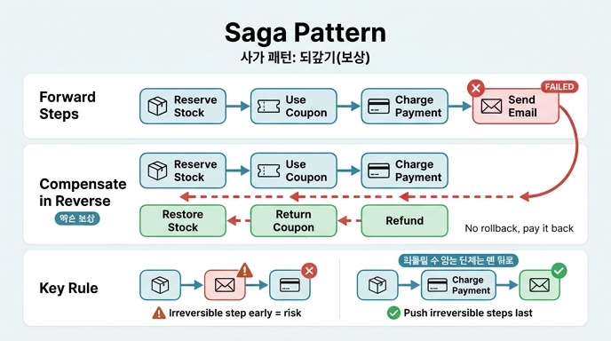

# 밖으로 나간 일을 되돌리는 방법 — 사가(saga) 패턴

## 질문
밖으로 나간 일을 되돌리는 방법은 무엇인가?

## 답
롤백이 안 되므로 되갚는 동작(보상)을 짝지어 두고 역순으로 실행한다. 사가(saga) 패턴이다.

---

## 왜 롤백이 안 되나

DB 트랜잭션 안의 일은 `ROLLBACK` 한 줄이면 없던 일이 됩니다. 그런데 우리 시스템 **밖으로 나간 일**은 다릅니다.

- 외부 결제 API로 돈이 빠져나갔다
- 다른 서비스의 재고가 차감됐다
- 확정 메일이 이미 발송됐다

이런 일에는 되돌리기 버튼이 없습니다. 결제사 DB를 우리가 롤백할 수 없고, 보낸 메일은 회수할 수 없습니다. 분산 시스템에서 여러 서비스에 걸친 작업은 하나의 트랜잭션으로 묶이지 않는다는 뜻입니다.

## 해법: 되갚는 동작(보상 트랜잭션)을 짝지어 둔다

되돌릴 수 없다면, **반대 효과를 내는 새 동작**을 실행해서 되갚습니다. 이것이 보상 트랜잭션(compensating transaction)입니다.

| 정방향 동작 | 되갚는 동작 (보상) |
|---|---|
| 재고 차감 | 재고 복구 |
| 쿠폰 사용 | 쿠폰 반환 |
| 결제 | 환불 |
| 확정 메일 발송 | **없음** (회수 불가) |

핵심은 "취소"가 아니라 "상쇄"라는 점입니다. 결제 기록을 지우는 게 아니라 환불이라는 **새로운 기록**을 추가해서 순효과를 0으로 만듭니다.

## 사가 패턴: 실패하면 역순으로 되갚는다

사가(saga)는 1987년 Garcia-Molina와 Salem의 논문에서 나온 개념으로, 긴 트랜잭션을 짧은 로컬 트랜잭션의 연쇄로 쪼개고 각 단계에 보상 동작을 짝지어 두는 패턴입니다.

동작 방식:

1. 단계를 순서대로 실행한다: `T1 → T2 → T3 → T4`
2. 각 단계마다 보상 동작 `C1, C2, C3, C4`를 미리 정의해 둔다
3. `T4`에서 실패하면, **완료된 단계만 역순으로** 되갚는다: `C3 → C2 → C1`

역순인 이유: 단계 사이에 의존이 있을 수 있기 때문입니다. 나중 단계가 앞 단계의 결과 위에 쌓였으므로, 쌓은 순서의 반대로 걷어내야 안전합니다.

```
정방향:  재고 차감 → 쿠폰 사용 → 결제 → 확정 메일(실패!)
되갚기:  환불 ← 쿠폰 반환 ← 재고 복구      (역순 실행)
```

## 되돌릴 수 없는 단계는 최대한 뒤로 민다

이 장(ex3_saga.py)의 핵심 규칙입니다. 확정 메일처럼 보상 동작이 아예 없는 단계는 **맨 뒤에** 둡니다.

- 메일을 두 번째에 보내면: 뒤 단계(결제)가 실패했을 때 이미 나간 메일을 회수할 수 없다. 취소된 주문인데 "주문 확정" 메일을 받은 손님이 생긴다.
- 메일을 마지막에 보내면: 앞 단계가 전부 성공한 뒤에만 실행되므로, 되갚을 일 자체가 안 생긴다.

같은 코드, 같은 실패 지점이어도 **단계 순서만 바꾸면** 위험이 사라집니다. 리팩터링이 아니라 리스트 한 줄 순서 바꾸기입니다.

## 되갚기가 실패하면 (연결 개념)

보상 동작(예: 환불 API 호출)도 외부 호출이라 실패할 수 있습니다. 그때는:

- 상한까지 재시도하고, 그래도 안 되면 **되갚기 대기열(데드레터 큐)**에 적어 둔다
- 대기열은 우리 DB 안의 일이라 거기서 멈춘다 — 무한히 안 내려간다
- 되갚기는 "지금 성공해야 하는 일"이 아니라 "언젠가 반드시 성공해야 하는 일"이다
- 재실행을 위해 멱등 키를 반드시 넣고, 큐를 누가 보는지 정해 둔다

## 정리

| 상황 | 수단 |
|---|---|
| 우리 DB 안의 일 | 트랜잭션 롤백 |
| 밖으로 나간 일 | 보상 동작을 짝지어 두고 **역순 실행** (사가) |
| 보상조차 불가능한 일 | 최대한 뒤로 밀어서 되갚을 일 자체를 없앤다 |
| 보상이 실패하는 일 | 대기열에 적고 나중에 반드시 완수한다 |

## 1차 출처

- 사가 패턴: [Sagas (Garcia-Molina & Salem, 1987)](https://www.cs.cornell.edu/andru/cs711/2002fa/reading/sagas.pdf)
- 보상 트랜잭션: [Compensating Transaction pattern (Microsoft Azure)](https://learn.microsoft.com/en-us/azure/architecture/patterns/compensating-transaction)

## 인포그래픽


