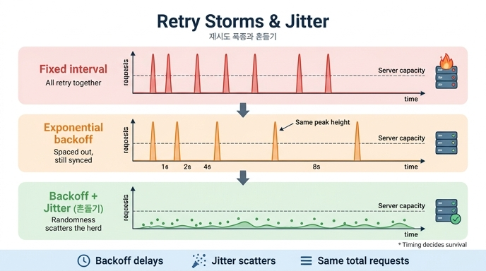

# 재시도가 장애를 키우는 이유와 흔들기(jitter)

## 질문
재시도가 장애를 키우는 이유는 무엇이며 무엇으로 푸는가?

## 답
여럿이 동시에 재시도하면 봉우리가 생긴다. 지수 백오프만으로는 봉우리가 낮아지지 않고, '다 같이'를 흩는 것은 흔들기(jitter)다.

---

## 왜 재시도가 장애를 키우는가

재시도 자체는 좋은 도구입니다. 문제는 **장애가 여럿에게 동시에 일어난다**는 데 있습니다.

서버가 잠깐 죽으면, 그 서버를 쓰던 클라이언트 수백 개가 **같은 순간에** 실패를 겪습니다. 그리고 각자 "잠시 후 다시 시도"를 합니다. 각자의 재시도 로직이 똑같으니, 재시도도 **같은 순간에** 다시 몰려옵니다. 이게 부하의 **봉우리(peak)** 입니다.

- 서버는 이미 아픈 상태인데, 평소의 수십 배 요청이 한꺼번에 때립니다.
- 서버가 겨우 살아나려는 순간마다 봉우리가 다시 덮쳐서, 3분짜리 장애가 40분짜리 복구로 늘어납니다.
- 이 현상을 **재시도 폭풍(retry storm)** 이라고 부릅니다. (Google SRE Book의 과부하 처리 장에서 다루는 고전적 실패 모드)

## 지수 백오프만으로는 왜 부족한가

지수 백오프(exponential backoff)는 재시도 간격을 1, 2, 4, 8, 16초처럼 두 배씩 늘리는 전략입니다. 재시도 **총량**을 줄이고 간격을 벌리는 데는 효과적입니다.

그러나 함정이 있습니다. 200개 클라이언트가 동시에 실패했다면:

- 고정 간격: 200개가 **다 같이** 1초 뒤, 2초 뒤에 옵니다.
- 지수 백오프: 200개가 **다 같이** 1초 뒤, 3초 뒤(1+2), 7초 뒤(1+2+4)에 옵니다.

간격만 벌어졌을 뿐 **「다 같이」는 그대로**입니다. 봉우리 사이가 멀어질 뿐, 봉우리의 높이는 낮아지지 않습니다. 결정적(deterministic) 계산식이라 모두가 같은 답을 얻기 때문입니다.

## 흔들기(jitter)가 푸는 방법

흔들기는 대기 시간을 계산값 그대로 쓰지 않고 **0 ~ 계산값 사이에서 무작위로** 뽑는 것입니다(이른바 full jitter, AWS Builders' Library 권장 방식).

```python
def schedule_jitter(rng):
    """지수 백오프 + 흔들기 — 0~대기시간 사이 무작위."""
    t, out = 0.0, []
    for i in range(MAX_TRIES):
        t += rng.uniform(0, min(BASE * (2 ** i), CAP))
        out.append(t)
    return out
```

무작위성이 각 클라이언트의 재시도 시각을 흩어 놓으니, 같은 순간에 몰리던 200건이 시간축 위에 고르게 퍼집니다. **코드 한 줄인데 봉우리가 사라집니다.**

책의 예제(`ex1_backoff.py`, 클라이언트 200개, 서버는 0.25초 구간당 10건 수용)가 보여주는 핵심:

| 전략 | 봉우리 | 특징 |
|---|---|---|
| 고정 간격 | 200건이 같은 구간에 몰림 | 아픈 서버에 20배 부하 |
| 지수 백오프 | 여전히 다 같이 몰림 | 간격만 벌어지고 봉우리 높이는 그대로 |
| 지수 백오프 + 흔들기 | 봉우리 소멸 | 요청이 시간축에 흩어짐 |

**총 요청 수는 세 전략 모두 1000건으로 같습니다.** 다른 것은 오직 「언제」 오느냐뿐인데, 그것만으로 서버가 죽고 삽니다.

## 핵심 통찰: 흔들기는 늦추는 장치가 아니라 흩는 장치

흔들기를 쓰면 첫 재시도가 오히려 **더 빨리** 오기도 합니다. 0~1초 사이에서 뽑으니 평균 0.5초로, 고정 간격 1초보다 이릅니다. 즉:

- 백오프 = 재시도를 **늦추는** 장치 (총량과 빈도 조절)
- 흔들기 = 재시도를 **흩는** 장치 (동시성 파괴)

둘은 역할이 다르며, 재시도 폭풍의 원인인 「다 같이」를 깨는 것은 흔들기 쪽입니다. 그래서 실무 표준은 **지수 백오프 + 흔들기**의 조합입니다.

## 기억 포인트

1. 장애는 동시에 오고, 재시도도 동시에 온다 → 봉우리(재시도 폭풍).
2. 지수 백오프는 간격만 벌린다. 「다 같이」는 결정적 계산식이라 그대로 남는다.
3. 흔들기(무작위 대기)가 동시성을 흩어 봉우리를 없앤다. 늦추는 게 아니라 **흩는** 것이다.

## 출처

- [Timeouts, retries, and backoff with jitter — AWS Builders' Library](https://aws.amazon.com/builders-library/timeouts-retries-and-backoff-with-jitter/)
- [Handling Overload — Google SRE Book](https://sre.google/sre-book/handling-overload/)

## 인포그래픽


