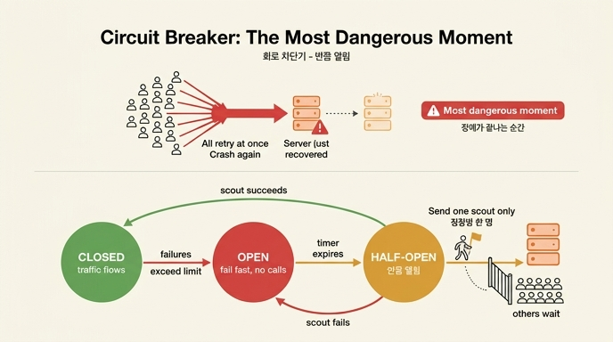

# 장애 상황에서 가장 위험한 순간은 언제이며 어떻게 대비하는가?

**답: 장애가 끝나는 순간이다. 회로 차단기(circuit breaker)의 「반쯤 열림(half-open)」 상태에서 정찰병을 한 명만 보내야 한다.**

## 왜 「장애가 끝나는 순간」이 제일 위험한가

직관적으로는 장애가 한창일 때가 제일 위험해 보입니다. 그런데 실제로 서버를 두 번 죽이는 건 **회복 직후**인 경우가 많습니다.

- 장애 동안 실패한 요청들은 사라지지 않습니다. 클라이언트마다 재시도 타이머를 걸고 **대기**하고 있습니다.
- 서버가 겨우 살아나는 순간, 기다리던 클라이언트들이 **다 같이** "살아났나?" 하고 두드립니다.
- 막 일어난 서버는 캐시도 비어 있고 커넥션 풀도 차가운, 평소보다 **약한 상태**입니다. 거기에 평소보다 **큰 부하**(밀린 요청 + 신규 요청)가 꽂힙니다.
- 결과: 서버가 다시 쓰러지고, 장애가 연장됩니다. 이 장 서두의 "장애는 3분이었습니다. 복구에는 40분이 걸렸어요"가 바로 이 패턴입니다. 재시도 폭풍(retry storm)이 회복을 계속 짓밟는 것이죠.

즉 문제의 본질은 **"다 같이"** 입니다. 22.1절의 흔들기(jitter)가 재시도 시점의 "다 같이"를 흩는 장치라면, 회로 차단기의 half-open은 **회복 확인의 "다 같이"를 한 명으로 줄이는** 장치입니다.

## 회로 차단기(Circuit Breaker) 패턴

마틴 파울러가 정리한 [사실상 표준] 패턴입니다(출처: [martinfowler.com/bliki/CircuitBreaker.html](https://martinfowler.com/bliki/CircuitBreaker.html)). 전기 배선의 두꺼비집에서 이름을 따왔습니다. 과부하가 걸리면 회로를 끊어 집이 타는 걸 막듯이, 원격 호출을 차단기로 감싸서 장애가 번지는 걸 막습니다.

### 세 가지 상태

| 상태 | 의미 | 동작 |
|---|---|---|
| **닫힘 (Closed)** | 정상. 전기가 흐르듯 요청이 흐른다 | 요청을 그대로 통과시키며 실패를 센다. 실패율/연속 실패가 임계치를 넘으면 → **Open** |
| **열림 (Open)** | 장애 확정. 회로가 끊겼다 | 요청을 **호출 없이 즉시 실패**시킨다(fail fast). 죽은 서버를 두드리지 않고, 호출자도 타임아웃까지 기다리지 않는다. 타이머가 만료되면 → **Half-Open** |
| **반쯤 열림 (Half-Open)** | 회복 확인 중. 가장 민감한 구간 | **시험 요청을 딱 하나만**(정찰병) 통과시킨다. 성공 → **Closed** 복귀. 실패 → 다시 **Open**, 타이머 리셋 |

주의: 전기 차단기와 반대로, 소프트웨어 회로 차단기는 **닫힘이 정상**(전류가 흐름), **열림이 차단**입니다.

### 상태 전이 요약

```
            실패 임계치 초과
  Closed ──────────────────▶ Open
    ▲                          │
    │ 정찰 성공                 │ 대기 타이머 만료
    │                          ▼
    └────────────────── Half-Open
             ▲                 │
             └── 정찰 실패 ──────┘  (Open 으로 복귀, 타이머 리셋)
```

## 「정찰병 한 명」이 핵심인 이유

Half-open 상태 설계에서 갈리는 지점이 바로 이겁니다.

- **전군을 보내면**: 타이머가 만료되자마자 밀린 요청을 전부 통과시키면, 겨우 일어나는 서버에 폭탄을 던지는 것과 같습니다. 서버가 다시 쓰러지고, 차단기는 다시 열리고, 이 사이클이 반복됩니다. 회복이 영영 안 됩니다.
- **정찰병 한 명만 보내면**: 시험 요청 하나로 "살아났는지"를 확인합니다.
  - 정찰병이 실패해도 → 잃는 건 요청 하나. 나머지는 여전히 즉시 실패로 보호받고, 서버도 추가 부하 없이 회복을 계속합니다.
  - 정찰병이 성공하면 → 그때 비로소 문을 열어(Closed) 본대를 보냅니다.

한 문장으로: **회복 확인 비용을 요청 1건으로 상한**을 거는 것입니다. 구현에 따라 half-open 동안 동시 시험 요청 수를 소수(예: 1~3)로 제한하기도 하지만, 원리는 같습니다 — "다 같이 확인"을 금지한다.

## 이 장의 다른 개념과의 연결

- **흔들기(jitter, 22.1)**: 재시도의 "다 같이"를 시간축으로 흩는다. 회로 차단기는 회복 확인의 "다 같이"를 개수로 줄인다. 둘 다 표적은 동기화된 무리 행동(thundering herd)이다.
- **타임아웃 예산(22.2)**: Open 상태의 즉시 실패는 타임아웃 예산을 아껴 준다. 죽은 의존성에 10초를 태우는 대신 0초에 실패를 받고, 남은 예산을 폴백이나 다음 단계에 쓸 수 있다.
- **Retry-After**: 서버가 "언제 다시 와라"를 알려 주는 표준 헤더(RFC 9110). 차단기의 대기 타이머를 정하는 힌트로 쓸 수 있다.

## 기억 포인트

1. 가장 위험한 순간 = **장애가 끝나는 순간** (밀린 재시도가 약해진 서버에 동시 도착).
2. 대비책 = 회로 차단기의 **half-open**: 대기 타이머가 끝나면 전부 보내지 말고 **정찰병 한 명만** 보낸다.
3. 성공하면 Closed로 복귀, 실패하면 Open으로 되돌아가 다시 기다린다 — 회복 확인의 비용을 요청 1건으로 묶는다.

## 인포그래픽


