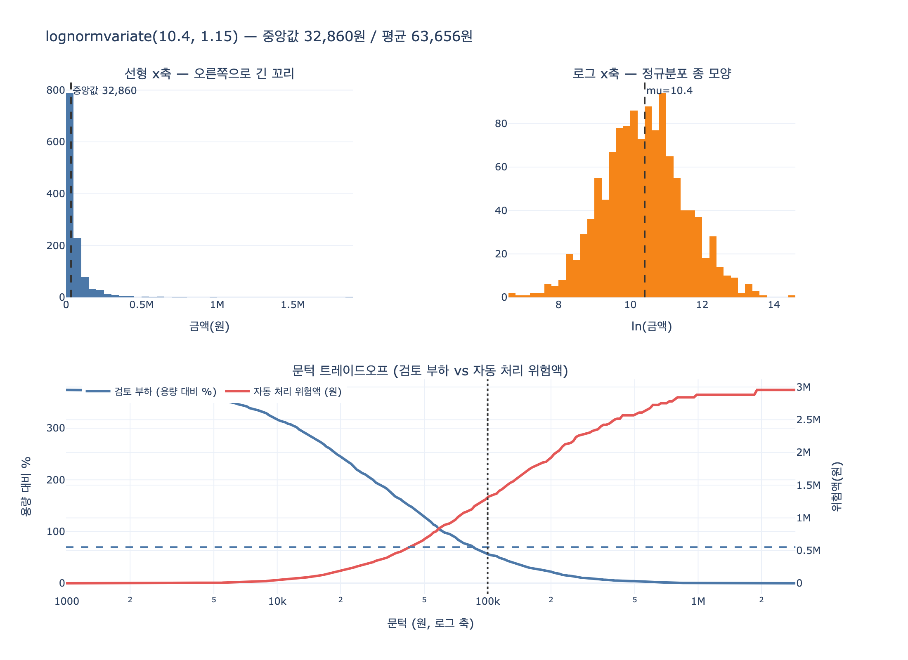

# `ex3_gate_policy.py`의 요청 금액 분포 모델링

## 질문과 답

**Q.** `ex3_gate_policy.py`는 요청 금액 분포를 어떻게 모델링하는가?

**A.** 로그정규분포(`lognormvariate(10.4, 1.15)`)로 소액이 많고 고액이 드문 현실적 분포를 만든다.

## 코드에서의 위치

```python
def day(seed=7, n=1200):
    """하루치 환불 요청. 금액은 소액이 많고 고액이 드물다."""
    rng = random.Random(seed)
    return [int(rng.lognormvariate(10.4, 1.15)) for _ in range(n)]
```

`random.Random(seed)`로 난수 생성기를 고정해 **누가 돌려도 같은 표를 보게** 만들고,
`lognormvariate(mu, sigma)`로 하루치 환불 요청 1,200건의 금액을 뽑는다.

여기서 중요한 것은 **왜 균등분포나 정규분포가 아니라 로그정규분포인가**다.
23.3절의 주장 — "문턱은 취향이 아니라 용량으로 정한다" — 은 분포의 꼬리 모양에
전적으로 의존한다. 분포가 틀리면 문턱별 건수 표가 통째로 거짓말이 된다.

## 왜 로그정규분포인가

### 1. 금액은 음수가 될 수 없다

정규분포는 실수 전체에 퍼져 있어서 표본의 일부가 음수로 나온다.
"−32,000원짜리 환불 요청"은 의미가 없다. 로그정규분포는 정의역이 $(0, \infty)$라
이 문제가 원천적으로 없다.

### 2. 곱셈적 효과의 중심극한정리

이게 핵심 근거다. 중심극한정리는 보통 이렇게 배운다.

> 독립인 확률변수를 **더하면**, 그 합은 정규분포에 가까워진다.

$$X_1 + X_2 + \cdots + X_n \;\longrightarrow\; \mathcal{N}(\mu, \sigma^2)$$

그런데 현실의 금액은 더해져서 만들어지지 않는다. **곱해져서** 만들어진다.

- 상품 단가 × 수량 × 옵션 배수 × 환율 × 할인율 × 세율 …
- 소득: 기본급 × 직급 배수 × 연차 배수 × 업종 배수 …

각 요인이 "몇 % 더/덜"이라는 **비율**로 작용하는 구조다.
곱셈에 로그를 씌우면 덧셈이 된다.

$$\log(Y_1 Y_2 \cdots Y_n) = \log Y_1 + \log Y_2 + \cdots + \log Y_n$$

우변은 독립 확률변수의 합이므로 중심극한정리에 의해 정규분포에 가까워진다.
즉 $\log X \sim \mathcal{N}(\mu, \sigma^2)$이고, 이때 $X$의 분포를
**로그정규분포**라 부른다.

그래서 금액·소득·도시 인구·파일 크기·대기시간·수명 같이
**양수이면서 오른쪽으로 긴 꼬리를 가진** 데이터는 로그정규분포가 자연스러운 1차 모형이다.
"덧셈적 잡음 → 정규분포"의 곱셈판이라고 보면 된다.

### 3. 문턱 정책 시뮬레이션에 필요한 성질

승인 관문(approval gate) 정책의 실전 질문은 이거다.

> 문턱을 10만 원에 두면 하루 1,200건 중 몇 건이 사람에게 가는가?

이 답은 **분포의 상단 꼬리 두께**로 결정된다.
균등분포를 쓰면 "10만 원 이상"이 지나치게 많이 나오고,
정규분포를 쓰면 꼬리가 너무 빨리 죽어서 "고액 소수 건" 현상이 사라진다.
로그정규분포는 **건수는 소액에 몰리고 금액 합은 고액이 좌우하는**
현실의 비대칭을 재현한다. 그래서 표에서
"사람이 볼 건수는 15%인데 자동 처리 위험액은 절반이 넘는다" 같은
직관에 반하는(그러나 현실적인) 결과가 나온다.

## $\mu = 10.4$, $\sigma = 1.15$는 어떤 금액인가

$X = e^{Z}$, $Z \sim \mathcal{N}(10.4,\, 1.15^2)$일 때의 대표값들이다.

| 통계량 | 공식 | 값 |
|---|---|---|
| 최빈값 (mode) | $e^{\mu - \sigma^2}$ | 약 **8,756원** |
| 중앙값 (median) | $e^{\mu}$ | 약 **32,860원** |
| 평균 (mean) | $e^{\mu + \sigma^2/2}$ | 약 **63,656원** |
| 표준편차 | $e^{\mu+\sigma^2/2}\sqrt{e^{\sigma^2}-1}$ | 약 **105,600원** |

**최빈값 < 중앙값 < 평균** 순서가 오른쪽 꼬리(우편향) 분포의 지문이다.
평균이 중앙값의 약 2배라는 점이 특히 중요하다.
"평균 환불 금액 6.4만 원"이라는 요약 통계만 보고 문턱을 정하면
실제 건수 분포를 크게 오해하게 된다.

### 분위수

$p$ 분위수는 $e^{\mu + \sigma z_p}$로 바로 계산된다 ($z_p$는 표준정규 분위수).

| 분위수 | $z_p$ | 금액 |
|---|---|---|
| 1% | −2.326 | 약 2,270원 |
| 10% | −1.282 | 약 7,510원 |
| 25% | −0.674 | 약 15,120원 |
| 50% | 0 | 약 32,860원 |
| 75% | +0.674 | 약 71,430원 |
| 90% | +1.282 | 약 143,700원 |
| 99% | +2.326 | 약 476,000원 |

1%와 99% 사이가 **200배 이상** 벌어진다. 이 폭이 바로
"문턱을 어디에 둘 것인가"가 의미 있는 질문이 되는 이유다.

### 문턱별 초과 비율 (생존함수)

$P(X \ge t) = 1 - \Phi\!\left(\dfrac{\ln t - \mu}{\sigma}\right)$

| 문턱 | 이론 초과 비율 | 1,200건 기준 기대 건수 | 실제 표본(seed=7) |
|---|---|---|---|
| 50,000원 | 35.8% | 429건 | 412건 |
| 100,000원 | 16.7% | 200건 | 183건 |
| 300,000원 | 2.72% | 33건 | 32건 |
| 1,000,000원 | 0.149% | 1.8건 | 1건 |

`ex3_gate_policy.py`가 출력하는 표와 정확히 맞물린다.
검토 용량은 담당자 2명 × 480분 ÷ 3분 = **320건/일**.

- 전부 사람: 1,200건 → 3,600분, 용량의 **375%**. 붕괴.
- 5만 원 문턱: 412건 → 1,236분, 용량의 **129%**. 여전히 초과.
- 10만 원 문턱: 183건 → 549분, 용량의 **57%**. 70% 기준을 만족하는 가장 낮은 문턱.

즉 파라미터 $(\mu, \sigma) = (10.4, 1.15)$는
"10만 원 문턱이 답으로 떨어지도록" 설계된 값이다.
중앙값 3.3만 원짜리 환불 업무에서 상위 15% 정도만 사람이 보는 정책 —
현실의 커머스 환불 데스크와 크게 다르지 않은 그림이다.

## 정리

- 요청 금액은 `random.Random(seed).lognormvariate(10.4, 1.15)`로 생성된다.
- 로그정규분포를 쓰는 이유: 금액은 양수이고, 여러 요인이 **곱셈적**으로 작용하므로
  로그를 취하면 중심극한정리가 적용된다.
- $(\mu, \sigma) = (10.4, 1.15)$ ⇒ 중앙값 약 3.3만 원, 평균 약 6.4만 원, 최빈값 약 8.8천 원.
  소액이 압도적으로 많고 고액이 드물지만 금액 합계에는 크게 기여한다.
- 이 꼬리 모양 덕분에 "문턱 = 용량으로 정한다"는 23.3절의 계산이 성립한다.

## 시각화


