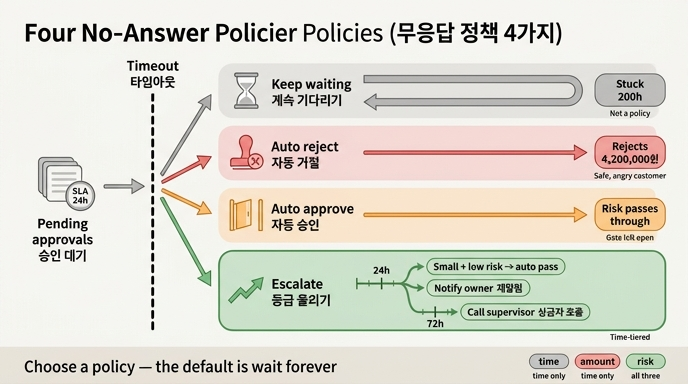

# `ex4_no_answer.py`가 비교하는 네 가지 무응답 정책

**답: 계속 기다리기 · 자동 거절 · 자동 승인 · 등급 올리기**

23.4절 「사람이 답을 안 하면」의 예제입니다. 승인 대기 큐에 사람이 응답하지 않을 때, **같은 상황에 네 가지 정책을 나란히 적용해** 결과가 어떻게 갈리는지 보여 줍니다. 코드에서는 각각 `p_wait`, `p_reject`, `p_approve`, `p_escalate` 네 함수로 구현돼 있습니다.

## 예제가 깔아 둔 상황

SLA(약속한 응답 시간)는 **24시간**이고, 승인 대기 5건이 있습니다.

| 주문 | 금액 | 대기 시간 | 위험도 |
|---|---:|---:|---|
| A-1024 | 120,000원 | 2h | 보통 |
| A-1031 | 890,000원 | 26h | 높음 |
| A-1044 | 150,000원 | 73h | 보통 |
| A-1050 | 4,200,000원 | 121h | 높음 |
| A-1066 | 110,000원 | 200h | 낮음 |

대기 시간이 2시간부터 200시간까지 퍼져 있는 게 핵심입니다. SLA(24h)와 상급자 문턱(72h)이라는 두 개의 선을 일부러 걸치도록 만든 표본이에요.

## 네 정책의 동작

### 1. 계속 기다리기 (`p_wait`)

```python
def p_wait(_o, _a, _h, _r):
    return "계속 기다린다", "영원히"
```

인자를 하나도 안 봅니다. 대기 시간이 2시간이든 200시간이든 결과는 늘 「계속 기다린다」예요. 5건 전부 그대로 큐에 남습니다.

- **장점**: 잘못된 자동 판단이 없습니다. 사람의 판단을 100% 보존합니다.
- **단점**: 아무 일도 안 일어납니다. 200시간(8일 넘게) 묶인 A-1066이 그 증거입니다.
- **책의 핵심 지적**: 이건 정책이 아니라 **정책을 안 정한 상태**입니다. 무응답 정책을 명시하지 않은 시스템의 기본값이 언제나 「영원히 기다림」이고, 그건 아무도 원하지 않는 결말이에요. 장 요약의 "무응답 정책이 없으면 기본값은 「영원히 기다림」입니다"가 이 함수입니다.

### 2. 자동 거절 (`p_reject`)

```python
def p_reject(_o, _a, h, _r):
    return ("자동 거절", "안전하지만 고객이 화난다") if h > SLA else ("대기", "-")
```

대기 시간 `h`만 봅니다. SLA를 넘으면 무조건 거절. A-1024(2h)만 대기이고 **나머지 4건은 전부 자동 거절**입니다.

- **장점**: 금전적으로는 안전합니다. 위험한 건이 통과할 일이 없어요.
- **단점**: **4,200,000원짜리 A-1050까지 거절**합니다. 정상 주문이었을 수도 있는데 고객은 이유도 모른 채 거절 통보를 받습니다. 안전은 회사 쪽 안전이지 고객 쪽 안전이 아니에요.
- **맞는 상황**: 거절 비용이 낮고 재시도가 쉬운 흐름. 취소해도 고객이 다시 주문하면 되는 경우, 규제상 미검토 통과가 절대 안 되는 경우.

### 3. 자동 승인 (`p_approve`)

```python
def p_approve(_o, _a, h, _r):
    return ("자동 승인", "위험 노출") if h > SLA else ("대기", "-")
```

구조는 거절과 완전히 대칭입니다. `h`만 보고 SLA 초과분을 전부 통과시켜요. 역시 4건이 자동 승인됩니다.

- **장점**: 고객 경험이 매끄럽고 큐가 밀리지 않습니다.
- **단점**: 위험이 **그대로 노출**됩니다. A-1050(4,200,000원, 위험도 높음)이 아무 검토 없이 통과해요. 승인 관문을 달아 놓고 관문을 열어 둔 셈입니다.
- **맞는 상황**: 사후 회수·환불이 가능하고 건당 위험액이 작은 흐름. 되돌릴 수 있는 작업(22장의 보상 가능한 작업)에 한해서.

### 4. 등급 올리기 (`p_escalate`)

```python
def p_escalate(_o, amount, h, risk):
    if h <= SLA:
        return "대기", "-"
    if risk == "낮음" and amount < 200_000:
        return "자동 승인", "소액·저위험만 통과"
    if h > 72:
        return "상급자 호출", "책임을 위로 올린다"
    return "담당자 재알림", "한 번 더 찌른다"
```

유일하게 **네 인자를 모두 쓰는** 정책입니다. 시간·금액·위험도를 조합해서 단계별로 다르게 처리해요.

- 24시간 이내 → 그냥 대기
- 24시간 초과 → 소액(20만 원 미만)·저위험만 자동 통과
- 그 외 24~72시간 → 담당자 재알림 (한 번 더 찌른다)
- 72시간 초과 → 상급자 호출

### 실행 결과 (네 정책 나란히 보기)

| 주문 | 대기 | 위험 | 기다리기 | 자동 거절 | 자동 승인 | 등급 올리기 |
|---|---:|---|---|---|---|---|
| A-1024 (120,000원) | 2h | 보통 | 계속 기다린다 | 대기 | 대기 | 대기 |
| A-1031 (890,000원) | 26h | 높음 | 계속 기다린다 | 자동 거절 | 자동 승인 | 담당자 재알림 |
| A-1044 (150,000원) | 73h | 보통 | 계속 기다린다 | 자동 거절 | 자동 승인 | 상급자 호출 |
| A-1050 (4,200,000원) | 121h | 높음 | 계속 기다린다 | 자동 거절 | 자동 승인 | 상급자 호출 |
| A-1066 (110,000원) | 200h | 낮음 | 계속 기다린다 | 자동 거절 | 자동 승인 | 자동 승인 |

읽는 법: 왼쪽 세 열은 모두 **한 가지 답만** 내놓습니다(전부 대기 / 전부 거절 / 전부 승인). 오른쪽 한 열만 건마다 다른 답을 냅니다.

- A-1044(150,000원)와 A-1050(4,200,000원)은 자동 거절·자동 승인에서 **완전히 같은 취급**을 받습니다. 28배 차이 나는 금액인데도요. 시간만 보는 정책의 한계입니다.
- A-1066(110,000원, 저위험)은 200시간이나 묶여 있었는데, 등급 올리기에서는 사람 손을 안 거치고 통과합니다. 사람의 시간을 쓸 가치가 없는 건이거든요. 23.3절의 「용량」 논리와 이어집니다.
- A-1031(26h)과 A-1044(73h)는 등급 올리기에서 갈립니다. 재알림이냐 상급자냐, 72시간이 그 경계입니다.

## 이 예제가 말하려는 것

1. **시간이 지날수록 다르게 처리하라.** 무응답을 하나의 상태로 보지 말고, 24시간짜리 무응답과 200시간짜리 무응답을 구분하세요. 네 번째 정책만이 그렇게 합니다.
2. **등급 올리기는 판단을 올리는 장치가 아니라 주의를 끄는 장치다.** 상급자가 더 똑똑해서 부르는 게 아니라, 아무도 안 보는 상태를 깨려고 부릅니다. 「책임을 위로 올린다」는 그 뜻이에요.
3. **중요한 건 「무엇을 고르느냐」가 아니라 「골랐느냐」다.** 예제 마지막 문장이 이겁니다. 자동 거절이든 자동 승인이든 명시적으로 골랐으면 정책이고, 안 고르면 기본값은 언제나 「영원히 기다림」입니다.

## 주변 절과의 연결

- **23.3 어디에 문을 달 것인가** (`ex3_gate_policy.py`): 문턱을 취향이 아니라 용량으로 정합니다. 검토 시간이 용량의 70%를 넘지 않는 문턱 중 제일 낮은 것. 여기서 정한 문턱을 넘어 들어온 건이 23.4의 대기 큐에 쌓입니다.
- **23.1 멈추는 것은 예외가 아니다**: 멈춘 자리는 체크포인터에 남으므로 프로세스를 붙잡고 있을 필요가 없습니다. 그래서 200시간 대기가 물리적으로 «가능»하고, 그렇기 때문에 무응답 정책이 필요해집니다.
- **23.5 무엇을 보여 줬는지 남긴다** (`ex5_audit.py`): 자동 처리든 사람 승인이든 「보여 준 내용」과 「상태 지문」을 감사 기록에 남겨야 합니다.

## 인포그래픽


