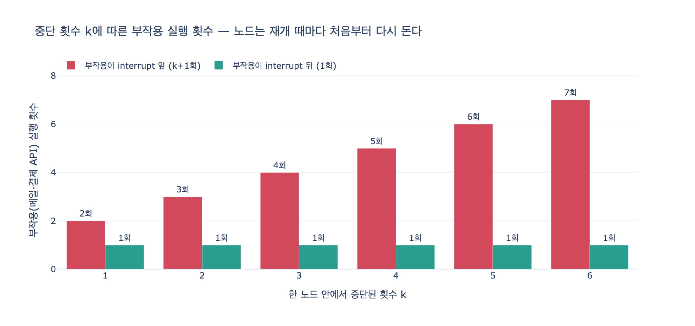

# 중단점 앞에 부작용을 두면 안 되는 이유

> **Q.** 중단점 앞에 부작용을 두면 안 되는 이유는 무엇인가?
>
> **A.** 재개하면 그 노드를 **처음부터 다시 돌기** 때문이다.
> 노드 안에서 `interrupt` 앞의 코드는 **두 번 실행된다**.

출처: 23장 「사람이 끼어드는 지점」 23.2절 — 중단점 앞에 부작용을 두지 마라
(`code/ex2_node_reruns.py`)

---

## 1. 왜 처음부터 다시 도는가 — 체크포인트는 노드 «경계»에 찍힌다

21장의 「슈퍼스텝 경계」 이야기가 여기서 그대로 되돌아옵니다.

LangGraph의 체크포인터는 노드가 **하나 끝날 때마다** 상태를 저장합니다.
노드 **중간**에는 저장 지점이 없습니다. 함수 안 어느 줄까지 실행됐는지,
지역 변수가 무엇이었는지는 아무 데도 안 남습니다.

그런데 `interrupt()`는 노드 **중간**에서 멈춥니다.

```
        ┌──────────────── 노드「사람확인」────────────────┐
  ●─────┤  메일 발송      interrupt()      결과 기록      ├─────●
  체크포인트                   ↑                            체크포인트
  (저장됨)              여기서 멈춘다                       (아직 안 찍힘)
                        ↑ 저장된 건 노드 «시작 직전» 상태뿐
```

멈춘 시점에 저장돼 있는 가장 최근 체크포인트는 그 노드가 **시작되기 직전**의 것입니다.
그래서 `Command(resume=...)`로 재개하면 런타임이 할 수 있는 일은 하나뿐입니다.
**그 노드 함수를 처음부터 다시 호출하는 것.**

두 번째 호출에서는 `interrupt()`가 이번엔 멈추는 대신
사람이 준 답을 **그 자리에서 돌려주며 통과**합니다.
그래서 `interrupt` 뒤의 코드는 이제 처음으로 실행됩니다.

| | 노드 함수 호출 | `interrupt` 앞 코드 | `interrupt` 뒤 코드 |
|---|---|---|---|
| 1회차 invoke | 1 | 실행 | 실행 안 됨 (여기서 중단) |
| 재개 invoke | 1 | **또 실행** | 실행 |
| 합계 | 2 | **2회** | 1회 |

## 2. 실제로 무슨 일이 벌어지나 (책 예제 `ex2_node_reruns.py`)

```python
def 나쁜노드(s: S) -> S:
    호출수["메일"] += 1
    print(f"    → 담당자에게 «검토 요청» 메일 발송 (누적 {호출수['메일']}회)")
    답 = interrupt("승인하시겠습니까?")     # ← 부작용이 이 «앞»에 있다
    return {"승인": 답}


def 좋은노드(s: S) -> S:
    답 = interrupt("승인하시겠습니까?")     # ← 먼저 멈춘다
    호출수["조회"] += 1
    print(f"    → 결과 기록 (누적 {호출수['조회']}회)")   # 부작용은 «뒤»
    return {"승인": 답}
```

실행 결과:

```
[부작용이 interrupt «앞»에 있다]
    → 담당자에게 «검토 요청» 메일 발송 (누적 1회)
    ...사람이 답한다...
    → 담당자에게 «검토 요청» 메일 발송 (누적 2회)   ← 승인한 뒤에 또 왔다

[부작용이 interrupt «뒤»에 있다]
    ...사람이 답한다...
    → 결과 기록 (누적 1회)

메일 발송 2회, 결과 기록 1회.
```

담당자는 검토 요청 메일을 **두 번** 받았습니다.
그것도 두 번째는 자기가 **승인을 하고 난 뒤에** 받았습니다.

메일이면 짜증으로 끝납니다. 하지만 이 자리에 있던 게
결제 API, 환불 실행, 재고 차감, 외부 시스템 통보였다면
**돈이 두 번 나갑니다.** 22장의 보상 트랜잭션이 필요해지는 사고가 정확히 이 모양입니다.

## 3. 규칙

> **`interrupt` 앞에는 부작용을 두지 않는다.**
> 읽기만 하는 코드는 괜찮다. 밖으로 나가는 것은 전부 뒤로 민다.

「부작용」의 판별 기준은 **두 번 실행돼도 아무 일이 없느냐**입니다.

| `interrupt` 앞에 둬도 되는 것 | 뒤로 밀어야 하는 것 |
|---|---|
| DB 조회, 캐시 읽기 | 메일·슬랙·SMS 발송 |
| 상태에서 값 꺼내기, 포맷팅 | 결제·환불·송금 API 호출 |
| 검증·계산·분기 판단 | 레코드 INSERT / UPDATE |
| 사람에게 보여 줄 내용 만들기 | 외부 시스템 상태 변경 |
| 로그 (중복돼도 무해하면) | 카운터 증가, 재고 차감 |

읽기 코드가 두 번 도는 건 성능만 조금 손해입니다.
비싸다면 그건 최적화 문제지, 정합성 문제가 아닙니다.

## 4. 부작용이 꼭 «앞»에 있어야 하면 — 노드를 둘로 쪼갠다

「검토 요청 메일을 **보내고 나서** 물어야 한다」는 요구는 정당합니다.
그럴 땐 순서를 바꾸는 게 아니라 **경계를 하나 더 만듭니다.**

```
      ┌──────────┐   체크포인트   ┌──────────────┐
  ●───┤ 부작용 노드 ├──── ● ────┤ interrupt 노드 ├───●
      │ (메일 발송) │   여기 찍힘   │   (묻기)      │
      └──────────┘               └──────────────┘
                                    ↑ 재개는 여기만 다시 돈다
```

```python
g.add_node("검토요청발송", 메일노드)   # 부작용만
g.add_node("사람확인", 묻기노드)       # interrupt 만
g.add_edge("검토요청발송", "사람확인")
```

앞 노드가 끝나는 순간 체크포인트가 찍히므로,
재개할 때 런타임은 **이미 끝난 노드는 건너뛰고** 뒤 노드만 다시 돕니다.
메일은 한 번만 나갑니다.

`expy.py`의 실측:

```
노드 호출 {'effect': 1, 'ask': 2}, 메일 발송 1회
```

`ask` 노드는 여전히 2번 돌지만 `effect` 노드는 1번만 돕니다.
**재실행 자체를 막은 게 아니라, 재실행 범위에서 부작용을 빼낸 것**입니다.

## 5. 중단이 여러 번이면 선형으로 증폭된다

중단은 한 번으로 안 끝나는 경우가 많습니다.
한 노드 안에서 「금액 확인 → 사유 확인 → 최종 승인」을 차례로 물을 수도 있고,
23.4절의 등급 올리기로 담당자를 바꿔 가며 다시 물을 수도 있습니다.

그 노드가 $k$ 번 중단됐다 재개되면:

$$\text{interrupt 앞 코드 실행 횟수} = k + 1, \qquad \text{interrupt 뒤 코드 실행 횟수} = 1$$

3단계로 묻는 승인 화면 하나가 검토 요청 메일 **4통**이 되는 셈입니다.

## 6. 함께 기억할 것

- 재실행 자체는 **막을 수 없습니다.** 체크포인트가 노드 경계에만 찍히기 때문입니다.
  막을 수 있는 건 「무엇이 재실행에 끌려 들어가느냐」뿐입니다.
- 그래서 `interrupt`가 들어 있는 노드는 **멱등(idempotent)하게** 짜야 합니다.
  두 번 돌아도 결과가 같아야 합니다.
- 부작용을 도저히 못 미루겠다면 21장의 멱등 키 / 22장의 보상 트랜잭션을 붙이는 방법도 있지만,
  **순서를 바꾸거나 노드를 쪼개는 쪽이 언제나 더 싸고 안전합니다.**
- 같은 이유로 노드 안에서 난수·현재 시각·자동 증가 ID를 `interrupt` 앞에서 만들면
  재개 후 값이 달라집니다. 이것도 일종의 부작용입니다.

## 시각화



중단 횟수 $k$가 늘수록 `interrupt` 앞의 부작용은 $k+1$회로 선형 증가하고,
뒤로 민 부작용은 언제나 1회입니다.
