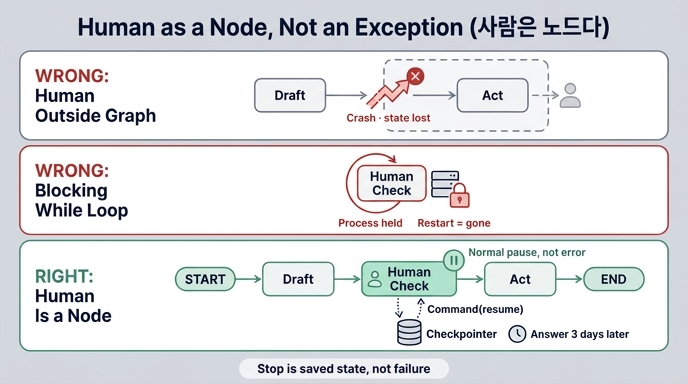

# 23장이 제시하는 사람 개입의 기본 관점

> **정답**: 사람을 그래프 밖의 예외가 아니라 안의 노드로 넣는다. 중단점은 예외가 아니라 정상적인 중단이다.

## 한 줄로

사람은 그래프를 **깨뜨리는 존재**가 아니라 그래프 **안에서 순서를 기다리는 한 단계**다.

## 왜 이 관점이 필요한가

22장에서 「사람에게 넘긴다」를 여러 번 썼지만, *넘기는 방법*은 안 정했다. 방법을 안 정하면 실무에서 두 가지 잘못된 구현이 나온다.

| 잘못된 구현 | 증상 |
|---|---|
| 사람을 **그래프 밖의 예외**로 취급 | 예외를 던지고 워크플로가 죽는다. 어디까지 갔는지 잃어버린다. 재시도하면 처음부터. |
| 사람을 **기다리는 while 루프**로 취급 | 프로세스·스레드·커넥션을 붙잡고 대기. 서버 재시작이면 대기 중인 건은 전부 증발. |

23장의 답은 제3의 길이다. **사람 확인을 노드로 만들고, 그 노드 안에서 정상적으로 멈춘다.**

```
START → 초안 → 사람확인 → 실행 → END
                  ↑
            여기서 «정상적으로» 멈춘다
```

## 「예외가 아니라 정상적인 중단」이 뜻하는 것

`ex1_interrupt.py`의 핵심 세 줄에 이 관점이 전부 들어 있다.

```python
def 사람확인(s: S) -> S:
    if s["금액"] < 100_000:
        return {"승인": "자동"}          # 문턱 아래면 사람을 안 부른다

    # 여기서 그래프가 «멈춘다». 예외가 아니라 정상적인 중단이다.
    답 = interrupt({"물음": "이 환불을 승인하시겠습니까?", "금액": s["금액"], ...})
    return {"승인": 답}
```

`interrupt()`는 다음을 의미한다.

1. **멈춤은 실패가 아니다.** 그래프는 `__interrupt__`를 담은 정상 결과를 돌려주고, `app.get_state(cfg).next`로 「다음에 실행할 노드」가 그대로 조회된다. 에러 핸들러가 아니라 상태 조회로 다룬다.
2. **멈춘 자리는 체크포인터에 남는다.** 21장에서 본 그 체크포인터다. 상태가 저장돼 있으니 **서버를 재시작해도 그 자리에 있다.**
3. **프로세스를 붙잡지 않아도 된다.** 대기 비용이 메모리가 아니라 저장소다. 그래서 사람이 **사흘 뒤에 답해도** 이어간다.
4. **재개는 명령이다.** `app.invoke(Command(resume="승인"), cfg)` — 사람의 답이 그래프에 다시 흘러들어가는 정식 입구가 있다.

> 운영에서는 `InMemorySaver`가 아니라 디스크에 저장하는 체크포인터를 써야 이 성질(사흘 뒤 재개)이 실제로 성립한다. 예제가 메모리 체크포인터를 쓰는 건 데모라서다.

## 이 관점에서 파생되는 나머지 절

기본 관점 하나를 잡으면 23장의 나머지가 전부 따라 나온다.

| 절 | 파생되는 규칙 | 근거 |
|---|---|---|
| 23.2 중단점 앞에 부작용 금지 | 재개하면 그 노드를 **처음부터** 다시 돈다. 체크포인트는 노드 *경계*에 찍히는데 `interrupt`는 노드 *중간*에서 멈추기 때문. 부작용이 앞에 있어야 하면 노드를 둘로 쪼개 경계를 만든다 | `ex2_node_reruns.py` — 검토 요청 메일이 2회 발송된다 |
| 23.3 어디에 문을 달 것인가 | 문턱은 취향이 아니라 **용량**. 검토 시간이 용량의 70%를 넘지 않는 문턱 중 제일 낮은 것 (30%는 휴가·회의·급한 건용) | `ex3_gate_policy.py` |
| 23.4 사람이 답을 안 하면 | 정책을 안 정하면 기본값은 「영원히 기다림」. 시간이 지날수록 다르게 처리 (24h 재알림 → 72h 상급자) | `ex4_no_answer.py` |
| 23.5 무엇을 보여 줬는지 남긴다 | 감사 기록에 **보여 준 내용 + 상태 지문**. 지문이 다르면 다시 묻는다 | `ex5_audit.py` |

## 자주 놓치는 함정

- **「모든 것을 사람이 본다」 = 「아무것도 안 보는 것」.** 예제 1이 5만 원짜리를 안 부르는 이유다. 문턱 없는 개입은 밀린 건을 만들고, 담당자가 대충 보기 시작하면 결국 전부 자동과 같아진다. 사람을 갈아 넣고 효과는 0.
- **노드는 재실행되지만 사람은 재실행되지 않는다.** 사람 확인 노드 안에서 메일을 먼저 보내면, 담당자는 승인을 *하고 나서* 같은 요청 메일을 한 번 더 받는다.
- **읽기는 앞에 둬도 된다.** `interrupt` 앞에 금지되는 건 밖으로 나가는 부작용(메일, 결제, 쓰기)이지 조회가 아니다.

## 용어 정리

| 키워드 | 상태 | 출처 |
|---|---|---|
| 사람 개입 (human in the loop) | 사실상 표준 | [LangGraph interrupts](https://docs.langchain.com/oss/python/langgraph/interrupts) |
| 중단점 (interrupt) | 사실상 표준 | 위와 동일 |
| 재개 명령 `Command(resume)` | 사실상 표준 | 위와 동일 |
| 승인 관문 (approval gate) | 사실상 표준 | [Gatekeeper 패턴](https://learn.microsoft.com/en-us/azure/architecture/patterns/gatekeeper) |
| 등급 올리기 (escalation) | 사실상 표준 | [SRE Workbook](https://sre.google/workbook/incident-response/) |
| 감사 추적 (audit trail) | 표준 | [W3C PROV-O](https://www.w3.org/TR/prov-o/) |
| 네 눈 원칙 (four-eyes) | 사실상 표준 | [BCBS 230](https://www.bis.org/publ/bcbs230.pdf) |

## 암기용 압축

> 사람은 **밖의 예외**가 아니라 **안의 노드**.
> 멈춤은 **에러**가 아니라 **저장된 정상 상태**.
> 그래서 프로세스를 안 붙잡아도 되고, 사흘 뒤 답도 받는다.

## 인포그래픽


