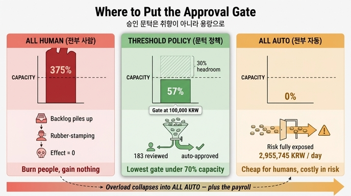

# '전부 사람'과 '전부 자동'의 실패 방식

> **Q.** '전부 사람'과 '전부 자동'의 실패 방식은 각각 무엇인가?
>
> **A.** 전부 사람은 검토 시간이 용량의 3배가 넘어 사람을 갈아 넣고 효과는 0이 되고, 전부 자동은 위험액이 그대로 노출된다.

출처: 23장 「사람이 끼어드는 지점」 23.3 어디에 문을 달 것인가 / `code/ex3_gate_policy.py`

---

## 1. 무엇을 묻는 질문인가

승인 관문(approval gate)의 **문턱(threshold)** 을 어디에 둘 것인가를 정할 때, 사람들은 보통 두 극단 중 하나를 기본값처럼 고릅니다.

- **전부 사람** — "모든 건은 담당자가 확인한다" (문턱 = 0원)
- **전부 자동** — "사람 안 부른다" (문턱 = ∞)

이 카드는 **두 극단이 각각 다른 방식으로 실패한다**는 것을 묻습니다. 중요한 점은 두 실패가 대칭이 아니라는 것입니다. 하나는 *조용히* 실패하고, 다른 하나는 *드러나게* 실패합니다.

## 2. 계산으로 확인하기

`ex3_gate_policy.py`는 취향 논쟁을 없애기 위해 숫자를 깝니다. 하루치 환불 요청 분포(로그정규, 소액 다수·고액 소수)를 놓고 문턱별로 **사람이 볼 건수**와 **자동으로 나가는 위험 금액**을 계산합니다.

```python
REVIEW_MINUTES = 3        # 한 건 검토에 걸리는 시간
REVIEWERS      = 2        # 검토 담당자 수
WORK_MINUTES   = 8 * 60   # 하루 근무 시간
ERROR_RATE     = 0.04     # 자동 처리 중 잘못된 비율 (실측 가정)

def evaluate(amounts, threshold):
    reviewed = [a for a in amounts if a >= threshold]
    auto     = [a for a in amounts if a <  threshold]
    load     = len(reviewed) * REVIEW_MINUTES   # 검토에 드는 시간
    capacity = REVIEWERS * WORK_MINUTES         # 하루에 쓸 수 있는 시간
    risk     = sum(auto) * ERROR_RATE           # 그냥 나가는 위험 금액
    return len(reviewed), load, capacity, risk
```

핵심은 지표가 **두 개**라는 점입니다. `load / capacity`(사람 쪽 비용)와 `risk`(자동 쪽 비용). 한쪽만 보면 반드시 극단으로 밀립니다.

실행 결과 (하루 요청 1,200건, 합계 73,893,625원, 담당자 2명 = 하루 처리 가능 320건):

| 문턱 | 사람이 볼 건수 | 검토 시간(분) | 용량 대비 | 자동 처리 위험액 |
|---:|---:|---:|---:|---:|
| **전부 사람** | 1,200 | 3,600 | **375%** | 0원 |
| 50,000원 | 412 | 1,236 | 129% | 672,804원 |
| **100,000원** | 183 | 549 | **57%** | 1,306,610원 |
| 300,000원 | 32 | 96 | 10% | 2,291,931원 |
| 1,000,000원 | 1 | 3 | 0% | 2,881,208원 |
| **전부 자동** | 0 | 0 | 0% | **2,955,745원** |

## 3. 실패 방식 ① — 전부 사람: "사람을 갈아 넣고 효과는 0"

검토 시간 3,600분 vs 용량 960분. **용량의 375%, 3배가 넘습니다.**

여기서 끝이 아닙니다. 책이 지적하는 건 그다음에 벌어지는 **연쇄**입니다.

```
용량 375% 초과
   ↓
밀린 건이 쌓인다 (승인 대기 2주)
   ↓
담당자가 대충 보기 시작한다 (검토 품질 붕괴)
   ↓
결국 「전부 자동」과 같아진다  ← 여기가 함정
```

> «전부 사람»은 검토 시간이 용량의 3배가 넘는다. 실제로는 이렇게 된다.
> 밀린 건이 쌓이고, 담당자가 대충 보기 시작하고, 결국 «전부 자동»과 같아진다.
> **이게 제일 나쁜 결말이다. 사람을 갈아 넣고 효과는 0인 상태.**

즉 '전부 사람'의 실패는 단순히 "느리다"가 아닙니다. **자동의 위험을 그대로 떠안으면서 사람의 비용까지 추가로 지불하는 상태**입니다. 표에서 위험액이 0원으로 찍히는 건 어디까지나 "담당자가 1,200건을 전부 제대로 본다"는 가정 위에서만 성립하고, 그 가정이 375%에서 무너집니다. 표의 0원은 실제 값이 아니라 **지켜지지 않을 약속**입니다.

23.1의 문장도 같은 이야기입니다.

> «모든 것을 사람이 본다»는 정책은 아무것도 안 보는 정책과 같아진다.

## 4. 실패 방식 ② — 전부 자동: "위험액이 그대로 노출"

이쪽은 훨씬 정직합니다. 사람 비용은 0이고, 대신 자동 처리 중 잘못되는 비율(4%)이 금액에 그대로 곱해집니다.

```
risk = sum(전체 금액) × ERROR_RATE = 73,893,625 × 0.04 ≈ 2,955,745원
```

**하루 약 296만 원이 매일 그냥 나갑니다.** 은폐되지 않고, 계산되고, 예측됩니다.

두 실패의 성격 차이가 여기서 갈립니다.

| | 전부 사람 | 전부 자동 |
|---|---|---|
| 실패 지점 | 사람 용량 초과 → 검토 품질 붕괴 | 오류율 × 금액이 그대로 손실 |
| 드러나는가 | **숨는다** (기록상으론 "전부 승인됨") | **드러난다** (측정 가능) |
| 비용 | 인건비 + 지연 + 위험액(사실상) | 위험액만 |
| 최종 상태 | 사실상 전부 자동 + 인건비 | 전부 자동 |

'전부 사람'이 더 나쁜 결말인 이유가 이 표에 있습니다. 도착지는 같은데 요금을 더 냅니다.

## 5. 그래서 답은 — 취향이 아니라 용량

> 중간 어딘가가 답인데, 고르는 기준은 «용량»이다.
> **검토 시간이 용량의 70%를 넘지 않는 문턱 중 제일 낮은 것**을 고른다.
> 30%는 휴가·회의·급한 건을 위해 비워 둔다.

표에 이 규칙을 적용해 봅니다.

- 전부 사람 375% → 탈락
- 50,000원 129% → 탈락
- **100,000원 57% → 통과. 통과한 것 중 제일 낮은 문턱** ✅
- 300,000원 10% → 통과하지만 더 높은 문턱 (더 많은 위험을 흘려보냄)

**문턱 100,000원**이 답입니다. 위험액은 130만 원으로, 전부 자동(296만 원) 대비 **56% 줄면서** 검토 부하는 용량의 절반 남짓입니다.

두 가지 설계 원칙이 여기 숨어 있습니다.

1. **왜 "제일 낮은 것"인가** — 문턱이 낮을수록 사람이 더 많이 봅니다. 용량이 허락하는 한 최대한 잡는 게 이득이므로, 제약(70%)을 만족하는 것 중 가장 공격적인 값을 고릅니다.
2. **왜 100%가 아니라 70%인가** — 100%로 잡으면 휴가 하루, 회의 한 번, 급한 건 하나에 즉시 초과합니다. 30%는 여유(headroom)이고, 이건 SRE의 error budget이나 큐 이론의 이용률(utilization) 관리와 같은 발상입니다. 이용률이 1에 가까워지면 대기 시간이 발산합니다.

### 금액만이 최선은 아니다

> 문턱을 «금액»으로만 잡는 게 최선은 아니다.
> 신규 고객, 반복 환불, 이상 패턴 같은 신호를 섞으면 같은 용량으로 더 잡는다.
> 다만 시작은 금액이 좋다. **계산이 되고, 설명이 되고, 감사도 통과한다.**

같은 "사람이 볼 183건"을 쓰더라도, 그 183건을 *가장 위험한* 183건으로 채우면 위험액이 더 줄어듭니다. 금액은 그 신호들 중 가장 단순한 첫 번째 축일 뿐입니다.

## 6. 한 줄 정리

- **전부 사람** → 검토 시간이 용량의 **3배 초과(375%)**. 밀림 → 대충 봄 → 사실상 전부 자동. **사람을 갈아 넣고 효과는 0.**
- **전부 자동** → 사람 비용은 0이지만 **위험액(약 296만 원/일)이 그대로 노출.**
- **답** → 취향이 아니라 **용량**. 검토 시간이 **용량의 70% 이내**인 문턱 중 **가장 낮은 것**(이 예에서는 10만 원, 57%).

## 인포그래픽



## 참고

- [LangGraph — human in the loop / interrupt](https://docs.langchain.com/oss/python/langgraph/interrupts)
- [Azure Architecture — Gatekeeper pattern](https://learn.microsoft.com/en-us/azure/architecture/patterns/gatekeeper)
- [Google SRE Workbook — Incident Response](https://sre.google/workbook/incident-response/)
