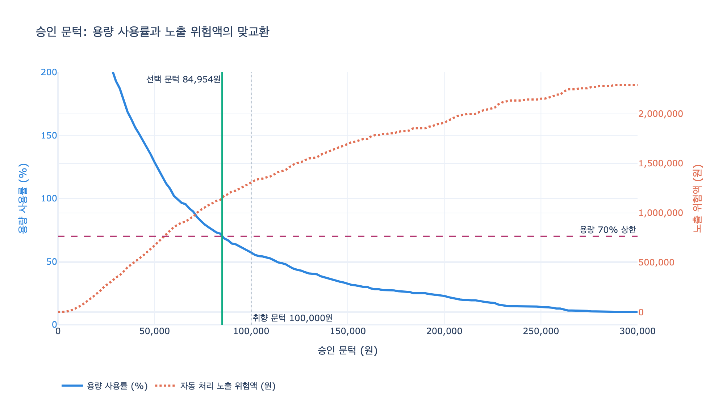

# 승인 문턱은 무엇으로 정해야 하는가?

> **답**: 취향이 아니라 **용량**으로 정한다.
> 검토 시간이 용량의 **70%**를 넘지 않는 문턱 중 **가장 낮은 것**을 고른다.

---

## 1. 문턱이란 무엇인가

23장 「사람이 끼어드는 지점」은 사람을 그래프 밖의 예외가 아니라 **안의 노드**로 넣는 방법을 다룹니다.
`ex1_interrupt.py`에서 이미 문턱이 코드로 등장합니다.

```python
def 사람확인(s: S) -> S:
    if s["금액"] < 100_000:
        print("  [확인]  10만 원 미만이라 사람에게 안 묻는다")
        return {"승인": "자동"}
    답 = interrupt({...})   # 여기서 그래프가 멈춘다
```

이 `100_000`이 **승인 문턱(approval gate threshold)** 입니다.
이 값 이상이면 그래프가 `interrupt()`로 멈추고 사람의 판단을 기다립니다. 미만이면 그냥 통과합니다.

문제는 **이 숫자를 누가, 무슨 근거로 정하느냐**입니다.
현장에서는 보통 이렇게 정해집니다.

- "10만 원 정도면 적당하지 않아요?"
- "지난번 사고가 80만 원이었으니 50만 원으로 하죠."
- "일단 다 보는 걸로 하고 나중에 조정합시다."

전부 **취향**입니다. 근거가 없으니 반박도 안 되고, 상황이 바뀌어도 안 움직입니다.

---

## 2. 양 끝은 왜 답이 아닌가

문턱을 극단으로 밀면 두 개의 실패 모드가 나옵니다.

### 「전부 사람이 본다」 — 검토 붕괴

책의 표현 그대로입니다.

> «전부 사람»은 검토 시간이 용량의 3배가 넘는다. 실제로는 이렇게 된다.
> 밀린 건이 쌓이고, 담당자가 대충 보기 시작하고, 결국 «전부 자동»과 같아진다.
> **이게 제일 나쁜 결말이다. 사람을 갈아 넣고 효과는 0인 상태.**

용량을 넘는 검토 정책은 **정책이 아니라 위장**입니다. 감사 서류에는 "전 건 검토"라고 적히지만,
실제로는 담당자가 5초 만에 승인 버튼을 누릅니다. 여기에 더해 밀린 건이 SLA를 깨고
(`ex4_no_answer.py`의 200시간 묶인 건이 바로 그 증상), 담당자는 번아웃됩니다.

`ex1_interrupt.py`의 마지막 문단도 같은 말을 합니다.

> «모든 것을 사람이 본다»는 정책은 아무것도 안 보는 정책과 같아진다.

### 「전부 자동」 — 위험 그대로 노출

반대쪽은 단순합니다. 자동 처리 오류율 $\varepsilon$이 전체 금액에 그대로 곱해집니다.
사람이 개입할 여지가 없으니 사고가 나면 막을 방법이 없습니다.

**답은 중간 어딘가**입니다. 그리고 고르는 기준이 바로 **용량**입니다.

---

## 3. 용량으로 정한다는 것의 의미

핵심 통찰은 이겁니다: **검토 능력은 유한한 자원이다.**

담당자 $R$명이 하루 $W$분 일하고, 한 건 검토에 $m$분 걸린다면

$$\text{capacity} = R \times W$$

이것이 하루에 쓸 수 있는 총 검토 시간입니다. 문턱 $t$를 정하면 검토 부하가 결정됩니다.

$$\text{load}(t) = m \cdot \bigl|\{\, a \in A : a \ge t \,\}\bigr|$$

여기서 $A$는 하루치 요청 금액 집합입니다.

`ex3_gate_policy.py`의 기본값으로 계산하면

| 항목 | 값 |
|---|---|
| 담당자 $R$ | 2명 |
| 근무 시간 $W$ | 8시간 = 480분 |
| 1건 검토 $m$ | 3분 |
| **하루 용량** | **960분 = 320건** |
| **70% 안전 용량** | **672분 = 224건** |

즉 문턱을 정하는 일은 "얼마부터 위험한가"를 맞히는 일이 아니라,
**"하루 224건까지 볼 수 있는데, 그 224건을 어디서 자를 것인가"** 를 정하는 일입니다.

---

## 4. 왜 하필 70%인가

책의 근거는 명확합니다.

> 검토 시간이 용량의 70%를 넘지 않는 문턱 중 제일 낮은 것을 고른다.
> **30%는 휴가·회의·급한 건을 위해 비워 둔다.**

100%를 목표로 잡으면 안 되는 이유는 대기 이론(queueing theory)과 같습니다.
도착이 확률적으로 흔들리는 시스템에서 **가동률(utilization) $\rho$가 1에 가까워지면 대기 시간이 발산**합니다.
M/M/1 큐의 평균 대기 시간은

$$W_q = \frac{\rho}{\mu(1-\rho)}$$

$\rho \to 1$일 때 $W_q \to \infty$입니다. 70%면 $\frac{0.7}{0.3} \approx 2.3$ 정도로 버티지만,
95%면 $\frac{0.95}{0.05} = 19$ — 8배 이상 폭증합니다.

여기에 현실 변수가 더해집니다.

- **휴가·병가**: 2명 중 1명이 빠지면 용량이 절반. 70%였던 부하가 순식간에 140%.
- **회의·다른 업무**: 검토만 하는 사람은 없습니다.
- **급한 건**: 큐를 건너뛰고 들어오는 건은 여유분에서 처리해야 합니다.
- **요청량 변동**: 세일·환불 시즌에는 하루 요청이 배로 뜁니다.

30%는 낭비가 아니라 **이 변동을 흡수하는 완충 구간**입니다.

---

## 5. 왜 「그중 가장 낮은 것」인가

70% 조건만으로는 문턱이 하나로 안 정해집니다. 문턱을 높이면 부하는 더 줄어드니까요.
100만 원도, 1억 원도 조건을 만족합니다. 그런데 그건 사실상 「전부 자동」입니다.

여기서 두 번째 조건이 필요합니다. 자동 처리로 나가는 노출 위험액은

$$\text{risk}(t) = \varepsilon \sum_{a < t} a$$

- $\text{load}(t)$는 $t$에 대해 **단조 감소** (문턱이 높을수록 사람이 덜 본다)
- $\text{risk}(t)$는 $t$에 대해 **단조 증가** (문턱이 높을수록 위험이 더 샌다)

두 함수가 반대로 움직이므로, **70% 제약을 만족하는 가장 왼쪽 지점**이 위험을 최소화합니다.
최적화 문제로 쓰면

$$t^{*} = \arg\min_{t} \ \text{risk}(t) \quad \text{s.t.} \quad \frac{\text{load}(t)}{\text{capacity}} \le 0.70
\;\;\Longleftrightarrow\;\;
t^{*} = \min \Bigl\{\, t \;\Bigm|\; \frac{\text{load}(t)}{\text{capacity}} \le 0.70 \,\Bigr\}$$

말로 풀면: **가진 검토 능력을 (안전 여유를 남기고) 최대한 다 쓴다.**
남는 용량은 잡을 수 있었던 위험을 놓치는 것과 같습니다.

---

## 6. 실제 계산 — `ex3_gate_policy.py`

하루 환불 요청 1,200건, 금액은 로그정규분포 $\ln A \sim \mathcal{N}(10.4,\ 1.15^2)$
(소액이 많고 고액이 드문 현실 분포), 자동 처리 오류율 4%.

| 문턱 | 사람이 볼 건수 | 검토 시간 | 용량 대비 | 노출 위험액 | 판정 |
|---:|---:|---:|---:|---:|---|
| 전부 사람 (0원) | 1,200건 | 3,600분 | **375%** | 0원 | 용량 초과 |
| 50,000원 | 412건 | 1,236분 | **129%** | 672,804원 | 용량 초과 |
| 100,000원 | 183건 | 549분 | 57% | 1,306,610원 | OK |
| 300,000원 | 32건 | 96분 | 10% | 2,291,931원 | OK |
| 1,000,000원 | 1건 | 3분 | 0% | 2,881,208원 | OK |
| 전부 자동 (∞) | 0건 | 0분 | 0% | 2,955,745원 | OK |

책의 후보 목록에서는 70% 이내 중 가장 낮은 값이 **100,000원**입니다.

하지만 후보를 10,000원 간격으로 촘촘히 훑으면 답이 달라집니다.

| 문턱 | 건수 | 용량 대비 | 위험액 |
|---:|---:|---:|---:|
| 70,000원 | 287건 | 89.7% | 963,331원 |
| 80,000원 | 241건 | 75.3% | 1,099,369원 |
| **90,000원** | **206건** | **64.4%** | **1,218,650원** |
| 100,000원 | 183건 | 57.2% | 1,306,610원 |

격자 없이 정확히 구할 수도 있습니다. 70% 안에서 볼 수 있는 최대 건수는

$$k = \left\lfloor \frac{0.70 \times 960}{3} \right\rfloor = 224 \text{건}$$

금액을 내림차순 정렬해 225번째 값보다 1원 큰 값이 최저 문턱 — **84,954원**, 위험액 1,155,666원.
취향으로 잡은 100,000원 대비 위험액이 **약 15만 원 줄었습니다. 인원은 그대로 두고요.**

---

## 7. 취향 문턱이 진짜로 위험한 이유

「10만 원」이 틀린 숫자라서가 아닙니다. **상황이 바뀌어도 안 움직이기 때문**입니다.

| 담당자 수 | 하루 용량 | 70% 건수 | 용량 기반 문턱 | 「10만 원 고정」의 용량 대비 |
|---:|---:|---:|---:|---:|
| 1명 | 480분 | 112건 | 143,864원 | **114% — 큐가 쌓인다** |
| 2명 | 960분 | 224건 | 84,954원 | 57% |
| 3명 | 1,440분 | 335건 | 58,789원 | 38% |
| 5명 | 2,400분 | 560건 | 34,668원 | **23% — 놀리고 있다** |

같은 「10만 원」이 인원에 따라 **과부하도 되고 낭비도 됩니다.**
문턱은 고정 상수가 아니라 **용량에 연결된 파생값**이어야 합니다.

용량이 바뀌는 순간은 생각보다 자주 옵니다.

- 담당자 채용/퇴사/휴가
- 검토 도구 개선으로 1건 3분 → 1분
- 프로모션으로 요청량 2배
- 금액 분포 자체의 변화

이 중 무엇이 바뀌어도 문턱을 다시 계산해야 합니다. **상수로 박아 두면 반드시 취향으로 되돌아갑니다.**

---

## 8. 실무 적용 시 주의점

### 금액만이 유일한 축은 아니다

책의 마지막 문단이 중요합니다.

> 문턱을 «금액»으로만 잡는 게 최선은 아니다.
> 신규 고객, 반복 환불, 이상 패턴 같은 신호를 섞으면 같은 용량으로 더 잡는다.
> **다만 시작은 금액이 좋다. 계산이 되고, 설명이 되고, 감사도 통과한다.**

용량 제약은 그대로 두고 **선별 기준만 정교하게** 만들면, 같은 224건으로 더 많은 실제 위험을 잡습니다.
즉 개선의 방향은 "더 많이 보기"가 아니라 **"같은 예산으로 더 잘 고르기"** 입니다.

### 오류율 $\varepsilon$은 실측해야 한다

`ERROR_RATE = 0.04`는 코드 주석에 「실측 가정」이라고 적혀 있습니다.
이 값은 사후 감사·클레임 데이터로 계속 갱신해야 합니다. 이 숫자가 틀리면 위험액 비교가 통째로 무의미합니다.

### 문턱은 감사 대상이다

문턱과 그 근거(용량, 검토 시간, 분포, 오류율)를 기록해 두면
"왜 이 건은 사람이 안 봤나"라는 질문에 계산으로 답할 수 있습니다.
`ex5_audit.py`가 개별 승인의 감사 추적을 다룬다면, 문턱 산출 근거는 **정책 수준의 감사 추적**입니다.

---

## 9. 한 줄 정리

| 방식 | 문턱 | 용량 대비 | 노출 위험액 | 실제 결과 |
|---|---:|---:|---:|---|
| 전부 사람 | 0원 | 375% | 0원 | 붕괴 → 사실상 전부 자동 |
| 취향 | 100,000원 | 57% | 1,306,610원 | 우연히 맞을 수도, 아닐 수도 |
| **용량** | **84,954원** | **70.0%** | **1,155,666원** | 계산되고 설명되고 재계산된다 |
| 전부 자동 | ∞ | 0% | 2,955,745원 | 위험 전면 노출 |

> **문턱은 취향이 아니라 용량으로 정한다.
> 검토 시간이 용량의 70%를 넘지 않는 문턱 중 가장 낮은 것.**
>
> 70%는 휴가·회의·급한 건의 여유분을 남기기 위해서고,
> 「가장 낮은 것」은 가진 검토 능력을 최대한 써서 위험을 최소화하기 위해서다.

---

## 관련 출처

- [approval gate — Gatekeeper pattern (Microsoft)](https://learn.microsoft.com/en-us/azure/architecture/patterns/gatekeeper) [사실상 표준]
- [four-eyes principle (BIS)](https://www.bis.org/publ/bcbs230.pdf) [사실상 표준]
- [human in the loop / interrupt (LangGraph)](https://docs.langchain.com/oss/python/langgraph/interrupts) [사실상 표준]

## 시각화


