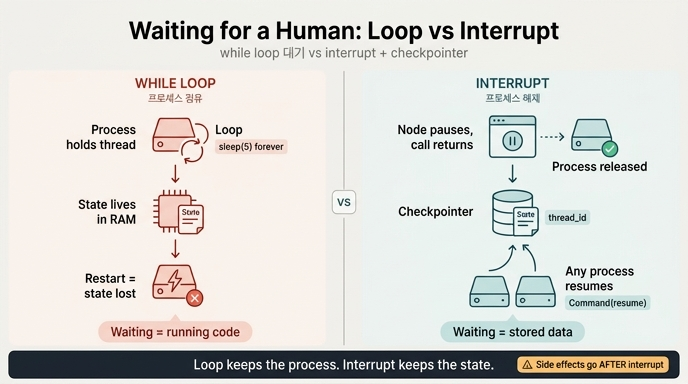

# interrupt 기반 중단 vs while 루프로 사람 기다리기

## 카드

**Q.** interrupt 기반 중단이 'while 루프로 사람 기다리기'와 결정적으로 다른 점은 무엇인가?

**A.** 상태가 체크포인터에 저장되어 서버를 재시작해도 그 자리에 남는다. 프로세스를 붙잡고 있을 필요가 없다.

---

## 한 줄 요약

**while 루프는 「기다림」을 메모리에 담고, interrupt는 「기다림」을 저장소에 담는다.**
그래서 하나는 프로세스가 죽으면 같이 죽고, 다른 하나는 프로세스가 죽어도 살아남는다.

---

## 1. while 루프로 기다리면 무슨 일이 생기나

사람의 승인을 기다리는 가장 소박한 방법은 이렇습니다.

```python
# 안티패턴
def 사람확인(s):
    ticket = 승인요청_등록(s["금액"])
    while not 승인됐나(ticket):      # 사람이 누를 때까지 여기서 돈다
        time.sleep(5)
    return {"승인": 조회(ticket)}
```

이 코드가 도는 동안 시스템이 붙잡고 있는 것들:

| 붙잡고 있는 것 | 사람이 3일 뒤 답한다면 |
|---|---|
| OS 스레드 / 이벤트 루프 슬롯 | 3일간 점유 |
| 그래프의 중간 상태 (지역 변수, 스택 프레임) | 전부 **프로세스 메모리에만** 존재 |
| DB 커넥션, HTTP 요청 타임아웃 | 진작에 끊어짐 |

그리고 결정적인 문제 — **이 프로세스가 죽는 순간 상태가 통째로 사라집니다.**
배포, OOM 킬, 노드 재스케줄링, 인스턴스 스케일다운. 운영에서 프로세스가 3일 동안 안 죽는다는 가정은 성립하지 않습니다. 상태가 스택 프레임에 있으면, 스택 프레임과 함께 증발합니다.

즉 while 루프 방식의 대기는 **「기억」이 아니라 「점유」**입니다.

---

## 2. interrupt는 무엇을 다르게 하나

23장 예제 1(`ex1_interrupt.py`)의 핵심 부분입니다.

```python
def 사람확인(s: S) -> S:
    if s["금액"] < 100_000:
        return {"승인": "자동"}

    # 여기서 그래프가 «멈춘다». 예외가 아니라 정상적인 중단이다.
    답 = interrupt({
        "물음": "이 환불을 승인하시겠습니까?",
        "금액": s["금액"],
        "근거": "고객 요청 · 상품 미개봉",
    })
    return {"승인": 답}

app = g.compile(checkpointer=InMemorySaver())   # ← 체크포인터가 있어야 성립한다
```

`interrupt()`가 호출되면 파이썬 함수는 **거기서 빠져나옵니다**(내부적으로 특수 예외가 던져지고 런타임이 받습니다). 루프를 돌지 않고, 슬립하지 않고, 그냥 **실행이 끝납니다.**

이때 런타임이 하는 일:

1. 지금까지의 그래프 상태와 「다음에 실행할 노드」를 **체크포인터에 기록**한다.
2. `invoke()`가 `__interrupt__` 값을 담아 **정상 반환**한다.
3. 프로세스는 자유로워진다. 다른 요청을 처리하거나, 그냥 종료해도 된다.

```python
out = app.invoke({"금액": 금액, ...}, cfg)   # 여기서 «반환된다». 블로킹이 아니다.

if "__interrupt__" in out:
    물음 = out["__interrupt__"][0].value
    상태 = app.get_state(cfg)
    print(f"다음에 실행할 노드: {상태.next}")   # 체크포인터가 기억하고 있다
    # ...프로세스는 안 붙잡고 있어도 된다...
```

사람이 언젠가 답하면, **완전히 다른 프로세스에서** 재개할 수 있습니다.

```python
out = app.invoke(Command(resume=사람답변), cfg)   # thread_id 만 있으면 된다
```

재개에 필요한 것은 **`thread_id` 하나**입니다. 이 문자열만 있으면 체크포인터에서 상태를 복원해서 멈춘 자리부터 이어 갑니다. 원래 프로세스가 살아 있을 필요도, 같은 서버일 필요도 없습니다.

---

## 3. 대비표

| | while 루프 대기 | interrupt + 체크포인터 |
|---|---|---|
| 대기 중 프로세스 | **점유한다** (스레드/루프 블로킹) | **놓아 준다** (호출이 반환됨) |
| 상태가 사는 곳 | 프로세스 메모리(스택 프레임) | **체크포인터**(DB/디스크) |
| 서버 재시작 | 대기 건 **소실** | 그 자리에 **그대로 남음** |
| 재개하는 주체 | 그 프로세스 그 스레드 | **아무 프로세스나**, `thread_id`로 |
| 확장 방식 | 대기 건수 = 붙잡힌 스레드 수 | 대기 건수 = **DB 행 수** |
| 대기 시간 한계 | 사실상 프로세스 수명 | 사흘이든 2주든 무관 |
| 성격 | 예외적 정지 / 임시방편 | **정상적인 중단**, 그래프의 1급 상태 |

**한 문장으로:** while 루프에서 「대기」는 *실행 중인 코드*지만, interrupt에서 「대기」는 *저장된 데이터*입니다. 실행 중인 코드는 프로세스와 운명을 같이하고, 저장된 데이터는 그렇지 않습니다.

---

## 4. 그래서 따라오는 것들

### 사람이 예외가 아니라 노드가 된다
멈춤이 「타임아웃 나기 전에 빨리 답해야 하는 비정상 상태」가 아니라 **그래프의 정상적인 한 상태**가 됩니다. 23장이 「멈추는 것은 예외가 아니다」로 시작하는 이유입니다. 승인 대기 건은 장애 알림이 아니라 조회 가능한 데이터 행입니다.

### 운영에서는 메모리 체크포인터를 쓰면 안 된다
예제의 `InMemorySaver()`는 학습용입니다. 메모리 체크포인터를 쓰면 저장 위치가 결국 프로세스 메모리라서 **while 루프와 똑같은 약점**을 갖습니다. 이 카드의 이점은 오롯이 **디스크/DB 체크포인터**(21장)에서 나옵니다.

> `ex1`, `ex2` 는 메모리 체크포인터를 씁니다. 운영에서는 21장에서 본 대로 디스크에 저장하는 체크포인터를 써야 사람이 사흘 뒤에 답해도 이어집니다.

### 대신 「노드 재실행」이라는 대가가 붙는다
체크포인트는 **노드 경계**에 찍힙니다. interrupt는 노드 *중간*에서 멈추지만, 재개하면 **그 노드의 처음부터** 다시 돕니다. 그래서 23.2의 규칙이 나옵니다.

> **interrupt 앞에는 부작용을 두지 않는다.**

```python
def 나쁜노드(s):
    메일발송()                 # 재개 시 두 번 나간다
    답 = interrupt("승인?")
    return {"승인": 답}

def 좋은노드(s):
    답 = interrupt("승인?")     # 부작용을 뒤로 민다
    기록()                     # 한 번만 실행된다
    return {"승인": 답}
```

부작용이 꼭 앞에 있어야 하면 노드를 둘로 쪼개서 `부작용 노드 → interrupt 노드`로 만듭니다. 그러면 사이에 체크포인트 경계가 생깁니다.

### 「영원히 기다림」이 공짜가 되는 함정
프로세스를 안 붙잡으니 대기 비용이 거의 0이 됩니다. 좋은 일이지만, 그래서 **아무도 안 쳐다보는 대기 건이 2주씩 묶입니다**(23장의 첫 문장). 무응답 정책(23.4)과 상태 지문 재확인(23.5)이 세트로 필요한 이유입니다.

---

## 5. 시험 대비 포인트

- 답의 핵심 단어 두 개: **체크포인터에 저장** / **프로세스를 안 붙잡음**
- 「비동기라서 다르다」는 부분적인 답입니다. async/await로 논블로킹하게 기다려도 **상태는 여전히 프로세스 메모리에** 있으므로 재시작하면 사라집니다. 결정적 차이는 비동기 여부가 아니라 **상태의 영속화**입니다.
- 재개 키는 `thread_id`, 재개 명령은 `Command(resume=...)`.
- 대가는 **노드 처음부터 재실행** → 부작용은 interrupt 뒤로.

## 참고

- [LangGraph — Interrupts / human in the loop](https://docs.langchain.com/oss/python/langgraph/interrupts)
- 21장(체크포인터·슈퍼스텝 경계), 22장(사람에게 넘기기), 24장(컨텍스트 압축)

## 인포그래픽


