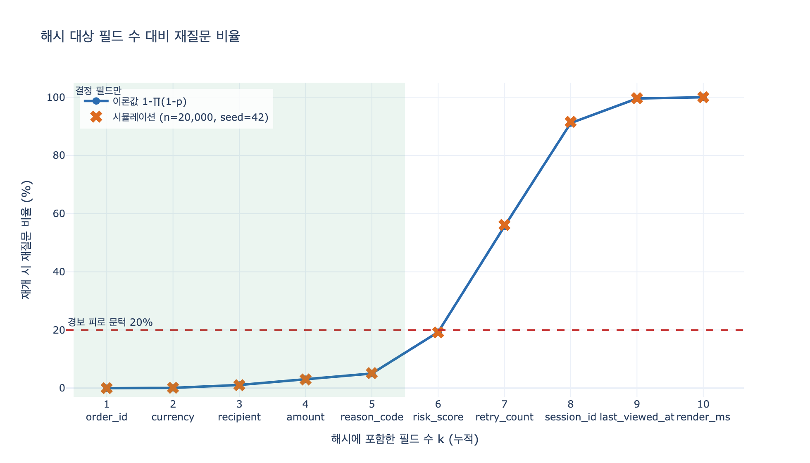

# state_hash가 필요한 이유는 무엇인가?

> **답**: 재개할 때 지문이 다르면 '승인한 내용'과 '지금 실행할 내용'이 달라진 것이다.
> 사흘 전 승인으로 오늘 420만 원을 내보내면 안 된다.

---

## 1. 문제의 구조 — 승인과 실행 사이에 시간이 있다

23장의 중단점(`interrupt`)은 그래프를 **정상적으로** 멈춘다. 멈춘 자리는 체크포인터에 저장되고, 프로세스는 죽어도 된다. 사람은 사흘 뒤에 답해도 된다. 여기까지가 23.1~23.4의 이야기다.

그런데 바로 그 장점이 이 절(23.5)의 위험을 만든다.

```
t0  그래프 멈춤     ── 사람에게 보여 준 것: "금액 300,000 / 미개봉 / 첫 환불"
      ↓
      (사흘)          ← 이 사이에 상태가 바뀔 수 있다
      ↓
t1  사람이 "승인"   ── 실제 실행할 것: "금액 4,200,000 / 개봉 / 3회차"
```

승인은 **t0의 화면**에 대해 이루어졌는데, 실행은 **t1의 상태**로 일어난다. 이 둘이 같다는 보장은 어디에도 없다. `ex5_audit.py`의 마지막 문장이 정확히 이것이다.

> `state_hash`는 그 순간의 상태 지문이다.
> 재개할 때 지문이 다르면 «승인한 그 내용»과 «지금 실행할 내용»이 다른 것이다.
> 그러면 다시 물어야 한다. 사흘 전 승인으로 오늘 4,200,000원을 내보내면 안 된다.

## 2. 그래서 승인 기록에 무엇이 들어가야 하나

`ex5_audit.py`의 `approval` 테이블에는 결정 말고 두 칸이 더 있다.

| 칸 | 뜻 | 없으면 생기는 일 |
|---|---|---|
| `shown` | 사람에게 **실제로 보여 준** 내용 | "왜 승인했느냐"에 답할 수 없다. 담당자 잘못인지 화면 잘못인지 구분이 안 된다 |
| `state_hash` | 그 순간의 **상태 지문** | 승인한 대상과 실행할 대상이 같은지 검증할 수 없다 |

`shown`은 **사후 감사**용이다(사고 난 뒤에 원인을 가른다). `state_hash`는 **사전 차단**용이다(실행 직전에 막는다). 둘은 역할이 다르고, 둘 다 있어야 한다.

책의 사례가 이 구분을 잘 보여 준다. 승인은 났는데 사고가 났고, 화면에 「3회차 환불」이 안 떠 있었다는 게 `shown`에 남아 있었다. 담당자 잘못이 아니라 화면 잘못이었다.

## 3. 지문 계산 — 무엇을 해시할 것인가

핵심은 **결정에 영향을 주는 필드만** 해시하는 것이다.

$$
h = \mathrm{SHA256}\big(\mathrm{canonical}(\{f_i : i \in D\})\big)
$$

여기서 $D$는 「결정에 영향을 주는 필드 집합」이다. `canonical`은 정규 직렬화 — 파이썬이라면 `json.dumps(obj, sort_keys=True, separators=(",", ":"), ensure_ascii=False)` 정도. 키 순서나 공백이 흔들리면 내용이 같아도 지문이 달라지므로 정규화가 필수다.

```python
DECISION_FIELDS = ("order_id", "amount", "currency", "recipient", "reason_code")

def state_hash(state: dict) -> str:
    subset = {k: state[k] for k in DECISION_FIELDS}
    blob = json.dumps(subset, sort_keys=True, separators=(",", ":"), ensure_ascii=False)
    return hashlib.sha256(blob.encode()).hexdigest()[:8]
```

재개 지점의 검사는 단순하다.

```python
if state_hash(now) != approval.state_hash:
    raise ReAsk("승인 당시와 상태가 다릅니다. 다시 확인해 주세요.")
```

## 4. 필드 범위를 넓게 잡으면 — 경보 피로

한 장 요약이 이 함정을 짚는다.

> 다만 결정에 영향을 주는 필드만 해시하세요. **매번 다시 물으면 사람이 확인 없이 누르기 시작합니다.**

상태 전체를 해시하면 `last_viewed_at`, `session_id`, `retry_count`, 렌더링 시간 같은 것까지 지문에 들어간다. 이런 필드는 거의 항상 바뀌므로 재질문이 사실상 100%가 된다. 재개할 때마다 다시 묻는 시스템은 「다시 묻지 않는 시스템」과 결과가 같아진다 — 사람이 내용을 안 보고 승인 버튼을 누르기 때문이다.

필드 $i$가 대기 중에 바뀔 확률을 $p_i$라 하고 서로 독립이라고 두면, $k$개 필드를 해시했을 때 재질문 확률은

$$
P_{\text{re-ask}}(k) = 1 - \prod_{i=1}^{k} (1 - p_i)
$$

이다. $p_i$가 작아도 $k$가 커지면 곱이 빠르게 0으로 내려간다. 즉 **재질문율은 필드 수에 대해 단조 증가하며, 노이즈 필드 하나가 전체를 망가뜨린다**. `expy.py`가 이 곡선을 수치로 그린다.

이건 23.3의 문턱 이야기와 같은 모양이다. 「전부 사람이 보는 정책은 결국 아무도 안 보는 정책이 된다」 — 문턱을 낮추면 물량이 폭증해 검토 품질이 무너지고, 해시 범위를 넓히면 재질문이 폭증해 확인 품질이 무너진다.

## 5. 다른 분야의 같은 구조

`state_hash`는 새로 발명된 물건이 아니다. 「읽은 시점의 값을 근거로 나중에 쓴다」는 패턴이 있는 곳에는 늘 같은 장치가 있다.

### 낙관적 동시성 제어 (Optimistic Concurrency Control)

DB에서 행을 읽을 때 버전 번호(또는 타임스탬프)를 같이 읽고, 갱신할 때 `WHERE id = ? AND version = ?`로 조건을 건다. 영향받은 행이 0이면 그 사이 누가 바꾼 것이므로 트랜잭션을 실패시킨다. 락을 잡지 않고도 lost update를 막는다.

`state_hash`는 **버전 번호 대신 내용 해시를 쓰는 낙관적 동시성 제어**다. 「사람의 검토」가 곧 아주 긴 읽기-쓰기 구간이고, 그 구간에 락을 걸 수는 없으니(사흘씩 잡고 있을 순 없다) 낙관적 방식이 유일한 선택지다.

### HTTP ETag / If-Match

서버는 리소스에 `ETag: "a91c"`를 붙여 준다. 클라이언트는 수정할 때 `If-Match: "a91c"`를 보내고, 그 사이 리소스가 바뀌었으면 서버가 `412 Precondition Failed`로 거절한다. 이게 "lost update problem"에 대한 HTTP 표준 답(RFC 9110)이다.

대응 관계가 거의 1:1이다.

| HTTP | 승인 관문 |
|---|---|
| `ETag` (응답에 실려 옴) | `state_hash` (승인 기록에 저장) |
| `If-Match` (수정 요청에 동봉) | 재개 시점의 지문 비교 |
| `412 Precondition Failed` | 재질문(re-ask) |
| 약한 ETag `W/"..."` — 의미상 동등하면 같음 | 결정 필드만 해시 — 무관한 변경은 무시 |

특히 **약한 ETag** 개념이 4절의 「결정 필드만 해시하라」와 정확히 같은 발상이다. 바이트가 한 글자만 달라도 다른 것으로 치면(강한 검증) 캐시가 무용지물이 되므로, 「의미상 같으면 같다」고 선언하는 것이다.

### TOCTOU (Time-of-Check to Time-of-Use)

보안 쪽에서 오래된 취약점 종류다. 검사한 시점과 사용한 시점 사이에 대상이 바뀌면 검사가 무효가 된다. 고전적인 예가 `access()`로 권한을 확인하고 `open()`으로 여는 코드 — 그 사이에 경로가 심볼릭 링크로 바뀌면 검사를 통과한 채로 다른 파일을 연다.

승인 관문은 **검사(사람의 판단)와 사용(실행) 사이가 사흘인 TOCTOU 창**이다. 보통 TOCTOU는 원자적 연산(`openat`, 파일 디스크립터 기반 검사)으로 창을 없애서 푸는데, 사람이 끼어드는 창은 없앨 수가 없다. 없앨 수 없으니 **창이 열려 있는 동안 대상이 바뀌었는지 검출**하는 쪽으로 푼다. 그게 `state_hash`다.

## 6. 실무에서 걸리는 것들

- **정규 직렬화가 안정적이어야 한다.** 키 순서, 부동소수점 표현, 유니코드 이스케이프, `None` 처리가 흔들리면 아무것도 안 바뀌었는데 지문이 달라진다. 금액은 float 대신 정수(최소 화폐 단위)나 문자열로 두는 게 안전하다.
- **재질문이 뜨면 무엇이 바뀌었는지 보여 줘야 한다.** 「상태가 바뀌었습니다」만 띄우면 사람은 그냥 다시 승인한다. 어느 필드가 얼마에서 얼마로 바뀌었는지 diff를 보여 줘야 재검토가 실제로 일어난다.
- **`DECISION_FIELDS` 자체가 버전 관리 대상이다.** 필드 목록을 바꾸면 과거 기록의 지문과 비교가 성립하지 않는다. 승인 기록에 해시 스킴 버전을 같이 남겨 두는 게 좋다.
- **해시는 무결성 증명이 아니다.** `state_hash`는 「같은 것을 실행하는가」를 확인하는 장치이지, 「기록이 위조되지 않았는가」를 보장하진 않는다. 후자가 필요하면 감사 로그 자체에 append-only 저장소나 서명이 필요하다.
- **`shown`은 렌더링 결과여야 한다.** 상태 원본이 아니라 사람 눈에 실제로 들어간 문자열을 남겨야 「3회차 환불이 화면에 안 떴다」를 나중에 증명할 수 있다.

## 7. 한 줄 정리

`state_hash`는 **사람의 승인이 어느 상태에 대한 승인이었는지 못 박아 두는 장치**다. 중단점이 시간의 창을 열어 준 대가로, 그 창 동안 대상이 바뀌지 않았음을 실행 직전에 확인해야 한다. 범위를 좁게(결정 필드만) 잡아야 이 장치가 살아 있고, 넓게 잡으면 경보 피로로 스스로 무력해진다.

## 시각화


