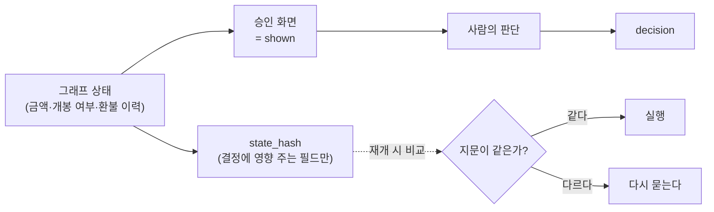

# 승인 기록에서 「보여 준 내용」이 결정적인 이유

> **Q.** 승인 기록에서 '보여 준 내용'이 왜 결정적인가?
>
> **A.** 결정만 남기면 "왜 승인했느냐"에 답할 수 없다. 담당자 판단 오류인지 시스템이 잘못된 정보를 보여 준 것인지 구분되지 않는다.

출처: 23장 「사람이 끼어드는 지점」 · 23.5 무엇을 보여 줬는지 남긴다 · `code/ex5_audit.py`

---

## 1. 한 줄로 줄이면

**승인은 「사람」이 「입력」을 보고 내린 함수의 출력이다. 출력만 저장하면 함수를 역추적할 수 없다.**

`decision = f(사람, 화면에 뜬 것)` 인데 기록에 `decision` 과 `사람` 만 남기면, 사고가 났을 때 남는 결론은 딱 하나다. "그 사람이 잘못 눌렀다." 그런데 그건 세 가지 중 하나일 뿐이다.

## 2. 결정만 남겼을 때 구분되지 않는 것들

승인이 났는데 사고가 났다. 원인은 최소한 셋인데, `decision` 칸만으로는 전부 똑같이 보인다.

| 실제 원인 | 기록에 남는 모습 | 고쳐야 할 곳 |
|---|---|---|
| 담당자가 필요한 정보를 다 보고도 잘못 판단했다 | `kim / 승인` | 사람 — 교육, 문턱, 네 눈 원칙 |
| 시스템이 결정에 필요한 필드를 화면에 안 띄웠다 | `kim / 승인` | 화면 — 승인 UI의 표시 항목 |
| 승인 시점과 실행 시점의 상태가 달라졌다 | `kim / 승인` | 파이프라인 — 상태 지문 재확인 |

세 줄이 전부 `kim / 승인` 이다. **기록이 원인을 구분하지 못하면, 조직은 언제나 제일 만만한 원인을 고른다. 그게 사람이다.**

`shown` 칸이 있으면 이 셋이 갈린다. 책의 실제 사례가 정확히 그 경우다.

> 실제로 저희는 이걸로 한 번 갈렸다. 승인은 났는데 사고가 났고, 화면에 «3회차 환불»이 안 떠 있었다는 게 기록으로 남아 있었다. **담당자 잘못이 아니라 화면 잘못이었다.**
>
> — `ex5_audit.py`

`ROWS` 를 보면 `"금액 890,000 / 개봉 / 3회차 환불"` 처럼 반복 환불 이력이 들어간 행이 있다. 그 필드가 빠진 화면을 본 담당자는 애초에 다른 문제를 풀고 있었던 것이다. 같은 사람이 같은 규정을 알고 있어도, **입력이 다르면 정답이 다르다.**

## 3. 그래서 스키마가 이렇게 생겼다

`ex5_audit.py` 의 `approval` 테이블은 승인 한 건을 「누가·언제·무엇을 보고·무엇을 결정했나」로 쪼갠다.

```sql
CREATE TABLE approval (
  id           INTEGER PRIMARY KEY,
  thread_id    TEXT NOT NULL,   -- 어느 실행인가 (체크포인터 스레드와 연결)
  node         TEXT NOT NULL,   -- 그래프의 어느 노드에서 물었나
  asked_at     TEXT NOT NULL,   -- 물은 시각
  answered_at  TEXT,            -- 답한 시각 (NULL이면 미응답 → 23.4 무응답 정책)
  actor        TEXT,            -- 누가
  decision     TEXT,            -- 무엇을 결정했나
  shown        TEXT NOT NULL,   -- 사람에게 «실제로 보여 준» 내용   ← 이 카드의 핵심
  state_hash   TEXT NOT NULL    -- 그 순간의 상태 지문
);
```

주목할 점 두 가지.

- `actor`, `decision`, `answered_at` 은 **NULL 허용**이다. 아직 답을 안 했을 수 있으니까 (`환불-A1050` 행이 그렇다).
- `shown` 과 `state_hash` 는 **NOT NULL** 이다. 물어보는 순간 이미 확정되는 값이고, 이게 없으면 그 기록은 애초에 감사 가치가 없다는 뜻이다. 스키마가 그 우선순위를 말하고 있다.



## 4. `shown` 과 `state_hash` 는 서로 다른 일을 한다

둘 다 「그 순간」을 붙잡지만 방향이 반대다.

| | `shown` | `state_hash` |
|---|---|---|
| 언제 쓰나 | 사고 **후** 원인을 되짚을 때 | 재개 **전** 실행해도 되는지 볼 때 |
| 답하는 질문 | "왜 그렇게 결정했나?" | "승인한 그것과 지금 실행할 것이 같은가?" |
| 형태 | 사람이 읽을 수 있는 원문 | 압축된 지문(해시) |
| 없으면 | 책임이 항상 사람에게 떨어진다 | 사흘 전 승인으로 오늘 4,200,000원이 나간다 |

`shown` 을 해시로만 저장하면 안 되는 이유가 여기 있다. 해시는 **다르다는 사실**만 말해 주지 **무엇이 없었는지**는 말해 주지 않는다. "3회차 환불이 화면에 없었다"는 결론은 원문을 보관했기 때문에 나올 수 있었다.

반대로 `state_hash` 는 원문일 필요가 없고, 한 장 요약이 경고하듯 **결정에 영향을 주는 필드만** 넣어야 한다.

> 지문이 다르면 다시 물으세요. 다만 결정에 영향을 주는 필드만 해시하세요. **매번 다시 물으면 사람이 확인 없이 누르기 시작합니다.**

`last_viewed_at` 같은 필드까지 해시에 넣으면 지문이 계속 바뀌고, 재확인 요청이 쏟아지고, 담당자는 읽지 않고 승인 버튼을 누르는 기계가 된다. 그러면 `shown` 을 아무리 잘 남겨도 소용없다. 승인 관문이 형식만 남는 것이다 — 23.3에서 「전부 사람이 보는 정책」이 결국 「아무도 안 보는 정책」이 되는 것과 똑같은 실패다.

## 5. W3C PROV-O로 보면 — 빠진 것은 `prov:used`

키워드 표에서 감사 추적의 출처로 [W3C PROV-O](https://www.w3.org/TR/prov-o/)를 든 이유가 이 카드와 직결된다. PROV-O는 「무언가가 왜 이렇게 됐는가」를 세 가지 축으로 모델링한다.

- **Entity** — 사물·데이터. 여기서는 *승인 화면에 뜬 내용*과 *승인 결정*.
- **Activity** — 시간에 걸쳐 일어난 일. 여기서는 *승인 검토*.
- **Agent** — 책임 주체. 여기서는 *담당자 kim*.

이 셋을 잇는 관계가 provenance의 뼈대다.

| PROV-O 관계 | 뜻 | `approval` 테이블의 칸 |
|---|---|---|
| `prov:wasAssociatedWith` | Activity에 책임 있는 Agent | `actor` |
| `prov:startedAtTime` / `prov:endedAtTime` | Activity의 시작·끝 | `asked_at` / `answered_at` |
| `prov:wasGeneratedBy` | Activity가 만들어 낸 Entity | `decision` |
| **`prov:used`** | **Activity가 소비한 입력 Entity** | **`shown`** |
| `prov:wasDerivedFrom` | 결과가 어느 입력에서 나왔나 | `decision` ← `shown` |

**결정만 남긴 기록은 `wasGeneratedBy` 와 `wasAssociatedWith` 만 있고 `used` 가 없는 그래프다.** 노드는 있는데 들어오는 간선이 없다. PROV-O에서 그런 그래프는 "kim이 승인을 만들어 냈다"까지만 말할 수 있고, "무엇에 근거해서"는 말할 수 없다. 그래서 책임 귀속(attribution)은 되지만 인과 설명(derivation)은 안 된다. 사고 조사에서 필요한 건 후자다.

PROV-O에 `prov:qualifiedUsage` 같은 한정 클래스가 따로 있는 것도 같은 맥락이다. "썼다"만으로는 부족해서 **어떤 역할로 언제 썼는지**를 붙일 수 있게 만들어 뒀다. `shown` 을 원문 그대로 남기는 것이 이 한정(qualification)의 가장 실용적인 형태다.

## 6. 일반적인 감사 추적 요건과의 관계

규제 산업의 감사 추적 요건은 대체로 「누가·언제·무엇을·왜」의 4종 세트를 요구한다. 앞의 셋은 대부분의 시스템이 남기지만, **「왜」는 자동으로 생기지 않는다.** 사람의 머릿속 이유를 저장할 수는 없으니, 실무에서 「왜」를 가장 가깝게 복원하는 재료가 바로 *그때 그 사람 앞에 놓여 있던 정보*다.

여기서 함께 보면 좋은 것들.

- **재구성 가능성(reconstructability)** — 감사인이 그 시점을 재현할 수 있어야 한다. `shown` + `state_hash` 조합이 이걸 담당한다.
- **불변성(immutability)** — 승인 기록은 사후 수정되면 안 된다. append-only 로 다루고, 정정이 필요하면 새 행을 추가한다.
- **네 눈 원칙(four-eyes)** — 두 사람이 봐야 하는 건이라면 `actor` 가 둘이어야 하고, 그때 **각자에게 보여 준 내용**이 달랐는지도 봐야 한다. 두 사람이 똑같이 잘못된 화면을 봤다면 눈이 넷이어도 소용이 없다.

## 7. 실무에서 자주 어긋나는 지점

- **화면 코드와 감사 코드를 따로 만든다.** 승인 UI가 렌더링한 것과 `shown` 에 기록한 것이 다르면 기록 전체가 거짓이 된다. 화면을 그리는 그 데이터 구조를 그대로 직렬화해 저장하는 것이 안전하다.
- **상태 전체를 통째로 저장한다.** 23장 말미가 예고하듯("다음 장에서 뒤집히는 것"), 이렇게 쌓다 보면 상태가 터진다. 24장의 컨텍스트 관리와 이어지는 지점이라, 「결정에 영향을 주는 필드」로 범위를 좁히는 판단이 필요하다.
- **참조만 남긴다.** `order_id` 만 저장하고 화면 내용은 조회로 재현하겠다는 설계는, 원본 레코드가 바뀌는 순간 무너진다. 사고가 나는 건 대체로 데이터가 바뀌었기 때문인데, 그때 재현되는 화면은 사고 당시의 화면이 아니다. **스냅샷으로 남겨야 한다.**
- **미응답 행을 안 남긴다.** `환불-A1050` 처럼 `answered_at` 이 NULL인 행이 있어야 23.4의 무응답 정책(재알림·등급 올리기)이 데이터 위에서 돈다. 물어본 순간에 행을 먼저 쓰고, 답이 오면 UPDATE 하는 순서가 맞다.

## 8. 되짚기용 요약

- 승인은 사람과 **입력**의 함수다. 결정만 남기면 입력이 사라져 함수를 역추적할 수 없다.
- 그래서 담당자 판단 오류와 시스템 표시 오류가 기록상 똑같아 보이고, 책임은 늘 사람에게 떨어진다.
- `shown` 은 사고 **후** 원인 구분용(원문 보관), `state_hash` 는 재개 **전** 안전 확인용(결정에 영향 주는 필드만).
- PROV-O로 말하면 결정만 남긴 기록은 `prov:used` 가 없는 provenance 그래프다. 귀속은 되지만 설명은 안 된다.
- 지문 범위를 너무 넓게 잡으면 재확인이 잦아지고, 사람은 확인 없이 누르기 시작한다. 그 순간 관문은 형식만 남는다.
