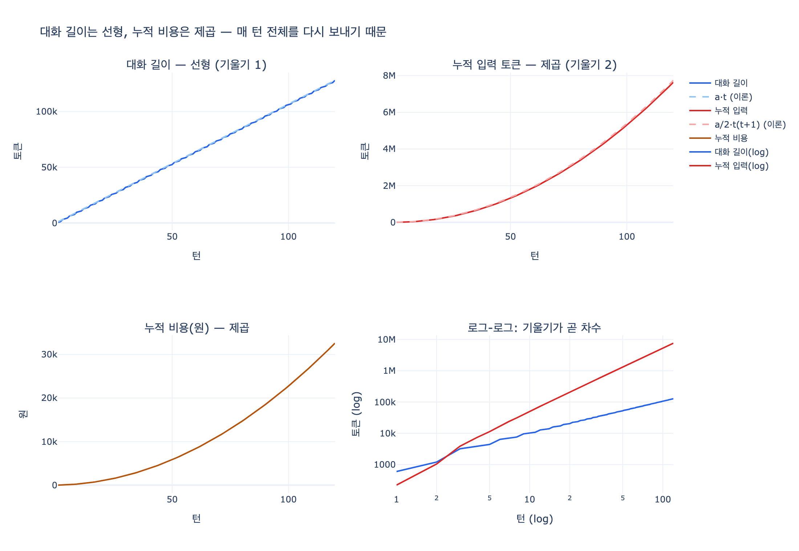

# 대화 길이와 누적 비용은 각각 어떻게 자라는가?

> **답** 대화 길이는 **선형**으로 자라고 누적 비용은 **제곱**으로 자란다. 매 턴 전체를 다시 보내기 때문이다.

24장 24.1절 「선형으로 자라는 것과 제곱으로 자라는 것」 / 예제 `ex1_growth.py`의 핵심.

---

## 왜 제곱인가

모델 API는 **스테이트리스**다. 서버가 지난 대화를 기억하지 않는다.
그래서 클라이언트는 매 턴 **지금까지의 대화 전체**를 입력으로 다시 실어 보낸다.

한 턴에 대화에 새로 붙는 양을 $a$라고 하자. 그러면

| 재는 대상 | 식 | 차수 |
|---|---|---|
| 턴 $t$에서의 대화 길이 | $H(t) \approx a\,t$ | **선형** $O(t)$ |
| 턴 $t$에서 «한 번» 보내는 입력 | $H(t) \approx a\,t$ | **선형** $O(t)$ |
| 1턴부터 $t$턴까지 «누적» 입력 | $S(t) = \sum_{k=1}^{t} H(k) \approx \dfrac{a}{2}t^2$ | **제곱** $O(t^2)$ |
| 누적 비용 | $S(t) \times$ 단가 | **제곱** $O(t^2)$ |

선형인 것을 매 턴 한 번씩 더하면 삼각수 $\frac{t(t+1)}{2}$가 된다. 이게 제곱의 전부다.

> **한 줄로** 매 턴 보내는 양은 선형인데, 그걸 턴 수만큼 반복하니 누적은 제곱이 된다.

가장 실용적인 형태로 바꾸면:

$$\frac{S(2t)}{S(t)} \approx \frac{(2t)^2}{t^2} = 4$$

**턴이 2배가 되면 비용은 4배가 된다.** 이게 감이 잘 안 오는 부분이다.

---

## 숫자로 보기

24장 예제의 파라미터(사용자 입력 220토큰, 모델 출력 380토큰, 3턴마다 도구 결과 1,400토큰,
입력 $3/1M · 출력 $15/1M, 1,380원/달러, 창 200K)로 시뮬레이션한 결과다.

| 턴 | 대화 길이 | 누적 입력 | 누적 비용 | 창 사용률 |
|---:|---:|---:|---:|---:|
| 1 | 600 | 220 | 9원 | 0% |
| 5 | 4,400 | 11,300 | 86원 | 2% |
| 10 | 10,200 | 50,200 | 286원 | 5% |
| 20 | 20,400 | 206,600 | 1,013원 | 10% |
| 40 | 42,200 | 840,800 | 3,796원 | 21% |
| 80 | 84,400 | 3,387,800 | 14,655원 | 42% |
| 120 | 128,000 | 7,642,400 | 32,583원 | 64% |

턴이 2배가 될 때의 배수를 직접 재 보면 두 열의 성격 차이가 드러난다.

| 구간 | 대화 길이 | 누적 입력 | 누적 비용 |
|---|---:|---:|---:|
| 10턴 → 20턴 | ×2.00 | ×4.12 | ×3.53 |
| 20턴 → 40턴 | ×2.07 | ×4.07 | ×3.75 |
| 40턴 → 80턴 | ×2.00 | ×4.03 | ×3.86 |
| 60턴 → 120턴 | ×2.00 | ×4.02 | ×3.91 |

- 대화 길이는 **2배** — 선형이 맞다.
- 누적 입력은 **4배** — 제곱이 맞다.
- 비용 배수가 4보다 살짝 작은 건 출력 토큰($\propto t$, 선형)이 섞여 있어서다.
  턴이 길어질수록 입력이 지배하므로 4에 수렴한다(3.53 → 3.91).

로그–로그 회귀로 차수를 직접 재면 대화 길이 **1.03**, 누적 입력 **2.02**가 나온다.

---

## 이 사실이 실무에서 뜻하는 것

### 1. 「창이 아직 안 찼으니 괜찮다」는 잘못된 안심

120턴에서도 창 사용률은 64%다. 아직 창은 남았다.
그런데 누적 비용은 이미 20턴 대비 **32배**다.

| | 창 사용률 | 누적 비용 |
|---|---:|---:|
| 20턴 | 10% | 1,013원 |
| 120턴 | 64% | 32,583원 |
| 배수 | ×6.3 | **×32.2** |

**비용은 창이 차기 훨씬 전에 문제가 된다.** 컨텍스트 관리를 「창이 찰 때 하는 일」로 미루면 늦는다.

### 2. 「6.4배 청구서」가 생기는 메커니즘

24장 도입부의 사건이 정확히 이 제곱이다.

- 테스트할 때 20턴만 해 봤고, 그 숫자로 예산을 잡았다 (기준을 잡은 이유는 사실 없었다)
- 실제 사용자는 평균 **47턴**을 썼다
- 턴 배수는 $47/20 = 2.35$배 — 「좀 더 쓰네」 정도로 보인다
- 그런데 비용은 $2.35^2 \approx 5.5$배. 예제 파라미터로 재면 **5.1배**

턴 수를 선형으로 눈대중하고 비용도 선형일 거라 가정한 것이 오차의 전부다.

### 3. 그래서 무엇을 하나

제곱의 원인이 「전체 재전송」이므로, 손댈 곳은 **매 턴 보내는 $H(t)$를 상수로 눌러 두는 것**이다.
$H$가 상수 $C$로 고정되면 누적은 $C\,t$, 즉 **선형으로 내려온다.**

| 수단 | 절 | 하는 일 |
|---|---|---|
| 최근 N턴만 유지 | 24.2 | $H$를 상한으로 자른다 (가장 많이 줄이고 가장 많이 잃는다) |
| 요약·압축 | 24.2~24.3 | 오래된 구간을 짧은 블록으로 대체 |
| 오프로딩 | 24.4 | 본문은 밖에 두고 상태·컨텍스트에는 참조만 |
| 계층 기억 | 24.5 | 위 계층에서 끝나는 질문은 아래를 안 건드린다 |
| 프롬프트 캐싱 | — | 재전송 자체는 남지만 접두사 단가를 낮춘다 |

단, 줄일 때는 **절감률만 보지 말 것**. 「나중에 실제로 참조되는 사실이 몇 % 남는가」를 같이 재야
절반이 아니라 전체를 잰 것이다(24.2). 그리고 요약은 **이유와 제약**을 먼저 버린다(24.3).

---

## 자주 헷갈리는 지점

- **「대화 길이도 제곱 아닌가?」** 아니다. 턴마다 비슷한 양이 붙으니 선형이다. 제곱이 되는 건 «누적으로 보낸 양»이다.
- **「매 턴 요금도 제곱인가?」** 아니다. 한 턴의 요금은 $H(t) \propto t$, 선형이다. 제곱인 것은 대화 전체의 «합계»다.
- **「출력 토큰도 제곱인가?」** 아니다. 출력은 턴당 일정하므로 누적도 선형이다. 제곱은 **입력 쪽에서만** 발생한다.
- **「캐싱하면 제곱이 사라지나?」** 아니다. 재전송 자체는 그대로라 여전히 $O(t^2)$이고, 상수(단가)만 작아진다.

---

## 출처

- [context window](https://docs.claude.com/en/docs/build-with-claude/context-windows) — 컨텍스트 창 [사실상 표준]
- [effective context engineering for AI agents](https://www.anthropic.com/engineering/effective-context-engineering-for-ai-agents) — 컨텍스트 엔지니어링·압축 [실험]
- [prompt caching](https://docs.claude.com/en/docs/build-with-claude/prompt-caching) — 프롬프트 캐싱 [사실상 표준]
- [token counting](https://docs.claude.com/en/docs/build-with-claude/token-counting) — 토큰 계산 [사실상 표준]

단가는 확인 시점(2026년 8월) 공개 가격표 기준 예시. 지금 값은 각 벤더 가격 페이지에서 확인할 것.

## 시각화

왼쪽 위는 직선(선형), 오른쪽 위는 위로 휘는 곡선(제곱)이다.
점선은 이론값 $a\,t$와 $\frac{a}{2}t(t+1)$로, 실측과 거의 겹친다.
오른쪽 아래 로그–로그 그래프에서 두 선의 **기울기가 곧 차수**다 — 파란 선은 1, 빨간 선은 2.
