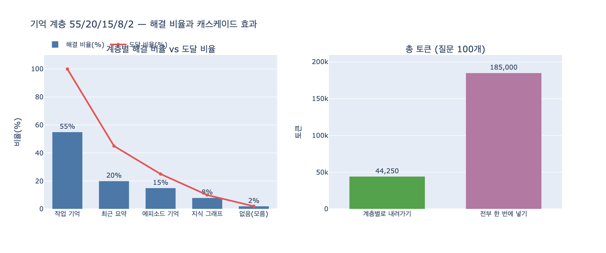

# 각 기억 계층의 해결 비율은 어떻게 분포하는가?

**답: 작업 기억 55%, 최근 요약 20%, 에피소드 기억 15%, 지식 그래프 8%, 모름 2%다.**

출처: 24장 「컨텍스트가 꽉 찼습니다」 24.5절 *기억을 계층으로 나누기* / 예제 `code/ex5_memory_tiers.py`

---

## 1. 표 원문

`ex5_memory_tiers.py`의 `TIERS` 상수가 이 카드의 전부다.

```python
TIERS = [
    # 이름            지연(ms)  건당 토큰   이 계층에서 답이 나올 확률
    ("작업 기억",         0.0,      0,      0.55),   # 지금 컨텍스트 안
    ("최근 요약",         1.5,    350,      0.20),   # 이번 세션 요약
    ("에피소드 기억",     18.0,    900,      0.15),   # 지난 세션 기록
    ("지식 그래프",       42.0,    600,      0.08),   # 27장에서 다룬다
    ("없음(모름)",       0.0,      0,      0.02),
]
```

| 계층 | 무엇인가 | 지연 | 건당 토큰 | **해결 비율** |
|---|---|---:|---:|---:|
| 작업 기억 | 지금 컨텍스트 안에 이미 있는 것 | 0.0ms | 0 | **55%** |
| 최근 요약 | 이번 세션의 압축 요약 | 1.5ms | 350 | **20%** |
| 에피소드 기억 | 지난 세션들의 기록 저장소 | 18.0ms | 900 | **15%** |
| 지식 그래프 | 구조화된 장기 지식 (27장) | 42.0ms | 600 | **8%** |
| 없음(모름) | 어디에도 답이 없는 질문 | 0.0ms | 0 | **2%** |

## 2. 왜 "모름 2%"까지 세는가

$$0.55 + 0.20 + 0.15 + 0.08 + 0.02 = 1.00$$

다섯 값의 합이 정확히 1이다. 즉 이건 임의로 고른 숫자 다섯 개가 아니라 **확률 분포**다.
"모름"을 빼면 98%밖에 안 되고, 그러면 남은 2%가 어디로 갔는지 계산이 설명하지 못한다.
계층 설계에서 "여기서도 못 찾으면 모른다고 말한다"는 종착 계층을 명시하는 것이 중요하다는 뜻이기도 하다.
종착 계층이 없으면 시스템은 답을 못 찾았을 때 **지어내거나 무한히 뒤진다**.

## 3. 해결 비율 vs 도달 비율 — 헷갈리기 쉬운 지점

카드가 묻는 55/20/15/8/2는 **해결 비율**($p_i$, 전체 질문 중 그 계층에서 답이 나오는 비율)이다.
코드에서 파생되는 또 하나의 값이 **도달 비율**($r_i$, 그 계층까지 내려온 질문 비율)인데, 둘은 다르다.

$$r_1 = 1, \qquad r_{i+1} = r_i - p_i \qquad\Longrightarrow\qquad r_i = 1 - \sum_{j<i} p_j$$

```
계층            도달 r_i    해결 p_i
작업 기억          1.00      0.55
최근 요약          0.45      0.20
에피소드 기억      0.25      0.15
지식 그래프        0.10      0.08
없음(모름)         0.02      0.02
```

`ex5`의 `cascade()`가 하는 일이 정확히 이것이다.

```python
reached = remaining          # 이 계층까지 «내려온» 질문 비율
hit = p                      # 이 계층에서 «해결되는» 질문 비율
ms  += reached * N_Q * lat
tok += reached * N_Q * t
remaining -= p
```

**지연·토큰 비용은 `hit`이 아니라 `reached`에 곱한다.** 그 계층을 "찾아봤다"는 사실 자체가 비용이지,
"거기서 답이 나왔다"가 비용이 아니기 때문이다.

## 4. 이 분포가 만드는 결과 (질문 100개 기준)

| 방식 | 총 지연 | 총 토큰 | 토큰 비용($3/1M, 1,380원/USD) |
|---|---:|---:|---:|
| 계층별로 내려가기 | 937.5ms | 44,250 | 183원 |
| 전부 한 번에 넣기 | 6,150ms | 185,000 | 766원 |

지연은 **15.2%**, 토큰은 **23.9%**로 떨어진다.

이유는 비용이 도달 비율로 가중되기 때문이다.

$$\mathbb{E}[\text{tokens}] = \sum_i r_i \cdot t_i
= 1.00\cdot 0 + 0.45\cdot 350 + 0.25\cdot 900 + 0.10\cdot 600 + 0.02\cdot 0 = 442.5$$

가장 비싼 지식 그래프(42ms, 600토큰)는 질문 100개 중 **10개**만 건드린다.
반대로 "전부 한 번에"는 모든 계층에 가중치 1을 주므로 질문 1개당 61.5ms / 1,850토큰이 그냥 고정으로 나간다.

> 55%가 여기서 하는 일: **첫 계층이 절반 이상을 0ms / 0토큰에 끝내 버린다.**
> 아래 계층들의 도달 비율이 통째로 절반 아래로 깎이는 출발점이 이 숫자다.
> 24.5절의 표현대로 "비싼 조회를 안 하는 것이 빠른 조회를 만드는 것보다 크게 듣는다".

## 5. 왜 하필 55%가 맨 위인가

작업 기억이 가장 큰 비중을 가진 것은 우연이 아니라 **에이전트 대화의 성질**이다.
직전 몇 턴 안에서 나온 값을 다시 묻는 질문이 전체의 다수를 차지한다.
이 장 앞부분(24.4절 오프로딩)에서 "무엇을 버릴지는 중요도가 아니라 «몇 번 쓰나»로 정한다"고 한 것과 같은 관찰이다.
자주 쓰이는 것은 이미 위쪽 계층에 있고, 아래 계층은 **가끔·희귀하게** 필요한 것을 맡는다.

거꾸로 말하면, 이 분포가 **어떤 시스템에서나 55/20/15/8/2**라는 뜻은 아니다.
- 세션이 짧고 반복 질의가 많으면 $p_1$ 이 커진다.
- 새 세션에서 과거 프로젝트 이력을 캐묻는 워크로드면 에피소드 기억 비중이 커진다.
- 각자 자기 로그에서 재야 하는 값이고, 24장은 "이 형태로 재라"를 보여 주는 예시 값이다.

## 6. 함정 — 55%가 틀리면 "틀린 채로 빠르다"

예제 마지막 문단이 이 카드의 진짜 결론이다.

> 이 계산은 «위 계층이 맞을 때»를 전제한다.
> 작업 기억에 오래된 값이 남아 있으면 잘못된 답으로 55%를 처리한다.
> 그러면 아래 계층은 영영 안 불린다. 틀린 채로 빠르다.

캐스케이드는 **첫 히트에서 멈춘다**. 그래서 상위 계층이 낡으면 하위 계층이 가진 정확한 값이
있어도 조회되지 않는다. 작업 기억이 낡아 있을 확률을 $s$ 라 하면

$$\text{조용한 오답률} \approx p_1 \cdot s$$

$p_1 = 0.55$ 에서 $s = 10\%$ 면 질문 100개당 5.5건이 **에러 없이** 틀린다.
비중이 클수록 빠르지만 그만큼 갱신 실패의 대가도 크다는 뜻이다.

그래서 24장 한 장 요약은 이렇게 맺는다.

> 대신 위 계층이 낡으면 틀린 채로 빨라지니, **계층마다 유효 기간을 두세요.**

계층 설계에서 제일 중요한 변수는 속도가 아니라 **갱신(TTL / 무효화)** 이다.

## 7. 암기 포인트

- 순서와 값: **55 → 20 → 15 → 8 → 2** (위에서 아래로, 단조 감소)
- 계층 이름 순서: 작업 기억 → 최근 요약 → 에피소드 기억 → 지식 그래프 → 모름
- 합이 정확히 100%. "모름"이 종착 계층.
- 파생값 도달 비율: 100 → 45 → 25 → 10 → 2
- 비용은 해결 비율이 아니라 **도달 비율**에 곱해진다.

## 시각화


