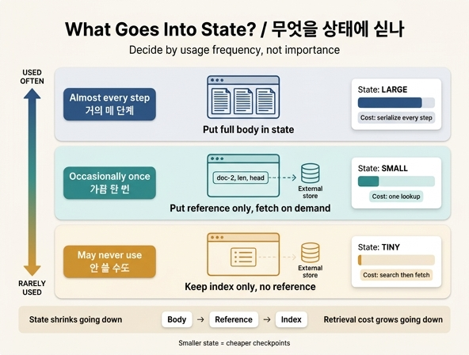

# 무엇을 상태에 실을지 판단하는 세 가지 기준

> **Q.** 무엇을 상태에 실을지 판단하는 세 가지 기준은 무엇인가?
>
> **A.** 거의 매 단계 쓰면 상태에 싣고, 가끔 한 번 쓰면 참조만 싣고 그때 꺼내고, 안 쓸 수도 있으면 참조도 싣지 말고 색인만 남긴다.

## 한 줄로

기준은 **중요도가 아니라 「몇 번 쓰나」(사용 빈도)** 입니다. 24장 24.4절 「상태에는 참조만 싣는다」의 결론이자, `ex4_offload.py` 마지막 출력에 그대로 적혀 있는 세 줄입니다.

## 세 단계 판단표

| 얼마나 쓰나 | 상태에 무엇을 싣나 | 상태 크기 | 값을 치르는 곳 |
|---|---|---|---|
| **거의 매 단계 쓴다** | 본문(inline) 그대로 싣는다 | 크다 | 매 슈퍼스텝 직렬화 비용 |
| **가끔 한 번 쓴다** | 참조(ID·길이·머리말)만 싣고 그때 꺼낸다 | 작다 | 꺼내 오는 조회 1회 |
| **안 쓸 수도 있다** | 참조도 빼고 **색인(index)만** 남긴다 | 가장 작다 | 있는지 찾는 검색 + 조회 |

핵심은 세 가지가 "좋은 것/나쁜 것"이 아니라 **빈도에 따라 최적점이 옮겨간다**는 점입니다. 매 단계 쓸 걸 참조로 두면 조회를 매 단계 하게 되고(왕복 비용 폭발), 한 번 쓸 걸 본문으로 실으면 나머지 단계 내내 그 짐을 직렬화합니다.

## 왜 이 기준인가 — ex4_offload.py가 잰 것

예제는 4만 자짜리 문서 6편을 12단계 그래프에서 다룹니다.

```python
def run_inline(db):
    """본문을 상태에 통째로 싣고 다닌다."""
    state["docs"].append({"id": f"doc-{step}", "body": body})   # 본문 통째로
    blob = json.dumps(state, ensure_ascii=False)                 # 슈퍼스텝마다 직렬화

def run_ref(db):
    """참조만 싣고, 필요할 때 꺼내 쓴다."""
    state["docs"].append({"id": f"doc-{step}", "len": len(DOC), "head": DOC[:40]})
    if step == N_STEPS - 1:          # 마지막에 실제로 한 편만 읽는다
        db.execute("SELECT body FROM doc WHERE id=?", ("doc-2",)).fetchone()
```

결과가 말하는 것:

- 상태 크기와 직렬화 시간이 **수백 배 단위로** 벌어집니다. 상태는 슈퍼스텝마다 다시 직렬화되므로, 본문 한 번의 낭비가 단계 수만큼 곱해집니다.
- **6편을 다 실어 놓고 1편만 썼다면, 5편은 그냥 짐이었습니다.** 이 문장이 세 기준을 만든 관찰입니다.
- 참조 방식이 공짜는 아닙니다. 마지막에 문서 한 편을 꺼내는 **조회가 한 번** 듭니다. 그 한 번이 매 단계로 늘어나는 순간 판정은 뒤집힙니다.

## 21장과 만나는 지점

예제 주석이 명시적으로 되짚습니다. 21장에서 「**상태가 32KB를 넘으면 체크포인터 비용이 꺾인다**」고 쟀는데,

- 본문을 실으면 그 임계를 한참 넘고,
- 참조만 실으면 꺾이는 지점 아래로 내려옵니다.

그래서 24장의 한 장 요약은 이렇게 말합니다. **「컨텍스트를 줄이는 일」과 「체크포인트를 싸게 만드는 일」이 사실 같은 일이었다.** 상태에 참조만 실으면 두 문제가 한 번에 풀립니다.

## 형제 개념과 헷갈리지 않기

24장에는 「몇 번 쓰나로 판단한다」는 규칙이 두 군데 나옵니다. 대상이 다릅니다.

| | 대상 | 기준 |
|---|---|---|
| **24.2 / 무엇을 버릴지** | 대화 히스토리(컨텍스트) | 중요도가 아니라 「몇 번 참조되나」. 단, **사용자가 명시한 제약은 횟수와 무관하게 남긴다** |
| **24.4 / 무엇을 상태에 실을지** | 그래프 상태(state) | 「몇 번 쓰나」 → 본문 / 참조 / 색인 3단계 |

또한 `ex2_strategies.py`의 네 가지 줄이기 방법 중 **「밖에 저장 + 색인」(offload)** 이 사실 보존율에서 가장 앞섰던 것도 같은 맥락입니다. 색인만 남기고 본문은 밖에 두니까요. 대신 **조회가 틀리면(엉뚱한 걸 꺼내 오면) 요약보다 나쁠 수도** 있습니다.

## 외우는 방법

> **매 단계 → 본문 / 가끔 → 참조 / 안 쓸 수도 → 색인**

한 칸 내려갈수록 상태에 남는 것이 얇아지고(본문 → 참조 → 색인), 대신 필요할 때 치르는 값(조회 → 검색+조회)이 커집니다.

## 인포그래픽


