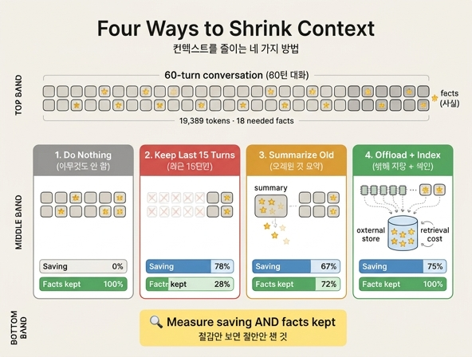

# `ex2_strategies.py`가 비교하는 네 가지 방법

**Q.** `ex2_strategies.py`가 비교하는 네 가지 방법은 무엇인가?

**A.** 아무것도 안 함, 최근 15턴만 유지, 오래된 것 요약, 밖에 저장 + 색인(오프로딩)이다.

---

## 이 예제가 왜 있나

24장 도입부의 사건은 "한 달 청구서가 예상의 6.4배"였습니다. `ex1_growth.py`가 그 원인(매 턴 전체 대화를 다시 보내니 누적 비용이 제곱으로 자란다)을 보여 준다면, `ex2_strategies.py`는 **그럼 뭘 줄일 것인가**에 대한 선택지 네 개를 한 표에 놓고 비교합니다.

핵심 메시지는 파일 상단 독스트링에 그대로 적혀 있습니다.

> 줄어든 토큰만 자랑하고 잃은 사실을 안 세면 절반만 잰 것이다.

그래서 이 예제는 절감률과 **사실 보존율**을 항상 같이 잽니다.

## 실험 세팅

```python
N_TURNS = 60
FACT_EVERY = 2          # 두 턴에 한 번 «나중에 쓸 사실»이 나온다
TOKENS_PER_TURN = 300
```

- 60턴짜리 가짜 대화를 만들고, 두 턴에 한 번씩 "사실"을 심습니다.
- 심은 사실이 전부 나중에 쓰이지는 않습니다. `needed`가 `rng.random() < 0.62`로 정해져서, 약 62%만 뒤에서 실제로 참조됩니다.
- 채점 기준(`ref`)은 "**나중에 실제로 참조되는 사실**"의 집합입니다. 그냥 등장한 사실의 개수가 아닙니다.

이 구분이 이 장의 한 장 요약 중 한 줄과 직결됩니다.

> 무엇을 버릴지는 중요도가 아니라 「몇 번 쓰나」로 정합니다.

## 네 가지 방법

| # | 표에 찍히는 이름 | 함수 | 하는 일 |
|---|---|---|---|
| 1 | 아무것도 안 함 | `keep_all()` | 대화 전체를 그대로 둔다. 기준선(baseline). |
| 2 | 최근 15턴만 | `last_n(turns, n=15)` | 슬라이딩 윈도우. `turns[-15:]`만 남기고 앞은 버린다. |
| 3 | 오래된 것 요약 | `summarize_old(turns, keep=15, ratio=0.12, fact_survival=0.6)` | 최근 15턴은 원문 유지, 그 앞은 12% 분량으로 압축. 압축하면서 사실은 60% 확률로만 살아남는다. |
| 4 | 밖에 저장 + 색인 | `offload(turns, keep=15)` | 오래된 본문은 외부 저장소로 빼고, 사실 하나당 12토큰짜리 색인만 컨텍스트에 남긴다. 필요하면 그때 꺼낸다. |

네 개는 각각 업계 용어와 대응됩니다: **(1) no-op / (2) sliding window(trimming) / (3) compaction(summarization) / (4) offloading + retrieval**.

## 실제 실행 결과

```
60턴 대화, 원본 19,389 토큰. 나중에 실제로 필요한 사실 18개.

방법                           토큰      절감     남은 사실      사실 보존율
--------------------------------------------------------------
아무것도 안 함                 19,389     0%        18       100%
최근 15턴만                   4,610    76%         5        28%
오래된 것 요약                  6,383    67%        13        72%
밖에 저장 + 색인                4,886    75%        18       100%
```

(시드가 `make_conversation(seed=11)`, `summarize_old` 안이 `Random(3)`으로 고정돼 있어 재현됩니다.)

## 표를 읽는 법

### 1. 「아무것도 안 함」 — 보존율 100%, 절감 0%
비교의 기준입니다. 컨텍스트는 완벽하지만 `ex1`이 보여준 제곱 비용을 그대로 문니다.

### 2. 「최근 15턴만」 — 제일 많이 줄이고 제일 많이 잃는다
76% 절감으로 1등인데, 사실 보존율은 **28%**. 18개 중 5개만 남습니다.

이 방법이 실무에서 오래 살아남는 이유는 예제 주석이 잘 짚습니다.

> 쓸 만한 방법처럼 보이는 이유는 대부분의 턴에서 «최근»만 쓰기 때문이다.
> 필요한 사실이 30턴 전에 나온 그 한 번에 무너진다.

평균적으로는 괜찮고 특정 순간에 치명적인, 전형적인 꼬리 위험(tail risk)입니다.

### 3. 「오래된 것 요약」 — 중간
67% 절감에 보존율 72%. 균형이 좋아 보이지만 함정이 있습니다. `fact_survival=0.6`은 **가정한 값**입니다.

> 다만 «어느 정도»가 얼마인지는 요약 프롬프트에 달렸고, 재 보기 전에는 모른다.

게다가 `ex3_summary_drift.py`가 이어서 보여 주듯, 잃는 것이 무작위가 아닙니다. **이유**와 **제약**이 먼저 날아가고 **결정**은 잘 남습니다. 결정만 남고 이유가 사라진 컨텍스트를 받은 에이전트는 그 결정을 뒤집고, 제약이 사라지면 금지된 일을 다시 시도합니다.

### 4. 「밖에 저장 + 색인」 — 사실 보존에서 이긴다
75% 절감에 보존율 **100%**. 본문은 밖에 두고 색인(사실당 12토큰)만 들고 다니니 둘 다 챙깁니다. 다만 공짜가 아닙니다.

> 꺼내 오는 «조회»가 한 번 더 들어간다.
> 그 조회가 틀리면(엉뚱한 걸 꺼내 오면) 요약보다 나쁠 수도 있다.

여기서 재는 "보존율 100%"는 **색인이 항상 올바른 본문을 찾아 준다**는 낙관적 전제 위의 숫자입니다. 검색 품질이 곧 이 방법의 실제 성능 상한입니다.

## 왜 오프로딩이 이 장의 결론인가

이 예제의 4번은 뒤 예제들과 이어집니다.

- `ex3`: 요약의 요약을 하지 말고 **매번 원문에서 다시 요약**하라 → 원문을 밖에 갖고 있어야 가능 → "그래서 오프로딩이 먼저다".
- `ex4_offload.py`: 상태에 본문 대신 참조를 실으면 컨텍스트도 줄고 21장의 체크포인터 비용도 같이 내려간다. 두 문제가 사실 같은 문제였다는 것.
- `ex5_memory_tiers.py`: 밖에 둔 것을 계층으로 나누고 위에서부터 훑는다.

## 외워야 할 한 줄

> 표를 만들 때 «절감»만 보지 마시라. 오른쪽 두 칸이 없으면 절반만 잰 것이다.

절감률 단독으로는 「최근 N턴만」이 늘 이깁니다. 보존율 칸을 붙이는 순간 순위가 뒤집힙니다.

## 관련 1차 출처

- [Context windows](https://docs.claude.com/en/docs/build-with-claude/context-windows) — 컨텍스트 창 [사실상 표준]
- [Effective context engineering for AI agents](https://www.anthropic.com/engineering/effective-context-engineering-for-ai-agents) — 컨텍스트 엔지니어링 / 압축(compaction) [실험]
- [LangGraph memory](https://docs.langchain.com/oss/python/langgraph/memory) — 오프로딩 / 장기 기억 저장소
- [Token counting](https://docs.claude.com/en/docs/build-with-claude/token-counting)

## 인포그래픽


