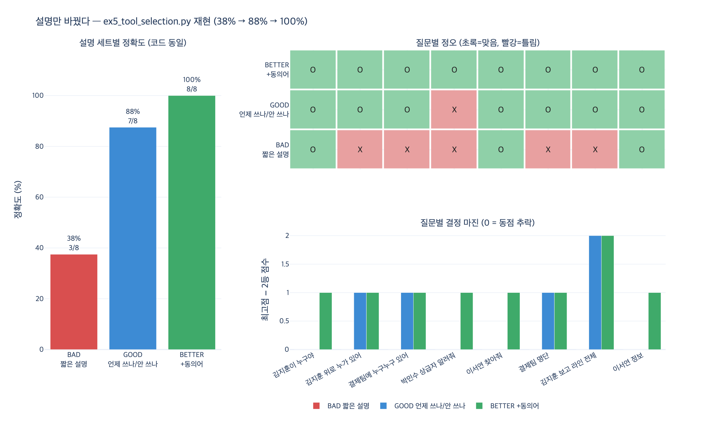

# `ex5_tool_selection.py` — 설명만 바꿨는데 무엇이 달라졌나

## 질문

`ex5_tool_selection.py`에서 설명만 바꿔 무엇이 달라졌는가?

## 답

**코드를 한 줄도 고치지 않고 도구 선택 정확도가 올랐다.** 짧은 설명 대신
「언제 쓰나 / 언제 안 쓰나」를 넣은 설명을 썼다.

실제 실행값으로는 **3/8 (38%) → 7/8 (88%)** 이다.

---

## 예제가 무엇을 하는가

25장 25.5절 「도구 설명이 곧 엣지 선택 함수다」를 뒷받침하는 예제다.
의존성이 없고 모델도 쓰지 않는다. 대신 **아주 멍청한 선택기** 하나를 두고,
그 선택기에 주는 **도구 설명 문자열만** 바꿔서 정확도를 잰다.

### 고정되는 것 (실험 내내 안 바뀜)

- 선택기 `tokenize` / `choose` — 한글·영문 토큰을 뽑아 집합으로 만들고
  질문 토큰과 도구 설명 토큰의 **겹침 개수**를 세서 최대인 도구를 고른다.
- 질문 세트 8개와 각 질문의 정답 도구.
- 도구 이름 3개: `find_person`, `chain_of_command`, `team_members`.

$$\hat{t}(q) = \arg\max_{t \in T} \bigl| \mathrm{tok}(q) \cap \mathrm{tok}(d_t) \bigr|$$

동점이면 딕셔너리에서 **먼저 순회한 도구**가 이긴다
(코드가 `if overlap > score` 로 **엄격 부등호** 비교를 하기 때문).

### 바뀌는 것 (딱 하나)

| | 내용 | 총 글자수 |
|---|---|---|
| `BAD` | `"사람 조회"`, `"체인 조회"`, `"팀 조회"` | 14자 |
| `GOOD` | 반환값 + 사용자 어휘 + 「~에는 쓰지 않는다」 경계 | 206자 |

`GOOD` 설명의 예 (`chain_of_command`):

> 한 사람의 «위로 올라가는» 보고 체계를 뿌리까지 준다. 상사, 상사의 상사, 보고 라인,
> 결재선을 물으면 이것이다. **아래 부하 목록에는 쓰지 않는다.**

---

## 실행 결과

```
[설명이 짧다]                          → 정확도 3/8 = 38%
[설명에 «언제 쓰나»와 «언제 안 쓰나»가 있다] → 정확도 7/8 = 88%
```

질문별로 보면 이렇다.

| 질문 | 정답 | BAD | GOOD | 변화 |
|---|---|---|---|---|
| 김지훈이 누구야 | `find_person` | `find_person` | `find_person` | 그대로 맞음 |
| 김지훈 위로 누가 있어 | `chain_of_command` | `find_person` ✗ | `chain_of_command` | **고쳐짐** |
| 결제팀에 누구누구 있어 | `team_members` | `find_person` ✗ | `team_members` | **고쳐짐** |
| 박민수 상급자 알려줘 | `chain_of_command` | `find_person` ✗ | `find_person` ✗ | 그대로 틀림 |
| 이서연 찾아줘 | `find_person` | `find_person` | `find_person` | 그대로 맞음 |
| 결제팀 명단 | `team_members` | `find_person` ✗ | `team_members` | **고쳐짐** |
| 김지훈 보고 라인 전체 | `chain_of_command` | `find_person` ✗ | `chain_of_command` | **고쳐짐** |
| 이서연 정보 | `find_person` | `find_person` | `find_person` | 그대로 맞음 |

4개가 고쳐졌고, 깨진 것은 없고, 1개가 남았다.

---

## 놓치기 쉬운 지점 1 — BAD의 38%는 실력이 아니다

`BAD` 설명(「사람 조회」/「체인 조회」/「팀 조회」)은 8개 질문 중 **어떤 질문과도 단어가
하나도 겹치지 않는다.** 즉 세 도구가 전부 0점 동점이고, 엄격 부등호 때문에
언제나 **딕셔너리 첫 키**가 반환된다.

```
김지훈이 누구야         find:0 chain:0 team:0  → find_person
김지훈 위로 누가 있어    find:0 chain:0 team:0  → find_person
...  (8개 전부 동일)
```

`BAD` 는 선택을 하는 게 아니라 **`find_person` 을 상수로 반환하는 함수**다.
그래서 그 38%는 정답 분포 중 `find_person` 이 3/8이라는 사실일 뿐이다.
증거로, 설명 내용은 그대로 두고 딕셔너리 **키 순서만** 바꾸면 정확도가 흔들린다.

| 첫 키 | 정확도 |
|---|---|
| `find_person` | 38% (3/8) |
| `chain_of_command` | 38% (3/8) |
| `team_members` | 25% (2/8) |

설명이 정보를 하나도 안 주면 **딕셔너리 순서가 답을 정한다.** 이게 나쁜 도구 설명이
프로덕션에서 일으키는 사고의 정체다 — 「어쩌다 잘 되던 것」이 도구 추가·순서 변경 한 번에
전부 어긋난다.

## 놓치기 쉬운 지점 2 — 정확도만 보면 안 된다, 결정 마진을 봐라

`GOOD` 도 8개 중 **4개는 여전히 0점 동점**이다. 최고점이 0인 질문은 여전히 첫 키로
추락하고 있다. 그러니 88%는

- 진짜로 «고른» 4개 (`김지훈 위로…`, `결제팀에 누구누구…`, `결제팀 명단`, `김지훈 보고 라인 전체`)
- 첫 키 추락이 우연히 맞은 3개 (`find_person` 정답들)
- 남은 1개 오답

의 합이다. 그래서 **결정 마진**(1등 점수 − 2등 점수)을 함께 봐야 한다.
마진이 0이면 선택기는 아무것도 «고르지» 않았다.

| | 평균 결정 마진 |
|---|---|
| `BAD` | 0.00 |
| `GOOD` | 0.62 |

## 놓치기 쉬운 지점 3 — 남은 하나 「박민수 상급자 알려줘」

`GOOD` 설명에는 «**상사**»라고 썼는데 사용자는 «**상급자**»라고 물었다.
토큰이 안 겹치니 점수가 0이고, 다시 첫 키로 추락한다.

> 우리는 사내 용어로 쓰고, 사용자는 자기 말로 묻는다.

대응은 **동의어를 설명에 넣는 것**이다 — 상사·상급자·윗사람·결재선.
촌스러워 보여도 이게 듣는다. 실제 질문 로그에서 뽑아 넣으면 더 좋다.
expy에서 `BETTER` 세트로 이걸 해 보면 **100% (8/8), 평균 마진 1.12** 가 된다.
여기서도 선택기 코드는 한 줄도 안 고쳤다.

---

## 좋은 도구 설명에 들어가는 셋

1. 무엇을 **주는지** — 반환값을 말한다.
2. 어떤 **말**로 물었을 때 이것인지 — 사용자 어휘를 넣는다.
3. 언제 **안** 쓰는지 — 경계를 긋는다.

> 3번이 제일 자주 빠지고 제일 크게 듣는다. 도구가 늘어날수록 «비슷한 도구»가 생기고,
> 그때 경계를 그어 둔 쪽이 이긴다.

## 왜 이 장난감 선택기를 믿어도 되나

여기 쓴 선택기는 단어 겹침을 세는 게 전부라 진짜 모델보다 훨씬 멍청하다.
하지만 **「설명이 나쁘면 못 고른다」는 성질은 모델도 같다.** 모델은 토큰 겹침이 아니라
의미 유사도를 쓰므로 절대 점수는 훨씬 높지만, 설명에 경계와 사용자 어휘가 없으면
비슷한 도구 사이에서 같은 방식으로 흔들린다.

2장의 말로 하면 **Description이 호출을 결정**하고,
그래프의 말로 하면 도구 설명이 곧 **엣지 선택 함수**다.
엣지를 고르는 규칙을 자연어로 적어 두는 셈이라, **그 글이 곧 코드다.**

## 한 줄 정리

| | BAD | GOOD | BETTER(동의어까지) |
|---|---|---|---|
| 설명 글자수 | 14 | 206 | 256 |
| 선택기 코드 변경 | — | **0줄** | **0줄** |
| 정확도 | 38% (3/8) | 88% (7/8) | 100% (8/8) |
| 평균 결정 마진 | 0.00 | 0.62 | 1.12 |

## 시각화


