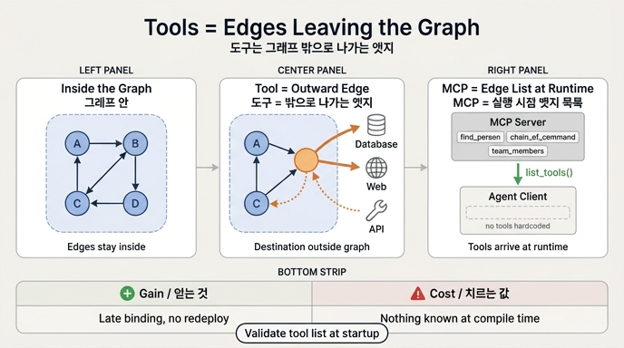

# 도구와 MCP를 그래프 용어로 표현하면?

**질문**: 도구와 MCP를 그래프 용어로 표현하면 무엇인가?

**답**: 도구는 그래프 밖으로 나가는 엣지이고, MCP는 그 엣지 목록을 실행 시점에 받아 오는 방식이다.

---

## 1. 왜 「엣지」인가

에이전트 그래프에서 노드는 「일하는 단위」이고 엣지는 「다음으로 가는 길」입니다.
지금까지의 엣지는 모두 **그래프 안쪽**을 향했습니다. 노드 A에서 노드 B로, 조건에 따라
C로. 전부 우리가 정의한 노드 집합 안에서 끝나는 이동이었죠.

도구 호출은 그 집합을 벗어납니다.

- `find_person("김지훈")` → 사내 인사 DB
- `search_web(...)` → 인터넷
- `run_sql(...)` → 데이터 웨어하우스

이건 노드→노드가 아니라 노드→**그래프 외부**입니다. 그래서 25.4절의 제목이
「도구는 그래프 밖으로 나가는 엣지다」입니다. 나갔다가 결과를 갖고 돌아오지만,
목적지 자체는 우리 그래프 위에 없습니다.

이렇게 보면 따라오는 성질들이 자동으로 정리됩니다.

| 그래프 성질 | 도구에서의 의미 |
|---|---|
| 엣지가 있어야 갈 수 있다 | 도구가 등록돼 있지 않으면 모델은 그 능력이 없다 |
| 엣지 선택 함수가 다음을 정한다 | **도구 설명(description)이 곧 엣지 선택 함수** |
| 엣지 목록이 곧 가능한 행동의 경계 | 도구 목록이 곧 에이전트의 권한 경계 (26장의 주제) |
| 엣지가 그래프 밖으로 나간다 | 실패·지연·부작용이 우리 통제 밖에 있다 |

특히 두 번째 줄이 같은 장 25.5절과 이어집니다. 예제 5(`ex5_tool_selection.py`)는
**코드는 한 줄도 안 고치고 설명 문자열만 바꿔서** 도구 선택 정확도를 올립니다.
「사람 조회」 같은 짧은 설명에서, 「무엇을 주는지 / 어떤 말로 묻는지 / 언제 안 쓰는지」
셋이 들어간 설명으로 바꾸는 것만으로요. 엣지를 고르는 규칙을 자연어로 적어 둔 셈이라,
그 산문이 곧 코드입니다.

## 2. 왜 MCP는 「실행 시점에 받아 오는 엣지 목록」인가

보통 그래프는 엣지를 **코드에 박아 둡니다**. `graph.add_edge(a, b)` 처럼요.
컴파일(또는 그래프 빌드) 시점에 엣지 집합이 확정됩니다.

MCP(Model Context Protocol)는 이 순서를 뒤집습니다. 클라이언트는 도구를 하나도
정의하지 않고, 서버에 붙어서 **목록을 물어봅니다**.

예제 4(`ex4_mcp_client.py`)가 정확히 이 장면입니다.

```python
async with stdio_client(params) as (read, write):
    async with ClientSession(read, write) as s:
        info = await s.initialize()          # 핸드셰이크, 프로토콜 버전 확인
        tools = (await s.list_tools()).tools # ← 엣지 목록을 «받아 온다»
        for t in tools:
            t.name, t.description, t.inputSchema   # 이름·설명·스키마 전부 서버가 준 것
```

예제의 자평이 핵심을 찝습니다.

> 여기서 클라이언트 코드는 도구 이름을 「세 번」 말했다.
> 그런데 도구의 「정의」는 한 번도 안 갖고 있다. 서버가 준 것을 그대로 쓴다.
> (…) 2장의 말로 하면 「지연 결합되는 서브그래프」고,
> 그래프의 말로 하면 「엣지 목록을 실행 시점에 받아 오는 것」이다.

즉 MCP는 새로운 종류의 도구가 아닙니다. **도구(엣지)를 언제 알게 되는지**에 대한
프로토콜입니다. 같은 클라이언트가 다른 서버에 붙으면 다른 도구를 갖게 되고,
서버에 도구를 하나 추가하면 클라이언트는 안 고쳐도 됩니다.

## 3. 얻는 것과 치르는 값

**얻는 것 — 지연 결합(late binding)**

- 서버에 `@mcp.tool()` 하나 추가 → 클라이언트 재배포 없이 능력이 늘어남
- 도구 제공자와 에이전트 개발자가 다른 팀/다른 조직이어도 됨
- 같은 에이전트가 붙는 서버만 갈아서 다른 도메인에 재사용됨

**치르는 값 — 컴파일 시점에 아무것도 모른다**

이게 한 장 요약의 문장입니다: 「대가는 컴파일 시점에 아무것도 모른다는 것이에요.」

- 도구 이름이 바뀌면 **실행할 때** 터집니다. 타입 체커도, 린터도 못 잡습니다.
- 스키마가 바뀌어도 마찬가지. 인자 이름 하나 바뀐 걸 런타임에 알게 됩니다.
- 서버가 안 떠 있으면 그 엣지들이 전부 사라진 그래프로 돌게 됩니다.
- 목록이 폭발하면 컨텍스트를 잡아먹고(24장), 비슷한 도구끼리 선택 정확도가 떨어집니다(25.5절).

**그래서 처방은 하나** — 「시작할 때 목록을 검증하세요.」

부팅 시점에 `list_tools()`를 돌려서
(a) 내가 기대하는 도구 이름이 다 있는지,
(b) 각 도구의 `inputSchema.required`가 내가 넘기려는 인자와 맞는지,
(c) 설명이 비어 있지 않은지
를 확인하고, 안 맞으면 **거기서 실패**하는 겁니다. 런타임 중간에 터지는 것보다
기동 실패가 훨씬 싸니까요. 지연 결합을 쓰면서 컴파일 시점 검증을 잃었으니,
그 검증을 「기동 시점」으로 옮겨 놓는 셈입니다.

## 4. 곁가지로 얻는 실전 함정

예제 4에는 MCP를 처음 쓸 때 흔히 밟는 지점이 주석으로 박혀 있습니다.

```python
r = await s.call_tool("chain_of_command", {"person_id": person["id"]})
# 목록을 돌려주는 도구는 «항목마다 content 블록 하나»로 온다.
# r.content[0] 만 읽으면 첫 항목만 읽는 셈이다. 흔한 실수다.
chain = [json.loads(c.text) for c in r.content]
```

리스트를 반환하는 도구는 결과가 `content` 블록 여러 개로 옵니다. `content[0]`만
읽으면 조용히 첫 항목만 갖게 됩니다. 예외도 안 나고요. 「실행 시점에 알게 된다」는
값을 이런 데서 치릅니다.

## 5. 한 줄 정리

- **도구 = 그래프 밖으로 나가는 엣지.** 목적지가 우리 노드 집합 밖에 있는 이동.
- **도구 설명 = 그 엣지의 선택 함수.** 자연어로 쓴 라우팅 규칙.
- **MCP = 그 엣지 목록을 코드에 박지 않고 실행 시점에 받아 오는 방식.**
- **대가 = 컴파일 시점 무지.** 그러니 기동할 때 목록과 스키마를 검증하라.

## 참고

- 소스: `content/ch25/code/README.md` (25.4절, 25.5절, 한 장 요약)
- 예제: `content/ch25/code/ex4_mcp_client.py`, `mcp_server.py`, `ex5_tool_selection.py`
- [Model Context Protocol 명세 (2025-06-18)](https://modelcontextprotocol.io/specification/2025-06-18)
- [MCP tools 명세 / 도구 스키마](https://modelcontextprotocol.io/specification/2025-06-18/server/tools)

## 인포그래픽


