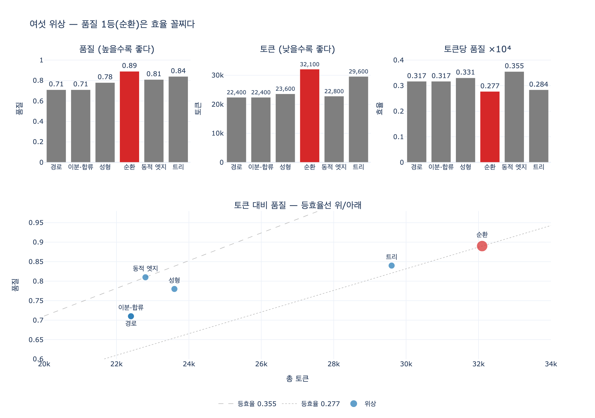

# 여섯 위상 중 품질 1등과 그 대가

**질문** — 여섯 위상 중 품질이 가장 높은 것과 그 대가는 무엇인가?

**답** — 순환(생성-검증)이 0.89로 가장 높지만 토큰이 가장 많이 든다. '토큰당 품질'로 보면 오히려 아래쪽이다.

---

## 1. 무엇을 재고 있는가

25장의 `ex1_topologies.py`는 **똑같은 하나의 작업**을 여섯 가지 위상으로 돌린다.

> 문서 8편을 읽고 보고서 한 장을 쓴다.

작업이 같으니 「읽어야 하는 양」도 같다. 달라지는 건 *언제, 무엇을, 몇 번 하는가* 뿐이다.
그래서 이 표는 위상의 성능표가 아니라 **위상이 무엇을 대가로 무엇을 사는지**를 보는 표다.

비용 모델의 단가:

| 단위 작업 | 지연 | 토큰 |
|---|---:|---:|
| 문서 한 편 읽기 | 900ms | 2,400 |
| 보고서 한 장 쓰기 | 1,800ms | 3,200 |
| 검토 한 번 | 700ms | 1,100 |
| 라우팅 판단 한 번 | 300ms | 400 |

동시에 돌릴 수 있는 수(`PAR`)는 4. 문서 8편이면 물결(wave)은 2개다.

## 2. 여섯 위상 결과표

| 위상 | 다른 이름 | 지연(ms) | 토큰 | 품질 | 토큰당 품질 ×10⁴ |
|---|---|---:|---:|---:|---:|
| 경로 | 파이프라인 | 9,000 | 22,400 | 0.71 | 0.317 |
| 이분·합류 | 팬아웃-팬인 | **3,600** | **22,400** | 0.71 | 0.317 |
| 성형 | 감독자-작업자 | 4,500 | 23,600 | 0.78 | 0.331 |
| **순환** | **생성-검증, 평가자-최적화** | 9,300 | **32,100** | **0.89** | **0.277** |
| 동적 엣지 | 라우터 | 3,900 | 22,800 | 0.81 | **0.355** |
| 트리 | 계층적 위임 | 4,800 | 29,600 | 0.84 | 0.284 |

- 제일 빠른 것 → **이분·합류** (3,600ms)
- 제일 싼 것 → **경로**(= 이분·합류와 동률, 22,400 토큰)
- 품질 1등 → **순환** (0.89)
- **토큰당 품질 1등 → 동적 엣지** (0.355)

세 개의 1등이 **전부 다른 위상**이다. 그래서 「좋은 위상」이라는 말이 성립하지 않는다.

## 3. 순환은 왜 품질이 오르는가

순환은 「생성 → 검증」을 검토가 통과할 때까지 돈다(예제에서는 3회 고정).

```
읽기(2 물결) → [ 쓰기 → 검토 ] × 3
```

품질이 0.71 → 0.89 로 **0.18** 오른다. 여섯 위상 중 유일하게 크게 오른다.
자기 출력을 다시 보는 단계가 붙었으니 당연한 결과다.
1차 출처의 이름으로는 **evaluator-optimizer**(평가자-최적화) 패턴이다.

## 4. 대가: 토큰이 가장 많이 든다

토큰이 늘어나는 곳은 **읽기가 아니라 쓰기·검토의 반복**이다.

$$\text{tok}_{\text{순환}} = 8 \times 2{,}400 + 3 \times (3{,}200 + 1{,}100) = 19{,}200 + 12{,}900 = 32{,}100$$

기준선(이분·합류, 22,400)보다 **+9,700 토큰**. 여섯 위상 중 최다다.
읽기 값은 그대로인데, 쓰기 3번 + 검토 3번이 그대로 얹힌다.

라운드 수 $r$ 에 대해 선형으로 커진다.

$$\text{tok}(r) = 19{,}200 + 4{,}300\,r$$

라운드를 늘리면 품질은 수확 체감하지만 토큰은 **계속 선형으로 붙는다**. 이게 순환의 위험이다.

## 5. 뒤집히는 지점 — '토큰당 품질'

지표를 바꿔 보자.

$$\text{효율} = \frac{q}{\text{tok}} \times 10^4$$

| 위상 | 품질 순위 | 효율 순위 | 낙차 |
|---|---:|---:|---:|
| 순환 | **1위** | **6위(꼴찌)** | +5 |
| 트리 | 2위 | 5위 | +3 |
| 동적 엣지 | 3위 | **1위** | −2 |
| 성형 | 4위 | 2위 | −2 |
| 경로 | 5위 | 3위 | −2 |
| 이분·합류 | 6위 | 4위 | −2 |

순환은 **1위에서 꼴찌로 5칸 떨어진다**. 이것이 답의 뒷문장 그대로다.

> «토큰당 품질» 칸으로 보면 순환이 오히려 아래쪽이다.
> 품질을 돈으로 산 것이지 공짜로 얻은 게 아니다.

한계 비용으로 보면 더 선명하다. 기준선 대비 **품질 1%p 를 올리는 데 드는 추가 토큰**:

| 위상 | Δ품질 | Δ토큰 | 품질 1%p 값(토큰) |
|---|---:|---:|---:|
| 동적 엣지 | +0.10 | +400 | **40** |
| 성형 | +0.07 | +1,200 | 171 |
| 순환 | +0.18 | +9,700 | **539** |
| 트리 | +0.13 | +7,200 | 554 |

순환은 품질 1%p 를 사는 데 539 토큰을 쓴다. 동적 엣지(40)의 **13배**다.
품질은 확실히 올라가지만, 「제일 비싼 방법으로 올린다」는 게 정확한 서술이다.

## 6. 함께 붙는 오해 셋

**(1) 순환은 지연도 나쁘다.**
9,300ms 로 지연도 꼴찌다(경로 9,000ms보다 느리다). 읽기를 병렬로 폈는데도,
쓰기·검토 3회가 **직렬로** 붙어서 그렇다. 순환의 반복은 원리상 병렬화할 수 없다.
앞 라운드의 결과를 보고 다음 라운드를 도는 게 순환이니까.

**(2) 병렬은 돈을 아끼는 게 아니다.**
경로와 이분·합류는 토큰이 **정확히 같다**(22,400). 지연만 9,000 → 3,600 (2.5배).
나눠 읽는다고 읽는 양이 줄지 않는다. 병렬은 **시간을 사는 것**이다.

**(3) 품질 숫자는 모델에서 나온 게 아니다.**
0.71 / 0.78 / 0.89 같은 값은 예제가 「이 정도 차이가 난다」고 **가정으로 박아 둔 것**이다.
실제 서비스에서는 이 자리에 반드시 **자기 채점 데이터셋의 숫자**가 들어가야 한다.
(같은 장의 25.3절 라우터 얘기가 이 지점을 정면으로 다룬다: 라우터를 넣을 때 제일 먼저
만들 것은 라우터가 아니라 「라우팅이 맞았는지 채점하는 데이터셋」이다.)

## 7. 그래서 고르는 순서

품질 1등을 고르는 게 아니라, **제약에서 거꾸로** 고른다.

1. **품질 하한이 있나** → 있으면 순환을 넣는다 (토큰을 내준다)
2. **지연 상한이 있나** → 있으면 이분·합류로 편다 (토큰은 그대로)
3. **입력 종류가 갈리나** → 갈리면 동적 엣지 (품질 조금 내주고 토큰 크게 아낀다)
4. **다 아니면 경로.** 제일 단순한 게 제일 오래 산다.

순환은 1번에만 등장한다. **품질 하한이 계약처럼 걸려 있을 때 쓰는 도구**이고,
그 외의 경우에는 토큰을 태우는 장치다.

## 8. 한 줄 정리

> 순환(생성-검증)은 품질 0.89로 1등이지만, 토큰 32,100으로도 1등(최악)이고
> 토큰당 품질 0.277로 꼴찌다. 지연도 9,300ms로 꼴찌다.
> **순환은 품질을 얻는 위상이 아니라, 품질을 토큰으로 사는 위상이다.**

## 관련 1차 출처

| 키워드 | 상태 | 출처 |
|---|---|---|
| 평가자-최적화 (순환) | 사실상 표준 | [evaluator-optimizer](https://www.anthropic.com/engineering/building-effective-agents) |
| 오케스트레이터-워커 (성형) | 사실상 표준 | [orchestrator-workers](https://www.anthropic.com/engineering/building-effective-agents) |
| 팬아웃·팬인 (이분·합류) | 사실상 표준 | [fan-out/fan-in](https://learn.microsoft.com/en-us/azure/azure-functions/durable/durable-functions-cloud-backup) |
| 라우팅 (동적 엣지) | 사실상 표준 | [routing](https://www.anthropic.com/engineering/building-effective-agents) |

## 시각화



위 세 칸에서 순환(빨강)이 품질 막대는 제일 높고, 토큰 막대는 제일 높고(=제일 나쁘고),
토큰당 품질 막대는 제일 낮다. 아래 산점도의 두 점선은 **등효율선**($q = k \cdot \text{tok}$)이다.
순환은 낮은 등효율선(0.277) 위에 정확히 놓이고, 다른 위상들은 모두 그보다 위쪽 —
즉 **더 적은 토큰으로 더 많은 품질을 뽑는 영역** — 에 있다.
왼쪽 아래에 경로와 이분·합류가 **한 점으로 겹쳐** 있는 것도 봐 둘 만하다.
효율 관점에서 두 위상은 구별되지 않는다. 병렬화는 토큰을 한 개도 아끼지 않았으니까.
