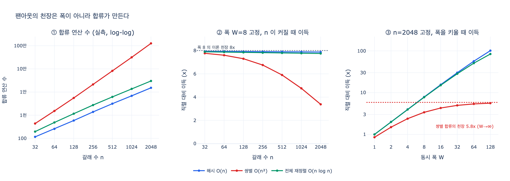

# 팬아웃 성능 개선에서 폭 키우기보다 효과가 큰 것

> **질문** — 팬아웃 성능 개선에서 폭 키우기보다 효과가 큰 것은 무엇인가?
>
> **답** — 합류 코드를 가볍게 유지하는 것이다. 합류에서 전체 재정렬이나 O(n²) 중복 제거를 하면 펴는 의미가 사라진다.

출처는 25장 「여섯 가지 위상, 그리고 도구를 꽂는 구멍」의 **25.2절 — 펴는 값보다 합치는 값이 비싸다** 이고, 근거 코드는 `code/ex2_fanout.py` 입니다.

---

## 1. 왜 폭이 답이 아닌가 — 식 한 줄

팬아웃-팬인(fan-out/fan-in)의 총 시간을 쪼개면 두 항입니다. 갈래 수 $n$, 동시 폭 $W$, 갈래 하나 처리 시간 $T$, 합류 값 $C(n)$ 이라 하면

$$
\text{total}(n, W) = \underbrace{\left\lceil \frac{n}{W} \right\rceil \cdot T}_{\text{펴는 값}} + \underbrace{C(n)}_{\text{합류 값}}
$$

핵심은 **오른쪽 항에 $W$ 가 없다**는 것입니다.

- 왼쪽(펴는 값)은 폭으로 **나눗셈**이 됩니다. 폭을 두 배 하면 반이 돼요.
- 오른쪽(합류 값)은 폭과 **아무 관계가 없습니다**. 갈래가 몇 개 왔는지에만 달렸어요. 폭 1로 받았든 폭 128로 받았든, 합류가 처리할 항목 수는 똑같이 $n$ 개입니다.

그래서 폭을 무한히 키운 극한이 이렇습니다.

$$
\lim_{W \to \infty} \text{speedup}(n, W) = \frac{nT}{T + C(n)}
$$

$C(n)$ 이 $T$ 에 비해 커지면 이 값은 $n$ 과 무관한 **상수 천장**이 됩니다. 폭에 돈을 아무리 부어도 이 선을 못 넘어요. 병렬 세계에서 오래된 이름이 붙어 있습니다. **암달의 법칙**(Amdahl's law) — 직렬 구간이 전체 이득의 상한을 정한다는 것이요. 팬아웃에서 그 직렬 구간이 바로 합류입니다.

## 2. 책의 첫 표가 이미 그 말을 하고 있다

`ex2_fanout.py` 의 첫 표는 합류 값을 「갈래당 140ms」라는 상수로 놓았습니다. 즉 $C(n) = 140n$, 겨우 $O(n)$ 이에요. 그런데도 결과가 이렇습니다.

| 갈래 수 | 직렬(ms) | 병렬 4폭(ms) | 그중 합류(ms) | 이득 |
|---|---|---|---|---|
| 2 | 1,908 | 2,151 | 280 | **0.89x** ← 병렬이 더 느림 |
| 4 | 3,816 | 2,431 | 560 | 1.57x |
| 8 | 7,632 | 4,862 | 1,120 | 1.57x |
| 64 | 61,056 | 38,898 | 8,960 | **1.57x** ← 천장 |

폭이 4인데 4배가 안 나오고 1.57배에 붙어 버립니다. 갈래를 32배 늘려도 1.57배 그대로예요. 절의 문장이 이유를 정확히 씁니다.

> 펴는 값은 나누기(÷폭)인데 합류 값은 갈래 수에 비례해서 안 줄어든다.

$O(n)$ 합류만으로도 천장이 생기는데, 합류가 $O(n^2)$ 이면 천장이 아니라 **하강**이 시작됩니다. 갈래를 늘릴수록 성능이 나빠지는 구간이 생기는 거예요.

## 3. 합류가 제곱이 되는 순간

합류에서 자주 하는 일 중 어떤 것이 제곱인지 구분하는 게 실전 기술입니다. 기준은 하나예요.

> **갈래끼리 비교하는 연산이 있으면 그건 제곱이다.**

| 합류에서 하는 일 | 복잡도 | 위험 |
|---|---|---|
| 이어 붙이기(`extend`) | $O(n)$ | 없음 |
| 키 기반 중복 제거 (`set` / `dict`) | $O(n)$ | 없음 |
| 점수로 정렬 | $O(n \log n)$ | 거의 없음 |
| **쌍별 유사도 중복 제거** | $O(n^2)$ | 큼 |
| **갈래끼리 모순 검사** | $O(n^2)$ | 큼 |
| **모든 갈래 결과를 한 프롬프트에 넣어 LLM에게 합치라고 하기** | 토큰 $O(n)$, 하지만 컨텍스트 상한에 부딪힘 | 큼 |
| **합류에서 전체를 다시 정렬 + 매 항목 재조회** | $O(n \log n)$ 인데 상수가 거대 | 중간 |

「전체 재정렬」이 답에 등장하는 이유는 복잡도 차수 때문이 아니라 **상수**입니다. 재정렬 자체는 $O(n \log n)$ 으로 싼데, 재정렬을 하려고 모든 갈래 결과를 다시 읽고 다시 파싱하고 다시 임베딩을 뽑으면 그 상수가 갈래 하나 처리 시간과 맞먹게 되어 버려요.

## 4. 실측 — 합류 구현만 바꿔 재 본 결과

같은 폴더의 `expy.py` 가 합류를 세 가지로 짜고 연산 수와 실제 시간을 직접 잽니다. 세 구현은 **결과가 완전히 같습니다**(중복 없는 147개, 1등 점수 0.9991). 다른 건 연산 수뿐이에요.

실측 성장 지수 $\alpha = \log_2 \dfrac{C(2n)}{C(n)}$:

| 합류 구현 | 실측 α | 판정 |
|---|---|---|
| 해시 중복 제거 | 1.17 | 선형 (뒤의 점수 정렬 $\log n$ 만큼 1을 넘음) |
| 쌍별 비교 | **1.92** | 사실상 제곱 |
| 전체 재정렬(2회 정렬) | 1.21 | $n \log n$ |

폭을 8로 고정한 채 갈래 수만 늘리면:

| 갈래 수 n | 해시 합류 | 쌍별 합류 | 전체 재정렬 |
|---|---|---|---|
| 32 | 7.94x | 7.76x | 7.89x |
| 256 | 7.91x | 6.75x | 7.81x |
| 2048 | **7.87x** | **3.38x** | 7.75x |

해시는 $n$ 이 64배가 되도록 이론값(8배) 근처를 지킵니다. 쌍별은 7.76배에서 3.38배로 흘러내려요. $n{=}2048$ 에서 합류 값 315초가 펴는 값 230초를 넘어섭니다. 여기가 「펴는 의미가 사라진다」는 지점입니다.

### 카드의 핵심 비교

$n{=}2048$ 에서 두 개선을 나란히 놓으면:

| 개선 | 결과 | 개선 배수 | 든 값 |
|---|---|---|---|
| (기준) 쌍별 합류 + 폭 8 | 3.38x | — | — |
| **폭 키우기**: 쌍별 합류 + 폭 128 | 5.60x | 1.66배 | 동시 실행 슬롯 **16배** |
| **합류 고치기**: 해시 합류 + 폭 8 | **7.87x** | **2.33배** | 코드 몇 줄 |

투자를 16배 한 쪽이 코드 몇 줄 고친 쪽보다 덜 나아졌습니다. 그리고 더 결정적인 건 천장입니다.

- 쌍별 합류를 둔 채 폭을 **무한히** 키운 극한 = **5.83배**
- 해시 합류 + 폭 **8** = **7.87배**

폭으로는 살 수 없는 구간이 있습니다. 합류를 안 고치면 그 위로는 못 올라가요.

폭 1(사실상 직렬) 줄도 볼 만합니다. 쌍별 합류에서는 **0.85배** — 합류 단계를 따로 둔 것만으로 직렬보다 느려집니다. `ex2_fanout.py` 첫 표의 「갈래 2개짜리는 병렬이 더 느리다, 0.89배다」와 같은 현상입니다.

## 5. 폭 키우기가 값을 치르는 방식은 또 따로 있다

카드의 답과 짝을 이루는 25.2절의 다른 발견을 같이 기억하는 게 좋습니다. 폭을 키우면 총 시간은 계속 줄어드는데, 대신 **물결 하나가 길어집니다.**

갈래 16개를 폭만 바꿔 가며 (`ex2_fanout.py` 둘째 표):

| 동시 폭 | 물결 수 | 물결 하나(ms) | 총 시간(ms) |
|---|---|---|---|
| 1 | 16 | 1,179 | 21,104 |
| 2 | 8 | 1,432 | 13,698 |
| 4 | 4 | 1,871 | 9,724 |
| 8 | 2 | 2,533 | 7,306 |
| 16 | 1 | **3,299** | 5,539 |

한 물결은 **제일 느린 갈래**가 끝나야 끝나기 때문입니다(**꼬리 지연**, tail latency). 폭이 커질수록 「하나라도 느린 놈이 섞일 확률」이 올라가요. 16폭이면 물결 하나가 3,299ms, 1폭일 때(1,179ms)의 2.8배입니다.

> 폭을 키우는 값은 «총 시간»이 아니라 «변동성»으로 치른다. 평균은 좋아지는데 최악이 나빠진다. 사용자가 느끼는 건 대개 최악 쪽이다.

정리하면 **폭 키우기는 값이 두 겹**입니다. 동시 실행 자원을 사야 하고, p99 지연이 나빠지는 것도 받아들여야 해요. **합류 고치기는 그 값을 안 치릅니다.** 그래서 같은 성능 개선이면 합류 쪽이 먼저입니다.

## 6. 실전 순서

1. **폭을 키우기 전에 합류를 프로파일한다.** 총 시간에서 합류가 몇 %인지 잰다. 이 숫자를 모르면 개선 방향을 고를 수가 없다. 20%면 폭을 무한히 키워도 5배가 상한이다.
2. **갈래끼리 비교하는 연산이 있나 본다.** 있으면 그건 제곱이다. 중복 제거, 유사도 클러스터링, 「서로 모순되나」 검사가 다 여기 걸린다.
3. **키를 뽑을 수 있으면 해시로 바꾼다.** 정확한 중복이면 `set` 하나로 $O(n^2) \to O(n)$ 이다.
4. **의미 중복이면 후보를 줄인다.** 임베딩 후 LSH나 버킷으로 나눠 버킷 안에서만 비교하면 기대 복잡도가 거의 선형으로 내려간다. 전수 쌍별은 마지막 수단이다.
5. **스트리밍 합류를 검토한다.** 「전부 모인 다음에」 정리하는 대신 도착하는 대로 누적하면 합류가 펴는 시간에 숨는다(오버랩). 이러면 $C(n)$ 이 총 시간에서 사실상 사라진다. 힙에 상위 $k$ 개만 유지하는 형태가 흔한 구현이다.
6. **전체 재정렬은 그다음이다.** $O(n \log n)$ 은 대개 문제가 아니다. 문제가 되는 것은 「합류에서 전부 다시 읽는」 형태다.

## 7. 한 문장으로

25.2절이 이렇게 끝냅니다.

> 그리고 합류 코드를 «가볍게» 유지하는 게 폭을 키우는 것보다 크게 듣는다.
> 첫 표에서 천장을 만든 게 합류였다. 폭이 아니라.
> 합류에서 전체를 다시 정렬하거나 중복 제거를 O(n²)로 하고 있으면 펴는 의미가 사라진다.

## 참고

- [Durable Functions — fan-out/fan-in](https://learn.microsoft.com/en-us/azure/azure-functions/durable/durable-functions-cloud-backup)
- [The Tail at Scale](https://research.google/pubs/the-tail-at-scale/) — 꼬리 지연
- [Building effective agents — orchestrator-workers](https://www.anthropic.com/engineering/building-effective-agents)

## 시각화

